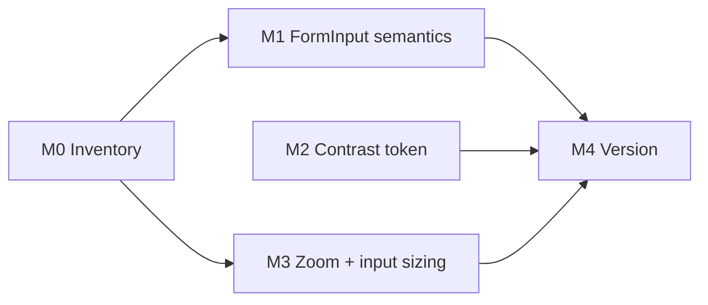

# Plan 252: Accessible Form Inputs, Muted-Text Contrast, and Zoom

| Field          | Value                                                                                                                                         |
| -------------- | --------------------------------------------------------------------------------------------------------------------------------------------- |
| Plan ID        | 252 (provisional; the Orchestrator must confirm. `agent-output/.next-id` was not read or changed)                                             |
| Target Release | next available patch after current origin/main version; confirm at DevOps Stage 1                                                             |
| Epic Alignment | Accessibility and UX quality (frontend review #251)                                                                                           |
| Related Issues | None. Source: [QA 251](../qa/251-frontend-review.md) F5, F6, F7; [Code Review 251](../code-review/251-frontend-review-code-review.md) batch 1 |
| Classification | Bugfix                                                                                                                                        |
| Pipeline       | Abbreviated (Critic → Implementer → Code Review → QA → UAT → DevOps)                                                                          |
| GitHub Issue   | Not created: terminal access was disabled during planning. Create it after the plan is approved.                                              |
| Created        | 2026-09-24T19:10Z (approx.)                                                                                                                   |

## Changelog

| Time (UTC)                  | Agent   | Change                                                                                |
| --------------------------- | ------- | ------------------------------------------------------------------------------------- |
| 2026-09-24T19:10Z (approx.) | Planner | Drafted from code review 251, batch 1. Awaiting user approval of the value statement. |

## Value Statement and Business Objective

As a **user who relies on a screen reader, keyboard, larger text, or lower-contrast vision**, I want the login, signup, profile, and waitlist forms to announce their labels, show where focus is, stay readable, and allow zooming, so that I can sign in and contribute listings without help.

**Success criteria**

- Each of the 14 `FormInput` consumers exposes its visible label as the input's accessible name.
- The password visibility toggle has a translated accessible name in all 6 locales.
- Default-theme muted text reaches at least 4.5:1 contrast on every background it appears on.
- Rendered viewport metadata no longer restricts zoom.

## Objective

Fix the shared primitives once, so every consumer inherits the fix:

- [FormInput.tsx](../../src/components/ui/FormInput.tsx): label association, toggle name, and visible focus.
- `--color-text-muted` in [globals.css](../../src/styles/globals.css#L68): contrast.
- The root viewport in [layout.tsx](../../src/app/layout.tsx#L20): zoom limit.

## Release Strategy

**Bundled with**: Plans 253 (desktop header) and 254 (data-state recovery), all from review 251.

- Sequencing: 252 has no dependency on 253 or 254 and can merge first.
- Locale-file edits across the three plans must be merged sequentially to avoid conflicts.
- Must **not** ship inside v0.15.18. Plans 217–219 are in UAT for that version, with the PROD release pending.
- Version pre-flight (`git fetch --tags`, latest tags, `origin/main` version) **could not run** because terminal access was disabled. `package.json` on local `main` reads `0.15.18`. DevOps Stage 1 must confirm the version.

## Decision Record

1. **[RESOLVED] Fix the shared primitive, not each consumer.** All 14 consumers inherit a `FormInput` fix. Changing consumers one by one would drift.
2. **[RESOLVED] Label association uses a stable per-instance id, and a consumer-supplied `id` takes precedence.** This preserves existing ids that tests or anchors may rely on.
3. **[RESOLVED] The password toggle's accessible name is translated and reflects its state (show or hide).** An unnamed icon button fails WCAG 4.1.2.
4. **[RESOLVED] Fix contrast at the token (`--color-text-muted`, default theme), not only on the label.** The measured 3.59:1 ratio fails WCAG 1.4.3 for all normal-size muted text app-wide. The dark theme (65% lightness on a 7% background) already passes and must not regress. The final value must reach at least 4.5:1 against white, `--color-surface` (98%), and `--color-background-selection`. The implementer chooses the value; no value is prescribed.
5. **[RESOLVED] Remove `maximumScale: 1`, and keep iOS from auto-zooming on input focus by giving mobile form controls at least a 16px font size.** Removing the cap alone would make iOS Safari zoom into the 15px `FormInput` fields on focus, which is a UX regression.
6. **[RESOLVED] Show visible focus on the input's container (focus-within), using the existing `--color-state-focus` token.** The input deliberately removes its own outline, so the container must carry the WCAG 2.4.7 indicator.
7. **[DEFERRED: Planner, batch 4 plan, same or next release]** Moving `LoginModal` and `SignupModal` onto the shared `Modal`, and unifying auth error messages (F3, F11), are out of scope. Both modals still gain the `FormInput` fixes automatically.

## Assumptions

- `FormInput` has no hardcoded user-visible strings today. Any string it gains (the toggle names) must be translated.
- Visually darkening muted text is acceptable; UAT confirms the visual result.
- There is exactly one alternate theme (`[data-theme='dark']`).

## Plan

### M0: Inventory (state and consumer enumeration)

- List all 14 `FormInput` consumers: the login, signup, forgot-password, reset-password, saved, profile, and profile-edit pages; `create/basics/category`; `create/media/social`; `CitySelectionModal`; `DesktopWaitlistSection`; `WaitlistScreen`; `LoginModal`; and `SignupModal`.
- Record which consumers use the `with-icon` variant.
- List every `input`, `textarea`, and `select` whose computed font size is below 16px at widths under 768px (including search bars and chat input). Mark each **fix** or **documented exception**.
- **Acceptance**: the inventory is in the implementation doc, and every entry has a disposition.

### M1: `FormInput` semantics and focus

- Associate the visible label with its input using an explicit id relationship.
- Give the toggle a translated, state-aware accessible name, with keys in all 6 locale files (`src/translations/{de,en,ar,tr,ur,ps}.ts`).
- Show a visible focus indicator on the container when the input has focus.
- **Acceptance**: in all 14 consumers, locating an input by its label text resolves to that input. The toggle is named in every locale. The focus indicator is visible when tabbing. No consumer needs a code change unless it passes conflicting ids.

### M2: Muted-text contrast

- Update the default-theme `--color-text-muted` value. Leave the dark theme unchanged, but re-verify it.
- **Acceptance**: at least 4.5:1 against the three backgrounds listed in decision 4. The dark theme stays at or above 4.5:1. Record the before and after ratios in the implementation doc.

### M3: Zoom and input sizing

- Remove the zoom cap from the root viewport.
- Bring every M0 **fix** entry to at least 16px at mobile widths. Desktop sizing may remain as designed.
- **Acceptance**: rendered viewport metadata contains no `maximum-scale`. On iOS Safari, focusing a login field causes no automatic zoom; UAT confirms this on a device. Pinch zoom works.

### M4: Version and release artifacts

- Add a CHANGELOG entry and a `package.json` version bump **once for the 252–254 bundle**. The last plan of the bundle to reach DevOps does this, with DevOps confirming the version at Stage 1.
- **Acceptance**: the version matches the DevOps-confirmed value, and the CHANGELOG lists 252, 253, and 254.

## Milestone Dependencies

Sequencing rule: M2 is independent. M1 and M3 start once the M0 inventory is complete.

## Testing Strategy

- **Unit and component**: render the real `FormInput` with no mocks. Cover label association and toggle naming in both states, including one locale beyond `en`.
- **Regression**: at least one real consumer page (login) asserts that its email and password inputs are reachable by label. This replaces the current mocked `FormInput` pattern in the saved-page test (QA F14).
- **Browser**: viewport metadata, computed contrast of the token pair in both themes, and 16px mobile input size.
- **Manual device check** (UAT): iOS Safari focus and zoom behavior, and screen-reader naming on one Android device.

## Validation

- `npm run type-check`, focused Vitest for `FormInput` and its consumers, and `npm run lint:check` on touched files.
- Run the i18n scan on every touched file, per code-review rule 6k.

## Risks

| Risk                                                                                    | Mitigation                                                                          |
| --------------------------------------------------------------------------------------- | ----------------------------------------------------------------------------------- |
| The token change visibly alters all secondary text                                      | UAT visual pass on discovery, detail, and forms; the change is limited to one token |
| iOS input zoom returns after the cap is removed                                         | M0 inventory plus the M3 16px rule and device check                                 |
| Merge conflict with `refactor/247-root-layout-static-rendering` (rewrites `layout.tsx`) | Rebase after 247 merges, or keep the viewport edit to one line and merge first      |
| Label id collides with consumer-passed ids                                              | Decision 2: the consumer's id wins                                                  |

**Scope note**: about 9 files: 3 source files and 6 locale files, plus any sub-16px inputs found in M0. Going over the 10-file guideline is justified by the i18n requirement.

## Duration Estimates

| Phase          | Range        | Uncertainty                           |
| -------------- | ------------ | ------------------------------------- |
| Critic         | 0.5–1h       | —                                     |
| Implementation | 3–6h         | Number of sub-16px inputs found in M0 |
| QA             | 1–2h         | —                                     |
| UAT            | 0.5–1h       | Access to an iOS device               |
| DevOps         | Bundle-level | Version collision with v0.15.18       |

## Rollback

Every change is a small, isolated diff. To roll back, revert the three source files; locale keys can safely remain.
