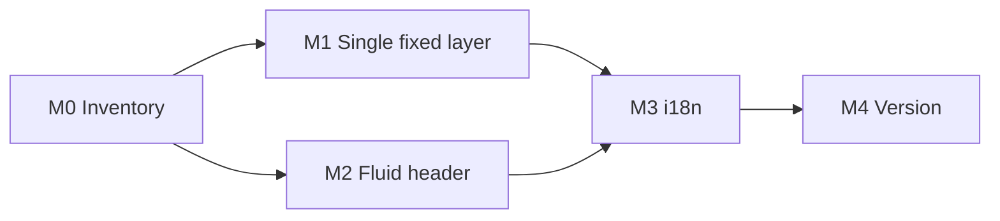

# Plan 253: Desktop Header Ownership and Tablet Header Fit

| Field          | Value                                                                                                                                            |
| -------------- | ------------------------------------------------------------------------------------------------------------------------------------------------ |
| Plan ID        | 253 (provisional; the Orchestrator must confirm. `agent-output/.next-id` was not read or changed)                                                |
| Target Release | next available patch after current origin/main version; confirm at DevOps Stage 1                                                                |
| Epic Alignment | Accessibility and UX quality (frontend review #251)                                                                                              |
| Related Issues | None. Source: [QA 251](../qa/251-frontend-review.md) F1, F2; [Code Review 251](../code-review/251-frontend-review-code-review.md) batch 2 and R1 |
| Classification | Bugfix                                                                                                                                           |
| Pipeline       | Full (Critic → Implementer → Code Review → QA → UAT → DevOps)                                                                                    |
| GitHub Issue   | Not created: terminal access was disabled during planning. Create it after the plan is approved.                                                 |
| Created        | 2026-09-24T19:10Z (approx.)                                                                                                                      |

## Changelog

| Time (UTC)                  | Agent   | Change                                                                                |
| --------------------------- | ------- | ------------------------------------------------------------------------------------- |
| 2026-09-24T19:10Z (approx.) | Planner | Drafted from code review 251, batch 2. Awaiting user approval of the value statement. |

## Value Statement and Business Objective

As a **desktop or tablet visitor**, I want the site header's Login, Register, Create, and profile controls to be visible and clickable on every page, so that I can sign in, register, and manage my account from anywhere, instead of hitting a dead header.

**Success criteria**

- At 768, 1024, 1280, 1440, and 1920px, every global-header control lies fully within the viewport.
- On every route that renders `PageHeader`, the global-header control is the topmost element at its own center point.
- Header accessible names and the "coming soon" toast are translated in all 6 locales.

## Objective

- **Single owner (F2)**: at 768px and wider, the global [Header.tsx](../../src/components/layout/Header.tsx) is the only fixed top layer. [PageHeader.tsx](../../src/components/layout/PageHeader.tsx) is fixed at `top-0 z-50` with no responsive rule, renders in 37 consumer files, and currently covers the global header's top row on desktop.
- **Fit (F1)**: make the global header's fixed `grid-cols-[1fr_800px_1fr]` / `w-[800px]` layout fit from 768px up.
- **Localization (R1, rule 6k)**: translate the hardcoded strings in both touched files.

## Release Strategy

**Bundled with**: Plans 252 and 254.

- 253 is independent of 254 and does not depend on 252.
- Coordinate locale-file edits with the other two plans.
- Must **not** ship in v0.15.18 (see Plan 252).
- Version pre-flight could not run because terminal access was disabled. DevOps Stage 1 confirms the version.
- **In-flight conflicts**: `fix/250-mobile-ui-jank-fixes` edits many `PageHeader` consumers (create/* and legal pages). `refactor/247-root-layout-static-rendering` changes where the desktop `Header` is mounted. Rebase onto `main` after those merge; this plan touches only the two header components.

## Decision Record

1. **[RESOLVED] At 768px and wider, the global `Header` is the only fixed top layer, and `PageHeader` must never occupy its area.** Two fixed layers at the same z-index caused the pointer interception.
2. **[RESOLVED] At 768px and wider, `PageHeader` renders in normal page flow below the global header.** This is the default because it keeps page titles and back buttons. A consumer may suppress its desktop `PageHeader` only if its desktop layout already provides an equivalent title and back affordance, recorded in the M0 inventory (see Removal Surface).
3. **[RESOLVED] Mobile (<768px) behavior of both headers is unchanged.** The mobile flash and jank fixes are owned by #250; changing mobile here would collide.
4. **[RESOLVED] Keep the 768px desktop-header breakpoint and make the header layout fluid.** Moving the breakpoint would ripple through every `md:` class and the mobile footer and navbar logic.
5. **[RESOLVED] Localize hardcoded strings in `Header.tsx` and `PageHeader.tsx`** (the "is coming soon" toast and description, "Zur Startseite", "Profil Dropdown öffnen", "Zurück"). Rule 6k makes these HIGH once the files are touched.
6. **[DEFERRED: Planner, batch 5 plan]** Hardcoded labels in `ScrollablePageHeader`, `MobileHeader`, chat, and the create/* back buttons, plus profile-dropdown keyboard semantics (no expanded-state attribute and no Escape handling). Those files are not touched here.
7. **[RESOLVED] Scroll-hide behavior of the global header (`useScrollDirection`) is kept.** An in-flow `PageHeader` scrolls with the page, which is compatible.

## Assumptions

- Page content on desktop currently clears the global header through each page's own spacing, such as `HeaderSpacer` or `--desktop-header-height`. Moving `PageHeader` into the page flow must not double or remove that clearance; M0 verifies this.
- The admin status filter slot inside the header's search bar must continue to fit.

## Plan

### M0: Inventory and state enumeration (required before implementation)

- List all 37 `PageHeader` consumer files (for example, by searching `src/app` and `src/features` for the component). For each, record:
  - the variant (`title-only`, `back-and-title`, `back-title-icon`, `title-and-icon`, or `about-logo`);
  - whether it renders at 768px and wider;
  - its desktop layout wrapper (for example `DesktopCreateLayout`);
  - how its content clears the global header;
  - its disposition: **in-flow** (default) or **suppressed** (with the equivalent affordance named).
- Enumerate the global-header states in scope:
  - auth loading (skeleton);
  - guest (About, Login, Register);
  - authenticated (Create, profile dropdown);
  - admin (status filter in the search bar);
  - hidden on scroll.
- Enumerate the width bands: 768–1023, 1024–1279, 1280–1439, 1440 and up. Record under 768px as **confirmed unaffected** by inspection.
- **Acceptance**: the inventory table is in the implementation doc, and no consumer's disposition is left unresolved.

### M1: Single fixed layer on desktop (F2)

- Apply decisions 1 and 2 inside `PageHeader`. Consumers should not need edits, except those marked suppressed in M0.
- **Acceptance**:
  - For every consumer, at every M0 width band, the global Login/Register (guest) or Create/profile (authenticated) controls are the topmost element at their center point.
  - Page titles and back buttons remain visible and working on desktop, unless the consumer is suppressed with an equivalent.
  - Mobile rendering is unchanged.

### M2: Fluid global header (F1)

- Make the header's top and search rows fit the viewport from 768px up in every M0 header state, admin slot included.
- **Acceptance**: at 768, 1024, 1280, 1440, and 1920px, every visible header control lies within the viewport and does not overlap another control. There is no document horizontal overflow. The 1440 and 1920px appearance matches the current design.

### M3: Localization of touched files

- Replace the decision-5 strings with translation keys in all 6 locales.
- **Acceptance**: the i18n scan finds no hardcoded user-visible strings or accessible names in `Header.tsx` or `PageHeader.tsx`.

### M4: Version and release artifacts

- Done at bundle level (see Plan 252, M4).

## Removal Surface Enumeration

This plan removes no route. If M0 marks any consumer's desktop `PageHeader` as **suppressed**, that consumer's title and back affordance count as a hidden capability. For each suppressed consumer, the inventory must name where the equivalent remains available on desktop. Otherwise the disposition must be in-flow.

| Surface                                             | Disposition                                           |
| --------------------------------------------------- | ----------------------------------------------------- |
| Desktop page titles and back buttons (37 consumers) | Kept (in-flow) unless listed in M0 with an equivalent |
| Global header auth controls                         | Kept; the fix makes them reachable                    |
| Mobile headers                                      | Out of scope, unchanged (#250 owns mobile)            |

## Milestone Dependencies

Sequencing rule: M1 and M2 may proceed in parallel once the M0 inventory is complete. M3 follows because it touches the same two files.

## Testing Strategy

- **Browser (Playwright)** is the primary evidence. For a representative consumer set (at least `/login`, `/saved`, `/create`, `/search`, a legal page, and a dashboard edit page), check bounding boxes and the topmost element at control centers at the M0 widths, in guest and authenticated states.
- **Component**: `PageHeader` variants render titles and back buttons; `Header` renders translated names.
- **Regression**: a test that fails on current `main`, where the global Login button is covered at 1440px, and passes after the fix.

## Validation

- `npm run type-check`, focused Vitest for the header components and existing `Header.test.tsx`, and `npm run lint:check` on touched files.
- The i18n scan passes.

## Risks

| Risk                                                                            | Mitigation                                                                            |
| ------------------------------------------------------------------------------- | ------------------------------------------------------------------------------------- |
| Moving `PageHeader` into page flow changes vertical spacing on 37 desktop pages | M0 records how each page clears the header; UAT visual pass on the representative set |
| Collision with #250 or #247 edits                                               | Rebase after they merge; mobile branch unchanged                                      |
| The fluid header degrades the approved desktop design at 1440px and above       | The M2 acceptance criteria require no change there                                    |

**Scope note**: about 8–10 files: 2 components and 6 locale files, plus any suppressed consumers. This is a cohesive single-owner change, not split further.

## Duration Estimates

| Phase          | Range        | Uncertainty                            |
| -------------- | ------------ | -------------------------------------- |
| Critic         | 1h           | —                                      |
| Implementation | 1–1.5 days   | M0 spacing variety across 37 consumers |
| QA             | 0.5 day      | Authenticated test identity            |
| UAT            | 1–2h         | Tablet device                          |
| DevOps         | Bundle-level | Rebase on #247/#250                    |

## Rollback

Revert the two component files. There is no data or deploy-surface impact.
