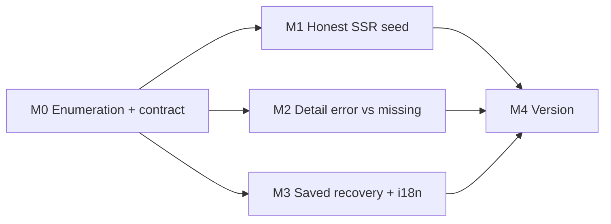

# Plan 254: Recoverable Error States for Discovery, Provider Detail, and Saved Items

| Field          | Value                                                                                                                                         |
| -------------- | --------------------------------------------------------------------------------------------------------------------------------------------- |
| Plan ID        | 254 (provisional; the Orchestrator must confirm. `agent-output/.next-id` was not read or changed)                                             |
| Target Release | next available patch after current origin/main version; confirm at DevOps Stage 1                                                             |
| Epic Alignment | Discovery reliability (frontend review #251)                                                                                                  |
| Related Issues | None. Source: [QA 251](../qa/251-frontend-review.md) F4, F8, F9; [Code Review 251](../code-review/251-frontend-review-code-review.md) batch 3 |
| Classification | Bugfix                                                                                                                                        |
| Pipeline       | Full (Critic → Implementer → Code Review → QA → UAT → DevOps)                                                                                 |
| GitHub Issue   | Not created: terminal access was disabled during planning. Create it after the plan is approved.                                              |
| Created        | 2026-09-24T19:10Z (approx.)                                                                                                                   |

## Changelog

| Time (UTC)                  | Agent   | Change                                                                                |
| --------------------------- | ------- | ------------------------------------------------------------------------------------- |
| 2026-09-24T19:10Z (approx.) | Planner | Drafted from code review 251, batch 3. Awaiting user approval of the value statement. |

## Value Statement and Business Objective

As a **visitor browsing halal food, stores, or community services**, I want a temporary outage to show as an error I can retry, not as "no results" or "not found", so that I trust the listings and don't leave thinking UFlow has nothing near me.

**Success criteria**

- When the server-side discovery read fails, the five discovery routes show the existing error-with-retry state, or recover by fetching on the client, instead of an empty result.
- A provider-detail fetch failure shows a retryable error, not a 404.
- The saved page offers retry after a load failure, and shows localized feedback when unsaving fails.

## Objective

- **F4**: in [renderProvidersPage.tsx](<../../src/app/(public)/providers/renderProvidersPage.tsx#L60>), a caught failure currently seeds [ProvidersContent.tsx](<../../src/app/(public)/providers/ProvidersContent.tsx#L269>) with an empty **successful** page. Mount refetch is disabled, so the grid's error and retry branch is never reached. Five routes are affected: `/food`, `/food/[city]`, `/food/[city]/[category]`, `/stores`, and `/ummah`.
- **F9**: [ProviderDetailPageClient.tsx](<../../src/app/(public)/p/[id]/ProviderDetailPageClient.tsx#L145>) returns not-found for both errors and missing records.
- **F8**: [saved/page.tsx](<../../src/app/(public)/saved/page.tsx#L521>) has no retry in its error state, and unsave failures appear only in the console.

## Release Strategy

**Bundled with**: Plans 252 and 253.

- 254 is independent of both, apart from sequencing locale-file edits.
- Must **not** ship in v0.15.18.
- Version pre-flight could not run because terminal access was disabled. DevOps Stage 1 confirms the version.
- **In-flight conflicts**:
  - `cr/244-t1-seo-machinery` and `fix/245-category-pages-broken` change the `/food/[city]` routes and their 404 behavior.
  - `fix/250-mobile-ui-jank-fixes` touches `DiscoveryResultsGrid` padding and `ProviderDetailPage`.
  - Rebase after those merge, and confirm that the real-404 behavior for unknown slugs from #245 is preserved.

## Decision Record

1. **[RESOLVED] A failed server read must not seed a successful result.** When the server-side read fails, the client performs its own fetch and uses the existing `DiscoveryResultsGrid` loading, error, and retry branches. This reuses existing UI, and the extra request happens only on failure.
2. **[RESOLVED] A genuinely empty server result still seeds the page, with no extra fetch.** This preserves the Plan 010 server-first behavior and its cost.
3. **[RESOLVED] Provider detail has three outcomes:**
   - Confirmed missing: not found.
   - Fetch failed with no data: a retryable error.
   - Background refetch failed while data is cached: keep showing the data.

   A server-side `null` must **not** count as confirmed missing before the client fetch settles. Admins and owners load RLS-hidden providers on the client, following the Plan 085 pattern.

4. **[RESOLVED] Saved page:** the error state gains a retry. An unsave failure shows localized feedback and keeps the item, which the current post-success cache update already does. A failed bookmark lookup also shows feedback.
5. **[RESOLVED] Localize every hardcoded user-visible string in `saved/page.tsx` (rule 6k)**, reusing equivalent existing `login.*` keys where they exist.
6. **[DEFERRED: Planner, batch 4 plan]** Unifying auth error mapping across the login page, saved page, and modals (F11/F13). This plan only localizes strings in place.
7. **[RESOLVED] Entity ownership: not applicable.** No `providers` rows are created or modified; unsave deletes only the user's own `bookmarks` row under existing RLS. **Shared-results actionability: not applicable.** No new inline actions are added to any result list.
8. **[RESOLVED] Observability:** keep the existing server-side failure log in `renderProvidersPage`, and add no logging service. Client error states must not render raw error messages.
9. **[DEFERRED: Planner, follow-up after #250 merges]** The equivalent error-versus-missing handling on the community-service detail client, which #250 is currently changing.

## Assumptions

- `DiscoveryResultsGrid` already renders loading, error with `onRetry`, empty, and results branches correctly, as QA verified by source reading and a 503 injection on `/search`.
- `useProvider` returns `null` for a missing record and throws on a fetch failure. M0 must verify this against `getProviderById`.

## Plan

### M0: State enumeration and contract verification (required)

Enumerate every branch in scope and mark each **fix** or **confirmed unaffected**:

- **ProvidersContent**:
  - server seeded with results;
  - server seeded empty;
  - **server failed** (fix);
  - status filter active (no seed);
  - section mismatch (no seed);
  - near-me active (separate query).
- **DiscoveryResultsGrid**: loading, error with retry, empty, results, infinite-scroll pagination error.
- **ProviderDetailPageClient**:
  - loading with no initial data;
  - server data;
  - server null, then client data;
  - server null, then client null (not found);
  - **client error with no data** (fix);
  - **refetch error with cached data** (fix);
  - mobile and desktop presentation (unchanged; owned by #250).
- **Saved page**:
  - login required;
  - skeleton;
  - **error** (fix: retry);
  - no saved items;
  - no results;
  - list;
  - **unsave failure and lookup failure** (fix: feedback).

Also verify how `getProviderById` distinguishes a missing record from a failure (decision 3).

**Acceptance**: the enumeration table is in the implementation doc, and every branch has a disposition.

### M1: Honest server seed (F4)

- The server renderer passes a distinguishable failure outcome instead of an empty success. `ProvidersContent` only seeds from a successful read, and otherwise fetches on the client.
- **Acceptance**:
  - With the server search forced to fail, all five routes end in either real results (the client fetch succeeded) or the error state with a working retry. None shows the empty state.
  - A genuinely empty server result still shows the empty state, with no additional client request.
  - The server-side failure log still appears.

### M2: Provider detail error versus missing (F9)

- Apply decision 3.
- **Acceptance**:
  - A missing id still returns not found.
  - A failed fetch shows a translated error with retry, and a successful retry renders the provider.
  - A failed background refetch keeps the provider visible.
  - Admins and owners viewing a non-approved provider still see it.

### M3: Saved-page recovery and localization (F8)

- Add retry to the error state and user-visible feedback for unsave and lookup failures. Localize the file's strings in all 6 locales.
- **Acceptance**:
  - After a load failure, retry reloads the list.
  - A failed unsave shows localized feedback and keeps the item.
  - The i18n scan of `saved/page.tsx` finds no hardcoded user-visible strings.

### M4: Version and release artifacts

- Done at bundle level (see Plan 252, M4).

## Milestone Dependencies

Sequencing rule: M1, M2, and M3 are independent after M0 and may proceed in parallel. M1 is the highest priority.

## Testing Strategy

- **Regression, renderer to query** (required, per the client-state precedence pattern): with the real renderer and real query configuration, a server failure leads to a client fetch or error state, marked **[pre-fix FAILS]** and **[post-fix PASSES]**. Include a genuine-empty control. The QA 251 fault-injection probe shows the mechanism.
- **Component**: all provider-detail outcomes in M2, and saved-page retry and unsave-failure behavior, rendering real `EmptyState` and grid components rather than stubs.
- **Browser**: inject read failures into one discovery route and one detail route, and check the visible error and retry at 375px and 1440px.

## Validation

- `npm run type-check`, focused Vitest for the touched modules (including the existing discovery, provider-detail, and saved regressions), and `npm run lint:check` on touched files.
- The i18n scan passes.

## Risks

| Risk                                                                                   | Mitigation                                                                                    |
| -------------------------------------------------------------------------------------- | --------------------------------------------------------------------------------------------- |
| Removing the empty seed on failure causes a request spike during an outage             | The client retry policy already caps retries (2, with exponential backoff); no new retry loop |
| Treating a server-side null as missing breaks the admin and owner hidden-provider view | Decision 3 caveat, plus an explicit M2 acceptance criterion                                   |
| Collision with #244, #245, and #250                                                    | Rebase after they merge; re-verify the real-404 behavior for unknown slugs                    |
| Saved-page localization overlaps the batch 4 auth refactor                             | Decision 6: localize in place only                                                            |

**Scope note**: about 11–13 files: 4–5 source files and 6 locale files, plus tests. Going over the guideline is justified: all three fixes are small, share one error-state pattern, and are reviewed together.

## Duration Estimates

| Phase          | Range        | Uncertainty                                              |
| -------------- | ------------ | -------------------------------------------------------- |
| Critic         | 1h           | —                                                        |
| Implementation | 1–1.5 days   | The `getProviderById` missing-versus-error contract (M0) |
| QA             | 0.5 day      | Authenticated saved-page identity                        |
| UAT            | 1–2h         | —                                                        |
| DevOps         | Bundle-level | Rebase on #244/#245/#250                                 |

## Rollback

Revert the touched source files independently for each milestone. No migrations, data changes, or deploy-surface changes are involved.
