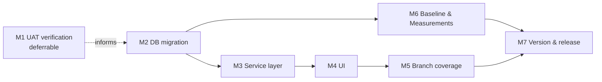

# Plan 266: Desktop search, suggestion results parity and partial (prefix) matching

| Field          | Value                                                                                                                                                      |
| -------------- | ---------------------------------------------------------------------------------------------------------------------------------------------------------- |
| Plan ID        | 266                                                                                                                                                        |
| Target Release | next available patch after current origin/main version (0.15.18); confirm at DevOps Stage 1                                                                |
| Epic Alignment | Discovery / Search quality (Postgres-first search)                                                                                                         |
| Related Issues | https://github.com/abu-lina/uflow/issues/431; analysis [266-desktop-search-partial-analysis.md](../analysis/closed/266-desktop-search-partial-analysis.md) |
| Classification | Bugfix                                                                                                                                                     |
| Pipeline       | Bugfix (Analyst → Planner → Implementer → Code Reviewer → QA → DevOps)                                                                                     |
| GitHub Issue   | https://github.com/abu-lina/uflow/issues/431                                                                                                               |
| Created        | 2026-09-26T21:03Z                                                                                                                                          |
| Session        | S266-desktop-search-partial · branch `session/266-desktop-search-partial`                                                                                  |

## Changelog

| Timestamp (UTC)   | Agent         | Change                                                                                                                                                                                      |
| ----------------- | ------------- | ------------------------------------------------------------------------------------------------------------------------------------------------------------------------------------------- |
| 2026-09-28T09:51Z | QA            | Re-tested the code-review migration test-loader fix: 31/31 migration tests, type-check, and diff check passed. QA remains complete; handed off to UAT.                                      |
| 2026-09-28T00:00Z | Code Reviewer | Final pre-QA quality gate passed. Applied fix-in-review to remove hardcoded migration filename dependency in migration test loader. Handed off to QA for test execution.                    |
| 2026-09-26T21:03Z | Planner       | Plan created from analysis 266. User answers: Q1 "advise" → Planner recommendation recorded (D1); Q2 yes (D2); Q3 yes + visible in UI (D3).                                                 |
| 2026-09-26T21:03Z | Planner       | Analysis 266 set to Planned and moved to `analysis/closed/`. GitHub issue #431 created.                                                                                                     |
| 2026-09-27T06:48Z | Code Reviewer | Re-review round 2 approved after resolving i18n and category-index findings.                                                                                                                |
| 2026-09-27T07:06Z | QA            | QA Complete after verified 4/12/7 TDD evidence, focused/full tests, type-check, lint, i18n, and performance budget. Build awaits configured CI; browser/UAT validation is handed to QA/UAT. |

## Value Statement and Business Objective

As a **desktop user searching for food, stores or community services**, I want **every suggestion I click to show the matching places, and to find places by typing only the start of a word**, so that **search never shows an empty list when matching places exist, and I can discover providers without knowing exact names**.

### Success criteria (measurable)

1. Every suggestion type (provider, menu item, cuisine) returns ≥1 result for its own label in the active section and city. The analysis POC-B table must go from 2/6 non-empty clicks to 6/6 for the in-scope fixtures.
2. Word-prefix input returns hits: `Istan` → Istanbul Grill, `Kab` → Kabul Kitchen, `Afgh` → Afghan providers, `Lahm` → providers serving Lahmacun. Stopword-shaped prefixes like `Ist` must also work.
3. Multi-word partial queries (e.g. `döner keb`) return results and never raise a tsquery error, on the desktop and mobile paths.
4. Results matched via a menu item show the matched dish name(s) on the provider card.
5. Zero `ILIKE` remains in the suggestion path and in the `searchProviders` query path.

## Objective

Close both root causes from the analysis:

- **RC1:** suggestions and results use different corpora, scope and match semantics.
- **RC2:** the results RPCs match exact lexemes only.

Fix the latent multi-word tokenizer defect (F4) in the shipped prefix RPCs, and remove the ILIKE policy deviations (F5).

## Context (from analysis 266)

- Suggestions: `fetchSearchSuggestions`. It runs ILIKE on `providers`, `food_menu` and `categories`, with no section or city scope.
- Results: `searchProviders` in `src/services/providers/search.ts`. It uses `search_provider_ids_by_name`, `search_offers` and `search_needs` (`plainto_tsquery` only), plus ILIKE on categories. It never searches `food_menu`.
- Client flow (SearchBar → Header → `buildResultsUrl` → `/food[/city]?q=`) is **correct** (L1). No React or URL-state fix is required.
- Prefix prior art: Plans 096/097, migration 077, and the current `search_food_menu_items` (086, correct `'\s+'`). `search_food_concepts` (089) and `search_food_categories` (107) use a wrong `'\\s+'` split (F4).
- Prior art 229 (unmerged) does not overlap.

## Decision Record

| #   | Decision                                                                                                                                                                                  | Status                                                                                                                                                                                                                                          |
| --- | ----------------------------------------------------------------------------------------------------------------------------------------------------------------------------------------- | ----------------------------------------------------------------------------------------------------------------------------------------------------------------------------------------------------------------------------------------------- |
| D1  | **Partial-match scope = word-prefix on every typed token (AND semantics), via tsvector prefix queries.** Infix and compound-tail matching (e.g. "laden" → "Burgerladen") is out of scope. | [RESOLVED] Planner recommendation (user asked for advice). Word-prefix covers the reported symptom (typeahead-style partials), stays inside the tsvector-only constraint, and uses existing GIN patterns. Infix needs a different index family. |
| D1b | Infix / compound-word partial matching                                                                                                                                                    | [DEFERRED: owner = user + Roadmap; reason = needs a non-tsvector index strategy (e.g. `pg_trgm`), which goes beyond the "tsvector only" constraint; target = separate follow-up plan if zero-result data or user feedback shows demand]         |
| D2  | **Suggestions are scoped to the active section (`listing_type`) and, when a city is selected, to that city.** With "Everywhere" selected, suggestions are section-scoped only.            | [RESOLVED] User confirmed (Q2). This guarantees a clicked suggestion is inside the results scope.                                                                                                                                               |
| D3  | **Menu-item matches appear in results as the providers that serve the item, and the provider card shows the matched dish name(s).**                                                       | [RESOLVED] User confirmed (Q3 "yes and shown in the UI").                                                                                                                                                                                       |
| D4  | **One matching core for suggestions and results.** Both are served by the same DB-side matching rules (shared tokenizer and prefix/exact logic), so they cannot drift again.              | [RESOLVED] This addresses the systemic weakness in the analysis (no single source of truth).                                                                                                                                                    |
| D5  | **Remove ILIKE from the suggestion path and the `searchProviders` category branch.** Replace it with tsvector matching on category names.                                                 | [RESOLVED] Project rule "never ILIKE"; ILIKE also hid RC2.                                                                                                                                                                                      |
| D6  | **Fix the F4 tokenizer defect in `search_food_concepts` and `search_food_categories` in the same migration, using the shared tokenizer.**                                                 | [RESOLVED] Same root theme (partial multi-word queries). Low risk because the fix is a function body replacement.                                                                                                                               |
| D7  | Keep `search_provider_ids_by_name` in the DB, unused, for rollback safety.                                                                                                                | [DEFERRED: owner = Implementer of next search-touching plan; reason = rollback path during the 266 rollout; target = cleanup after 266 has been in production for one release]                                                                  |
| D8  | Store catalog items (`store_catalog`) are **not** added to matching.                                                                                                                      | [DEFERRED: owner = Roadmap; reason = suggestions do not surface store items today, so there is no parity gap; target = future stores-search plan]                                                                                               |

Ownership / actionability checks: not applicable. The plan is read-only over `providers` and adds no inline actions.

## Release Strategy

Standalone. No other non-closed plans target the next patch after 0.15.18. Older plans in `agent-output/planning/` reference stale base versions.

## Assumptions

1. Supabase Postgres uses the same German Snowball behaviour as local PG 17.6 (analysis G4). If not, the prefix acceptance examples may need adjusting, but the approach still holds.
2. Current data volume is small (well under the 500-row safety caps used by existing RPCs), so a combined matching RPC is acceptable without pagination inside the RPC.
3. DB migrations are applied manually to UAT and production. The deploy workflows (`deploy-uat.yml`, `deploy-hetzner.yml`) do not run migrations. Verified: no migration step in either workflow.

## Plan

### M1: Pre-implementation verification (UAT, read-only)

Owner: DevOps or QA (whoever has UAT DB access). This is a gate, but it may be deferred as described below.

1. Confirm the deployed bodies of `search_food_concepts` and `search_food_categories` contain the `'\\s+'` split (analysis G1). Call one with a two-word query and record the error or the result.
2. Confirm German stemming parity with one `to_tsvector('german', …)` sample (analysis G4).
3. Record the latest applied migration number on UAT, to avoid a migration-number collision with parallel worktrees.

**Acceptance:** results are appended to the plan's Changelog or the implementation doc.
**Allowed deferral:** if UAT access is unavailable, the Implementer proceeds. D6 is safe whether or not F4 is live, because it replaces function bodies idempotently. Record the deferral with owner and rationale.

### M2: DB migration, shared matching core (`supabase/migrations/`)

Owner: Implementer.

1. Create the next-numbered migration (currently 134 on origin/main). Re-check the number against `origin/main` immediately before committing.
2. Add a **shared, immutable tokenizer helper** that turns raw user input into a safe prefix tsquery. It must:
   - split on real whitespace (fixes F4)
   - strip tsquery operator characters and punctuation
   - require every token as a prefix (AND)
   - return NULL for empty or unusable input and never raise
   - **not** silently drop stopword-shaped prefixes (e.g. `ist` must still match "Istanbul"). The Implementer chooses the mechanism, e.g. a non-stemming, stopword-free text search configuration for the prefix branch, with matching GIN expression indexes.
3. Add a **provider-matching RPC** for the results path. It returns matching provider IDs plus the matched menu-item names per provider. It matches, with exact (existing German config) OR prefix semantics, across:
   - provider name
   - offers (via `provider_offers`)
   - needs (via `provider_needs`)
   - available `food_menu` items
   - category names (DE/EN)

   It must keep the existing `review_status = 'approved'` restriction, and accept optional section (`listing_type`) and city filters so that results and suggestions share one scope definition. Use `SECURITY INVOKER`, grant to anon, authenticated and service_role, and keep a safety cap consistent with existing RPCs.

4. Add a **suggestions RPC** built on the same matching rules. Inputs: query, section, optional city, limit. Output: label plus type (provider / menuItem / cuisine), deduplicated and ranked (exact before prefix). Only emit labels that would produce ≥1 result under the same scope (D2/D4 invariant).
5. Replace the bodies of `search_food_concepts` and `search_food_categories` so they use the shared tokenizer (D6). Keep the signatures unchanged.
6. Add or confirm GIN indexes for every tsvector expression used in the new predicates. Reuse the existing `food_menu.search_vector` GIN index where it applies.
7. Leave `search_provider_ids_by_name`, `search_offers` and `search_needs` in place (D7). `search_offers` and `search_needs` stay in use elsewhere (e.g. `communityServices.ts`).

**Acceptance:**

- All fixtures from analysis POC-B/POC-3 produce the "after" outcomes in Success Criteria 1–3.
- A two-word partial query succeeds on all four prefix RPCs (the two new ones, plus the fixed `search_food_concepts` and `search_food_categories`).
- No `ILIKE` in the new SQL.
- The migration is idempotent (`CREATE OR REPLACE` / `IF NOT EXISTS`).

### M3: Service layer

Owner: Implementer.

1. `src/services/providers/search.ts`: in `searchProviders`, replace the query branch (the four-way fan-out plus ILIKE categories) with one call to the M2 provider-matching RPC, passing section and city. Keep pagination, count, admin status behaviour, barakah filters and category-ID filtering unchanged.
2. Carry the matched menu-item names onto `Provider` / `SearchResult` in `src/services/providers/types.ts` as an optional field. Non-menu matches leave it empty.
3. `src/services/providers/suggestions.ts`: switch `fetchSearchSuggestions` to the M2 suggestions RPC and accept section and optional city. Remove all ILIKE.
4. `/api/providers/search` and `renderProvidersPage` need no contract change beyond passing through the new optional result field. Confirm the JSON payload includes it.

**Acceptance:**

- The analysis POC-A recording-client checks invert: the results path consults menu items and the suggestion path applies section and city scope.
- `grep -n "ilike" src/services/providers/{search,suggestions}.ts` returns nothing.
- Existing trust-boundary regression (255, "approved only") still passes.

### M4: UI

Owner: Implementer.

1. `src/features/search/components/SearchBar.tsx`: pass the active section and selected location into the suggestion fetch, and refetch when either changes. Suggestion click behaviour is unchanged (proven correct).
2. Thread the matched dish names through `ProvidersContent.adaptSearchResultToDiscoveryItem` → `DiscoveryCardItem` → `ProviderCard` (`src/features/providers/components/ProviderCard`). When present, show a compact "serves: <dish>" line on the card. Show at most a small number of dishes, with an overflow indicator. Omit the line when there are no menu matches.
3. Add i18n keys for the card label to all locales in `src/translations/` (`de`, `en`, `ar`, `tr`, `ur`, `ps`), with RTL-safe layout for `ar` and `ur`.
4. Accessibility: the matched-dish line must be real text (readable by screen readers), not an image or tooltip-only content.
5. Mobile `/search` needs no UI change. Its `mi:` dish selections now resolve through the same `/food?q=` results path and gain the card line automatically.

**Acceptance:**

- Desktop: clicking any suggestion shows ≥1 card.
- A menu-item-driven result card shows the matched dish.
- Loading, empty and error states on the results page are unchanged.
- The `/providers` perf budget in `scripts/perf/budgets.json` is not exceeded.

### M5: Branch coverage confirmation (State-Machine requirement)

Owner: Implementer, verified by QA. All branches from the analysis are in scope:

| Branch                                                            | Expected after fix                    |
| ----------------------------------------------------------------- | ------------------------------------- |
| Desktop, provider suggestion, same section/city                   | Results (unchanged)                   |
| Desktop, provider suggestion, other section                       | Not suggested (D2)                    |
| Desktop, provider suggestion, other city while a city is selected | Not suggested (D2)                    |
| Desktop, menu-item suggestion                                     | Results + matched dish on card (D3)   |
| Desktop, cuisine suggestion                                       | Results via tsvector, no ILIKE (D5)   |
| Desktop, Enter / search icon with a partial term                  | Prefix results (D1)                   |
| Mobile `/search`, offer-concept dish → `/food?q=`                 | Results (unchanged)                   |
| Mobile `/search`, `food_menu` dish → `/food?q=`                   | Results + matched dish (fixed via M3) |
| Mobile `/search`, multi-word Was? query                           | No error; results (D6)                |
| Ummah / store sections, partial term                              | Prefix results via the same core      |

**Acceptance:** every row is confirmed in the implementation doc with evidence (test or manual note). No row is left unconfirmed.

### M6: Baseline & Measurements

Owner: Implementer (local), with DevOps/QA on UAT.

- **What:** execution time of the new provider-matching RPC and suggestions RPC, for 3 representative queries (single-word exact, single-word prefix, two-word prefix). Include an `EXPLAIN ANALYZE` excerpt showing index use on the name and menu-item predicates.
- **Where:** UAT (preferred); local seeded DB as a fallback.
- **Thresholds:** suggestions RPC ≤ 100 ms and provider-matching RPC ≤ 200 ms at current UAT data volume. No regression of the `/food?q=` server response versus the pre-change baseline by more than 20%.
- **Allowed deferral:** if UAT access is unavailable, record local numbers plus a deferral note with owner (DevOps) and rationale. The UAT numbers are then captured at DevOps Stage 1.
- **Implementation requirement:** baseline numbers must be recorded, or an explicit deferral documented.

### M7: Version and release artifacts

Owner: Implementer, confirmed by DevOps.

1. Bump `package.json` to the next patch after the current origin/main version. Confirm the exact number at DevOps Stage 1.
2. Add a CHANGELOG entry:
   - suggestion clicks always return results
   - prefix search
   - menu-item matches shown on cards
   - multi-word Was? search fix
3. **Deployment note for DevOps:** apply the M2 migration to UAT **before** `deploy-uat.yml`, and to production **before** `deploy-hetzner.yml`. The new code depends on the new RPCs. Neither workflow runs migrations.

**Acceptance:** version and CHANGELOG are consistent, and the migration-first ordering is recorded in the DevOps doc.

## Milestone Dependencies

Sequencing rule: UI work (M4) starts only after the M2 RPC contracts are fixed and M3 returns the matched-dish field. M1 never blocks M2.

## Testing Strategy (high level; QA owns test cases)

- **Migration/SQL level:** behavioural checks of the RPCs against fixtures (exact, prefix, stopword-shaped prefix, multi-word, empty/garbage input, section and city scoping, approved-only). Avoid SQL-text-only assertions; they are what let F4 slip through in migration test 077.
- **Service unit tests:** recording-client style (as in the 255 regression) for scope parameters, the absence of ILIKE, and mapping of matched dish names.
- **Component tests:** SearchBar passes section and city to suggestions; ProviderCard renders or omits the matched-dish line; i18n keys exist for all locales.
- **Regression naming:** follow the project's client-state/regression pattern. Name the bug-path tests so the pre-fix failure is visible (e.g. menu-item suggestion → empty list).
- **Gates:** `vitest`, `tsc` (type-check), lint, and the `/providers` perf budget.

## Validation

- Recheck analysis POC-B and POC-3 fixtures against the new RPCs; the "after" state must match Success Criteria 1–3.
- Manually check on UAT, desktop and mobile, across the M5 branch table (QA/UAT responsibility).

## Risks

| Risk                                                           | Likelihood | Impact | Mitigation                                                                                          |
| -------------------------------------------------------------- | ---------- | ------ | --------------------------------------------------------------------------------------------------- |
| Prefix matching on very short inputs returns broad result sets | Medium     | Low    | Keep the 2-character minimum; rank exact matches before prefix matches.                             |
| Migration-number collision with parallel worktrees             | Medium     | Medium | Re-check the number against origin/main before commit (M2.1).                                       |
| Code deployed before the migration → RPC-not-found errors      | Low        | High   | Migration-first ordering in M7. Existing error handling returns empty results rather than crashing. |
| Stemming differences on Supabase (G4)                          | Low        | Low    | M1 check; acceptance examples can be adjusted without changing the approach.                        |
| Card line adds layout shift or clutter                         | Low        | Low    | Compact single line, capped dish count, omitted when empty.                                         |

## Rollback

- **App:** revert the code commit. The old RPCs (`search_provider_ids_by_name`, `search_offers`, `search_needs`) stay deployed (D7), so the previous code keeps working.
- **DB:** the new functions are additive. The F4 body fix is backward-compatible (same signatures). No data changes.

## Duration Estimates

| Phase          | Range                                             | Uncertainty drivers                                                                      |
| -------------- | ------------------------------------------------- | ---------------------------------------------------------------------------------------- |
| Analysis       | Done                                              | —                                                                                        |
| Planning       | Done (this doc), plus one Critic loop if required | —                                                                                        |
| Implementation | 1.5–2.5 days                                      | Tokenizer handling of stopword-shaped prefixes; index choice; card layout across locales |
| Code Review    | 0.5 day                                           | SQL review depth                                                                         |
| QA             | 0.5–1 day                                         | UAT DB access for M1/M6                                                                  |
| UAT            | 0.5 day                                           | Mobile and desktop manual pass                                                           |
| DevOps         | 0.5 day                                           | Manual migration ordering across UAT and production                                      |

## Open Questions

- **OPEN QUESTION [RESOLVED]:** Q1, partial-match scope → D1 (word-prefix). Infix is deferred (D1b). The user may override before implementation.
- **OPEN QUESTION [RESOLVED]:** Q2, scope suggestions → D2 (yes).
- **OPEN QUESTION [RESOLVED]:** Q3, menu-item hits in results and UI → D3 (yes).
