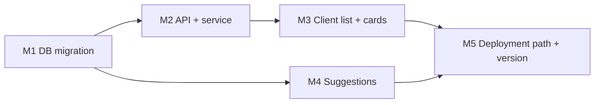

# Plan 267 — Admin "All" Status Scope on Food Search

| Field          | Value                                                                                                                                               |
| -------------- | --------------------------------------------------------------------------------------------------------------------------------------------------- |
| Plan ID        | 267                                                                                                                                                 |
| Target Release | next available patch after current `origin/main` version (`0.15.20`); confirm at DevOps Stage 1                                                     |
| Epic Alignment | Admin moderation in discovery (Plan 058 contract) / Food search (Plan 266)                                                                          |
| Related Issues | UAT report: `https://uat.ummahflow.com/food?q=Munchies` (no results) vs `https://uat.ummahflow.com/food/berlin?q=Munchies&status=pending` (results) |
| Classification | Bugfix                                                                                                                                              |
| Pipeline       | Bugfix                                                                                                                                              |
| GitHub Issue   | https://github.com/abu-lina/uflow/issues/435                                                                                                        |
| Created        | 2026-09-28T11:37Z                                                                                                                                   |
| Analysis       | [agent-output/analysis/closed/267-food-search-scope-mismatch-analysis.md](../analysis/closed/267-food-search-scope-mismatch-analysis.md)            |

## Changelog

| Timestamp         | Agent       | Change                                                                                                                                                                                                                                                                                                                                                                                                                                                                                                                                                                              |
| ----------------- | ----------- | ----------------------------------------------------------------------------------------------------------------------------------------------------------------------------------------------------------------------------------------------------------------------------------------------------------------------------------------------------------------------------------------------------------------------------------------------------------------------------------------------------------------------------------------------------------------------------------- |
| 2026-09-28T11:37Z | Planner     | Plan created from Analysis 267. User resolved OQ1 = A ("All" shows every status for admins) and OQ2 = A (admin suggestions follow the same scope). User added two requirements: each card shows its review status, and the "All" overview has no Approve/Reject buttons.                                                                                                                                                                                                                                                                                                            |
| 2026-09-28T11:41Z | Critic      | Critique Initial: REVISION REQUESTED (C1, M1–M3, L1–L4).                                                                                                                                                                                                                                                                                                                                                                                                                                                                                                                            |
| 2026-09-28T11:47Z | Planner     | Revision 1. C1: "all" becomes an explicit four-status set that excludes `removed_by_owner` (D1). M1: page URL `status` normalized to the four tab values (D7). M2: "all" is request-only; `ReviewStatusFilter` unchanged; map pins and near-me receive the selected tab (D9). M3: scope extended to every section where moderation already applies (`section !== 'ummah'`), i.e. food and store (D6). L1: suggestions follow the effective scope (D2). L2: inventory completed. L3: explicit label opt-in (M3 step 2). Q1–Q3 proposed defaults recorded, pending user confirmation. |
| 2026-09-28T11:58Z | Planner     | User answers recorded: "As an admin i want to see all listings, approved, rejected, pending, so i have a complete overview. I dont care about maps and pins. The list view is important. The list view should provide on every card the info what the review status is." Q1 → D8 deferral acknowledged. Q2 → store included (all listings). Q3 → `removed_by_owner` excluded (user enumerated moderation statuses). All decisions RESOLVED/DEFERRED; ready for Critic re-review.                                                                                                    |
| 2026-09-28T12:03Z | Implementer | Implementation started after Critic APPROVED; TDD red/green confirmed for admin outer status scope.                                                                                                                                                                                                                                                                                                                                                                                                                                                                                 |
| 2026-09-28T12:45Z | QA          | QA complete: full suite (2,668 passed), focused regression suite (149 passed), type-check, delta lint, full lint, and build verified. Live admin check deferred with named ownership to post-migration UAT. Status -> QA Complete.                                                                                                                                                                                                                                                                                                                                                  |
| 2026-09-28T12:50Z | UAT         | UAT Complete — CONDITIONAL APPROVAL. Value Statement and all success criteria met across automated and PGlite evidence. Live admin browser validation deferred to post-migration deployment (DF-1). Status -> UAT Approved.                                                                                                                                                                                                                                                                                                                                                         |
| 2026-09-28T14:45Z | DevOps      | Stage 1 commit prepared: target v0.15.21, open-actions tracker created, docs closed. Status -> Committed.                                                                                                                                                                                                                                                                                                                                                                                                                                                                           |

## Value Statement and Business Objective

As an **admin or moderator** working in provider discovery (food: `/food`, `/food/[city]`, `/food/[city]/[category]`; and the equivalent store routes), I want the **"All"** status tab to return listings in **every** review status, each labelled with its status and without moderation buttons. That way I never conclude a pending or rejected listing does not exist, and I can see the full picture before choosing a specific status tab to act on.

Public and non-admin users must keep seeing **approved listings only** (AC7.2 / #415 unchanged).

## Objective

Make the admin "All" scope real, end to end: DB matcher → API route → service → client list → cards → suggestions. Do this without weakening the public approved-only guarantee and without introducing CDN caching risk.

### Success Criteria

1. An admin on `/food?q=Munchies` with the "All" tab selected sees the pending Munchies listing, labelled "Pending".
2. The same admin on `/food/berlin?q=Munchies` sees the same listing, provided `address_city = 'Berlin'`.
3. No Approve/Reject buttons appear in the "All" view. They still appear on the specific status tabs, as today.
4. An anonymous or non-admin user on the same URLs still gets 0 results. The public API with `status=all` returns 403 for non-admins.
5. Admin typeahead on `/food` with "All" selected offers "Munchies" as a suggestion. Non-admin typeahead does not. With a specific tab selected, suggestions come only from that status.
6. No public/CDN-cacheable response ever contains non-approved rows.
7. Listings with `review_status = 'removed_by_owner'` never appear in the admin "All" view or its suggestions.
8. Opening a page URL with `status=all` or an unknown value behaves exactly like the "All" tab, with no Approve/Reject buttons.
9. Admin map pins and near-me keep working on "All" (unchanged approved-only behavior until FU-1; no errors).
10. Desktop `/store` "All" behaves the same as `/food` "All" for admins.
11. In the admin list view, **every** card shows its own review status, on "All" and on each specific tab.

## Decision Record

| #   | Decision                                                                                                                                                                                                                                                                                                                                                                               | Status                                                                                                                                                                                                                                                                                                                                                                        |
| --- | -------------------------------------------------------------------------------------------------------------------------------------------------------------------------------------------------------------------------------------------------------------------------------------------------------------------------------------------------------------------------------------- | ----------------------------------------------------------------------------------------------------------------------------------------------------------------------------------------------------------------------------------------------------------------------------------------------------------------------------------------------------------------------------- |
| D1  | For admins/moderators, "All" = the **explicit set of the four moderation statuses** (approved, pending, rejected, needs_revision) within the active section, city and category. `removed_by_owner` is **excluded**: those are owner removal requests (set by `src/app/api/outreach/action/route.ts`), not moderation candidates. "All" is never implemented as "no status predicate".  | `[RESOLVED]` User selected Option A (2026-09-28). Exclusion of `removed_by_owner` addresses Critique C1; confirmed by user 2026-09-28T11:58Z (Q3: "approved, rejected, pending" = moderation statuses).                                                                                                                                                                       |
| D2  | Admin typeahead suggestions follow the **same effective scope as the list**: the four-status set when "All" is selected, otherwise the selected status. Non-admins stay approved-only. This keeps the Plan 266 invariant that a suggestion never leads to zero results.                                                                                                                | `[RESOLVED]` User selected Option A for OQ2 (2026-09-28); tab-following addresses Critique L1.                                                                                                                                                                                                                                                                                |
| D3  | The "All" view is read-only: cards show a per-row review-status label and no Approve/Reject. Moderation actions stay on the specific status tabs only.                                                                                                                                                                                                                                 | `[RESOLVED]` Explicit user requirement.                                                                                                                                                                                                                                                                                                                                       |
| D4  | The admin "all" scope is requested **explicitly** by the client (e.g. a `status=all` value on the API request). It is never inferred from the session cookie on a status-less request.                                                                                                                                                                                                 | `[RESOLVED]` Status-less search responses are CDN-cacheable (`public, s-maxage=60`). Deriving scope from the cookie on those would risk caching admin-only rows for the public. Explicit status requests are already `no-store` and admin-gated.                                                                                                                              |
| D5  | An absent or NULL status in the DB matcher keeps meaning **approved** (fail closed). "All" requires an explicit sentinel.                                                                                                                                                                                                                                                              | `[RESOLVED]` Preserves AC7.2 for every existing caller; any caller that omits the value cannot widen scope by accident.                                                                                                                                                                                                                                                       |
| D6  | The admin "all" scope applies in **every section where admin status filtering already works**: `section !== 'ummah'`, i.e. food and store. This is the same condition as the existing moderation-enable rule. `ummah` is unchanged (the service already drops admin options for it).                                                                                                   | `[RESOLVED]` Critique M3: the desktop `Header.tsx` renders `AdminStatusFilter` for admins in every section, so on `/store` the specific tabs already filter but "All" would stay approved-only. Confirmed by user 2026-09-28T11:58Z (Q2: "see all listings").                                                                                                                 |
| D7  | The URL stays clean. "All" remains "no `status` param" in the page URL; the explicit "all" value is sent only on the API/suggestion request. The page **accepts only the four tab values** from the URL `status`; any other value (including `all`) is treated as the "All" tab. This applies wherever the URL param is read into tab state (`ProvidersContent`, desktop `Header`).    | `[RESOLVED]` Keeps existing links and canonical URLs unchanged. Normalization closes the D3 bypass found in Critique M1.                                                                                                                                                                                                                                                      |
| D8  | Map pins, near-me results and home page (`RootPageContent`) "All" semantics are out of scope.                                                                                                                                                                                                                                                                                          | `[DEFERRED: Planner + follow-up plan FU-1 (new ID from control window) + reason: separate data paths (`getMapLocations`, `search_food_near_me`, `useAdminSearch`); the reported defect is the list and suggestions]` Keeps this bugfix at about 10 source files. Acknowledged by user 2026-09-28T11:58Z (Q1: "I dont care about maps and pins. The list view is important."). |
| D9  | The "all" value is a **request-level contract only**: the API `status` param, the service's admin search options, and the suggestions scope. The shared `ReviewStatusFilter` type (tab state and row-level label prop) is **not** widened. Map pins (`useMapDiscovery` → `getMapLocations`) and near-me keep receiving the **selected tab** (null for All), never the effective scope. | `[RESOLVED]` Critique M2: `getMapLocations` filters an enum column with the value it is given, so `'all'` would fail there. Keeping the type narrow lets the compiler catch accidental flow.                                                                                                                                                                                  |

## Release Strategy

Standalone. No other non-closed plans target the next patch after `0.15.20`. Plan 266 (`0.15.20`) is merged to `main` but not yet tagged. If DevOps bundles 266 and 267 into one tag, record that at DevOps Stage 1.

## Assumptions

1. The UAT Munchies row(s) are `review_status='pending'`, `listing_type='food'` and `address_city='Berlin'` (Analysis F3, L2). QA/UAT confirm this with an admin session (Analysis G1). The fix does not depend on this assumption.
2. The current providers SELECT RLS policy (migration 130) lets admins/moderators read all rows and non-admin authenticated users read only approved rows plus their own. Browser-side suggestion calls rely on this: a non-admin who forces the "all" value can at most see their **own** non-approved rows, which RLS already permits elsewhere.
3. Migrations are applied manually before the app deploy, following the Plan 266 precedent.

## Scope

**In scope**

- DB matcher `search_providers_for_query`: explicit "all" sentinel meaning the four-status set (D1).
- DB suggestions `search_scoped_suggestions`: accepts a review-scope argument that defaults to approved.
- `/api/providers/search`: accepts and admin-gates the "all" value.
- Provider search service: honors "all" as the four-status set in both the RPC call and the outer PostgREST query.
- `ProvidersContent`: URL status normalization (D7); requests "all" for admins when "All" is selected on food/store (D6); suppresses moderation for "All"; maps the per-row review status onto cards; keeps map/near-me on the selected tab (D9).
- Desktop `Header.tsx`: URL status normalization only (D7).
- `DiscoveryResultsGrid` / `ProviderCard`: explicit opt-in to show the review-status label without moderation buttons.
- Suggestions service and `SearchBar`: pass the admin effective scope (D2).
- Regression tests (QA defines the cases), CHANGELOG, version.

**Out of scope**: see D8, plus any change to public/non-admin behavior, the halal gate, or the moderation APIs.

## Shared Results Actionability Check

- **Result types**: the food and store results lists return only `providers` with the matching `listing_type`. Community services (`ummah`) never reach these lists, and both moderation and the "all" scope are disabled when `section === 'ummah'`.
- **Actions**: Approve/Reject are allowed **only** when a specific status tab is active (approved/pending/rejected/needs_revision), as today. They are **not** allowed in the "All" view (D3).
- **Where enforced**: in the UI, at the moderation-enable condition in `ProvidersContent`. The server-side moderation endpoints (`/api/admin/review-provider`) keep their own admin checks and halal gate. This plan does not change them.
- **Wrong-target handling**: unchanged. Existing endpoint errors surface through `toast.error`, and the "All" view does not render the buttons.

## Entity Ownership Check

Not applicable. The plan only reads `providers` and never modifies them. Visibility applies to both claimed and unclaimed providers, governed by `review_status` and admin role.

## Schema/Function Change Inventory

This plan has no enum rename, column drop or table rename. It changes two function signatures or semantics, so their callers are listed here.

| Function                                              | Change                                                                                                                                 | Callers (from `grep -rn` on `src/` and `supabase/`)                                                                                                                                                                           | Classification                                                          |
| ----------------------------------------------------- | -------------------------------------------------------------------------------------------------------------------------------------- | ----------------------------------------------------------------------------------------------------------------------------------------------------------------------------------------------------------------------------- | ----------------------------------------------------------------------- |
| `search_providers_for_query(text,text,text,text,int)` | Same signature. Adds an explicit "all" sentinel for `review_status_filter` meaning the four-status set; NULL/absent stays approved.    | `src/services/providers/search.ts`; the body of `search_scoped_suggestions`; `src/__tests__/migrations/134-desktop-search-partial.test.ts`; `src/__tests__/services/providers.test.ts` (asserts RPC args, L159)               | write/read path: update the service; update migration and service tests |
| `search_scoped_suggestions(text,text,text,int)`       | Adds a review-scope argument (default approved). The old 4-arg signature must be dropped and grants re-issued, so no overload remains. | `src/services/providers/suggestions.ts`; `src/__tests__/services/search-suggestions-plan266.test.ts`; `src/__tests__/regression/255-trust-boundaries.test.tsx`; `src/__tests__/migrations/134-desktop-search-partial.test.ts` | update the service; update the tests that assert exact RPC args         |

Any caller in this inventory that is left unchanged is a QA blocker.

**Type surface (D9)**: `ReviewStatusFilter` is defined twice (`src/services/providers/types.ts` L202 and `src/features/admin/components/AdminStatusFilter.tsx` L8) and consumed by `ProvidersContent`, `Header`, `RootPageContent`, `useAdminSearch`, `ProviderCard`, `DiscoveryResultsGrid` and `SearchResultsList`. None of these change type. Only the request-level admin search options type (`AdminSearchOptions.status`), the API validation list and the suggestions scope gain "all".

## State / Branch Enumeration (food and store sections)

| Viewer                                    | Selected tab (URL `status`)         | Effective review scope requested                                        | Moderation buttons | Per-card status label |
| ----------------------------------------- | ----------------------------------- | ----------------------------------------------------------------------- | ------------------ | --------------------- |
| Anonymous / non-admin                     | n/a (param dropped client-side)     | approved                                                                | No                 | No                    |
| Non-admin forcing `status=all` on the API | n/a                                 | **403**                                                                 | n/a                | n/a                   |
| Admin, `useIsAdmin` still loading         | (treated as non-admin)              | approved (transient)                                                    | No                 | No                    |
| Admin, food or store                      | All (absent)                        | **all = four-status set** ← fix                                         | **No** ← fix       | **Yes** ← fix         |
| Admin, food or store                      | URL `status=all` or unknown value   | treated as All → **all** ← fix                                          | **No** ← fix       | **Yes** ← fix         |
| Admin, food or store                      | Approved                            | approved                                                                | Yes (unchanged)    | Yes (unchanged)       |
| Admin, food or store                      | Pending / Rejected / Needs Revision | that status                                                             | Yes (unchanged)    | Yes (unchanged)       |
| Admin, any tab                            | n/a                                 | `removed_by_owner` rows never returned ← fix (C1)                       | n/a                | n/a                   |
| Admin, `ummah` section                    | n/a                                 | unchanged                                                               | No                 | No                    |
| Admin on All, map opened                  | n/a                                 | map pins receive the selected tab (null → approved), unchanged (D8, D9) | n/a                | n/a                   |
| Any viewer, near-me active                | n/a                                 | near-me receives the selected tab, unchanged (D8, D9)                   | No                 | No                    |

The rows marked "← fix" are changed by this plan. Every other row must be confirmed unchanged.

## Milestone Dependencies

Sequencing rule: UI milestones (M3, M4) start once M1 and M2 are merged locally. The migration must be applied to UAT **before** the app deploy (M5).

## Plan

### M1 — DB: explicit "all statuses" scope (new migration `135_…`)

**Objective**: let the matcher and the suggestions function return every review status only when explicitly asked.

1. Add a new migration in `supabase/migrations/` (next number after `134`). Do not edit migration 134.
2. `search_providers_for_query`: keep the signature. Treat a dedicated sentinel value (e.g. `'all'`) as the **explicit four-status set** (D1). It must never mean "no predicate"; `removed_by_owner` stays excluded. NULL/absent stays approved (D5). All other predicates (section, city, tsvector/prefix matching, menu-item aggregation, ordering, limit) are unchanged. Keep `SECURITY INVOKER`, so RLS still bounds what each caller can read.
3. `search_scoped_suggestions`: add a trailing review-scope argument defaulting to approved, and pass it through to the inner `search_providers_for_query` call. Drop the old 4-arg signature so there is exactly one function, then re-issue `GRANT EXECUTE` for the new signature.
4. Header comment: state that the migration must be applied manually before the dependent app code, as in 134.

**Acceptance**

- With no or NULL review scope, both functions behave exactly as in 134.
- With the sentinel, rows in the four moderation statuses are returned, subject to RLS; `removed_by_owner` rows are not.
- Only one `search_scoped_suggestions` signature exists after the migration.
- Existing index usage is preserved: no new predicate wraps the tsvector expressions.

### M2 — API route + provider search service

**Objective**: carry the explicit "all" scope from the API down to both queries, admin-gated.

1. `src/app/api/providers/search/route.ts`: accept `all` as a valid `status` value. It goes through the same admin/moderator gate (403 otherwise), the service-role client, and `no-store` caching as the other statuses. Status-less requests keep their current public path and caching (D4).
2. `src/services/providers/search.ts` (`searchProviders`): when the admin status is "all", restrict the outer query to the four-status set (not "no filter"; D1) and pass the sentinel to the RPC. Keep selecting `review_status` and `review_feedback` for admin requests. Every other path (no admin options → approved; a specific status → that status) is unchanged.
3. Types (D9): add "all" only to the request-level `AdminSearchOptions.status` and the API validation list. Do **not** widen `ReviewStatusFilter` (either definition). Row-level `review_status` types stay the DB enum.

**Acceptance**

- Anonymous `status=all` returns 403.
- Admin `status=all` returns mixed-status rows from the four-status set only, each carrying its own `review_status`, and `Cache-Control: no-store`.
- Admin `status=all` never returns `removed_by_owner` rows, with or without `q`.
- Status-less responses are byte-for-byte the same behavior as today.

### M3 — Client: food/store list and cards

**Objective**: admins on "All" see every moderation status, labelled, with no moderation buttons.

1. `src/app/(public)/providers/ProvidersContent.tsx`
   - **URL normalization (D7)**: derive the selected tab only from the four tab values; any other URL `status` value (including `all`) means "All". Apply the same normalization where desktop `src/components/layout/Header.tsx` reads the URL into its tab state.
   - Separate the **selected tab** (normalized; absent = All) from the **effective request scope**. For an admin with `section !== 'ummah'` and "All" selected, request "all". Otherwise keep today's behavior (D6).
   - Map pins (`useMapDiscovery`) and near-me keep receiving the **selected tab**, never the effective scope (D9).
   - Include the effective scope in the React Query key, and never reuse the SSR `initialData` (which is approved-only) when the effective scope is not approved-only. This prevents a stale approved-only list from persisting for admins.
   - Moderation stays enabled only when a **specific** status tab is selected, never for "All" (D3).
   - Map each card's review status from the **row** (`result.review_status`), not from the selected filter. Today the adapter assigns the filter value, which would mislabel mixed-status rows.
   - Keep passing the selected tab (null for All) to `AdminStatusFilter`, so "All" still shows as selected.
2. `src/features/search/components/DiscoveryResultsGrid.tsx` and `src/features/providers/components/ProviderCard.tsx`: allow the status label to render **without** moderation mode, i.e. in bookmark mode, only through an **explicit opt-in** set by the admin "All" view. The label must not render merely because a row carries `review_status` (public rows do, via `*`; `SearchResultsList` passes it unconditionally). Reuse the existing label styling and colours. Moderation mode rendering is unchanged.
3. Loading, empty and error states follow the existing `DiscoveryResultsGrid` behavior. The label needs an accessible text equivalent (the status name), not colour alone.

**Acceptance**

- Every row in the State/Branch table behaves as listed.
- Non-admin cards never render a status label.
- `ReviewStatusFilter` is unchanged; `tsc` passes without widening it.

### M4 — Suggestions follow the admin scope

**Objective**: admin typeahead suggests listings from the same effective scope as the list (D2).

1. `src/services/providers/suggestions.ts`: add an optional review-scope field to `SearchSuggestionScope`, passed to the RPC. Default approved.
2. `src/features/search/components/SearchBar.tsx`: for an admin/moderator (`useIsAdmin`) with `section !== 'ummah'`, pass the effective scope: "all" when the normalized URL tab is All, otherwise the selected status. Everyone else passes nothing, so the default is approved.
3. RLS remains the enforcement boundary for browser-side calls (Assumption 2).

**Acceptance**

- Admin sees the "Munchies" suggestion on `/food` with "All" selected, and not with "Approved" selected.
- A non-admin session does not see it.
- `removed_by_owner` listings are never suggested.
- RPC args for non-admins match Plan 266 exactly, apart from the new default argument.

### M5 — Deployment path audit + version and release artifacts

1. **Deployment path audit**: this plan adds a DB migration. Identify every path by which migrations reach UAT and prod (manual application per the Plan 266 precedent, plus any `.github/workflows/*` or `scripts/` steps). Confirm the order is migration before app for both environments.
   - Record compatibility in both directions:
     - Old app with new DB: compatible, because defaults are unchanged.
     - New app with old DB: the "all" sentinel matches no rows and the 5-arg suggestions call errors, so suggestions come back empty. This fails closed with no leak.
2. Update `package.json` / `package-lock.json` version to the next patch after `0.15.20`, confirmed at DevOps Stage 1.
3. Add a `CHANGELOG.md` entry: admin "All" tab on food and store discovery now shows all moderation statuses (excluding owner-removed listings), with status labels and without moderation buttons; admin suggestions follow the selected tab.

**Acceptance**

- The audit lists every entrypoint that was checked.
- The version is consistent across artifacts.
- The CHANGELOG reflects D1–D3 and D6.

## Testing Strategy (high level; QA owns the cases)

- **Unit (service)**: review-scope predicates for none, specific status and "all", in both the RPC args and the outer query. Use the mocked-client pattern from Analysis 267.
- **Unit (API route)**: admin gate for `all` (403 for non-admin/anonymous), service-role client selection, and `no-store` header.
- **Migration/SQL**: the existing 134 pg-mem style migration tests extended to cover the sentinel and the default-approved behavior, plus the single `search_scoped_suggestions` signature.
- **Component**: `ProvidersContent` branch table (the "← fix" rows plus the unchanged rows, including URL normalization and map/near-me receiving the selected tab), `Header` URL normalization, and `ProviderCard` label opt-in without moderation buttons.
- **Exclusion**: `removed_by_owner` exclusion in the RPC sentinel, the outer query and suggestions.
- **Regression naming**: follow the repo's client-state precedence pattern (`[pre-fix FAILS]` / `[post-fix PASSES]`) for the effective-scope selection and the initialData gate.
- **Gates**: `vitest`, `tsc` (`npm run type-check`), `npm run lint`.

## Validation

- UAT with an admin session:
  - `/food?q=Munchies` (All) shows Munchies labelled Pending, with no Approve/Reject.
  - The Pending tab shows Approve/Reject as before.
- UAT anonymous: `/food?q=Munchies` returns 0, and `/api/providers/search?q=Munchies&status=all` returns 403.
- Close Analysis G1 during UAT by confirming the Munchies row's status and city.

## Risks

| Risk                                                            | Likelihood           | Impact | Mitigation                                                                           |
| --------------------------------------------------------------- | -------------------- | ------ | ------------------------------------------------------------------------------------ |
| Admin rows leak into public or CDN caches                       | Low                  | High   | D4 (explicit param only, `no-store`), D5 (fail-closed default), 403 gate             |
| Suggestions overload / grant drift after changing the signature | Medium               | Medium | M1 step 3: drop the old signature and re-grant; inventory tests updated              |
| Stale approved-only SSR `initialData` shown to admins           | Medium               | Low    | M3: gate `initialData` on the effective scope and include the scope in the query key |
| App deployed before the migration                               | Low                  | Low    | Fails closed (M5 compatibility note); migration-first ordering in the audit          |
| Mixed-status list is confused with the moderation view          | Low                  | Low    | D3: labels only, no buttons in "All"                                                 |
| Owner-removed listings resurface for admins                     | Low (after revision) | High   | D1: explicit four-status set in DB and outer query; acceptance + tests               |
| "all" reaches map pins / near-me and errors                     | Low (after revision) | Medium | D9: request-only type; map/near-me receive the selected tab                          |
| `?status=all` URL re-enables moderation on mixed list           | Low (after revision) | Medium | D7: URL normalization in `ProvidersContent` and `Header`                             |

## Rollback

- Revert the app commit. The old app is compatible with the new DB.
- If needed, apply a follow-up migration that restores the 134 definitions, including the 4-arg `search_scoped_suggestions` and its grant.

## Duration Estimates

| Phase             | Estimate                                 |
| ----------------- | ---------------------------------------- |
| Analysis          | Done                                     |
| Planning + Critic | 0.5 day                                  |
| Implementation    | 0.5–1 day                                |
| QA                | 0.5 day                                  |
| UAT               | 0.25 day (needs an admin session on UAT) |
| DevOps            | 0.25 day (manual migration step)         |

Uncertainty drivers:

- The pg-mem migration test harness may not support dropping and recreating the overload.
- Whether `ProviderCard` label rendering can be decoupled from moderation mode without touching other card consumers (`SearchResultsList`, `RootPageContent`).

## Follow-ups

- **FU-1 (D8)**: align map pins, near-me and the home page (`RootPageContent` / `useAdminSearch`) with the admin "All" semantics. Owner: Planner. This needs a new plan ID from the control window.

## Open Questions

- **OPEN QUESTION [RESOLVED]**: OQ1, the meaning of admin "All". Resolved as all statuses (D1).
- **OPEN QUESTION [RESOLVED]**: OQ2, admin suggestions scope. Resolved as the same scope as the list (D2).
- **OPEN QUESTION [RESOLVED]**: Q1 (Critique) — D8 deferral acknowledged by user (map pins not needed; list view is the priority).
- **OPEN QUESTION [RESOLVED]**: Q2 (Critique M3) — `/store` included in admin "All" (D6).
- **OPEN QUESTION [RESOLVED]**: Q3 (Critique C1) — `removed_by_owner` excluded from admin "All" (D1).
