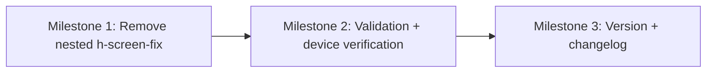

# 020 — iPhone SE Viewport Overlap v2 — Remediation Plan

## Changelog

| Date       | Author | Change                |
| ---------- | ------ | --------------------- |
| 2026-02-24 | Planner | Initial plan created |
| 2026-02-24 | Planner | Scope locked: Option 1 + duration estimates |
| 2026-02-24 | QA | QA executed — status set to QA Complete |
| 2026-02-24 | UAT | UAT Complete — status set to UAT Approved |

## Plan Header

- **Target Release**: v0.6.5
- **Epic Alignment**: Bugfix follow-up to Plan 019 (iPhone SE Safari viewport overlap)
- **Status**: UAT Approved
- **Related Issues**: None

## Release Strategy

Standalone (no other known plans for this version).

## Value Statement and Business Objective

As a mobile user (especially iPhone SE / iOS Safari), I want CTAs and key content to remain fully visible and interactable (not clipped behind bottom UI or headers), so that I can complete onboarding and reach city/provider discovery without friction.

This is conversion-critical: the landing CTA and city-selection CTAs are part of the primary funnel.

## Objective

Eliminate iOS “content hidden behind footer/header” on:
- Landing (`/`) — CTA “Muslimische Anbieter entdecken”
- City selection (`/city-selection`) — map area and CTA
- City page (`/city/[cityName]`) — stage empty state and related states

## Scope

### In Scope

1. **Single source of viewport height truth**
   - Ensure the viewport-height constraint is owned by the root layout only (`RootClientLayout`), and child screens fill available space instead of claiming their own `100dvh`.

2. **Remove nested `h-screen-fix` from child screen wrappers**
   - Replace nested `h-screen-fix` usage with container-filling primitives (`flex-1`, `min-h-0`, `h-full`, etc.) appropriate to each screen’s layout intent.

3. **Fix affected loading/error/fallback states**
   - Any screen-level `Loading...` / error / fallback wrappers currently using `h-screen-fix` inside the root layout should be converted similarly.

4. **Manual verification on iPhone SE Safari**
   - Confirm the CTA and map/controls are visible without needing “mystery scroll” and are not obscured by bottom nav areas.

### Explicit Non-Goals

- Redesigning the bottom navigation UI (visuals, spacing, icons)
- Converting `fixed` bottom nav to `sticky`
- Introducing new UI components, additional screens, or new navigation patterns

## Key Context (from Analysis 020)

- `RootClientLayout` uses `h-screen-fix` for the overall viewport container and always renders `mobile-bottom-ui-slot` with reserved height.
- Many child screens also use `h-screen-fix` inside `<main>`, causing an overflow mismatch: child requests `100dvh` but parent `<main>` is effectively `100dvh - 128px`.

## Proposed Approach

### A) Remove nested `h-screen-fix` from child screens (PRIMARY)

- Treat `RootClientLayout` as the only component that should set the viewport height.
- Child screens should size relative to the parent `<main>`.

**Primary target files (from analysis):**
- `src/components/layout/SplashLayout.tsx`
- `src/components/shared/MobileSplashScreen.tsx` (notably loading state wrapper)
- `src/app/city-selection/page.tsx`
- `src/components/shared/CityEarlyAccessEmptyState.tsx`
- `src/components/shared/EarlyAccessScreen.tsx`
- `src/app/(public)/city/[cityName]/page.tsx` (loading/error/fallback wrappers)

**Secondary sweep candidates (same pattern, lower priority unless confirmed impacted):**
- `src/components/shared/HomePageShell.tsx`
- `src/components/shared/WaitlistScreen.tsx`
- `src/components/shared/WaitlistSuccessScreen.tsx`
- Provider pages that embed `h-screen-fix` wrappers under `RootClientLayout`

**Scope decision**: Secondary sweep candidates are **out-of-scope for v0.6.5** unless QA/UAT confirms they exhibit the same overlap regression.

### B) Bottom slot behavior (DECISION)

**Decision: Option 1** — keep `mobile-bottom-ui-slot` reserved height behavior unchanged (including when `data-mobile-ui="none"`).

Rationale:
- Avoids hydration layout shift risk
- Preserves the intentional “always in DOM” behavior
- The reported issue is addressed by Approach A (removing nested viewport-height claims)

## Milestone Dependencies

Sequencing rule: UI/layout refactors (M1) land first, then validations + iPhone SE verification (M2).

## Implementation Milestones

1. **Milestone 1 — Remove nested viewport-height wrappers**
   - Identify all `h-screen-fix` instances rendered within `RootClientLayout`’s `<main>` on the onboarding/city discovery funnel.
   - Replace with fill-parent sizing (`flex-1`, `h-full`, `min-h-0`) consistent with each component’s intent (centered content vs scrollable).
   - Ensure scroll behavior remains correct (avoid double-scroll containers).

   **Acceptance Criteria**:
   - Landing CTA is visible and not clipped behind bottom UI.
   - City-selection map/header/CTA are visible and interactable.
   - City empty state CTA(s) remain visible with bottom nav present.

2. **Milestone 2 — Validation + iPhone SE verification**
   - Run type-check, unit/integration tests, lint, and production build.
   - Verify on iPhone SE Safari (real device preferred) on:
     - `/` splash (CTA)
     - `/city-selection` (map + CTA)
     - `/city/[city]` (bottom navbar + CTA)

   **Acceptance Criteria**:
   - All automated checks pass.
   - The three reported screens no longer hide CTAs behind header/footer areas.

3. **Milestone 3 — Version management and release artifacts**
   - Bump version to `v0.6.5`.
   - Add changelog entry describing the true root cause (nested `h-screen-fix` + bottom slot interaction) and the remediation.

   **Acceptance Criteria**:
   - Version artifacts consistently reflect `v0.6.5`.
   - CHANGELOG has a clear entry for the fix.

## Duration Estimates

Rough estimates (implementation complexity is mostly layout/scroll behavior verification):

- **Planning**: 0.5–1.0h (this document + scope lock)
- **Implementation**: 3–6h (update primary target files + resolve scroll/centering regressions)
- **QA**: 1–2h (targeted mobile regression sweep)
- **UAT**: 0.5–1.0h (iPhone SE Safari verification on the 3 reported screens)
- **DevOps**: 0.5–1.0h (version bump + deploy)

Uncertainty drivers:
- How many secondary pages are affected once primary is fixed
- Whether any screen relies on nested viewport-height behavior for centering

## Testing Strategy (High Level)

- **Unit/component tests**: Adjust or add minimal coverage where layout logic is conditional (rendering modes) to guard against regression.
- **Integration checks**: Ensure navigation utilities still drive correct visibility modes.
- **Manual UI verification**: iPhone SE Safari (primary), plus one Android device as sanity check.

(Details of QA test cases belong to the QA phase.)

## Risks and Mitigations

- **Risk**: Removing `h-screen-fix` changes scroll behavior (double scroll, or loss of intended centering).
  - **Mitigation**: Enforce one scroll container (prefer `<main>`), ensure child screens use `min-h-0` appropriately.

- **Risk**: Changing bottom slot min-height introduces hydration layout shift.
  - **Mitigation**: Treat slot-collapse as optional; only implement with explicit decision + verification.

## Open Questions

None.
