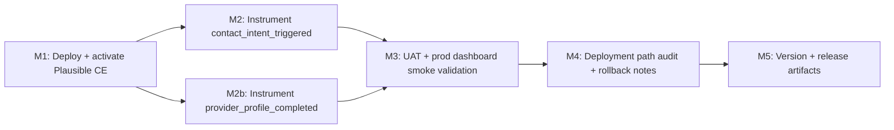

# Plan 036 — Analytics Activation & Event Instrumentation

## Plan Header

- **Target Release**: v0.7.1 (patch)
- **Epic Alignment**:
  - Follow-up to Plan 035 (v0.7.0): measurement foundation shipped (Plausible wrapper + conditional script + CSP allowlist + ISR city pages)
  - Roadmap alignment: Growth measurement + activation funnels (seekers + providers)
- **Status**: UAT Approved
- **Related Issues**: None

### Changelog

| Date (UTC) | Author | Change | Rationale |
|---|---|---|---|
| 2026-03-08T00:00Z | planner | Created plan | Activate Plausible + wire north-star events deferred from Plan 035, targeting a patch release (no user-facing behavior changes). |
| 2026-03-08T08:10Z | planner | Clarified contact_type scope | Plan 035 referenced “email tap” conceptually, but the current CTAs in the specified components only support call + website; document the intentional omission to avoid ambiguity. |
| 2026-03-08T08:35Z | code-reviewer | Status: Active → Code Review Approved | Implementation reviewed — APPROVED WITH COMMENTS. Code quality excellent, TDD exemplary, architecture aligned. One LOW finding (optional inline comments for event placement documentation). Ready for QA. |
| 2026-03-08T09:45Z | qa | Status: Code Review Approved → QA Complete | QA gates executed: `npm run type-check` (EXIT:0), `npx vitest run` (EXIT:0; 198 passed), `npm run build` (EXIT:0). QA report created and marked QA Complete. |
| 2026-03-08T10:00Z | uat | Status: QA Complete → UAT Approved | UAT Complete — all value delivered. Implementation delivers privacy-respecting analytics activation with north-star event instrumentation. M3 (dashboard validation) deferred to post-deployment verification. Verdict: APPROVED FOR RELEASE (v0.7.1). |
## Value Statement and Business Objective

As a **UFlow operator and product team**, I want to **activate privacy-respecting analytics and instrument the north-star activation events**, so that **we can measure acquisition/activation and iterate confidently without adding user friction (no cookie banner, no PII)**.

## Objective

1. Make Plausible fully operational (UAT + production) with a self-hosted Plausible CE stack on Hetzner.
2. Emit two decision-grade events with low-cardinality, non-PII properties:
   - `contact_intent_triggered`
   - `provider_profile_completed`
3. Smoke-validate the events appear in the Plausible dashboard for both UAT and production.

## Scope

### In scope

- Deploy Plausible CE on Hetzner VPS via Docker Compose (document config, volumes, healthchecks).
- Set runtime env vars to activate analytics:
  - `NEXT_PUBLIC_PLAUSIBLE_DOMAIN`
  - `NEXT_PUBLIC_PLAUSIBLE_HOST`
- Instrument `trackEvent()` calls in the specified UI components/forms.
- Validate event delivery in Plausible UI (UAT + production).

### Explicit non-goals

- Moving legacy provider UI from `src/components/providers/` into `src/features/providers/` (placement is known legacy; do not refactor in this patch).
- Adding new analytics events beyond the two north-stars.
- Adding user identifiers, provider IDs, phone numbers, or URLs to analytics props (PII / high-cardinality).

## Assumptions

- A DNS name will be available for Plausible CE (e.g., `plausible.ummahflow.com`) with TLS termination via the existing nginx/reverse-proxy approach.
- Production and UAT deployment mechanisms support setting `NEXT_PUBLIC_*` env vars (secrets manager, container env, or Hetzner host env) prior to Next.js build/runtime.
- The existing `trackEvent()` wrapper in `src/lib/analytics/plausible.ts` remains the only client-side integration surface (SSR-safe, no-op when script is absent).

## Release Strategy

Release Strategy: Standalone (no other known active plans currently targeting v0.7.1 in `agent-output/planning/`).

## Decision Record

- [RESOLVED] Self-host Plausible CE on Hetzner (Docker Compose) for v0.7.1.
  - Rationale: Plan 036 scope explicitly requires Plausible CE deployment and activation; aligns with Arch 035 allowance for self-hosting with guardrails.

- [RESOLVED] Analytics-down must be non-fatal.
  - Rationale: UFlow must keep functioning even if Plausible is unreachable; `trackEvent()` is already a safe no-op when `window.plausible` is missing.

- [RESOLVED] No PII and no high-cardinality identifiers in event props.
  - Rationale: GDPR posture + Arch 035 guardrails; keep properties to enums/booleans and normalized city.

- [RESOLVED] `contact_type` is an enum: `call` | `website`.
  - Rationale: Required by scope; keeps a stable, queryable property.

- [RESOLVED] `city` property uses the city display name/slug already shown in UI (single canonical representation), not free-text.
  - Rationale: Avoids uncontrolled cardinality. Implementation should reuse existing city value already present in the relevant components/forms.

- [DEFERRED: user | choose Plausible public hostname + access controls | target: Plan 036 implementation] Whether to protect Plausible admin via IP allowlist, Basic Auth at nginx, or both.
  - Rationale: Depends on the team’s operational preference and current Hetzner/network setup; implementer will apply at least one access-control layer.

## Milestone Dependencies

Sequencing rule: UI instrumentation (M2/M2b) can land in parallel with infra work, but **M3 requires M1** (events can only be validated once Plausible is reachable and env vars are set).

## Baseline & Measurements

### What will be measured

- Presence of events in Plausible:
  - `contact_intent_triggered` with props `{ contact_type, city }`
  - `provider_profile_completed` with props `{ city, has_phone, has_website }`

### Where measured

- Plausible dashboard:
  - UAT site: `uat.ummahflow.com`
  - Production site: `ummahflow.com`

### Success thresholds

- For each environment (UAT + production): at least 1 confirmed event received for each north-star event, with expected properties populated.

### Allowed deferral conditions

- If production dashboard access is unavailable at implementation time, defer production validation with:
  - owner (DevOps)
  - rationale (access / credentials pending)
  - timestamp
  - confirmation path (screenshots or event log export)

## Plan

### M1: Deploy and Activate Plausible CE (Hetzner Docker)

**Objective**: Make Plausible CE reachable, persistent, and safe to operate (guardrails, health checks), and activate analytics in UFlow for UAT + production.

**Work**:

1. **Compose-based Plausible CE stack** (separate from the main app stack)
   - Use a dedicated Docker Compose file (or folder) for Plausible CE.
   - Services: Plausible app + required datastores (Postgres + ClickHouse) per Plausible CE guidance.
   - Persistent storage:
     - named volumes for Postgres data
     - named volumes for ClickHouse data
   - Health checks:
     - container healthcheck for Plausible web
     - datastore healthchecks (or at minimum `depends_on` health gating)
   - Restart policies appropriate for VPS operation.

2. **Reverse proxy / TLS**
   - Expose Plausible CE through nginx with TLS (Let’s Encrypt) under the chosen hostname.
   - Ensure the Plausible `BASE_URL` (or equivalent) matches the public URL.

3. **Operational guardrails** (Arch 035)
   - Access control for the Plausible admin (at least strong credentials; ideally IP allowlist and/or nginx basic auth).
   - Backups documented for both Postgres and ClickHouse volumes.
   - Basic monitoring note: disk usage (ClickHouse growth) and container restart loops.

4. **Activate in UFlow environments**
   - Set env vars:
     - Production: `NEXT_PUBLIC_PLAUSIBLE_DOMAIN=ummahflow.com`
     - UAT: `NEXT_PUBLIC_PLAUSIBLE_DOMAIN=uat.ummahflow.com`
     - Both: `NEXT_PUBLIC_PLAUSIBLE_HOST=https://<plausible-hostname>` (self-host URL)
   - Verify CSP allowlist remains correct for the chosen `NEXT_PUBLIC_PLAUSIBLE_HOST` (Plan 035 allowedlisted Plausible managed host; self-hosting may require updating `next.config.js`).

**Acceptance criteria**:

- A documented, reproducible compose configuration exists (including volumes + health checks).
- Plausible is reachable at the public hostname over HTTPS and stays up across restarts.
- UAT + production have `NEXT_PUBLIC_PLAUSIBLE_DOMAIN` and `NEXT_PUBLIC_PLAUSIBLE_HOST` set appropriately.

---

### M2: Instrument `contact_intent_triggered`

**Objective**: Capture seeker activation when a user expresses intent to contact a provider.

**Event**:

- Name: `contact_intent_triggered`
- Props: `{ contact_type, city }`
 Props: `{ contact_type, city }`
  - `contact_type`: `call` | `website`
  - `city`: canonical city value already present in UI state (no free-text input)

**Note**: Plan 035’s measurement model referenced “email tap” as a possible contact intent. This plan intentionally limits `contact_type` to `call|website` because the current CTAs/handlers in the specified components do not include an email action. If an email CTA is added later, extend `contact_type` to include `email` as a follow-up.

**Wire into**:

- `src/components/providers/ProviderCardModal.tsx`
  - `handleCall`
  - `handleWebsite`

- `src/components/providers/ProviderDetailModal.tsx`
  - `handleExpand('call'|'website')`

- `src/components/providers/ProviderActionBar.tsx`
  - `onCall` callback
  - `onWebsite` callback

**Implementation constraints**:

- Ensure each user action emits **at most one** `contact_intent_triggered` event (avoid double-firing across nested handlers).
- Do not include phone numbers or URLs in props.

**Acceptance criteria**:

- Each call/website intent path results in a single event emission with correct props.
- No runtime errors occur when Plausible is disabled/unreachable (maintain no-op behavior).

---

### M2b: Instrument `provider_profile_completed`

**Objective**: Capture provider-side activation when a provider record is created with enough contact information to be usable.

**Event**:

- Name: `provider_profile_completed`
- Props: `{ city, has_phone, has_website }`
  - `has_phone`: boolean
  - `has_website`: boolean

**Wire into**:

- `src/features/providers/StreamlinedRecommendForm.tsx`
  - After successful `createProviderOrService` completion

- `src/features/providers/StreamlinedImportForm.tsx`
  - After successful `createProviderOrService` completion

**Implementation constraints**:

- Emit only after the provider create call is confirmed successful.
- Do not include raw phone numbers or URLs.

**Acceptance criteria**:

- Creating a provider through either streamlined flow emits the event once with correct booleans + city.

---

### M3: Dashboard Validation (UAT + Production)

**Objective**: Confirm end-to-end delivery of both north-star events.

**Work**:

- UAT smoke:
  - Trigger one `contact_intent_triggered` (call + website) and one `provider_profile_completed`.
  - Confirm in Plausible dashboard (real-time / events view).

- Production smoke:
  - Repeat minimal validation with real production site.

**Acceptance criteria**:

- Both events appear in Plausible for UAT and production with expected props.

---

### M4: Deployment Path Audit (Required)

**Objective**: Ensure all deployment entrypoints are consistent with Plausible CE activation and environment variable requirements.

**Work**:

- Enumerate and verify all deployment entrypoints that must set `NEXT_PUBLIC_PLAUSIBLE_*` (UAT + production) and any CSP changes required by self-hosting.
- Document rollback notes (how to disable analytics safely by unsetting `NEXT_PUBLIC_PLAUSIBLE_DOMAIN`).

**Acceptance criteria**:

- A short audit note exists listing each verified deployment entrypoint and where the vars live.

---

### M5: Update Version and Release Artifacts

**Objective**: Ship as a patch release.

**Work**:

- Update version to `0.7.1` consistently (e.g., `package.json`, lockfile if needed).
- Add a `CHANGELOG.md` entry for `0.7.1` noting:
  - Plausible CE activation (self-host)
  - Instrumented events: `contact_intent_triggered`, `provider_profile_completed`

**Acceptance criteria**:

- Version artifacts reflect `v0.7.1` consistently and changelog matches shipped scope.

## Validation (Engineering)

- `npm run type-check`
- `npm run lint`
- `npm test`
- `npm run build` (ensures `NEXT_PUBLIC_*` env var usage is build-safe)
- Docker Compose validation on VPS: `docker compose config` and service health green.

## Risks and Mitigations

- **CSP mismatch when self-hosting**: If CSP only allows `plausible.io`, self-hosted script/beacon may be blocked.
  - Mitigation: Ensure CSP allowlist covers the configured `NEXT_PUBLIC_PLAUSIBLE_HOST`.

- **Event double-counting**: Multiple handlers could trigger for one user action.
  - Mitigation: Choose a single emission point per click-path and keep it stable.

- **Ops overhead (ClickHouse disk growth)**: Plausible CE persistence can grow quickly.
  - Mitigation: Monitor disk usage and document backup/retention.

## Duration Estimates

- Analysis: 0.5–1.0h (confirm Plausible CE requirements + current CSP)
- Planning: 0.5h (this doc)
- Implementation:
  - M1 (infra): 2–5h (DNS/TLS + compose + hardening)
  - M2/M2b (instrumentation): 1–2h
- QA: 0.5–1.0h (local + build sanity)
- UAT: 0.5–1.0h (UAT dashboard validation)
- DevOps: 0.5–1.5h (production env vars + smoke)

Uncertainty drivers: DNS/TLS setup path on the current Hetzner VPS; access control approach for Plausible admin; whether CSP needs updating for the chosen host.

## Handoff Notes

- This plan intentionally limits scope to activation and instrumentation; no UX changes.
- Chain context: Plan 035 shipped `trackEvent()` and conditional script gating; Plan 036 activates and uses them.
