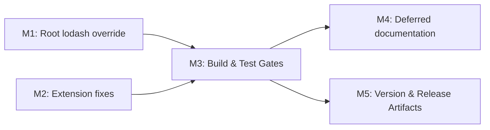

# Plan 074 — Dependabot Security Remediation

| Field              | Value                                                                           |
|--------------------|---------------------------------------------------------------------------------|
| **Plan ID**        | 074                                                                             |
| **Epic Alignment** | Security / Supply-Chain Hardening                                               |
| **Target Release** | Next available patch after current origin/main version (v0.10.1); confirm at DevOps Stage 1 |
| **Status**         | Active                                                                          |
| **Related Issues** | GitHub Dependabot alerts (8 open); Prior audits: 037, 049, 066                  |
| **Branch**         | session/074-dependabot-security-remediation                                     |

## Changelog

| Date              | Agent   | Action                              | Summary                                                          |
|-------------------|---------|-------------------------------------|------------------------------------------------------------------|
| 2026-04-03T09:00Z | Security| Triage completed                    | 8 alerts triaged → 4 fix now, 2 already fixed, 2 deferred       |
| 2026-04-03T09:15Z | Planner | Plan created from security triage   | Structured remediation plan for Implementer handoff              |

---

## Value Statement and Business Objective

**As a** maintainer of UFlow,
**I want to** remediate all actionable Dependabot security alerts across the root project and tool subprojects,
**so that** the dependency supply chain is free of known high/moderate vulnerabilities and the project passes `npm audit` cleanly on all production-affecting codebases.

---

## Decision Record

| # | Decision | Status | Rationale |
|---|----------|--------|-----------|
| 1 | Fix lodash via root `package.json` override to `>=4.18.0` | [RESOLVED] | Trivial override; resolves code injection (CVSS 8.1) and prototype pollution (CVSS 6.5) |
| 2 | Fix tar/picomatch/brace-expansion in uflow-memory-extension via `npm audit fix` | [RESOLVED] | `npm audit fix` resolves all 3 without breaking changes; override fallback if needed |
| 3 | Defer esbuild/vite in memory-backend | [RESOLVED] | Dev-only exposure; fix requires semver-major vitest ^1→^3; cost outweighs risk |
| 4 | No version bump needed for tool subproject lockfile-only changes | [RESOLVED] | Subproject lockfiles are not deployed; root package.json override + lockfile update warrants a patch release |
| 5 | Use override approach (not direct dep bump) for lodash | [RESOLVED] | lodash is transitive via swagger-ui-react and workbox-build; override is the correct mechanism |

---

## Release Strategy

Standalone (no other known plans for this version).

---

## Assumptions

1. `npm audit fix` in `tools/uflow-memory-extension` will resolve tar, picomatch, and brace-expansion without introducing regressions (all fixes are patch-level).
2. lodash 4.18.x is backward-compatible with 4.17.x for all consumers (minim, swagger-ui-react, workbox-build).
3. The root project build, tests, and type-check pass after lockfile regeneration.
4. Tool subprojects have independent lockfiles and do not affect the root build.

---

## Plan

### Milestone 1: Root Project — lodash Override

**Objective**: Eliminate the last remaining `npm audit` vulnerability in the root project.

**Tasks**:
1. Add `"lodash": ">=4.18.0"` to the `overrides` section of root `package.json`
2. Run `npm install` to regenerate `package-lock.json`
3. Verify: `npm audit` reports 0 vulnerabilities

**Acceptance Criteria**:
- `npm audit --json` → `metadata.vulnerabilities.total === 0`
- `package-lock.json` shows lodash version ≥ 4.18.0

### Milestone 2: uflow-memory-extension — tar, picomatch, brace-expansion

**Objective**: Resolve all 3 vulnerabilities in the VS Code extension subproject.

**Tasks**:
1. Run `npm audit fix` in `tools/uflow-memory-extension/`
2. If any vulnerability remains, add `overrides` to `tools/uflow-memory-extension/package.json`:
   - `"tar": ">=7.5.11"`
   - `"picomatch": ">=4.0.4"`
   - `"brace-expansion": ">=2.0.3"`
3. Run `npm install` if overrides were added
4. Verify: `npm audit` reports 0 vulnerabilities

**Acceptance Criteria**:
- `npm audit --json` → `metadata.vulnerabilities.total === 0`
- No changes to production dependencies or runtime behavior

### Milestone 3: Build & Test Gates

**Objective**: Confirm no regressions from dependency changes.

**Tasks**:
1. `npm run build` in root → exit 0
2. `npm test` in root → all tests pass
3. `npm run type-check` in root → exit 0
4. Document all gate results in implementation artifact

**Acceptance Criteria**:
- All three commands exit 0 with no new failures
- Evidence recorded in implementation doc

### Milestone 4: Deferred Alert Documentation

**Objective**: Record deferred esbuild/vite alerts with re-evaluation triggers.

**Tasks**:
1. Confirm `npm audit` in `tools/memory-backend` shows exactly 4 moderate vulnerabilities (esbuild/vite chain)
2. Document deferral in implementation artifact with:
   - Owner: Engineering
   - Trigger: Next tool modernization cycle or if memory-backend gains network-facing exposure
   - Required fix: vitest ^1.2.0 → ^3.2.4 (semver-major)

**Acceptance Criteria**:
- Deferred alerts enumerated with owner and re-evaluation conditions
- No attempt to fix memory-backend in this plan

### Milestone 5: Version Management and Release Artifacts

**Objective**: Update version artifacts for the patch release.

**Tasks**:
1. Bump `version` in root `package.json` to the next available patch (confirm at DevOps Stage 1)
2. Add CHANGELOG.md entry under the new version:
   - Security: Remediated lodash code injection (GHSA-r5fr-rjxr-66jc) and prototype pollution (GHSA-f23m-r3pf-42rh) via override
   - Security: Remediated tar path traversal, picomatch ReDoS, brace-expansion DoS in uflow-memory-extension
   - Security: Deferred esbuild/vite dev-server CORS in memory-backend (dev-only, requires semver-major upgrade)
3. Verify version consistency across package.json and package-lock.json

**Acceptance Criteria**:
- Version artifacts updated and consistent
- CHANGELOG reflects all changes from this plan

---

## Milestone Dependencies

Sequencing rule: M1 and M2 are independent and can execute in parallel. M3 gates M4 and M5.

---

## Testing Strategy

- **Unit/integration tests**: Existing test suite (`npm test`) validates no runtime regressions from dependency changes.
- **Build verification**: `npm run build` confirms Next.js compilation succeeds with updated lockfile.
- **Type checking**: `npm run type-check` confirms no TypeScript breakage.
- **Audit verification**: `npm audit` across all 3 projects confirms vulnerability resolution.
- NO new test cases required — this is a dependency-only change with no application logic modifications.

---

## Risks

| Risk | Likelihood | Impact | Mitigation |
|------|-----------|--------|------------|
| lodash 4.18.x introduces subtle behavior change | Low | Medium | Override constrains to 4.18.x range; workbox-build and swagger-ui-react are not in production code paths |
| `npm audit fix` in extension resolves one but not all vulns | Low | Low | Fallback to explicit overrides (documented in M2) |
| Lockfile churn causes merge conflicts on main | Medium | Low | This is a worktree session; merge at DevOps stage with `--no-ff` |

---

## Duration Estimates

| Phase | Estimate | Uncertainty |
|-------|----------|-------------|
| Implementation (M1–M4) | 15–30 min | Low — all fixes are override/lockfile changes |
| Build & Test Gates (M3) | 5–10 min | Low — waiting on build/test execution |
| Version & Release (M5) | 5–10 min | Low — mechanical version bump |
| **Total** | **25–50 min** | Low overall |

---

## Handoff Notes

- Security triage artifact: [agent-output/security/074-dependabot-security-remediation.md](../security/074-dependabot-security-remediation.md)
- DO NOT modify `tools/memory-backend` — esbuild/vite alerts are explicitly deferred.
- The root `package.json` already has an `overrides` section — add `lodash` to the existing object, do not create a new one.
- If `npm audit fix` in the extension modifies `package.json` (not just `package-lock.json`), review the diff to ensure no unintended dependency changes.

---

## Validation

After implementation, the following must all be true:
1. `npm audit` (root) → 0 vulnerabilities
2. `npm audit` (tools/uflow-memory-extension) → 0 vulnerabilities
3. `npm audit` (tools/memory-backend) → 4 moderate (expected, deferred)
4. `npm run build` → exit 0
5. `npm test` → all pass
6. `npm run type-check` → exit 0
7. No changes to any `src/` files
8. CHANGELOG and version updated
