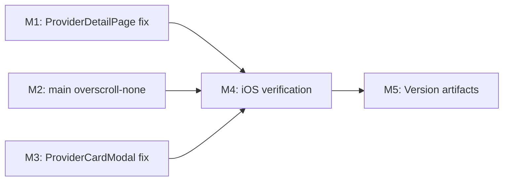

# 076 — iOS Footer CTA Overlay Fix v2

## Changelog

| Date | Author | Change |
|------|--------|--------|
| 2026-04-03T17:05Z | Planner | Initial plan created from analysis 076 |
| 2026-04-03T17:45Z | Planner | Revised per critique: M1 gradient fill check, M3 extraction specificity |

## Value Statement and Business Objective

As a mobile user on iOS, I want the footer CTA buttons (Save / Share) to remain fully visible and unobscured when I scroll or drag the provider detail page, so that I can always take action without visual interference.

Plan 075 deployed `overscroll-contain` + opaque footer but the user confirms the issue persists on UAT. This plan addresses the remaining structural root causes identified in analysis 076.

## Release Strategy

Release Strategy: Standalone (no other known plans targeting v0.10.4).

## Decision Record

| # | Decision | Status |
|---|----------|--------|
| D1 | Use `overscroll-none` instead of `overscroll-contain` — spec confirms `contain` still allows local rubber-band | [RESOLVED] CSS spec evidence (L1 Proven) |
| D2 | Replace `h-screen-fix` with `flex-1 min-h-0` on inner scroll container — architecturally correct per Plan 020 analysis | [RESOLVED] Eliminates viewport-height duplication; matches existing flex chain |
| D3 | Add `overscroll-none` to `<main>` in RootClientLayout — universal safety net | [RESOLVED] Provider detail pages excluded from footer, so no UX regression; other pages with `h-screen-fix` nesting also benefit |
| D4 | Move footer CTA outside inner scroll container as sibling — eliminates iOS compositor ambiguity | [RESOLVED] `position: fixed` is viewport-relative per spec so DOM position is irrelevant to visual layout; eliminates GPU-layer coupling |
| D5 | Apply same structural fix to `ProviderCardModal.tsx` footer | [RESOLVED] Same vulnerability exists; consistency required |
| D6 | Scope: ProviderDetailPage + ProviderCardModal + RootClientLayout only | [RESOLVED] These are the reported surfaces; broader `h-screen-fix` cleanup (13+ components per Plan 020) is a separate effort |
| D7 | Keep `overflow-y-auto` on inner scroll container (needed for content scrolling) | [RESOLVED] The inner div is the actual scroll surface for provider content; removing it would break scrolling |

## Assumptions

1. The UAT deployment at `f8c9bcb2` matches `origin/main` (verified by analyst).
2. CSS `overscroll-behavior: none` is supported on iOS Safari 16+ (caniuse confirms ≥15.4).
3. Moving the footer CTA outside the inner scroll container does not break the `customActionButtons` branch (it also uses `position: fixed`).
4. The `ProviderCardModal` mobile footer has the same structural vulnerability (footer inside scroll container).

## Plan

### Milestone 1 — Structural scroll container fix (ProviderDetailPage)

**Objective**: Eliminate the 3 structural causes of footer overlay on the provider detail mobile page.

**Where**: `src/components/providers/ProviderDetailPage.tsx` — mobile branch (`if (isMobile)` return block, currently starting ~L329).

**Tasks**:

1. On the outer mobile wrapper div (~L329):
   - Replace `h-screen-fix` with `flex-1 min-h-0` — fill available flex space instead of claiming viewport height (F2)
   - Replace `overscroll-contain` with `overscroll-none` — suppress local rubber-band, not just scroll chaining (F1)
   - Keep `overflow-y-auto` — this is the actual scroll surface
   - Keep `bg-gradient-to-b from-[#f5f5f5] to-[#fbfbfb]` — visual style unchanged
   - **Gradient fill check (Critique F2)**: Replacing `h-screen-fix` (explicit viewport height) with `flex-1 min-h-0` changes how the gradient extent resolves. If content is shorter than viewport, the gradient may not fill the visible area. Add `min-h-full` alongside `flex-1 min-h-0` if gradient appears cut off on providers with minimal content (no offers, no needs, no community services). Verify during implementation.

2. Move the footer CTA block (~L595) **outside** the inner scroll container div, making it a sibling instead of a child (F4):
   - The footer CTA is the `
` and the `customActionButtons` conditional above it
   - Since both are `position: fixed`, their visual position is unchanged
   - The `
` closing the scroll container should come before the footer block
   - Wrap the scroll container + footer in a parent fragment or a new wrapper div with `flex-1 min-h-0 relative flex flex-col`

**Acceptance**:
- Inner scroll container uses `flex-1 min-h-0 overflow-y-auto overscroll-none` (no `h-screen-fix`)
- Footer CTA is a DOM sibling of the scroll container, not a child
- Content scrolling still works on mobile
- Footer CTA remains visually fixed at viewport bottom
- Background gradient fills the visible area even on providers with minimal content

### Milestone 2 — Safety net on `<main>` (RootClientLayout)

**Objective**: Prevent `<main>` from rubber-banding if it becomes scrollable due to any remaining height mismatch (F3).

**Where**: `src/components/layout/RootClientLayout.tsx` — `<main>` element (~L120).

**Tasks**:

1. Add `overscroll-none` to `<main>`'s className: `"flex min-h-0 flex-1 flex-col overflow-y-auto overscroll-none"`

**Acceptance**:
- `<main>` has `overscroll-behavior: none`
- No visual regression on other pages (desktop footer, mobile footer bar, landing page all unaffected)

### Milestone 3 — Apply same fix to ProviderCardModal

**Objective**: Apply the footer extraction pattern to the modal path for consistency (D5).

**Where**: `src/components/providers/ProviderCardModal.tsx` — mobile footer (~L780).

**DOM structure (Critique F1 — specificity)**: The modal is rendered via `createPortal` to `document.body`. The relevant structure is:
- L468: `createPortal(` — portal root
- L471: `
` — backdrop overlay
- L477: `
` — modal container (fixed)
  - L492: `
` — **inner scroll container**
    - L625: `
` — mobile content
    - L780: `
` — **footer CTA (INSIDE scroll container)**

**Tasks**:

1. Add `overscroll-none` to the inner scroll container at L492 (the `overflow-y-auto` div)
2. Move the footer CTA at L780 (`
`) **outside** the `overflow-y-auto` div at L492, making it a sibling within the `fixed inset-x-0 bottom-0 top-6` modal container at L477

**Acceptance**:
- Modal mobile footer is a child of the `fixed` modal container (L477), NOT a child of the `overflow-y-auto` scroll div (L492)
- `overscroll-none` on the modal scroll surface (L492)

### Milestone 4 — iOS device verification

**Objective**: Confirm the fix resolves the user-reported issue on physical devices.

**Where**: UAT environment after deployment.

**Tasks**:

1. Open `/providers/[provider_id]` on iPhone SE (375×667) in Safari
2. Scroll to bottom of content
3. Drag/swipe upward past the content boundary (trigger overscroll)
4. Confirm footer CTA remains fully visible, no background overlay
5. Repeat on iPhone 16 Pro (393×852)
6. Verify `ProviderCardModal` modal path on both devices

**Acceptance**:
- Footer CTA is never obscured during overscroll gestures on both devices
- Content scrolling is smooth and natural
- No visual regressions (header, navigation, other pages)

### Milestone 5 — Version artifacts and release

**Objective**: Update version and release artifacts.

**Tasks**:

1. Update `package.json` version to target release
2. Update `package-lock.json` version 
3. Add CHANGELOG entry describing the fix
4. Commit with conventional commit message

**Acceptance**:
- Version artifacts updated and consistent
- CHANGELOG documents the structural fix (overscroll-none, flex-1, footer extraction)

## Milestone Dependencies

Sequencing: M1, M2, M3 are independent and can be implemented in any order. M4 requires all three. M5 follows M4.

## Testing Strategy

- **Unit/Integration**: CSS-only changes are not unit-testable in jsdom. Existing `MobileProviderDetail` tests should continue to pass (2/2).
- **Visual/Manual**: Physical iOS device testing (M4) is the primary validation gate. This is a compositor/rendering bug that only manifests on real iOS Safari.
- **Regression**: Verify other pages using `<main>` scroll (`/`, `/city/[name]`, `/profile`) are unaffected by the `overscroll-none` addition.
- **Automated gates**: `tsc --noEmit`, ESLint, existing test suite must all pass.

## Risks

| Risk | Likelihood | Impact | Mitigation |
|------|-----------|--------|------------|
| `flex-1 min-h-0` changes scroll container height, breaking content layout | LOW | HIGH | Content already scrolls inside; `flex-1` fills available space which should match or be smaller than viewport height |
| Moving footer outside scroll container breaks `customActionButtons` positioning | LOW | MED | Both `customActionButtons` and default footer use `position: fixed` — DOM position is irrelevant to visual layout |
| `overscroll-none` on `<main>` changes scroll feel on other pages | LOW | LOW | Most pages delegate scrolling to inner containers; `<main>` shouldn't be the primary scroll surface. Pull-to-refresh (if any) would be affected — verify |
| Fix still insufficient — deeper iOS compositor issue | MED | MED | This plan addresses all 4 identified root causes. If still broken, the next investigation step is GPU layer diagnostics via Safari Web Inspector |

## Duration Estimates

| Phase | Estimate | Uncertainty |
|-------|----------|-------------|
| Implementation (M1–M3) | 1–2 hours | LOW — CSS-only, well-scoped |
| QA automated gates | 15 min | LOW |
| iOS device verification (M4) | 30 min–1 hour | MED — depends on device owner availability |
| DevOps (M5) | 30 min | LOW |
| **Total** | **2–4 hours** | MED (device testing is the bottleneck) |

## Validation & Handoff

- Pre-handoff: `tsc --noEmit` PASS, ESLint PASS, existing tests PASS
- iOS device verification is the critical gate
- Rollback: Revert the 3 file changes (CSS-only, no data/state impact)

## OPEN QUESTION check

No open questions remain. All decisions are RESOLVED. All unknowns are tracked as analysis gaps with owners assigned.
