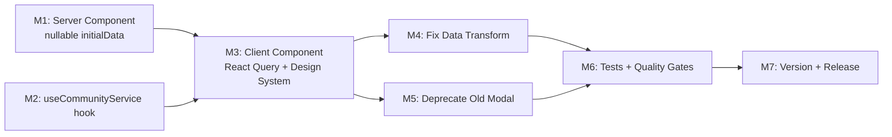

# Plan 082 — Community Service Detail Page: Architectural + Design System Parity

## Changelog

| Date (UTC) | Agent | Event |
|------------|-------|-------|
| 2026-04-05T21:10Z | analyst | Analysis 082 created — 6 findings, 5 weaknesses |
| 2026-04-05T22:00Z | planner | Plan 082 created from Analysis 082; inherits ID/Origin/UUID |
| 2026-04-05T18:58Z | critic | APPROVED WITH CONDITIONS — 2 medium findings (F1: ProviderDetailModal adapter gaps; F2: D8 deferral incomplete) |
| 2026-04-05T19:05Z | planner | Revised: addressed F1 (implementation notes added to M3+M4) and F2 (D8 deferral completed); no re-review required |

## Value Statement and Business Objective

**As a** community service owner or visitor, **I want to** open a community service detail page and see the same quality of presentation, loading behaviour, and design system compliance as the provider detail page, **so that** community services are treated as first-class entities with consistent UX — not a degraded experience.

## Release Strategy

Standalone (no other known active plans for this version). Supersedes Plan 081 (v0.10.9) which addressed only the import-path subset. The v0.10.9 import fix remains valid and is retained; this plan extends it to achieve full parity.

## Decision Record

| # | Decision | Status |
|---|----------|--------|
| D1 | Scope: Full architectural + design parity between community service and provider detail pages | [RESOLVED] — User explicitly requested community service display "similar to how a provider would be shown in detail view" + "follow our design system" |
| D2 | Server Component pattern: Remove hard `notFound()`, pass nullable `initialData` to client | [RESOLVED] — Matches proven provider detail pattern; eliminates W1 |
| D3 | Create `useCommunityService(id)` React Query hook | [RESOLVED] — Required for client-side caching, re-fetch, loading states; mirrors `useProvider()` pattern |
| D4 | Desktop rendering: Reuse `ProviderDetailModal` for community services (same approach as mobile uses `ProviderDetailPage`) | [RESOLVED] — Eliminates W3 (dual-modal maintenance), guarantees design parity, aligns with existing mobile pattern. `CommunityServiceDetailModal` becomes unused and should be deprecated |
| D5 | Mobile transform: Fix missing field mappings (description, badges) | [RESOLVED] — F6 proven gap; description not rendered on mobile |
| D6 | Entity ownership: Applies to ALL community services regardless of ownership status | [RESOLVED] — RLS handles visibility; this plan focuses on presentation layer |
| D7 | Admin action buttons for community services: Include where applicable | [RESOLVED] — User wants parity; admin buttons are part of the provider design system experience |
| D8 | RLS edge case (W5: recommendation-mode services with `user_created_id = NULL`): OUT OF SCOPE | [DEFERRED: User — requires DB-level investigation to confirm if this affects real UAT data. Target artifact: `agent-output/planning/082-open-actions.md`. Trigger: after Plan 082 UAT confirms parity, or if UAT re-surfaces "Service nicht gefunden" specifically for recommendation-mode services (`user_created_id = NULL`).] |
| D9 | Deprecation of `CommunityServiceDetailModal`: Mark as deprecated, do not delete in this plan | [RESOLVED] — Removal is a separate cleanup task after parity is confirmed in UAT |

## Objective

Transform the community service detail page from its current broken/divergent state into full architectural and design parity with the provider detail page by:
1. Adopting the same SSR → nullable initialData → React Query → graceful loading/error pattern
2. Reusing the same design system components (modals, pages, badges, analytics) already proven in the provider flow
3. Fixing the data transform to carry all required fields

## Assumptions

1. The `ProviderDetailModal` and `ProviderDetailPage` components already support community services (verified: `isCommunityService` check at line 140 of `ProviderDetailPage`). The implementer should verify the same support exists in `ProviderDetailModal` or can be added with minimal changes.
2. The `getCommunityServiceById` server function returns sufficient data to populate the provider-shape transform (description, images, contact info, categories, offers, needs).
3. The `communityServices.server.ts` `getCommunityServiceById` already fetches offers/needs in parallel (verified in Analysis 082).
4. The Plan 081 import fix (v0.10.9) is retained; this plan builds on top of it.
5. The `CommunityService` and `Provider` types are structurally compatible enough for a clean transform. The implementer should document any fields that require special handling.

## Plan

### Milestone 1 — Refactor Server Component: Nullable initialData Pattern

**Objective**: Eliminate the hard `notFound()` wall in the server component so the client always receives control, even when SSR data is null.

**What**:
- In `src/app/(public)/community-services/[community_service_id]/page.tsx`, remove the hard `notFound()` call when `getCommunityServiceById` returns null
- Pass the result (nullable) as `initialData` to the client component
- Follow the exact pattern used in `src/app/(public)/providers/[provider_id]/page.tsx`

**Why**: F1 (hard `notFound()` blocks all client-side recovery). The provider page handles null gracefully; community service page must do the same.

**Acceptance Criteria**:
- Server component never calls `notFound()` — always renders client component
- Client component receives `initialData` as `CommunityService | null`
- No TypeScript compilation errors

### Milestone 2 — Create `useCommunityService(id)` React Query Hook

**Objective**: Provide client-side data fetching, caching, and re-fetch capability for a single community service, mirroring `useProvider()`.

**What**:
- Create a new React Query hook in `src/hooks/useCommunityServices.ts` (or a new file if cleaner)
- Hook accepts `communityServiceId` and optional `initialData`
- Uses `getCommunityServiceById` from the client-side service module
- Matches `useProvider()` pattern: 5-min stale time, SSR `initialData` support, enabled flag

**Why**: F2 (no single-fetch hook exists). Without this, there's no loading state, no re-fetch, no client caching.

**Acceptance Criteria**:
- Hook returns `{ data, isLoading, error }` consistent with React Query patterns
- Accepts optional `initialData` for SSR hydration
- When `initialData` is null, hook fetches on mount and shows loading state
- When `initialData` is present, hook serves it immediately and revalidates after stale time

### Milestone 3 — Refactor Client Component: React Query + Design System

**Objective**: Rewrite `CommunityServiceDetailPageClient` to use the React Query hook and render through the same design system components as the provider detail page.

**What**:
- Use `useCommunityService(id)` hook (from M2) with `initialData` (from M1)
- Add loading skeleton state (same pattern as `ProviderDetailPageClient`)
- Add graceful not-found handling: call `notFound()` only after React Query confirms error/null
- **Desktop**: Transform community service data into provider-compatible shape and render through `ProviderDetailModal` (same pattern as mobile already uses `ProviderDetailPage`)
- **Mobile**: Continue using `ProviderDetailPage` but with the improved transform (M4)

> **Implementation notes for ProviderDetailModal adaptation (Critic F1)**:
> 1. `ProviderDetailModal` currently hardcodes `bookmarkableType: 'provider'` at line 57 of `src/components/providers/ProviderDetailModal.tsx`. This must be made dynamic — when rendering a community service the type must be `'community_service'` — using the presence of `provider.community_service_id`. Without this, bookmarks are silently persisted under the wrong type and lookups by type will fail.
> 2. `ProviderDetailModal` accepts a `provider: Provider` typed prop. The transformed community service data (Provider-shaped) will need either a compatible type assertion or the `Provider` type extended to accommodate community service fields. Implementer should choose the cleanest approach and document it.

**Why**: F1 + F2 + F3 combined. The current client component has no loading state, no error recovery, and uses a separate non-design-system-compliant modal.

**Acceptance Criteria**:
- Loading skeleton visible during client-side fetch
- Graceful not-found handling (only after React Query confirms)
- Desktop view renders through `ProviderDetailModal` with full design system compliance
- Mobile view renders through `ProviderDetailPage` (existing, with improved transform)
- Analytics tracking (`trackEvent`) fires for community service contact actions
- Bookmark functionality works correctly with `community_service` type (not `provider` type)

### Milestone 4 — Fix Data Transform: Complete Field Mapping

**Objective**: Ensure the community service → provider-shape transform carries all required fields for rendering parity.

**What**:
- Map `community_service_description` → `provider_description` (F6 — currently missing)
- Map badge data for trust section display
- Map social media links (`social_instagram`, `social_website` — note: `CommunityService` type does not have `social_facebook`; do not add a placeholder)
- Handle `provider_images` transformation correctly (avoid brittle `JSON.stringify` approach)
- Pass `initialCommunityServices` where applicable
- Pass `customActionButtons` for admin context
- Ensure `community_service_id` is included in the transformed shape so `ProviderDetailModal` can detect it and set `bookmarkableType: 'community_service'` (see M3 implementation note)

**Why**: F6 (description missing on mobile) + F4 (fragile transform) + F3 (missing badges, analytics, admin buttons).

**Acceptance Criteria**:
- Community service description is visible in both desktop and mobile views
- Image carousel renders correctly with `getAllTrustedImageUrlsWithFallback`
- All contact methods (phone, email, website) are functional
- Admin users see admin action buttons on community service detail
- No field-mapping regressions from current state

### Milestone 5 — Deprecate CommunityServiceDetailModal

**Objective**: Mark the old modal as deprecated now that it's no longer in the rendering path.

**What**:
- Add deprecation comment to `src/components/community-services/CommunityServiceDetailModal.tsx` header
- Remove the import from `CommunityServiceDetailPageClient` (it will now use `ProviderDetailModal`)
- Do NOT delete the file in this plan (deferred to cleanup)

**Why**: D4 + D9. The component is replaced by `ProviderDetailModal` for the detail page flow. It may still be referenced elsewhere (search results, lists) — deletion requires a separate audit.

**Acceptance Criteria**:
- `CommunityServiceDetailPageClient` no longer imports `CommunityServiceDetailModal`
- Deprecation comment added with plan reference
- No other files break due to the removal from this one import site

### Milestone 6 — Tests + Quality Gates

**Objective**: Verify the changes pass all automated quality gates and add regression tests for the new architecture.

**What**:
- Regression test for the React Query hook (`useCommunityService`) — verify it handles null initialData, loading state, and successful fetch
- Update or replace existing test `src/__tests__/app/community-service-detail-page.server-path.test.tsx` to verify the nullable initialData pattern
- Verify the data transform covers all critical fields (description, images, contact, categories)
- Run `npm run type-check`, `npm run lint`, `npm test`, `npm run build`

**Acceptance Criteria**:
- All existing tests pass (no regressions)
- New/updated tests cover: React Query hook, nullable initialData flow, data transform completeness
- `tsc` zero errors, lint zero new errors, build succeeds

### Milestone 7 — Version Management and Release Artifacts

**Objective**: Prepare release artifacts for the target version.

**What**:
- Update `package.json` version to confirmed release version (DevOps Stage 1)
- Add CHANGELOG.md entry documenting the parity fix
- Update `package-lock.json` to match

**Acceptance Criteria**:
- Version in `package.json` matches target release
- CHANGELOG entry reflects: architectural + design system parity for community service detail page
- `package-lock.json` aligned

## Milestone Dependencies

**Sequencing rule**: M1 and M2 can proceed in parallel. M3 depends on both. M4 and M5 depend on M3. M6 validates everything. M7 is final.

## Testing Strategy

- **Unit tests**: React Query hook (loading, error, success, initialData hydration), data transform field coverage
- **Integration tests**: Build verification, type-check, lint
- **Manual UAT**: Owner opens non-approved community service → renders with loading → displays content with design system components. Anonymous user opens approved community service → same quality as provider detail. Desktop + mobile both verified.
- **Regression scope**: Provider detail page remains unaffected. Existing community service list/search flows unaffected.

## Risks

| Risk | Likelihood | Impact | Mitigation |
|------|-----------|--------|------------|
| `ProviderDetailModal` needs non-trivial changes to support community service entity type | Medium | Medium — could extend implementation time | Implementer should assess upfront; if changes are extensive, may need to update CommunityServiceDetailModal instead (fallback approach) |
| Data transform misses edge-case fields for specific community service types | Low | Low — incremental fix in follow-up | Comprehensive field mapping in M4; UAT catches remaining gaps |
| W5 (recommendation-mode RLS) still causes null for some services | Medium | Medium — those specific services still show 404, but now with graceful loading first | D8 defers this to separate plan; not a regression from current state |
| Deprecating CommunityServiceDetailModal breaks other import sites | Low | Medium | M5 only removes import from detail page client; other sites audited before deletion |

## Duration Estimates

| Phase | Estimate | Uncertainty |
|-------|----------|-------------|
| Analysis | Complete | — |
| Planning | Complete | — |
| Implementation (M1-M5) | 2–4 hours | Medium — depends on ProviderDetailModal community service support |
| Testing (M6) | 1–2 hours | Low |
| QA / UAT | 1–2 hours | Low — focused manual checks |
| DevOps | 30–60 min | Low |
| **Total** | **4.5–9 hours** | Key uncertainty: ProviderDetailModal adaptation scope |

## Validation & Rollback

- **Validation**: Build passes, tests pass, manual UAT confirms design parity between community service and provider detail pages on both desktop and mobile.
- **Rollback**: Revert the commit. The v0.10.9 import fix remains valid as the base. No database or infrastructure changes.
- **Handoff notes**: This plan builds on the v0.10.9 import fix. The core architectural change is adopting the nullable-initialData + React Query pattern. The design system change is routing desktop through `ProviderDetailModal` instead of the separate `CommunityServiceDetailModal`. The implementer has freedom to choose the optimal transform approach and to handle `ProviderDetailModal` adaptation as they see fit.
