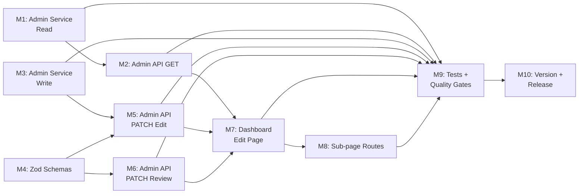

# Plan 083 — Admin Community Service Edit Page

## Changelog

| Date (UTC) | Agent | Event |
|------------|-------|-------|
| 2026-04-06T00:15Z | analyst | Analysis 083 created — F1 (profile RLS) + F2 (admin CS edit route) |
| 2026-04-06T01:30Z | planner | Plan 083 created from Analysis 083 F2; inherits ID/Origin/UUID. F1 taken by Plan 082 M8. |

## Value Statement and Business Objective

**As an** admin or moderator, **I want to** view, edit, and review (approve/reject) community services from the admin dashboard, **so that** I can moderate community service content without direct database access — the same capability I already have for providers.

## Release Strategy

Standalone (no other known active plans for this version). Plan 082 targets the preceding patch release (v0.10.10 preliminary). This plan targets the next available version after Plan 082 ships. `AdminCommunityServiceDetailButtons` (created in Plan 082) already routes to `/dashboard/community-services/${id}/edit` — this plan builds that target route.

## Decision Record

| # | Decision | Status |
|---|----------|--------|
| D1 | Admin CS edit mirrors the existing admin provider edit architecture exactly: admin API routes → admin service layer → dashboard page → edit form | [RESOLVED] — Proven pattern in `AdminProviderEditPage`, `api/admin/providers/[id]`, `api/admin/edit-provider`, `api/admin/review-provider`. Consistency reduces cognitive load and maintenance burden. |
| D2 | Form reuse strategy: Reuse `ProviderEditForm` with CS→Provider data transform and custom `onSubmitForm` handler, rather than creating a new `CommunityServiceEditForm` | [RESOLVED] — `ProviderEditForm` already supports `onSubmitForm`, `subPageBaseUrl`, `enableLocalStorage`, `localStoragePrefix`, and `reviewFooterActions` props. The CS↔Provider field mapping is well-understood from Plan 082's `buildProviderShapeFromCommunityService` transform. Avoids dual-form maintenance. Implementer should validate form field compatibility before committing to this approach; if CS-specific fields don't fit, a dedicated form is acceptable. |
| D3 | Entity ownership scope: Applies to ALL community services regardless of ownership (`user_created_id` NULL or non-NULL) | [RESOLVED] — Admin/moderator should be able to edit any CS. The admin service layer uses `getSupabaseAdmin()` (service-role client) to bypass RLS, consistent with provider admin pattern. |
| D4 | Sub-pages for category, offers, needs, images, social: Include in scope | [RESOLVED] — Provider admin edit supports these sub-pages. CS has the same relational fields (`offers_ids`, `needs_ids`, `category_id`, `community_service_images`). Without sub-pages, the edit form would be incomplete. The `subPageBaseUrl` prop on `ProviderEditForm` already supports custom routing. |
| D5 | CS-specific fields beyond provider fields (e.g., `is_verified`, `verified_at`, `community_service_logo`, `donation_count`): Read-only display only, not editable | [RESOLVED] — These are system-managed fields. Editing them via the admin form would bypass business logic. Display them as metadata context for the admin but do not expose as form inputs. |
| D6 | Validation approach: Create `communityServiceEditUpdateSchema` and `communityServiceReviewUpdateSchema` Zod schemas mirroring the provider equivalents | [RESOLVED] — Security boundary validation at the API layer must be explicit and type-safe, consistent with existing `providerEditUpdateSchema` / `providerReviewUpdateSchema` pattern. |
| D7 | Audit logging: Reuse existing `logAdminAction` pattern from provider admin routes | [RESOLVED] — Compliance requirement; consistent with Analysis 083 I2 gap. |
| D8 | Rate limiting: Reuse existing `rateLimiters.adminReview` from provider admin routes | [RESOLVED] — Same admin user population; no reason for different limits. |

## Objective

Build a complete admin CRUD surface for community services that enables admins and moderators to:
1. View any community service (including non-approved) via admin API
2. Edit community service fields via the dashboard
3. Approve, reject, or request revision for community services
4. Navigate to the edit page from the existing `AdminCommunityServiceDetailButtons` component (Plan 082)

## Assumptions

1. The `community_services` table has a `review_status` column with enum values matching the provider pattern: `pending`, `approved`, `rejected`, `needs_revision`, `removed_by_owner`. The implementer should verify this against the actual schema.
2. The `ProviderEditForm` component can render CS data when fed a Provider-shape transform. The Plan 082 `buildProviderShapeFromCommunityService` function demonstrates the mapping. The implementer should verify form field compatibility at implementation time.
3. The dashboard layout (`src/app/(dashboard)/layout.tsx`) already gates on `isAdminOrModerator` — no additional auth work needed at the layout level.
4. The `getSupabaseAdmin()` utility provides service-role access to bypass RLS, consistent with the provider admin pattern.
5. The existing `logAdminAction` audit function and `rateLimiters.adminReview` rate limiter can be reused without modification.
6. Sub-pages for category, offers, needs, images, and social editing use the same selection UI as the provider edit sub-pages. The implementer should verify whether the sub-page components need adaptation for CS-specific identifiers.

## Plan

### Milestone 1 — Admin Service Layer: Read (getCommunityServiceForAdmin)

**Objective**: Create a service function that fetches a single community service by ID using the admin Supabase client (bypassing RLS), including related offers, needs, and category data.

**What**:
- Create `src/services/admin/communityServiceEdit.ts` (or appropriate filename per implementer judgment)
- Function should use `getSupabaseAdmin()` to fetch from `community_services` table by ID
- Include related data: category (join), offers (by `offers_ids`), needs (by `needs_ids`)
- Mirror the data shape and error handling of `getProviderForAdmin` in `services/admin/providers.ts`

**Acceptance Criteria**:
- Admin can fetch any community service regardless of `review_status` or `user_created_id`
- Returns null for non-existent IDs
- Includes category, offers, and needs data in the response
- Uses service-role client (not cookie-based) for RLS bypass

### Milestone 2 — Admin API GET Route

**Objective**: Create a GET API route at `/api/admin/community-services/[id]` for fetching a single community service for admin editing.

**What**:
- Create route at `src/app/api/admin/community-services/[id]/route.ts`
- Auth gate: `getUserFromCookie` + `isAdminOrModerator` check
- UUID format validation for the ID parameter
- Call the service function from M1
- Structured error logging via `logger`

**Acceptance Criteria**:
- Returns 401 for unauthenticated requests
- Returns 403 for non-admin/non-moderator users
- Returns 400 for invalid UUID format
- Returns 404 for non-existent community service
- Returns 200 with community service data for valid admin requests
- Response shape matches the pattern of `GET /api/admin/providers/[id]`

### Milestone 3 — Admin Service Layer: Write (updateCommunityServiceFields)

**Objective**: Create a service function for admins to update community service fields using the admin Supabase client.

**What**:
- Add `updateCommunityServiceFields` function to the admin CS service module
- Accept partial update payload (only update fields that are provided)
- Sanitize text inputs using `sanitizeTextInput`
- Map camelCase input fields to `community_service_*` database column names
- Set `updated_at` on every write

**Acceptance Criteria**:
- Partial updates work (only provided fields are modified)
- Text inputs are sanitized before write
- Field name mapping is correct (e.g., `communityServiceName` → `community_service_name`)
- Returns updated record or throws on error

### Milestone 4 — Zod Validation Schemas

**Objective**: Create Zod validation schemas for community service admin edit and review operations.

**What**:
- Add `communityServiceEditUpdateSchema` and `communityServiceReviewUpdateSchema` to `src/lib/validations/adminSchemas.ts`
- Mirror the structure of `providerEditUpdateSchema` and `providerReviewUpdateSchema`
- Adapt field names and constraints for CS (e.g., `communityServiceId` instead of `providerId`, `communityServiceName` instead of `providerName`)
- Review rejection requires non-empty feedback (same as provider pattern)

**Acceptance Criteria**:
- Both schemas export from `adminSchemas.ts`
- `communityServiceEditUpdateSchema` validates all editable CS fields
- `communityServiceReviewUpdateSchema` enforces feedback requirement on rejection
- UUID validation on the community service ID field

### Milestone 5 — Admin API PATCH Edit Route

**Objective**: Create a PATCH API route for admin editing of community service fields.

**What**:
- Create route at `src/app/api/admin/edit-community-service/route.ts`
- Auth gate: `getUserFromCookie` + `isAdminOrModerator`
- Rate limiting via `rateLimiters.adminReview`
- Payload size guard (same as edit-provider: 1MB limit)
- Request body validation via `communityServiceEditUpdateSchema`
- Call `updateCommunityServiceFields` from M3
- Audit logging via `logAdminAction`
- Structured error logging

**Acceptance Criteria**:
- Returns 401/403/429/413/400 for auth/rate/size/validation failures
- Returns 200 with updated data on success
- Admin action is audit-logged
- Rate limiting is enforced

### Milestone 6 — Admin API PATCH Review Route

**Objective**: Create a PATCH API route for admin review (approve/reject/needs_revision) of community services.

**What**:
- Create route at `src/app/api/admin/review-community-service/route.ts`
- Same auth, rate limiting, and audit patterns as `review-provider`
- Request body validation via `communityServiceReviewUpdateSchema`
- Update `review_status` and optionally `review_feedback` on the `community_services` table
- Rejection requires non-empty feedback

**Acceptance Criteria**:
- Same error handling as edit route (401/403/429/400)
- Approve sets `review_status = 'approved'`
- Reject requires feedback and sets `review_status = 'rejected'` + `review_feedback`
- Needs-revision sets `review_status = 'needs_revision'`
- Admin action is audit-logged

### Milestone 7 — Dashboard Edit Page

**Objective**: Create the admin dashboard page at `/dashboard/community-services/[id]/edit` that fetches the community service via admin API and renders an edit form with review actions.

**What**:
- Create page at `src/app/(dashboard)/dashboard/community-services/[id]/edit/page.tsx`
- Client component (same pattern as `AdminProviderEditPage`)
- Fetch community service via `GET /api/admin/community-services/[id]` (M2)
- Transform CS data into Provider-shape for form rendering (reuse or adapt `buildProviderShapeFromCommunityService` from Plan 082)
- Render edit form with custom `onSubmitForm` handler calling `PATCH /api/admin/edit-community-service` (M5)
- Include approve/reject/needs-revision footer actions calling `PATCH /api/admin/review-community-service` (M6)
- Display CS-specific read-only metadata (`is_verified`, `donation_count`, etc.) as context
- `subPageBaseUrl` pointed to `/dashboard/community-services/[id]/edit` for sub-page navigation
- `enableLocalStorage = false` and `localStoragePrefix = 'admin_cs_'` to isolate from owner state

**Acceptance Criteria**:
- Admin navigates to `/dashboard/community-services/[id]/edit` → sees the CS edit form
- All editable fields are populated from the CS data
- Save button calls the edit API and shows success/error toast
- Approve/Reject/Needs-revision actions work via the review API
- Reject action opens a modal requiring feedback (reuse `RejectModal` pattern)
- `AdminCommunityServiceDetailButtons` (Plan 082) navigates correctly to this page
- Loading, error, and not-found states are handled

### Milestone 8 — Sub-page Routes

**Objective**: Create sub-page routes under the CS admin edit page for category, offers, needs, images, and social editing.

**What**:
- Create sub-page routes mirroring the provider admin edit sub-pages:
  - `/dashboard/community-services/[id]/edit/category/page.tsx`
  - `/dashboard/community-services/[id]/edit/offers/page.tsx`
  - `/dashboard/community-services/[id]/edit/needs/page.tsx`
  - `/dashboard/community-services/[id]/edit/images/page.tsx`
  - `/dashboard/community-services/[id]/edit/social/page.tsx`
- Each sub-page should follow the same pattern as the provider equivalent
- The implementer should evaluate whether the existing provider sub-page components can be reused or need adaptation for CS-specific identifiers

**Acceptance Criteria**:
- Each sub-page renders correctly when navigated to from the edit form
- Category selection, offers/needs selection, image management, and social links editing all function
- Sub-page state persists correctly during navigation (via URL params or admin-prefixed localStorage)
- Back navigation returns to the main edit form

### Milestone 9 — Tests and Quality Gates

**Objective**: Ensure all new code is tested and passes quality gates.

**What**:
- Unit tests for admin service layer functions (read + write)
- Unit tests for Zod validation schemas (valid/invalid payloads, rejection feedback requirement)
- Unit/integration tests for API route handlers (auth, validation, success paths)
- Component tests for the dashboard edit page (loading, error, form rendering)
- `tsc` zero errors, lint zero new errors, build succeeds
- All existing tests pass (no regressions)

**Acceptance Criteria**:
- All new code has test coverage
- `tsc` zero errors
- Lint zero new errors
- Build succeeds
- All existing tests pass

### Milestone 10 — Version Management and Release Artifacts

**Objective**: Prepare release artifacts for the target version.

**What**:
- Update `package.json` version to confirmed release version (DevOps Stage 1)
- Add CHANGELOG.md entry documenting the admin CS edit feature
- Update `package-lock.json` to match

**Acceptance Criteria**:
- Version in `package.json` matches target release
- CHANGELOG entry reflects: admin community service edit, review, and moderation capability
- `package-lock.json` aligned

## Milestone Dependencies

**Sequencing rule**: M1 and M3/M4 can proceed in parallel (read path vs write path). M2 depends on M1. M5 depends on M3+M4. M6 depends on M4. M7 depends on M2+M5+M6. M8 depends on M7. M9 validates everything. M10 is final.

## Testing Strategy

- **Unit tests**: Admin service functions (getCommunityServiceForAdmin, updateCommunityServiceFields, updateCommunityServiceReview), Zod schema validation (valid/invalid/edge cases), data transform CS→Provider shape
- **Integration tests**: API route handlers (auth gates, validation, rate limiting, success/error responses), build verification, type-check, lint
- **Component tests**: Dashboard edit page rendering (loading/error/success states), form population from CS data, save/review action flows
- **Manual UAT**: Admin navigates from CS detail → edit button → edit page renders → fields editable → save succeeds → approve/reject works → sub-pages functional
- **Regression scope**: Provider admin edit pages unaffected, community service detail page (Plan 082) unaffected, existing admin API routes unaffected

## Risks

| # | Risk | Likelihood | Impact | Mitigation |
|---|------|------------|--------|------------|
| R1 | `ProviderEditForm` may not cleanly accept CS data transform — CS-specific fields may require form adaptations | Medium | Medium | D2 explicitly allows the implementer to create a dedicated form if reuse doesn't work. The transform is well-understood from Plan 082. |
| R2 | Sub-page components may have provider-specific assumptions (e.g., hardcoded `provider_id` references) | Medium | Low | Sub-pages already use `subPageBaseUrl` prop. Implementer should trace component deps during M8. |
| R3 | `community_services` table schema assumptions may not match reality | Low | High | Implementer should verify schema before starting M1. The `CommunityService` type in `communityServices.ts` provides the expected shape. |
| R4 | Rate limiting reuse may be too restrictive if admins frequently edit both providers and CS | Low | Low | Monitor in UAT. Can adjust limits in a follow-up if needed. |

## Duration Estimates

| Phase | Estimate | Uncertainty Drivers |
|-------|----------|---------------------|
| Analysis | Done (Analysis 083) | — |
| Planning | Done (this document) | — |
| Implementation | 2–3 days | Form reuse feasibility (R1), sub-page adaptation (R2) |
| QA | 0.5–1 day | Dependent on test scope; API tests are straightforward |
| UAT | 0.5 day | Manual walkthrough of edit + review flows |
| DevOps | 0.5 day | Standard version bump + deploy |
| **Total** | **3–5 days** | Primary driver: M7+M8 complexity |

## Validation

- Admin can reach the CS edit page from `AdminCommunityServiceDetailButtons` (Plan 082)
- Full edit → save → verify cycle works for all editable fields
- Approve/Reject/Needs-revision workflow functions correctly
- Sub-page navigation for category, offers, needs, images, social is functional
- No regressions on provider admin edit pages
- All quality gates pass (tsc, lint, tests, build)

## Rollback Considerations

- All changes are additive (new routes, new service functions, new page)
- No modifications to existing provider admin code
- Rollback = revert the commit; `AdminCommunityServiceDetailButtons` would return to pointing at a 404 (same as current state)
- No database migrations required (uses existing `community_services` table)
