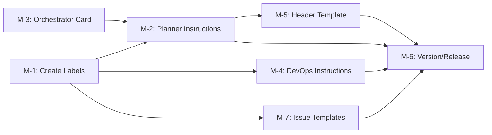

# Plan 084 — GitHub Issues Integration for Workflow Pipeline

| Field            | Value                                                                                   |
| ---------------- | --------------------------------------------------------------------------------------- |
| Plan ID          | 084                                                                                     |
| Target Release   | Next available patch after current origin/main version; confirm at DevOps Stage 1       |
| Epic Alignment   | Developer Experience / Workflow Observability                                            |
| Related Issues   | None                                                                                    |
| Classification   | Feature                                                                                 |
| Pipeline         | Full (13 phases)                                                                        |
| Created          | 2026-04-06T15:00Z                                                                       |

## Changelog

| Date                | Agent   | Action                        | Notes                      |
| ------------------- | ------- | ----------------------------- | -------------------------- |
| 2026-04-06T15:00Z   | Planner | Plan created                  | ID 084 allocated           |
| 2026-04-06T15:30Z   | Planner | Scope expanded                | Added M-7: GitHub Issue templates for manual creation |
| 2026-04-06T15:50Z   | Planner | Revised per critique          | Addressed M-1, L-1, L-2, L-3, L-4 from critique 084  |
| 2026-04-06T16:00Z   | Implementer | Implementation started    | Status → In Progress                                  |

---

## Value Statement and Business Objective

**As a** workflow agent (Orchestrator, Planner, DevOps) and project maintainer,
**I want to** automatically create GitHub Issues in `abu-lina/uflow` when a plan is created, with labels matching the Orchestrator's task classification, with status updates as plans move through the pipeline,
**so that** all work-in-progress is visible on GitHub Issues, stakeholders can track progress without reading local `agent-output/` files, and each plan has a canonical external tracking URL.

---

## Decision Record

1. **[RESOLVED] Mechanism: `gh` CLI via terminal**
   The `gh` CLI is already installed (`v2.67.0`), authenticated as `abu-lina` with `repo` scope (includes issue read/write). No MCP GitHub tools are available. No GitHub Action needed — agents already have `execute/runInTerminal`. `gh` is the simplest, most direct mechanism.

2. **[RESOLVED] Token/secrets handling: Existing keyring auth**
   `gh auth status` shows token stored in macOS keyring (`gho_****`). No new secrets, no `.env.local` entries, no PAT management needed. The agent runs `gh` which inherits the authenticated session.

3. **[RESOLVED] Issue creation trigger: Planner agent**
   The Planner creates the plan document and is the natural point to also create the GitHub Issue. The Orchestrator provides the classification label to the Planner via the Workflow Card.

4. **[RESOLVED] Label taxonomy: Mirror Orchestrator classifications**
   Create custom labels that map 1:1 to the Orchestrator's task classifications. Use a `type:` prefix namespace to avoid collision with existing default labels.

   | Orchestrator Classification | GitHub Label        | Color   |
   | --------------------------- | ------------------- | ------- |
   | Feature                     | `type:feature`      | #a2eeef |
   | Bugfix                      | `type:bugfix`       | #d73a4a |
   | Refactor                    | `type:refactor`     | #fbca04 |
   | Hotfix                      | `type:hotfix`       | #e11d48 |
   | Verification                | `type:verification` | #0e8a16 |
   | Security Audit              | `type:security`     | #b60205 |

   Plus a `plan` label (#5319e7) to identify all agent-created plan issues.

5. **[RESOLVED] Issue lifecycle updates: Comment + close on release**
   - Planner creates the issue at plan finalization.
   - DevOps Stage 2 closes the issue on successful release (adds a closing comment with the release version/tag).
   - Other pipeline agents MAY add status comments but are NOT required to (keeps noise low).

6. **[RESOLVED] Issue content: Structured template via `--body-file`**
   The issue body contains: value statement, plan ID, classification, milestones summary, link to local artifact path, and the target release. This keeps GitHub readable without duplicating the entire plan. The Planner MUST construct the body by writing a temporary file and using `gh issue create --body-file /tmp/uflow-issue-body-{ID}.md` — NOT inline `--body` (shell quoting of multi-line markdown is fragile; consistent with the existing commit message convention in DevOps agent).

7. **[RESOLVED] Issue number back-reference: Full URL in plan doc header**
   After `gh issue create`, the returned full issue URL (e.g., `https://github.com/abu-lina/uflow/issues/42`) is recorded in the plan document header as `GitHub Issue: <url>`. Full URL format is required — it is clickable in markdown, self-documenting, and the issue number can be extracted via `basename` or regex when needed (e.g., by DevOps for `gh issue close`). This creates a bidirectional link: plan → issue and issue → plan artifact path.

8. **[RESOLVED] Scope: Agent instruction changes only**
   This plan modifies `.github/agents/` instruction files and creates the labels. No source code changes, no GitHub Actions, no runtime code.

---

## Release Strategy

Standalone (no other known plans for this version). This is an agent-workflow-only change with no runtime code impact.

---

## Assumptions

1. The `gh` CLI remains authenticated on the developer machine (macOS keyring). If auth expires, the agent will encounter an error and should surface it to the user.
2. The `abu-lina/uflow` repository has Issues enabled (confirmed — labels exist).
3. Agents are invoked in VS Code with terminal access (confirmed — all affected agents have `execute/runInTerminal`).
4. The Orchestrator's classification is available to the Planner via the Workflow Card (confirmed — this is the existing handoff pattern).

---

## Milestones

### M-1: Create GitHub Labels

**Objective**: Establish the label taxonomy on `abu-lina/uflow` so issues can be classified consistently.

**What**: Create the 7 custom labels (6 type labels + 1 `plan` label) using `gh label create`.

**Where**: One-time setup executed by the Implementer via terminal commands.

**Acceptance Criteria**:
- All 7 labels exist on `abu-lina/uflow`: `type:feature`, `type:bugfix`, `type:refactor`, `type:hotfix`, `type:verification`, `type:security`, `plan`
- Existing default labels are NOT modified or deleted
- Labels verified via `gh label list`

---

### M-2: Update Planner Agent Instructions — Issue Creation

**Objective**: Add instructions to `planner.agent.md` so the Planner creates a GitHub Issue when finalizing a plan.

**What**: Add a new section to the Planner agent instructions specifying:
- WHEN: After the plan document is written to `agent-output/planning/` and before the completion/handoff block
- HOW: Write issue body to `/tmp/uflow-issue-body-{ID}.md`, then run `gh issue create --body-file /tmp/uflow-issue-body-{ID}.md` (never use inline `--body` for multi-line markdown)
- WHAT: Title format `[Plan {ID}] {short title}`, body from a temp file, labels = `plan` + `type:{classification}`
- BACK-REFERENCE: Record the returned full issue URL in the plan document header as `GitHub Issue: https://github.com/abu-lina/uflow/issues/{N}`

**Where**: `.github/agents/planner.agent.md`

**Acceptance Criteria**:
- Planner instructions contain a "GitHub Issue Creation" section
- The section specifies exact `gh issue create` command pattern
- Title format, body template, and label assignment are documented
- Back-reference step is documented
- Instructions are conditional: "If `gh` is available and authenticated" — graceful degradation if not

---

### M-3: Update Orchestrator — Classification-to-Label Mapping

**Objective**: Ensure the Planner can derive the correct `type:*` GitHub label from the Workflow Card.

**What**: The Orchestrator's Workflow Card already includes `Type: {Feature|Bugfix|Refactor|Hotfix}`. Two changes needed:
1. Add `Verification` and `Security Audit` to the Workflow Card `Type` field enum (currently missing from the template but present in the classification table)
2. Add a one-line mapping note to the Planner instructions: "Derive `type:` label by lowercasing the Workflow Card Type field and joining with a colon (e.g., `Type: Feature` → `type:feature`, `Type: Security Audit` → `type:security`)"

**Where**: `.github/agents/orchestrator.agent.md` (Workflow Card template Type field), `.github/agents/planner.agent.md` (mapping note in GitHub Issue Creation section)

**Acceptance Criteria**:
- Workflow Card Type field includes all 6 classifications: `Feature|Bugfix|Refactor|Hotfix|Verification|Security Audit`
- Planner instructions include the explicit type-to-label mapping rule

---

### M-4: Update DevOps Agent Instructions — Issue Closure

**Objective**: Add instructions to `devops.agent.md` so DevOps closes the GitHub Issue on successful Stage 2 release.

**What**: Add a step to the Stage 2 workflow:
- WHEN: After successful `git push` and tag creation (Stage 2 completion)
- HOW: Run `gh issue close {number} --comment "Released in {version}"` via terminal
- WHERE: The issue number comes from the plan document's `GitHub Issue` header field

**Where**: `.github/agents/devops.agent.md`

**Acceptance Criteria**:
- DevOps Stage 2 instructions include a "Close GitHub Issues" step
- The step reads plan docs to find issue numbers for all plans bundled in the release
- The closing comment includes the release version tag
- Instructions are conditional: skip if no `GitHub Issue` field in plan doc (backward compatible with older plans)

---

### M-5: Update Plan Document Header Template

**Objective**: Add the `GitHub Issue` field to the standard plan header so all agents know where to find it.

**What**: Document the new optional `GitHub Issue` header field in the Planner's template/instructions. The field is populated by the Planner after issue creation and read by DevOps for closure.

**Where**: `.github/agents/planner.agent.md` (plan header template section), `.github/copilot-instructions.md` (if header format is documented there)

**Acceptance Criteria**:
- Plan header template includes `GitHub Issue: (populated after creation)` field
- Format specified as full URL: `GitHub Issue: https://github.com/abu-lina/uflow/issues/{N}`
- Field is clearly marked as optional for backward compatibility

---

### M-7: GitHub Issue Templates for Manual Creation

**Objective**: Provide structured GitHub Issue templates so that issues can also be created manually through the GitHub web UI with consistent formatting matching the agent-created issues.

**What**: Create `.github/ISSUE_TEMPLATE/` directory with YAML-based issue forms (GitHub's modern form syntax) for each Orchestrator classification, plus a `config.yml` for blank issue and external link options.

**Templates to create**:

| Template File              | Label Auto-Applied         | Description                                    |
| -------------------------- | -------------------------- | ---------------------------------------------- |
| `feature.yml`              | `type:feature`, `plan`     | New feature or capability request               |
| `bugfix.yml`               | `type:bugfix`, `plan`      | Something isn't working correctly               |
| `refactor.yml`             | `type:refactor`, `plan`    | Code restructuring / technical debt             |
| `hotfix.yml`               | `type:hotfix`, `plan`      | **URGENT production issues only** — use bugfix for non-critical bugs |
| `security.yml`             | `type:security`, `plan`    | Security vulnerability or audit request         |
| `config.yml`               | —                          | Template chooser config (blank issue option)    |

Each template form should include:
- **Title** (pre-filled with classification prefix, e.g., `[Feature] `)
- **Description / Value Statement** (textarea — what and why)
- **Acceptance Criteria** (textarea)
- **Plan ID** (optional input — for linking to existing agent-output plans)
- **Target Release** (optional input)
- **Classification** (dropdown matching Orchestrator taxonomy — auto-selects based on template)
- **Priority** (dropdown: Critical / High / Medium / Low)

**Where**: `.github/ISSUE_TEMPLATE/` directory (new)

**Acceptance Criteria**:
- All 6 files exist in `.github/ISSUE_TEMPLATE/`
- Templates render correctly on GitHub's "New Issue" page with the chooser
- Labels are auto-applied when a template is used
- `config.yml` allows blank issues (for edge cases) and optionally links to relevant docs
- Form fields are consistent across templates (same field names for interoperability)
- Templates are usable by humans AND agents (agents can also use `--template` flag with `gh issue create`)

---

### M-6: Version Management and Release Artifacts

**Objective**: Update CHANGELOG and version artifacts per release-procedures skill.

**What**: Standard version milestone — CHANGELOG entry documenting the workflow integration, any relevant README updates.

**Acceptance Criteria**:
- CHANGELOG entry describes the GitHub Issues integration
- Version matches roadmap target (confirmed at DevOps Stage 1)

---

## Milestone Dependencies

Sequencing rule: M-1 (labels) must exist before any agent or template can reference them. M-3 (Orchestrator), M-7 (templates), and M-1 are independent except M-7 depends on M-1 labels existing. All instruction changes (M-2 through M-5) and templates (M-7) must complete before M-6 (release artifacts).

---

## Testing Strategy

- **Unit/integration tests**: Not applicable — changes are to `.md` instruction files only, no runtime code
- **Manual verification**: After implementation, create a test plan (Plan 085 or similar) and verify:
  - Issue is created on GitHub with correct title, body, and labels
  - Issue URL is recorded in plan document
  - DevOps can find and close the issue on release
  - Issue templates render correctly on GitHub's "New Issue" chooser page
  - Creating an issue manually via each template auto-applies the correct labels
- **Regression**: Existing plans without `GitHub Issue` field must not break any agent workflow
- **`gh` unavailability**: Verify agents degrade gracefully (skip issue creation, log warning)

---

## Risks

| Risk | Likelihood | Impact | Mitigation |
| ---- | ---------- | ------ | ---------- |
| `gh` auth expires mid-session | Low | Low | Instructions include conditional check; agent surfaces error to user |
| Rate limiting on `gh issue create` | Very Low | Low | GitHub API rate limits are generous (5000/hr); agent creates ~1 issue per plan |
| Instruction bloat in agent files | Medium | Low | Keep instructions concise; use a single well-defined section per agent |
| Parallel sessions creating duplicate issues | Low | Medium | Instructions specify: check if issue already exists for plan ID before creating |
| Shell quoting breaks issue body content | Medium | Medium | Use `--body-file` instead of `--body` for all multi-line issue content (see Decision Record #6) |

---

## Validation & Rollback

- **Validation**: After implementation, run the manual verification described in Testing Strategy
- **Rollback**: Revert the agent `.md` file changes. Delete custom labels if desired (`gh label delete`). No runtime impact.

---

## Duration Estimates

| Phase          | Estimate    | Uncertainty Driver                       |
| -------------- | ----------- | ---------------------------------------- |
| Planning       | 0.5 day     | (this document — complete)               |
| Critique       | 0.5 day     | None                                     |
| Implementation | 0.5–1 day   | Low — markdown/YAML edits only, no code  |
| Code Review    | 0.25 day    | Low — reviewing instruction clarity      |
| QA             | 0.25 day    | Requires manual `gh` verification        |
| UAT            | 0.25 day    | User confirms issue appears on GitHub    |
| DevOps         | 0.25 day    | Standard commit/release cycle            |
| **Total**      | **2–3 days** | Low overall uncertainty                  |

---

## Out of Scope

- GitHub Projects board integration (future enhancement)
- Automated issue assignment to GitHub users
- GitHub Actions triggered by `agent-output/` file changes
- Modifying existing default labels (bug, enhancement, etc.)
- Issue creation for non-plan artifacts (analysis docs, QA reports)
- MCP GitHub tool integration (not available in this environment)
- Verification-type issue template (verification tasks are typically QA-direct, not tracked as standalone issues)

---

## Handoff Notes for Implementer

1. **Start with M-1**: Run `gh label create` commands to establish the label taxonomy. This unblocks all other milestones.
2. **Agent files to modify**: `planner.agent.md`, `orchestrator.agent.md`, `devops.agent.md`. Possibly `copilot-instructions.md` if the plan header template is documented there.
3. **`gh issue create` pattern**: Write body to `/tmp/uflow-issue-body-{ID}.md`, then `gh issue create --repo abu-lina/uflow --title "[Plan {ID}] {title}" --body-file /tmp/uflow-issue-body-{ID}.md --label "plan" --label "type:{classification}"` — NEVER use inline `--body` for multi-line markdown
4. **`gh issue close` pattern**: Extract issue number from plan header URL (`GitHub Issue: https://github.com/abu-lina/uflow/issues/{N}`), then `gh issue close {N} --repo abu-lina/uflow --comment "Released in {version}"`
5. **Duplicate prevention**: Before creating, check `gh issue list --repo abu-lina/uflow --label plan --search "Plan {ID}" --state open`
6. **Backward compatibility**: All instructions must be conditional — older plans without a GitHub Issue field must not trigger errors.
7. **Issue templates**: Create `.github/ISSUE_TEMPLATE/` with YAML form files. Use GitHub's issue form syntax (not legacy markdown templates). Reference: https://docs.github.com/en/communities/using-templates-to-encourage-useful-issues-and-pull-requests/syntax-for-issue-forms
