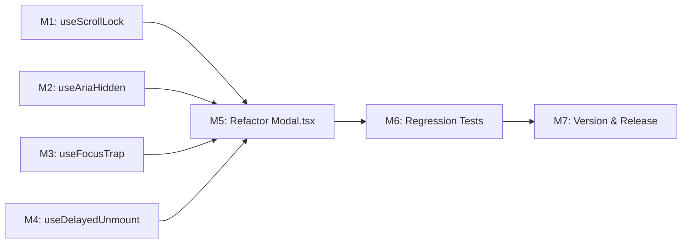

# Plan 086 — Modal.tsx Accessibility Refactor

| Field          | Value                                                                                  |
| -------------- | -------------------------------------------------------------------------------------- |
| Plan ID        | 086                                                                                    |
| Target Release | Next available patch after current origin/main v0.10.16; confirm at DevOps Stage 1     |
| Epic Alignment | Platform Quality — Accessibility & UX Robustness                                       |
| Related Issues | None (originated from Airbnb DLS reference analysis in Session S086)                   |
| Classification | Refactor                                                                               |
| Pipeline       | Focused (Architect → Planner → Critic → Implementer → Code Reviewer → QA)             |
| GitHub Issue   | https://github.com/abu-lina/uflow/issues/132                                          |
| Created        | 2026-04-07T09:25Z                                                                     |

## Changelog

| Date                | Agent   | Change                                               |
| ------------------- | ------- | ---------------------------------------------------- |
| 2026-04-07T09:25Z   | Planner | Initial plan created from Arch 086 findings          |
| 2026-04-07T09:40Z   | Implementer | Implementation started — TDD gate in progress     |
| 2026-04-07T10:00Z   | Implementer | All 7 milestones complete. 934 tests pass. EXIT 0 tsc + lint. Handing off to Code Reviewer. |
| 2026-04-07T10:55Z   | Code Reviewer | Code review complete. Verdict: APPROVED_WITH_COMMENTS. Handing off to QA. |
| 2026-04-07T11:20Z   | QA Agent | QA testing complete. All 9 gaps verified (935 tests pass, 0 fail). Verdict: QA COMPLETE. Handing off to UAT/DevOps. |

---

## Value Statement and Business Objective

**As a** screen-reader or keyboard-only user visiting UFlow,
**I want** the provider/community-service detail modals to trap focus, restore focus, hide background from assistive tech, and handle keyboard dismissal correctly,
**so that** I can interact with modal content without being lost in the background page, meeting WCAG 2.1 AA dialog requirements and making UFlow accessible to the entire Ummah.

**Secondary value**: Fix pointer UX bugs (drag-close), stacked-scroll-lock reliability, exit animation smoothness, and z-index correctness that affect all users.

---

## Decision Record

| # | Decision | Status |
|---|----------|--------|
| D1 | Sentinel-div focus trap via custom `useFocusTrap` hook — no third-party dependency | [RESOLVED] Simpler, testable, matches WAI-ARIA dialog pattern and Airbnb reference |
| D2 | Focus restoration integrated into `useFocusTrap` lifecycle (capture on mount, restore on cleanup) | [RESOLVED] Keeps focus management in a single hook; defensive fallback to `document.body` |
| D3 | `aria-hidden` on body siblings (not `inert`) via `useAriaHidden` hook | [RESOLVED] Minimal-invasive; `inert` has Safari concerns and blocks pointer events unnecessarily |
| D4 | Escape handler: `keyup` + `contains()` guard + `stopPropagation()` — inline, no new hook | [RESOLVED] Prevents auto-repeat fire, scopes to owning modal instance, matches Airbnb pattern |
| D5 | Drag-close prevention: mousedown-target tracking ref — inline in Modal | [RESOLVED] Simple ref-based pattern; only closes when both mousedown and click target the backdrop |
| D6 | Counter-based `useScrollLock` hook with original overflow capture/restore | [RESOLVED] Module-level counter avoids Context (no caller changes); Airbnb uses same pattern |
| D7 | `React.useId()` for `aria-labelledby` + visually-hidden `` for title | [RESOLVED] Unique per instance; self-contained — consumers don't need to wire IDs |
| D8 | CSS-transition exit animation via `useDelayedUnmount` hook; 300ms default, 0ms for `prefers-reduced-motion` | [RESOLVED] No animation library; CSS transitions sufficient; respects user preference |

---

## Release Strategy

Standalone — no other non-closed plans target the next available patch. This plan ships independently.

---

## Assumptions

1. `Modal.tsx` has exactly 2 consumers (`ProviderDetailModal`, `CommunityServiceDetailModal`); both pass `isOpen={true}` and are always-open when rendered.
2. No other component imports from `@/components/ui/Modal`.
3. The `children` prop may contain focusable elements (buttons, links, image-swipe carousels).
4. Stacked modals (two Modals mounted simultaneously) are rare but must work correctly for scroll lock and escape scoping.
5. The codebase uses React 18+ (required for `useId()`).
6. Tailwind `sr-only` utility class is available.
7. `prefers-reduced-motion` should be respected for exit animation timing.

---

## Milestones

### M1 — Create `useScrollLock` Hook

**Objective**: Replace the naive `document.body.style.overflow` toggle with a counter-based scroll lock that supports stacked modals.

**File**: `src/hooks/useScrollLock.ts`

**Acceptance Criteria**:
1. Module-level counter increments when `isOpen` transitions to `true`, decrements on cleanup
2. `document.body.style.overflow` set to `'hidden'` only when counter goes 0→1
3. Original `overflow` value captured on first lock, restored when counter returns to 0
4. Calling the hook from two components simultaneously: closing one does NOT restore scroll while the other is still open
5. TypeScript strict mode passes

**Architecture ref**: ADR-086-6

---

### M2 — Create `useAriaHidden` Hook

**Objective**: Hide background content from screen readers while the modal is open.

**File**: `src/hooks/useAriaHidden.ts`

**Acceptance Criteria**:
1. When `isOpen` is `true`, all direct children of `document.body` except the portal container (identified via the passed `containerRef`) and `<script>` elements have `aria-hidden="true"` set
2. Previous `aria-hidden` values are captured before modification
3. On cleanup (close or unmount), previous values are restored
4. No runtime errors when `containerRef.current` is `null`
5. TypeScript strict mode passes

**Architecture ref**: ADR-086-3

---

### M3 — Create `useFocusTrap` Hook (includes Focus Restoration)

**Objective**: Trap keyboard focus inside the modal dialog and restore focus to the trigger element on close.

**File**: `src/hooks/useFocusTrap.ts`

**Acceptance Criteria**:
1. Hook accepts `(containerRef, isOpen)` and returns `{ sentinelStart, sentinelEnd }` refs (or renders sentinels internally via returned JSX)
2. On mount with `isOpen=true`, captures `document.activeElement` as the previously-focused element
3. Initial focus moves to the first focusable element inside the container (or the container itself if none found)
4. Tabbing past the last focusable element wraps to the first; Shift+Tab past the first wraps to the last
5. On unmount/close, focus is restored to the previously-focused element (if still in DOM), else `document.body`
6. Sentinel divs are rendered with `tabIndex={0}`, zero height, and `aria-hidden="true"`
7. Does NOT interfere with pointer/touch events inside the modal content
8. TypeScript strict mode passes

**Architecture ref**: ADR-086-1, ADR-086-2

---

### M4 — Create `useDelayedUnmount` Hook

**Objective**: Keep the modal in the DOM for the duration of the exit animation before unmounting.

**File**: `src/hooks/useDelayedUnmount.ts`

**Acceptance Criteria**:
1. Hook accepts `(isOpen, durationMs?)` and returns `{ shouldRender, isAnimating }`
2. When `isOpen` transitions `true→false`, `shouldRender` stays `true` for `durationMs` (default 300ms), then becomes `false`
3. `isAnimating` is `true` during the `isOpen=true` state, `false` during the exit delay
4. When `prefers-reduced-motion: reduce` matches, delay is 0ms (immediate unmount)
5. Cancellation: if `isOpen` goes back to `true` during exit delay, animation state resets cleanly
6. TypeScript strict mode passes

**Architecture ref**: ADR-086-8

---

### M5 — Refactor `Modal.tsx` — Integrate All Hooks + Inline Fixes

**Objective**: Wire the 4 new hooks into `Modal.tsx` and apply inline fixes for escape scoping, drag-close, aria-labelledby, and z-index.

**File**: `src/components/ui/Modal.tsx`

**Acceptance Criteria**:
1. **Focus trap**: `useFocusTrap` integrated; sentinel divs rendered around children
2. **Focus restoration**: Focus returns to trigger on close (via `useFocusTrap`)
3. **aria-hidden**: `useAriaHidden` integrated; background hidden from assistive tech while open
4. **Scroll lock**: `useScrollLock` replaces inline overflow manipulation
5. **Escape scoping**: Listener on `keyup` (not `keydown`), `contains()` guard, `stopPropagation()`
6. **Drag-close fix**: `mouseDownTarget` ref tracks mousedown origin; backdrop `onClick` only fires `onClose` when mousedown also targeted the backdrop
7. **aria-labelledby wiring**: `useId()` generates unique ID; visually-hidden `` renders when `title` is provided; `aria-labelledby={titleId}` on `role="dialog"` element
8. **Exit animation**: `useDelayedUnmount` controls render lifecycle; CSS transition classes (`opacity`, possibly `scale`) applied based on `isAnimating` state
9. **Z-index fix**: Backdrop has no explicit z-index (or `z-0`); content has `z-10`; wrapper retains `z-[999999]`
10. **No new public props**: `ModalProps` interface unchanged (`isOpen`, `onClose`, `children`, `title?`)
11. **No consumer changes**: `ProviderDetailModal` and `CommunityServiceDetailModal` work without modification
12. TypeScript strict mode passes (`npm run type-check` EXIT 0)

**Architecture ref**: ADR-086-1 through ADR-086-9

---

### M6 — Regression Test Suite

**Objective**: Comprehensive test coverage for all 9 gaps to prevent regressions.

**Files**: `src/__tests__/components/ui/Modal.test.tsx` (new), plus unit tests for each hook

**Acceptance Criteria**:

| Gap | Test Description | Type |
|-----|-----------------|------|
| 1. Focus trap | Tab from last focusable wraps to first; Shift+Tab from first wraps to last | Unit (useFocusTrap) + Integration (Modal) |
| 2. Focus restoration | After close, `document.activeElement` matches the element that opened the modal | Unit (useFocusTrap) + Integration (Modal) |
| 3. aria-hidden | While open, body siblings have `aria-hidden="true"`; after close, restored | Unit (useAriaHidden) |
| 4. Escape scoping | Escape keyup inside modal → closes; Escape keyup when target outside `contains()` → does not close | Integration (Modal) |
| 5. Drag-close | Mousedown inside content + mouseup on backdrop → does NOT close; click on backdrop → closes | Integration (Modal) |
| 6. Scroll lock stacking | Open two instances: close one → overflow still hidden; close second → overflow restored | Unit (useScrollLock) |
| 7. aria-labelledby | When `title` provided, dialog has `aria-labelledby` pointing to element with matching text | Integration (Modal) |
| 8. Exit animation | After `isOpen→false`, content remains in DOM for transition duration; reduced-motion: immediate removal | Unit (useDelayedUnmount) + Integration (Modal) |
| 9. Z-index | Content z-index > backdrop z-index within wrapper stacking context | Integration (Modal — CSS assertion or computed style) |

Additional:
- All existing `ProviderDetailModal.test.tsx` tests must continue to pass (regression guard)
- `npm run type-check` EXIT 0
- `npm test` EXIT 0

---

### M7 — Version & Release Artifacts

**Objective**: Update version artifacts for release.

**Acceptance Criteria**:
1. `package.json` version bumped to target release version (confirmed by DevOps Stage 1)
2. `CHANGELOG.md` entry added documenting the 9 a11y/UX fixes
3. All artifacts consistent

---

## Milestone Dependencies

**Sequencing rule**: M1–M4 are independent of each other and may be implemented in parallel. M5 depends on all four hooks. M6 depends on M5. M7 depends on M6.

---

## Testing Strategy

**Test types**: Unit tests for each hook (4), integration tests for Modal.tsx (covering all 9 gaps), regression guard on existing ProviderDetailModal tests.

**Coverage expectation**: All 9 gaps must have at least one dedicated test. Hook unit tests cover edge cases (stacking, cleanup, reduced motion). Modal integration tests cover the assembled behavior.

**Critical scenarios**: Focus trap wrapping, stacked scroll lock, drag-close prevention, escape scoping with `contains()` guard, exit animation timing.

**Framework**: Vitest + React Testing Library (project standard).

> Note: Specific test cases, test file organization, and test implementation details are QA agent's exclusive responsibility.

---

## Duration Estimates

| Phase          | Estimate   | Uncertainty Driver                                           |
| -------------- | ---------- | ------------------------------------------------------------ |
| Analysis       | Complete   | Architecture findings already approved                       |
| Planning       | 0.5h       | This document                                                |
| Critique       | 0.5h       | Single-component scope, clear ADRs                           |
| Implementation | 2–4h       | 4 hooks + Modal refactor; sentinel focus trap is the most complex piece |
| Code Review    | 0.5–1h     | Focused scope, clear acceptance criteria                     |
| QA             | 1–2h       | 9 gap tests + hook unit tests                                |
| **Total**      | **5–8h**   | Main driver: focus trap correctness + exit animation timing  |

---

## Risks

| Risk | Likelihood | Impact | Mitigation |
|------|-----------|--------|------------|
| Focus trap breaks image carousel keyboard nav inside ProviderDetailModal | Low | Medium | Focus trap only intercepts sentinel-div focus; Tab wrapping doesn't prevent arrow-key carousel navigation |
| Exit animation causes flash of stale content | Low | Low | Content opacity transitions to 0 during exit; stale content is invisible |
| Module-level scroll lock counter leaks in test environment | Medium | Low | Each test should mount/unmount cleanly; if needed, export a `_resetForTesting()` helper |
| `useId()` SSR hydration mismatch | Low | Low | Modal is client-only (`'use client'` + `createPortal`); `useId()` is stable in client components |
| CommunityServiceDetailModal's redundant `role="dialog"` + `aria-modal` | N/A | Informational | Out of scope; logged as design debt in Arch 086 §7 |

---

## Validation

1. `npm run type-check` — EXIT 0
2. `npm test` — all existing + new tests pass
3. `npm run lint` — no new warnings/errors
4. Manual verification (QA/UAT): open provider detail modal, Tab through all focusable elements, verify wrap-around; press Escape; verify focus restoration; verify screen reader announces dialog and cannot navigate behind it
5. All 9 gaps have corresponding test coverage

---

## Handoff Notes

**For Implementer**:
- Architecture findings: `agent-output/architecture/086-modal-a11y-architecture-findings.md`
- Start with M1–M4 (hooks) in any order, then M5 (Modal refactor), then M6 (tests)
- The `useFocusTrap` hook is the most architecturally interesting piece — refer to ADR-086-1/086-2 for the sentinel-div pattern
- For `useDelayedUnmount`, test the `prefers-reduced-motion` path by mocking `window.matchMedia`
- The exit animation CSS classes are implementer's choice (opacity, scale, or both) — just ensure `isAnimating` toggles them

**For QA**:
- Test matrix in M6 covers all 9 gaps
- Stacked-modal scenario (two modals open simultaneously) is a critical edge case for scroll lock and escape scoping
- Screen reader testing (VoiceOver on macOS) recommended for aria-hidden and focus trap validation

**Rollback**:
- All changes are in `src/components/ui/Modal.tsx` and 4 new hook files in `src/hooks/`
- Rollback = revert Modal.tsx to pre-refactor state + delete 4 hook files
- No database, API, or configuration changes
