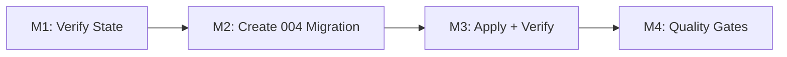

# Plan 114 Phase 1 — Environment Alignment (F-9)

| Field          | Value                                                                                  |
| -------------- | -------------------------------------------------------------------------------------- |
| Plan ID        | 114 (Phase 1 sub-plan)                                                                 |
| Parent Plan    | agent-output/planning/closed/114-db-schema-staged-refactor-plan.md                     |
| Target Release | Next available patch after current origin/main v0.11.1; confirm at DevOps Stage 1      |
| Epic Alignment | Technical Debt / Schema Integrity — F-9 cross-environment divergence                   |
| Related Issues | https://github.com/abu-lina/uflow/issues/189                                          |
| Classification | Refactor                                                                               |
| Pipeline       | Abbreviated (analysis complete, parent plan approved)                                   |
| Analysis       | agent-output/analysis/114-phase1-env-alignment-analysis.md                             |
| Created        | 2026-04-29T19:30Z                                                                      |

## Changelog

| Date                | Agent   | Change                                                        |
| ------------------- | ------- | ------------------------------------------------------------- |
| 2026-04-29T19:30Z   | planner | Phase 1 sub-plan created from analysis 114-phase1-env-alignment-analysis.md. DR#8 resolved by L1-proven evidence: both tables required on all environments. |
| 2026-04-29T20:15Z   | planner | Revised per Critique R1: C-1 resolved (explicit GRANT ALL for consent_logs). C-2 resolved (dev structural comparison added to M1). C-3 resolved (rollback section added). C-5 resolved (INSERT smoke test added to M3). |
| 2026-04-29T20:35Z   | implementer | Implementation started. Milestone 1 verification and migration/test execution in progress. |

---

## Value Statement and Business Objective

**As a** UFlow platform operator responsible for GDPR compliance,
**I want to** achieve schema parity across local, dev, and prod for the `consent_logs` and `deletion_logs` compliance tables,
**So that** GDPR consent records are actually persisted on prod (currently silently failing), the deletion audit trail exists on dev for testing, and all three environments run identical schemas — enabling confident forward migration for Plan 114's remaining phases.

---

## Decision Record

1. **[RESOLVED]** DR#8 Q1 — `consent_logs` intent: **Add to prod + local.** L1-proven evidence: 3 API routes actively write to this table (signup, magic-link, export-data). On prod, these writes silently fail — zero GDPR consent records exist for any prod user. No replacement mechanism exists. `deletion_logs` serves a completely different purpose (deletion audit, not consent tracking). *(Analysis Finding F1, F2, F3.)*

2. **[RESOLVED]** DR#8 Q2 — `deletion_logs` intent: **Codify as forward migration for dev.** L1-proven evidence: table exists on prod (captured in baseline) and is referenced by `delete_user_account()` RPC called from `src/services/account.ts`. Dev is the only environment missing it. The conditional `IF EXISTS` check in the function means dev works without it but loses the audit trail. *(Analysis Finding F4, F5, F6.)*

3. **[RESOLVED]** Both tables coexist — not duplicates: `consent_logs` = GDPR Art. 7 proof of consent (ToS/Privacy Policy acceptance events). `deletion_logs` = GDPR Art. 17 right to erasure audit trail. Complementary compliance purposes.

4. **[RESOLVED]** Migration must be idempotent: Dev already has `consent_logs` + `consent_type` from the old migration chain. Prod + local already have `deletion_logs` from the baseline. All DDL uses `IF NOT EXISTS` / guard blocks so the migration is safe to apply to any environment regardless of current state.

5. **[RESOLVED]** No application code changes needed: All existing code already references both tables correctly. The migration purely adds missing schema objects; no service-layer or type changes required for Phase 1.

---

## Release Strategy

Standalone release. No other active plans target the same version. Parent plan (114) phases ship independently as patch releases.

---

## Pre-conditions (all met)

- [x] Phase 0′ baseline squash complete — `001_baseline.sql` is prod-derived (v0.11.1)
- [x] Phase 0 hygiene complete — `003_phase0_schema_hygiene.sql` applied to prod
- [x] Migration tracking bootstrapped on prod (`supabase_migrations.schema_migrations` exists with 001/002/003)
- [x] F-9 divergences fully documented in architecture review and analysis
- [x] DR#8 resolved by L1-proven analysis evidence

---

## Milestones

### Milestone 1 — Cross-Environment State Verification

**Objective**: Confirm the exact current state of all three environments before writing migration DDL.

**Tasks**:
1. Verify local state via `psql` (already done in analysis): `deletion_logs` present, `consent_logs` + `consent_type` absent. 29 tables, 9 enums.
2. Verify prod state via `supabase-prod/execute_sql` MCP: confirm `deletion_logs` present, `consent_logs` + `consent_type` absent. Confirm post-003 state (migration tracking table exists).
3. Verify dev state via `supabase-dev/execute_sql` MCP: check presence of both tables + enum. Dev likely has `consent_logs` + `consent_type` from old chain but NOT `deletion_logs`.
4. **(C-2)** If dev `consent_logs` already exists, compare its column definitions (names, types, nullability, defaults) against archived migration 012 DDL. Query: `SELECT column_name, data_type, is_nullable, column_default FROM information_schema.columns WHERE table_schema = 'public' AND table_name = 'consent_logs' ORDER BY ordinal_position;`. If any delta exists, document it and create targeted ALTER statements in 004 to reconcile dev's table to the canonical schema.

**Acceptance Criteria**:
- All three environments' states documented with table + enum counts
- Delta matrix confirms which objects need to be created where
- If dev `consent_logs` exists: column-level comparison against migration 012 DDL completed, deltas documented
- No unexpected state (if found, escalate before proceeding)

**Effort estimate**: ~30 minutes

---

### Milestone 2 — Create `004_phase1_environment_alignment.sql`

**Objective**: Write a single idempotent forward migration that brings all three environments to parity for compliance tables.

**Scope — the migration must**:

1. **Create `consent_type` enum** — `DO $$ ... IF NOT EXISTS` guard. Values: `'terms_of_service'`, `'privacy_policy'`.
2. **Create `consent_logs` table** — `CREATE TABLE IF NOT EXISTS`. Columns: `id UUID PK DEFAULT gen_random_uuid()`, `user_id UUID NOT NULL REFERENCES auth.users(id) ON DELETE CASCADE`, `consent_type consent_type NOT NULL`, `accepted BOOLEAN NOT NULL DEFAULT true`, `accepted_at TIMESTAMPTZ NOT NULL DEFAULT NOW()`, `ip_address TEXT`, `user_agent TEXT`, `revoked_at TIMESTAMPTZ`, `created_at TIMESTAMPTZ DEFAULT NOW()`.
3. **Create indexes on `consent_logs`** — `CREATE INDEX IF NOT EXISTS`: `idx_consent_logs_user_id`, `idx_consent_logs_consent_type`, `idx_consent_logs_accepted_at DESC`.
4. **Enable RLS on `consent_logs`** + create 4 policies (users SELECT/INSERT/UPDATE own rows; admins SELECT all). Use `DO $$ ... IF NOT EXISTS` guards for policies.
5. **Create `deletion_logs` table** — `CREATE TABLE IF NOT EXISTS`. Columns: `id UUID PK DEFAULT gen_random_uuid()`, `user_id UUID NOT NULL`, `deleted_at TIMESTAMPTZ DEFAULT NOW()`, `reason TEXT`, `created_at TIMESTAMPTZ DEFAULT NOW()`. No FK to `auth.users` (user is being deleted when this row is written — FK would block the delete).
6. **Add PK constraint on `deletion_logs`** — `IF NOT EXISTS` guard (already exists on prod/local via baseline).
7. **Enable RLS on `deletion_logs`** + create admin-read policy. Guard to avoid duplicate policy errors.
8. **(C-1)** **Grant permissions for both tables** — `GRANT ALL ON TABLE public.consent_logs TO anon, authenticated, service_role;` and `GRANT ALL ON TABLE public.deletion_logs TO anon, authenticated, service_role;`. This matches the universal baseline pattern (all 94 baseline tables use `GRANT ALL`). RLS policies are the actual security boundary. Critical: without explicit grants, `service_role` INSERT (used by signup/magic-link routes via `getSupabaseAdmin()`) and `authenticated` SELECT (used by export-data route) would fail on freshly-created tables.
9. **Add table/column comments** — GDPR compliance context documentation.

**What the migration must NOT do**:
- No application code changes
- No type generation changes
- No data backfill (tables are empty or have existing data — both are fine)
- No changes to `delete_user_account()` function (it already handles `deletion_logs` correctly)

**Acceptance Criteria**:
- File exists at `supabase/migrations/004_phase1_environment_alignment.sql`
- All DDL is idempotent (safe to run on any environment regardless of current state)
- `consent_type` enum created before `consent_logs` table (dependency order)
- RLS policies match archived migration 012 for `consent_logs` and baseline for `deletion_logs`
- `GRANT ALL` applied to both `consent_logs` and `deletion_logs` for `anon`, `authenticated`, `service_role`
- No `IF NOT EXISTS` gaps (every CREATE statement guarded)

**Effort estimate**: ~1–2 hours

---

### Milestone 3 — Apply Migration + Cross-Environment Verification

**Objective**: Apply `004` to all three environments and verify structural parity.

**Tasks**:
1. Apply locally via `supabase db reset` (or direct `psql` execution against local)
2. Apply to prod via `supabase-prod/execute_sql` MCP tool (execute the migration SQL)
3. Register migration in prod tracking: INSERT into `supabase_migrations.schema_migrations`
4. Apply to dev via `supabase-dev/execute_sql` MCP tool
5. Run structural verification query on all three environments:
   - Table count (target: 30)
   - Enum count (target: 10)
   - Verify `consent_logs` table exists with correct column count and types
   - Verify `consent_type` enum exists with correct values
   - Verify `deletion_logs` table exists with correct column count
   - Verify RLS is enabled on both tables
   - Verify policy count on both tables
6. **(C-5)** Run INSERT smoke test on prod after applying migration — verify the application's write path works:
   ```sql
   INSERT INTO public.consent_logs (user_id, consent_type, accepted, accepted_at)
   VALUES ('00000000-0000-0000-0000-000000000000', 'terms_of_service', true, NOW());
   DELETE FROM public.consent_logs WHERE user_id = '00000000-0000-0000-0000-000000000000';
   ```
   If the INSERT succeeds and DELETE cleans up, the app's signup/magic-link consent write path will work. If it fails with a type mismatch, the enum values don't match — investigate before proceeding.

**Acceptance Criteria**:
- All three environments show 30 public tables, 10 enums
- `consent_logs` structurally identical across all environments (columns, types, indexes, RLS)
- `deletion_logs` structurally identical across all environments (columns, types, RLS)
- `consent_type` enum values identical across all environments
- Migration registered in prod tracking table
- Smoke test INSERT/DELETE on prod succeeds without errors

**Effort estimate**: ~1–2 hours

---

### Milestone 4 — Quality Gates

**Objective**: Verify no regressions from the migration.

**Tasks**:
1. `npm run lint` — pass
2. `npm run type-check` — pass
3. `npm run build` — pass
4. `npm test` (vitest) — pass
5. Create implementation document at `agent-output/implementation/114-phase-1-environment-alignment-implementation.md`

**Acceptance Criteria**:
- All 4 quality gates pass
- Implementation document created with evidence
- No application code changes needed (confirmed by clean gate pass)

**Effort estimate**: ~30 minutes

---

## Rollback Strategy

**(C-3)** If the migration fails midway or produces an unexpected state on any environment, execute these idempotent rollback statements:

```sql
-- Rollback 004_phase1_environment_alignment.sql
DROP TABLE IF EXISTS public.consent_logs;
DROP TYPE IF EXISTS public.consent_type;
DROP TABLE IF EXISTS public.deletion_logs;
```

**Notes**:
- On prod/local, `deletion_logs` already exists via baseline — only drop it if the migration itself caused corruption; otherwise leave it.
- On dev, `consent_logs` may pre-exist from the old migration chain — the rollback would remove it, which is acceptable since the migration will be re-run after fixing the root cause.
- All drops are idempotent and safe to run multiple times.

---

## Milestone Dependencies



Sequencing rule: Each milestone is strictly sequential — no parallelization possible since each depends on the prior milestone's output.

---

## Testing Strategy

- **Unit tests**: No new unit tests required — no application code changes
- **Migration validation**: Structural parity verification across all three environments (table/enum counts, column definitions, RLS policies)
- **Regression**: Existing vitest suite (1148+ tests) validates that no application behavior changed
- **Integration**: The `consent_logs` INSERT operations in signup/magic-link routes will begin succeeding on prod after migration — this is the intended fix, not a regression

---

## Risks

| Risk | Likelihood | Impact | Mitigation |
|---|---|---|---|
| Dev `consent_logs` has different structure than migration 012 DDL | Low | Medium | Migration uses `IF NOT EXISTS` — will skip if table already exists. Verify dev structure in M1 before applying. If dev table differs, create targeted ALTER statements. |
| `supabase db reset` exit code 502 (DF-3) | Medium | Low | Known deferred item. If it recurs, verify schema state via direct `psql` query instead. |
| Prod migration tracking table doesn't accept INSERT | Low | High | Verified in Phase 0′ that tracking table exists and accepts registrations. |
| RLS policy name collision on dev | Low | Low | Use `DO $$ ... IF NOT EXISTS` guards for all policy creation. |

---

## Duration Estimates

| Phase | Estimate | Uncertainty |
|---|---|---|
| M1: State Verification | 30 min | Low — MCP tools proven in Phase 0′ |
| M2: Migration Creation | 1–2 hours | Low — DDL is well-defined from analysis |
| M3: Apply + Verify | 1–2 hours | Medium — MCP latency, potential dev structure delta |
| M4: Quality Gates | 30 min | Low — no code changes |
| **Total** | **3–5 hours** | |

Key uncertainty driver: Dev environment state (G-1 from analysis). If dev has unexpected `consent_logs` structure, additional ALTER statements may be needed.

---

## Handoff Notes

### For Implementer
- Analysis doc has full DDL specifications: `agent-output/analysis/114-phase1-env-alignment-analysis.md`
- Archived migration 012 has the original `consent_logs` DDL: `supabase/migrations/archive/012_create_consent_logs.sql`
- Baseline lines 1992–2001 have the `deletion_logs` DDL
- Baseline lines 3728, 3926, 4329–4331 have `deletion_logs` RLS + grants
- `consent_logs` inserts use `getSupabaseAdmin()` (service_role) — RLS INSERT policy is for direct user access, not the primary write path
- `deletion_logs` has NO FK to `auth.users` — intentional, because the user row is deleted before the log is written in `delete_user_account()`

### For Code Reviewer
- Gate: `agent-output/implementation/114-phase-1-environment-alignment-implementation.md` created
- Gate: `004_phase1_environment_alignment.sql` created in `supabase/migrations/`
- Gate: All three environments verified via MCP (table+enum counts match: 30/10)
- Gate: lint/type-check/build/vitest all pass

### Note on DF-3
`supabase db reset` exit code 502 was deferred from Phase 0′. If it recurs, document it as accepted infra artifact and verify schema state via `psql` direct query instead.
