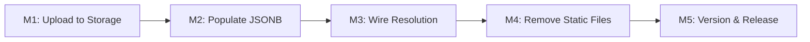

# Plan 122 — Category Image Unification (Supabase Storage)

| Field          | Value                                                                              |
| -------------- | ---------------------------------------------------------------------------------- |
| Plan ID        | 122                                                                                |
| Target Release | next available patch after current origin/main version; confirm at DevOps Stage 1  |
| Epic Alignment | Provider Image UX (continuation of Plan 119)                                       |
| Related Issues | Discovered during Plan 119 post-release verification; v0.12.5 hotfix PR #206       |
| Classification | Refactor                                                                           |
| Pipeline       | Abbreviated (Planner → Critic → Implementer → QA → DevOps)                        |
| GitHub Issue   | https://github.com/abu-lina/uflow/issues/207                                      |
| Created        | 2026-05-03T18:15Z                                                                 |
| Status         | In Progress                                                                        |

## Changelog

| Date (UTC)         | Agent   | Change                          | Summary                                                |
| ------------------ | ------- | ------------------------------- | ------------------------------------------------------ |
| 2026-05-03T18:15Z  | planner | Initial plan created            | Category image unification scoped from Architect findings |
| 2026-05-03T18:27Z  | planner | Revision per Critique 122       | Addressed F1–F6: added UnifiedGallery callsite, resolved bg color + American images, expanded test inventory, noted dual parseCategoryImages |

---

## Value Statement and Business Objective

> **As the platform operator, I want a single, DB-driven category image system instead of two competing approaches (hardcoded UUID map + Supabase Storage JSONB), so that adding or changing category images never requires a code change, Docker rebuild, or risk of silent UUID mismatch — and the git repository stops accumulating binary bloat.**

---

## Decision Record

| # | Decision | Status |
|---|----------|--------|
| D1 | Unify on existing `categories.category_images` JSONB + `category-images` Supabase Storage bucket | [RESOLVED] — infrastructure already exists, tested, and serves 3 categories in production |
| D2 | Store images as `category-images/{category_id}/N.webp` in the bucket | [RESOLVED] — category_id-based folders prevent UUID mismatch by construction |
| D3 | Convert existing PNGs to WebP before upload | [RESOLVED] — WebP is already the `next.config.js` preferred format; reduces size ~30-50% |
| D4 | Populate `categories.category_images` JSONB with `{urls: [...]}` format | [RESOLVED] — matches existing `parseCategoryImages()` contract (Plan 055 regression-tested) |
| D5 | Remove `public/images/categories/` and `src/utils/categoryImages.ts` after migration | [RESOLVED] — eliminates dual-system confusion and binary git bloat |
| D6 | Do NOT purge git history (`git filter-repo`) | [RESOLVED] — risk/reward too low for ~7MB; avoids force-push disruption |
| D7 | Multiple images per category stored as array in JSONB; deterministic selection by provider_id hash | [RESOLVED] — preserves Plan 119's variant diversity behaviour |
| D8 | Relocate `getCategoryCardBackgroundColor` + `CARD_BACKGROUND_COLORS` to `imageUtils.ts` when deleting `categoryImages.ts` | [RESOLVED] — function is 8 lines, source-independent (hash of providerId), used by 6 consumer files; relocation preserves behaviour with minimal churn |
| D9 | American images (`food/american/` — 4 PNGs): skip upload, discard | [RESOLVED] — no "American" category exists in the DB; 0 providers use it; creating a category is out of scope; images can be re-sourced later if a category is added |

---

## Background

Plan 119 introduced a category fallback image system using static PNGs in `public/images/categories/` with a hardcoded UUID lookup map in `categoryImages.ts`. This broke in production because the UUIDs in the map did not match the actual `categories` table. A hotfix (v0.12.5, PR #206) corrected the 4 active entries, but 24 of 34 entries still use wrong IDs.

Meanwhile, an **older system already exists**: the `categories.category_images` JSONB column stores Supabase Storage URLs, and the `category-images` bucket is public. Three store/service categories already use it. The two systems are completely independent — they don't interact.

This plan unifies on the existing DB-driven approach and removes the fragile static-file system.

---

## Assumptions

1. The `category-images` Supabase Storage bucket remains public (confirmed: `public: true`, no size/mime restrictions)
2. The `categories.category_images` JSONB column schema is `{urls: string[]}` (confirmed by existing data and `parseCategoryImages()`)
3. All 22 existing PNGs in `public/images/categories/food/` are licensed for use (they were sourced by Plan 119)
4. `isTrustedUrl()` already accepts Supabase Storage URLs (confirmed by existing usage)
5. No other feature branch depends on `categoryImages.ts` or the `public/images/categories/` folder

---

## Plan

### Milestone 1: Upload Images to Supabase Storage

**Objective**: Move the 18 existing category stock images from `public/` to the `category-images` Supabase Storage bucket, organized by `category_id`.

**Tasks**:
1. Convert 18 PNGs to WebP format (quality 85, max 512px — matching ornament mask viewport)
2. Upload to `category-images/{category_id}/N.webp` — using the real DB `category_id` as the folder name
3. Verify all uploads are publicly accessible via their Storage URLs

**Upload mapping** (from Architect findings):

| Category | DB category_id | Source folder | Images |
|---|---|---|---|
| Turkish | `232c2870-7929-43eb-a909-6cac90203192` | `food/turkish/` | 8 |
| Arabic | `a8d3cf09-b606-4de9-8744-b8c584c5e172` | `food/arabic/` | 6 |
| Italian | `b35965ed-fdb0-4bc5-a872-ab3bbc5139de` | `food/italian/` | 4 |
| ~~American~~ | ~~(no DB category)~~ | ~~`food/american/`~~ | ~~4~~ |

**American images skipped** (D9): No "American" category exists in the DB and 0 providers would use it. The 4 PNGs are discarded with the rest of `public/images/categories/` in M4. If a category is later added, images can be re-sourced.

**Acceptance**:
- All images accessible via `https://{supabase-ref}.supabase.co/storage/v1/object/public/category-images/{category_id}/N.webp`
- WebP format confirmed
- No broken URLs

---

### Milestone 2: Populate `categories.category_images` JSONB

**Objective**: Update the `categories` table rows for Turkish, Arabic, and Italian to include their new Storage URLs in the `category_images` JSONB column.

**Tasks**:
1. Write UPDATE statements to set `category_images = '{"urls": ["...1.webp", "...2.webp", ...]}'` for each category
2. Apply to production DB
3. Verify the JSONB is parseable by `parseCategoryImages()`

**Acceptance**:
- `SELECT category_images FROM categories WHERE name_en = 'Turkish'` returns valid `{urls: [...]}` JSONB with 8 URLs
- Same for Arabic (6) and Italian (4)
- Existing entries (Clothing, Community, Health & Sports) remain unchanged

---

### Milestone 3: Wire Resolution — Remove Hardcoded Map

**Objective**: Eliminate `categoryImages.ts` and its hardcoded UUID map. Make all callsites use the DB-driven `categories.category_images` JSONB path instead.

**Tasks**:
1. Audit all callsites of `getCategoryStaticImageUrl()`, `getCategoryCardBackgroundColor()`, and `isCategoryStaticImageUrl()`
2. Replace `getCategoryStaticImageUrl()` calls with resolution from `categories.category_images` JSONB (via the existing `parseCategoryImages()` path or a new lightweight resolver)
3. Preserve the deterministic variant selection (same provider always gets the same image) — use the existing `hashId()` logic with the URLs array
4. Relocate `getCategoryCardBackgroundColor()` + `CARD_BACKGROUND_COLORS` + `hashId()` to `imageUtils.ts` (D8) — the function is source-independent (hashes providerId into 4 pastel colors) and used by 6 consumer files
5. Remove `isCategoryStaticImageUrl()` and its usage in `UnifiedGallery.tsx` — after migration, category images are Supabase Storage URLs, so the `/images/categories/` prefix check is invalid; the gallery's category-image-specific background styling should use a URL-based check against the Supabase Storage bucket prefix, or be dropped if visually unnecessary
6. Remove `src/utils/categoryImages.ts`

**Note on dual `parseCategoryImages`**: Two independent implementations exist — (1) exported from `useImageFallback.ts` (tested via `parseCategoryImages.test.ts`), and (2) a private function in `imageUtils.ts` used by `getAllTrustedImageUrlsWithFallback()`. Both parse the same `{urls: [...]}` JSONB format. The implementer should be aware of both but consolidation is not in scope.

**Callsites to update** (6 files, verified by grep):
- `src/components/providers/ProviderCard.tsx` — card grid (`getCategoryStaticImageUrl`, `getCategoryCardBackgroundColor`)
- `src/components/providers/ProviderDetailPage.tsx` — detail page (`getCategoryStaticImageUrl`, `getCategoryCardBackgroundColor`)
- `src/components/providers/ProviderDetailModal.tsx` — modal view (`getCategoryStaticImageUrl`, `getCategoryCardBackgroundColor`)
- `src/components/providers/MobileProviderDetail.tsx` — mobile detail (`getCategoryStaticImageUrl`, `getCategoryCardBackgroundColor`)
- `src/components/shared/UnifiedGallery.tsx` — gallery (`isCategoryStaticImageUrl`, `getCategoryCardBackgroundColor`)
- `src/hooks/useImageFallback.ts` — gallery hook (`getCategoryStaticImageUrl` in `resolveGalleryImage`)

**Acceptance**:
- `categoryImages.ts` deleted
- `getCategoryCardBackgroundColor` + `CARD_BACKGROUND_COLORS` + `hashId` relocated to `imageUtils.ts`
- All provider cards/detail views still show category fallback images (from Supabase Storage URLs now)
- `UnifiedGallery.tsx` no longer references `isCategoryStaticImageUrl` or imports from `categoryImages.ts`
- No references to `/images/categories/` path prefix remain in `src/`
- Existing tests pass (update test fixtures to use Supabase Storage URLs)

---

### Milestone 4: Remove Static Files

**Objective**: Delete the `public/images/categories/` directory and all 22 PNGs from the repository.

**Tasks**:
1. `rm -rf public/images/categories/`
2. Update any references in tests, configs, or docs
3. Verify build succeeds without the static files
4. Docker image shrinks by ~7.2 MB (22 PNGs removed — includes 4 unused American images)

**Acceptance**:
- `public/images/categories/` does not exist
- `npm run build` succeeds
- No 404 errors in the app for any category image
- Git diff shows only deletions for image files

---

### Milestone 5: Version and Release

**Objective**: Update version artifacts for the release.

**Tasks**:
1. Update `package.json` version
2. Add CHANGELOG entry describing the unification
3. Commit message: `refactor(images): unify category images on Supabase Storage`

**Acceptance**:
- Version bumped
- CHANGELOG documents the change
- All CI gates pass

---

## Milestone Dependencies

Sequencing rule: Each milestone depends on the previous — images must be uploaded (M1) and DB populated (M2) before code is rewired (M3), and code must be rewired before static files are deleted (M4).

---

## Release Strategy

Standalone — no other known plans target the next patch release.

---

## Testing Strategy

- **Unit**: Update existing test fixtures across 4 test files:
  - `parseCategoryImages.test.ts` — fixture updates if JSONB format changes (unlikely)
  - `ProviderCard.test.tsx` — lines 105–134 contain a test case asserting `/images/categories/food/turkish/` path patterns; this test must be **rewritten** (not just fixture-swapped) to assert Supabase Storage URLs or verify the new resolution path
  - `useImageFallback.hierarchy.test.ts` — update `resolveGalleryImage` assertions from `/images/categories/` paths to Supabase Storage URLs
  - `UnifiedGallery.test.tsx` — mocks `useImageFallback`; update fixtures if `isCategoryStaticImageUrl` removal changes rendering behaviour
- **Integration**: Verify `resolveGalleryImage()` returns Supabase Storage URLs for categories with images and `PLACEHOLDER_IMAGE` for categories without.
- **Visual regression**: Spot-check Turkish and Arabic provider cards render stock images (same visual result, different URL source).
- No new test files expected — this is a refactor of existing tested behaviour.

---

## Risks

| Risk | Likelihood | Impact | Mitigation |
|---|---|---|---|
| Supabase Storage bucket access changes | LOW | HIGH | Bucket is public and has been for months; no planned policy changes |
| `parseCategoryImages()` doesn't handle multi-URL + variant selection | MEDIUM | LOW | May need a small wrapper to add deterministic pick; `parseCategoryImages` already returns arrays |
| Performance regression from remote image fetch vs local static | LOW | LOW | Supabase CDN + Next.js image optimization cache; unlikely worse than Docker-local |
| Deployment ordering: M1/M2 must complete before M3/M4 code deploys | MEDIUM | HIGH | Operator must complete M1+M2 (Storage upload + DB population) before merging the M3+M4 PR; milestone dependency graph enforces this |

---

## Duration Estimates

| Phase | Estimate | Uncertainty |
|---|---|---|
| Planning | 30 min | Low — architecture already validated |
| Implementation | 2–4 hours | Low — mostly wiring changes + uploads |
| QA | 30 min | Low — existing test suite covers resolution logic |
| DevOps | 30 min | Low — standard release |
| **Total** | **3–5 hours** | Key driver: 6 callsite files + 4 test files needing update |

---

## Validation

- [ ] All provider cards with Turkish/Arabic/Italian categories show stock images (from Supabase Storage)
- [ ] Provider cards without images show ProviderImageFallback (mint ornament)
- [ ] No references to `categoryImages.ts` or `/images/categories/` in `src/`
- [ ] `public/images/categories/` directory deleted
- [ ] Build succeeds, all tests pass
- [ ] Performance budget not exceeded
