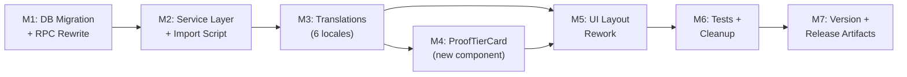

# Plan 133 — Halal Proof Tier Rework

| Field          | Value                                                                              |
| -------------- | ---------------------------------------------------------------------------------- |
| Plan ID        | 133                                                                                |
| Target Release | Next available minor after current origin/main v0.12.17; confirm at DevOps Stage 1 |
| Epic Alignment | Provider Detail UX — Trust & Transparency                                          |
| Related Issues | Plan 126 (Nachweise Attestation — superseded by this plan)                         |
| Classification | Feature                                                                            |
| Pipeline       | Abbreviated                                                                        |
| GitHub Issue   | https://github.com/abu-lina/uflow/issues/232                                       |
| Created        | 2026-05-20T06:30Z                                                                  |

## Changelog

| Date              | Agent       | Change                                            |
| ----------------- | ----------- | ------------------------------------------------- |
| 2026-05-20T06:30Z | Planner     | Plan created from ADR 133                         |
| 2026-05-20T07:35Z | Implementer | Execution started (M0 pre-flight + M1 sequencing) |

## Value Statement and Business Objective

**As a** Muslim community user browsing a restaurant or store on Ummah Flow,
**I want to** see a clear separation between the platform's halal guarantee (baseline gate) and the verification depth for each listing (proof tier),
**so that** I understand that every listing is halal AND I can see how transparently that was verified — without the current contradictory messaging implying some listings are "more halal" than others.

## Decision Record

| #   | Decision                                                                                                                        | Status                                                                                       |
| --- | ------------------------------------------------------------------------------------------------------------------------------- | -------------------------------------------------------------------------------------------- |
| D1  | Repurpose `food_providers.halal_level` (100% NULL) → `proof_tier` SMALLINT with CHECK 1–3. Add to `store_providers` for parity. | [RESOLVED] Zero data loss; reuses existing column; integer+CHECK over ENUM for extensibility |
| D2  | Separate baseline gate (HalalTrustBanner above sections) from proof tier (inside Verification section)                          | [RESOLVED] Baseline-first reading order resolves the contradiction                           |
| D3  | Rename section "Proofs"/"Nachweise" → "Verification"/"Prüfung"                                                                  | [RESOLVED] Frames as UFlow's verification effort, not provider burden of proof               |
| D4  | New `ProofTierCard` component with shield-based tier visualization                                                              | [RESOLVED] Shield icons avoid quantitative ranking while showing depth                       |
| D5  | Decouple `hasAnyDeclared` from `proof_tier` — check only boolean declarations                                                   | [RESOLVED] proof_tier is UFlow verification, not provider self-declaration                   |
| D6  | Rewrite `upsert_joinhalal_providers` RPC (broken on prod — references 4 dropped columns)                                        | [RESOLVED] Bundled into migration; fixes latent production bug                               |
| D7  | Update import script to match new RPC signature                                                                                 | [RESOLVED] Remove offers_ids/needs_ids, replace halal_level with proof_tier                  |
| D8  | Remove stale translation keys (`sections.proofs`, `empty.noProofs`) from all 6 locales                                          | [RESOLVED] Dead code cleanup prevents accumulation                                           |

## Assumptions

1. Migration 083 has been applied to production (confirmed: `halal_level` is on `food_providers`, not `providers`).
2. `halal_level` is 100% NULL across all 973 food providers (verified via live DB query).
3. The `upsert_joinhalal_providers` RPC is broken on production but the import pipeline is not actively running, so the fix is non-emergency.
4. `no_alcohol`/`no_pork`/`no_gambling` booleans are NOT candidates for removal — 2 providers have active declarations.
5. AR/TR/UR/PS translations are provisional and require native speaker sign-off before production merge.
6. Plan 126 (Nachweise Attestation) is effectively superseded — its `AttestationCard` work was already implemented, and this plan reworks the surrounding context.

## Release Strategy

Plan 126 (Nachweise Attestation, target v0.13.0) operates on the same domain. Plan 133 supersedes Plan 126's remaining scope by reworking the proof section architecture. Plan 126's `AttestationCard` component (already merged to main) is preserved and modified by this plan. No bundling conflict — Plan 133 ships independently.

## Milestone Dependencies



Sequencing rule: M1 (schema) must complete before M2 (service layer). M3 (translations) must complete before M4/M5 (UI). M4 and M5 can overlap. M6 (tests) runs after all UI work. M7 is final.

---

## Plan

### Milestone 0: Pre-Implementation Verification

**Objective**: Confirm migration 083 state and RPC state on remote DB before any code changes.

**Tasks**:

1. Verify `food_providers` table has `halal_level` column (not on `providers`)
2. Verify `upsert_joinhalal_providers` RPC still references dropped columns
3. Confirm no triggers, indexes, or views reference `halal_level`
4. Record baseline findings

**Acceptance Criteria**:

- [ ] Pre-flight check recorded confirming schema state
- [ ] No unexpected dependencies on `halal_level` discovered

---

### Milestone 1: DB Migration + RPC Rewrite

**Objective**: Rename `halal_level` → `proof_tier`, add CHECK constraints, and fix the broken `upsert_joinhalal_providers` RPC.

**Tasks**:

1. Create migration file `supabase/migrations/133_proof_tier_and_rpc_fix.sql`
2. Rename `food_providers.halal_level` → `proof_tier`
3. Add `proof_tier SMALLINT` to `store_providers`
4. Add CHECK constraints (1–3 or NULL) on both tables
5. Add column comments
6. Rewrite `upsert_joinhalal_providers` to:
   - Remove `offers_ids`, `needs_ids`, `no_alcohol`, `halal_level` from `providers` INSERT/UPDATE
   - After upserting `providers`, INSERT/UPSERT into `food_providers` with `proof_tier`, `no_alcohol`, `no_pork`
   - After upserting `providers`, INSERT into `provider_offers` junction table (replacing array column)
   - Drop `needs_ids` handling (always `[]` in the import pipeline — no data loss)

**Acceptance Criteria**:

- [ ] Migration applies cleanly to a fresh local DB
- [ ] `proof_tier` exists on `food_providers` and `store_providers` with CHECK constraints
- [ ] `halal_level` column no longer exists on `food_providers`
- [ ] `upsert_joinhalal_providers` RPC no longer references any dropped columns (`halal_level`, `no_alcohol`, `offers_ids`, `needs_ids` on `providers`)
- [ ] RPC correctly writes to `food_providers` and `provider_offers` instead

---

### Milestone 2: Service Layer + Import Script

**Objective**: Update TypeScript types, queries, and the import script to match the new schema.

**Tasks**:

1. In `src/services/providers.ts`:
   - Rename `halal_level` → `proof_tier` in `Provider` interface
   - Update `getProviderById()` select: `'halal_level, no_alcohol, no_pork'` → `'proof_tier, no_alcohol, no_pork'`
2. In `scripts/import-joinhalal.ts`:
   - Remove `offers_ids` and `needs_ids` from the `JoinHalalProvider` interface
   - Replace `halal_level` with `proof_tier` in the mapping/payload
   - Update any references to the removed fields
3. Run `npm run type-check` to catch any remaining `halal_level` references

**Acceptance Criteria**:

- [ ] `tsc` passes with zero errors
- [ ] No references to `halal_level` remain in `src/` or `scripts/` (verified via grep)
- [ ] No references to `offers_ids`/`needs_ids` remain in the import script interface
- [ ] `Provider` type includes `proof_tier?: number | null`

---

### Milestone 3: Translations (6 Locales)

**Objective**: Add new `proofTier.*` translation keys, update section titles, and remove stale keys.

**Tasks**:

1. Add `providerDetail.proofTier.*` namespace to all 6 locale files (`en`, `de`, `ar`, `tr`, `ur`, `ps`):
   - `sectionTitle`, `pending`, `pendingDetail`, `tier1Title`, `tier1Detail`, `tier2Title`, `tier2Detail`, `tier3Title`, `tier3Detail`, `whatIsThis`, `explanation`
2. Update `providerDetail.sections.proofs` → use new `proofTier.sectionTitle` (or remove if section title is now sourced from proofTier namespace)
3. Remove stale keys: `providerDetail.sections.proofs`, `providerDetail.empty.noProofs` from all 6 files
4. Flag AR/TR/UR/PS translations as provisional (EN/DE are authoritative)

**Acceptance Criteria**:

- [ ] All 6 locale files have `proofTier.*` keys
- [ ] Stale keys `sections.proofs` and `empty.noProofs` removed from all 6 files
- [ ] EN and DE translations reviewed for accuracy
- [ ] AR/TR/UR/PS translations marked as provisional in a code comment

---

### Milestone 4: ProofTierCard Component

**Objective**: Create the new `ProofTierCard` component that displays the verification tier.

**Tasks**:

1. Create `src/features/providers/components/ProofTierCard.tsx`
2. Accept `proofTier: number | null | undefined` prop
3. Render:
   - `NULL/undefined` → "Verification pending" with neutral styling (clock/hourglass icon)
   - `1` → "Online Check" with outline shield icon
   - `2` → "Personal Visit" with half-filled shield icon
   - `3` → "Certified" with fully-filled shield + gold accent
4. Display tier description text always visible (not behind tooltip)
5. Include an expandable "What does this mean?" explainer
6. Client component (`'use client'`) using `useLanguage()` for i18n
7. Follow existing design tokens: `text-content-heading`, `text-content`, `bg-[#E3F2EF]`/`bg-[#F8FBF9]` palette

**Acceptance Criteria**:

- [ ] Component renders all 4 states (null, 1, 2, 3) correctly
- [ ] Uses shield-based visual indicator, NOT stars/progress bars
- [ ] Includes accessible ARIA labels for the tier indicator
- [ ] Uses `useLanguage()` for all display text
- [ ] "What does this mean?" section is present and expandable

---

### Milestone 5: UI Layout Rework

**Objective**: Restructure the provider detail page and modal to resolve the baseline/proof contradiction.

**Tasks**:

1. In `ProviderDetailPage.tsx` (both mobile + desktop sections):
   - Move `<HalalTrustBanner />` from BELOW `<ProviderDetailSections>` to ABOVE it
2. In `ProviderDetailModal.tsx`:
   - Move `<HalalTrustBanner />` from BELOW sections to ABOVE
3. In `ProviderDetailSections.tsx`:
   - Replace the `<ExpandSection title="Proofs">` content with:
     - `<ProofTierCard proofTier={provider.proof_tier} />`
     - `<AttestationCard .../>` (existing — provider self-declarations)
     - `<TrustBadgesSection .../>` (existing — community badges)
   - Update section title to use `proofTier.sectionTitle` key
4. In `AttestationCard.tsx`:
   - Remove `halalLevel` prop
   - Decouple `hasAnyDeclared` from `proof_tier` — check ONLY `no_alcohol || no_pork || no_gambling`
   - Add `proofTier` prop if needed for conditional display logic (or remove entirely if AttestationCard doesn't need it)
5. Verify `HalalTrustPopup` still works (first 10 views behavior, no changes needed)

**Acceptance Criteria**:

- [ ] HalalTrustBanner renders ABOVE sections in both detail page (mobile + desktop) and modal
- [ ] Proofs ExpandSection renamed to Verification/Prüfung
- [ ] ProofTierCard renders inside the Verification section
- [ ] AttestationCard `hasAnyDeclared` no longer references `halal_level` or `proof_tier`
- [ ] HalalTrustPopup first-10-views behavior unchanged
- [ ] Visual reading order: Baseline → Values → Verification (ProofTier + Attestation + Badges) → Menu → ...

---

### Milestone 6: Tests + Cleanup

**Objective**: Update existing tests, add tests for new component, verify no regressions.

**Tasks**:

1. Update `AttestationCard.test.tsx`:
   - Remove `halalLevel` prop from test fixtures
   - Verify `hasAnyDeclared` logic uses only boolean declarations
2. Add `ProofTierCard.test.tsx`:
   - Test all 4 states (null, 1, 2, 3)
   - Test i18n rendering (at least EN and DE)
   - Test accessibility (ARIA labels)
3. Update `ProviderDetailSections.test.tsx`:
   - Update the Proofs/Nachweise section tests to reference "Verification"/"Prüfung"
   - Verify ProofTierCard is rendered inside the section
4. Run full test suite: `npm test`
5. Run type check: `npm run type-check`
6. Run lint: `npm run lint`
7. Grep for any remaining `halal_level` references: `grep -rn 'halal_level' src/ scripts/ supabase/migrations/133*`

**Acceptance Criteria**:

- [ ] All existing tests pass
- [ ] New ProofTierCard tests cover 4 states + i18n + a11y
- [ ] AttestationCard tests updated — no `halalLevel` prop
- [ ] `npm run type-check` passes
- [ ] `npm run lint` passes (or lint:fix applied)
- [ ] Zero `halal_level` references in `src/` or `scripts/` (verified via grep)

---

### Milestone 7: Version + Release Artifacts

**Objective**: Update version and changelog for release.

**Tasks**:

1. Bump version in `package.json` (minor: 0.12.17 → next available minor, confirm at DevOps Stage 1)
2. Add CHANGELOG.md entry documenting:
   - Proof tier model (3-tier verification transparency)
   - Baseline/proof UI separation
   - RPC fix (upsert_joinhalal_providers)
   - Import script cleanup
   - Translation changes
3. Update `system-architecture.md` changelog with Plan 133 summary

**Acceptance Criteria**:

- [ ] `package.json` version updated
- [ ] CHANGELOG.md entry covers all user-facing and schema changes
- [ ] `system-architecture.md` changelog updated

---

## Testing Strategy

| Type        | Scope                                                               | Coverage                                     |
| ----------- | ------------------------------------------------------------------- | -------------------------------------------- |
| Unit        | ProofTierCard: 4 render states, i18n, a11y                          | All tier values + null                       |
| Unit        | AttestationCard: decoupled hasAnyDeclared logic                     | Boolean-only check, no proof_tier dependency |
| Integration | ProviderDetailSections: section render with proof tier              | Section title, component composition         |
| Type safety | `npm run type-check`                                                | Zero halal_level references compile          |
| Lint        | `npm run lint`                                                      | No regressions                               |
| Manual (QA) | Visual verification of baseline/proof layout in detail page + modal | Both mobile and desktop viewports            |
| Manual (QA) | HalalTrustPopup first-10-views behavior                             | Still triggers correctly                     |

---

## Schema Mutation Inventory

### Write Inventory (halal_level rename)

| Location                                                       | Type          | Old Reference                                 | Action                                      |
| -------------------------------------------------------------- | ------------- | --------------------------------------------- | ------------------------------------------- |
| `src/services/providers.ts` L398                               | Read (select) | `.select('halal_level, no_alcohol, no_pork')` | Rename to `proof_tier`                      |
| `src/services/providers.ts` L62                                | Type          | `halal_level?: number \| null`                | Rename to `proof_tier`                      |
| `src/features/providers/components/AttestationCard.tsx`        | Prop          | `halalLevel` prop + `hasAnyDeclared` check    | Remove/decouple                             |
| `src/features/providers/components/ProviderDetailSections.tsx` | Prop pass     | `halalLevel={provider.halal_level}`           | Rename to `proofTier={provider.proof_tier}` |
| `upsert_joinhalal_providers` RPC (DB)                          | Write         | INSERT + UPDATE `halal_level` on `providers`  | Rewrite: target `food_providers.proof_tier` |
| `scripts/import-joinhalal.ts`                                  | Payload       | Maps `halal_level` into RPC payload           | Rename to `proof_tier`                      |

### Read Inventory (halal_level)

| Location                                    | Type             | Action                          |
| ------------------------------------------- | ---------------- | ------------------------------- |
| `src/services/providers.ts` getProviderById | SELECT           | Column name change              |
| `AttestationCard.tsx`                       | Prop destructure | Remove prop                     |
| `ProviderDetailSections.tsx`                | Prop pass        | Rename                          |
| `AttestationCard.test.tsx`                  | Test fixture     | Remove halalLevel from props    |
| `ProviderDetailSections.test.tsx`           | Test assertion   | Update section title assertions |

### Verification Command

```bash
grep -rn 'halal_level' src/ scripts/ supabase/migrations/133*
```

Expected: zero matches after implementation (excluding this plan document and archived migrations).

---

## Risks

| Risk                                   | Severity | Mitigation                                                         |
| -------------------------------------- | -------- | ------------------------------------------------------------------ |
| Broken RPC on prod (pre-existing)      | HIGH     | Fixed in M1 — RPC rewritten                                        |
| Import script out of sync with RPC     | MEDIUM   | M2 updates script to match; tested together                        |
| Users misread tiers as quality ranking | MEDIUM   | UX copy emphasizes "verification method"; shield icons (not stars) |
| Religious translation accuracy         | MEDIUM   | EN/DE authoritative; AR/TR/UR/PS flagged provisional               |
| Plan 116 migration conflict            | LOW      | Plan 116 doesn't touch halal_level; rename is independent          |

## Duration Estimates

| Phase                 | Estimate                      | Uncertainty                                                                 |
| --------------------- | ----------------------------- | --------------------------------------------------------------------------- |
| M0: Pre-flight        | 15 min                        | Low                                                                         |
| M1: Migration + RPC   | 1–2 hours                     | Medium — RPC rewrite is the most complex task (junction table INSERT logic) |
| M2: Service + Import  | 30 min                        | Low                                                                         |
| M3: Translations      | 30–45 min                     | Low (6 files, ~10 keys each)                                                |
| M4: ProofTierCard     | 1–2 hours                     | Low–Medium (new component, shield icon design)                              |
| M5: UI Layout         | 1–1.5 hours                   | Low (move existing components, update props)                                |
| M6: Tests + Cleanup   | 1–1.5 hours                   | Low                                                                         |
| M7: Version + Release | 15 min                        | Low                                                                         |
| **Total**             | **~5–8 hours implementation** | RPC rewrite is the main uncertainty driver                                  |
| QA                    | 1–2 hours                     | Low                                                                         |
| UAT                   | 30 min                        | Low                                                                         |

---

## Validation

1. **Type safety**: `npm run type-check` passes with zero errors
2. **Tests**: `npm test` passes, new ProofTierCard tests cover all states
3. **Grep**: Zero `halal_level` references in `src/` and `scripts/`
4. **Visual**: Detail page shows baseline banner → sections → verification section with tier card
5. **Popup**: HalalTrustPopup still triggers for first 10 views
6. **Migration**: Applied cleanly to local DB
7. **RPC**: `upsert_joinhalal_providers` callable without error on updated schema

## Rollback Considerations

- **Migration rollback**: `proof_tier` → `halal_level` rename is reversible. CHECK constraints can be dropped. RPC can be reverted (but reverting to the broken version is undesirable — better to fix forward).
- **UI rollback**: Revert component changes, restore `HalalTrustBanner` position, restore Proofs section title.
- **Low risk**: No data mutations (all proof_tier values start as NULL). No external API changes. No auth/security surface changes.

## Handoff Notes

- **For Implementer**: Start with M0 (schema verification), then M1 (migration). The RPC rewrite in M1 is the most complex task — study the current function body in migration `005_drop_barakah_effects.sql` (latest version) and adapt for the junction table pattern.
- **For QA**: Key scenarios are (1) detail page layout order, (2) modal layout order, (3) all 4 proof tier states rendered correctly, (4) AttestationCard with/without declarations, (5) HalalTrustPopup first-10-views.
- **For DevOps**: Standard migration + deploy. Confirm version bump type (minor) at Stage 1.
