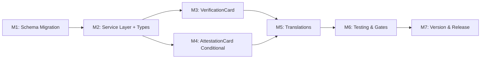

# Plan 135 — Verification UX Rethink: Visual Scale + Checklist + Conditional Declarations

| Field          | Value                                                                        |
| -------------- | ---------------------------------------------------------------------------- |
| Plan ID        | 135                                                                          |
| Target Release | Bundled with Plans 133+134 on session/133-halal-proof-rework branch (0.13.x) |
| Epic Alignment | Provider Detail UX — Trust & Transparency                                    |
| Related Issues | Plan 133 (halal proof tier), Plan 134 (visual hierarchy)                     |
| Classification | Feature                                                                      |
| Pipeline       | Full                                                                         |
| GitHub Issue   | https://github.com/abu-lina/uflow/issues/238                                 |
| Created        | 2026-06-01T15:00Z                                                            |

## Changelog

| Date              | Author      | Change                                                                                                                                                         |
| ----------------- | ----------- | -------------------------------------------------------------------------------------------------------------------------------------------------------------- |
| 2026-06-01T15:00Z | planner     | Plan created                                                                                                                                                   |
| 2026-06-01T16:10Z | planner     | Revised per critique: expanded Schema Mutation Inventory (F-1), added import script to M1 (F-2), documented computeHalalStars fate in M2 + Handoff Notes (F-3) |
| 2026-06-01T16:20Z | implementer | Execution started (M1 schema + TDD-first workflow)                                                                                                             |

---

## Value Statement and Business Objective

**As a** Muslim community user viewing a food/store listing on Ummah Flow,
**I want to** see a clear visual scale showing verification depth, a checklist of WHAT was verified (not just HOW), and provider declarations only when they've actually made them,
**so that** I can instantly gauge trustworthiness at a glance and understand what concrete evidence backs the listing — without noisy empty placeholders.

---

## Release Strategy

Bundled with: Plans 133, 134 on `session/133-halal-proof-rework` branch. This plan extends the schema and UI already introduced by Plan 133. Sequencing: Plan 135 builds on top of Plan 133's `proof_tier` column and Plan 134's visual hierarchy. Ships as part of the same branch merge to main.

---

## Decision Record

| #   | Decision                                                                                                                                                                     | Status                                                                                                                                                               |
| --- | ---------------------------------------------------------------------------------------------------------------------------------------------------------------------------- | -------------------------------------------------------------------------------------------------------------------------------------------------------------------- |
| D1  | Replace single `proof_tier` SMALLINT(1-3) with two-column model: `verification_method TEXT CHECK('online','onsite')` + `has_certificate BOOLEAN DEFAULT false`               | [RESOLVED] — Two dimensions are orthogonal; encoding them in a single integer created a confusing tier-number mental model that doesn't communicate WHAT to users    |
| D2  | Map existing data: tier 1 → online/no-cert, tier 2 → onsite/no-cert, tier 3 → online+cert (conservative default); allow tier 3 to also mean onsite+cert via admin edit later | [RESOLVED] — Tier 3 was defined as "Certificate Provided" which doesn't specify method; defaulting to online+cert is safest; admin can correct                       |
| D3  | ProofTierCard redesigned as "VerificationCard" with: (a) visual shield progress indicator showing position on 4-level scale, (b) checklist of WHAT was verified              | [RESOLVED] — Addresses user's critique #1 (no visual scale) and #3 (user doesn't know WHAT was checked)                                                              |
| D4  | AttestationCard: hide entirely when `!hasAnyDeclared` instead of showing greyed-out fallback rows                                                                            | [RESOLVED] — User's critique #2; empty attestation is visual noise that dilutes trust signal. This supersedes Plan 134's decision to keep attestation always-visible |
| D5  | The 4 verification levels are: (1) Online Check, (2) Online Check + Certificate, (3) On-site Check, (4) On-site Check + Certificate — displayed as progressive scale         | [RESOLVED] — Onsite > Online; Certificate is an upgrade within each method. Mirrors user's 6 Ausprägungen collapsed to 4 (declarations are orthogonal)               |
| D6  | "What we verified" checklist items are derived from verification_method + has_certificate + declarations, NOT stored separately                                              | [RESOLVED] — Avoids schema bloat; derivation logic lives in the component                                                                                            |

---

## Assumptions

1. The branch already has `proof_tier SMALLINT CHECK(1-3)` on `food_providers` and `store_providers` (Plan 133)
2. The `JoinHalal` RPC upserts proof_tier — will need updating for new columns
3. No other consumers of `proof_tier` exist outside this branch's code
4. `no_alcohol`/`no_pork`/`no_gambling` columns remain unchanged (declarations are orthogonal to verification method)
5. The import CSV has no `verification_method` or `has_certificate` column — default derivation from old proof_tier values is sufficient

---

## Schema Mutation Inventory

### Column Drop: `proof_tier`

### Column Add: `verification_method`, `has_certificate`

**Write inventory** (locations that write/filter proof_tier):

| File                                                      | Line                  | Description                                  |
| --------------------------------------------------------- | --------------------- | -------------------------------------------- |
| `supabase/migrations/090_plan_133_proof_tier_rpc_fix.sql` | 6,9,15,21,107,110,119 | Migration + RPC upsert                       |
| `src/services/providers.ts`                               | 398                   | `.select('proof_tier, no_alcohol, no_pork')` |
| `scripts/import-joinhalal.ts`                             | 416, 1387             | Default value assignment + RPC payload field |
| `src/components/providers/SearchResultsList.tsx`          | 123                   | Passes `proof_tier` to provider object       |

**Read inventory** (locations that read proof_tier):

| File                                                           | Line   | Description                         |
| -------------------------------------------------------------- | ------ | ----------------------------------- |
| `src/services/providers.ts`                                    | 62     | Type: `proof_tier?: number \| null` |
| `src/features/providers/components/ProofTierCard.tsx`          | 9,51   | Props + TIER_CONFIG lookup          |
| `src/features/providers/components/ProviderDetailSections.tsx` | 178    | `provider.proof_tier` pass-through  |
| `scripts/import-joinhalal.ts`                                  | 131    | Type definition                     |
| `src/utils/sectionBadges.ts`                                   | 9, 28  | `computeHalalStars()` type + lookup |
| `src/components/providers/ProviderCard.tsx`                    | 23     | Imports `computeHalalStars`         |
| `src/app/(debug)/provider-detail-preview/page.tsx`             | 41, 76 | Hardcoded proof_tier values         |
| `src/app/(debug)/provider-card-example/page.tsx`               | 31     | Hardcoded proof_tier value          |
| `src/app/(debug)/proof-tier-example/page.tsx`                  | 2, 41  | Import + usage of ProofTierCard     |

**Test files** (will fail at compile after column drop):

| File                                                               | Lines   | Description                   |
| ------------------------------------------------------------------ | ------- | ----------------------------- |
| `src/__tests__/utils/sectionBadges.test.ts`                        | 5,17-33 | Tests for `computeHalalStars` |
| `src/__tests__/features/providers/ProviderDetailSections.test.tsx` | 249     | Mock provider with proof_tier |

**Verification commands** (implementer must run before starting M1):

```bash
grep -rn "proof_tier" src/ supabase/ scripts/
grep -rn "computeHalalStars\|ProofTierCard" src/
```

---

## Milestones

### M1 — Schema Migration

**Objective**: Replace `proof_tier` with `verification_method` + `has_certificate` on both extension tables; migrate existing data.

**Tasks**:

- Create new migration file (next sequence number after 090)
- Add `verification_method TEXT CHECK (verification_method IN ('online', 'onsite')) DEFAULT 'online'` to `food_providers` and `store_providers`
- Add `has_certificate BOOLEAN DEFAULT false` to both tables
- Data migration: `UPDATE food_providers SET verification_method = CASE WHEN proof_tier = 2 THEN 'onsite' ELSE 'online' END, has_certificate = (proof_tier = 3)`
- Same for `store_providers`
- Drop `proof_tier` column from both tables (with constraint cleanup)
- Update `JoinHalal` RPC to accept/upsert new columns instead of proof_tier
- Update `scripts/import-joinhalal.ts`: replace `proof_tier` type (line 131), default value (line 416), and RPC payload field (line 1387) with `verification_method` + `has_certificate`
- Verify import script compiles independently: `npx tsx --check scripts/import-joinhalal.ts`
- Add CHECK constraints and column comments

**Acceptance**:

- `proof_tier` column no longer exists on either table
- `verification_method` and `has_certificate` exist with correct constraints
- Existing data is correctly migrated (online check = method 'online', onsite = 'onsite', certificate = has_certificate true)
- RPC signature updated and functional

---

### M2 — Service Layer + Types

**Objective**: Update TypeScript types and Supabase queries to use new columns.

**Tasks**:

- Update `Provider` type in `src/services/providers.ts`: remove `proof_tier`, add `verification_method?: 'online' | 'onsite' | null` and `has_certificate?: boolean`
- Update `.select()` calls to fetch new columns
- Update `src/components/providers/SearchResultsList.tsx` (line 123): replace `proof_tier` with new columns
- Update or remove `src/utils/sectionBadges.ts` → `computeHalalStars()`: remap to derive a 0-4 level from `verification_method` + `has_certificate` (rename to `computeVerificationLevel` if keeping, or remove if card-level stars are replaced by a different indicator)
- Update `src/components/providers/ProviderCard.tsx` to use the new utility or remove star display
- Update `src/app/(debug)/` preview pages (3 files) to use new columns
- Update any other service files referencing proof_tier

**Acceptance**:

- `npm run type-check` passes with zero errors
- No references to `proof_tier` remain in `src/` or `scripts/`

---

### M3 — VerificationCard (ProofTierCard replacement)

**Objective**: Replace ProofTierCard with a new VerificationCard that shows (a) visual progress scale and (b) "What we verified" checklist.

**Tasks**:

- Rename/replace `ProofTierCard.tsx` → new component (or refactor in-place)
- Visual progress scale: 4 shield icons in a row, filled/active up to current level, greyed beyond. Levels: Online → Online+Cert → Onsite → Onsite+Cert
- Below scale: "What we verified" checklist showing derived items:
  - ✓ Menu reviewed online (always, when verification_method exists)
  - ✓ Halal certificate on file (when has_certificate = true)
  - ✓ On-site visit completed (when verification_method = 'onsite')
  - ✓ Owner confirmed halal practices (when verification_method = 'onsite')
- Expandable "How do we check?" remains
- Update parent `ProviderDetailSections.tsx` to pass new props

**Acceptance**:

- Visual scale correctly highlights 1-4 based on method + certificate
- Checklist items conditionally render based on actual data
- Component renders gracefully for NULL/undefined (defaults to level 1: online, no cert)

---

### M4 — AttestationCard Conditional Rendering

**Objective**: Hide AttestationCard entirely when provider has no active declarations.

**Tasks**:

- In `AttestationCard.tsx`: return `null` early when `!hasAnyDeclared` (remove the fallback subtitle/grey-row rendering)
- Clean up any "not declared" translation keys that become dead code
- Ensure parent layout (`ProviderDetailSections`) handles the gap correctly when attestation is absent

**Acceptance**:

- When `noAlcohol=false, noPork=false, noGambling=false` → nothing renders
- When any declaration is true → full attestation card renders as before
- No layout shift or spacing issues in the "Halal Check" section

---

### M5 — Translations

**Objective**: Add/update translation keys for the new verification model.

**Tasks**:

- Remove old tier1/2/3 title/detail keys
- Add new keys for:
  - Verification levels (scale labels)
  - "What we verified" checklist item texts
  - Updated section descriptions
- Update both `en.ts` and `de.ts` (and any other active locales)

**Acceptance**:

- No orphaned translation keys referencing old tier model
- All new UI strings have both EN and DE translations
- `npm run type-check` passes (translation key type safety)

---

### M6 — Testing & Gate Verification

**Objective**: Full regression suite passes; new component behaviour covered.

**Tasks**:

- Update existing ProofTierCard tests for new VerificationCard
- Add tests for: each of the 4 verification levels renders correctly, checklist items appear/hide based on data, AttestationCard hides when no declarations
- Run full gate: `npm test`, `npm run type-check`, `npm run lint`, `npm run build`

**Acceptance**:

- All tests pass (0 failures)
- Type-check clean
- Lint clean (warnings acceptable)
- Build succeeds

---

### M7 — Version & Release Artifacts

**Objective**: Update version to reflect this plan's delivery alongside 133+134.

**Tasks**:

- Bump version in `package.json` if not already at target
- Update CHANGELOG.md with Plan 135 deliverables
- Update system architecture changelog if schema change warrants it

**Acceptance**:

- CHANGELOG documents the verification model change
- Version consistent across package.json and package-lock.json

---

## Milestone Dependencies



Sequencing rule: M1 (schema) must complete before service layer changes; M3 and M4 can proceed in parallel after M2; translations follow UI work; gates and version are final.

---

## Testing Strategy

- **Unit tests**: VerificationCard renders correct level for each of 4 combinations; AttestationCard returns null when no declarations; checklist items match data
- **Integration**: ProviderDetailSections passes correct props through to child components
- **Regression**: Existing provider detail rendering not broken for listings with NULL verification data
- **Type safety**: TypeScript strict mode ensures no stale proof_tier references compile

---

## Risks

| Risk                                                | Severity | Mitigation                                                                      |
| --------------------------------------------------- | -------- | ------------------------------------------------------------------------------- |
| Data loss during proof_tier → new columns migration | HIGH     | Migration uses UPDATE-before-DROP; test with local DB copy first                |
| JoinHalal RPC callers may pass old proof_tier param | MEDIUM   | RPC migration removes old param; TypeScript types catch callers at compile time |
| Visual regression in verification section           | LOW      | TDD approach; existing tests updated before component changes                   |
| Fallback for NULL verification_method on old data   | LOW      | DEFAULT 'online' on column + component handles null gracefully                  |

---

## Duration Estimates

| Phase          | Estimate                                    | Uncertainty                               |
| -------------- | ------------------------------------------- | ----------------------------------------- |
| Analysis       | N/A (context from Plans 133/134 sufficient) | —                                         |
| Planning       | 30min                                       | Done                                      |
| Implementation | 3–5 hours                                   | Medium — schema migration + new component |
| QA             | 1–2 hours                                   | Low — well-scoped                         |
| UAT            | 30min                                       | Low — visual check on DEV server          |
| DevOps         | 30min                                       | Low — same branch, no infra changes       |

**Key uncertainty**: The VerificationCard visual design (progress scale) may need iteration with the user on DEV preview.

---

## Validation & Rollback

- **Validation**: DEV server preview after each milestone; full gate suite at M6
- **Rollback**: Migration includes data preservation (new columns populated before old column dropped); if needed, reverse migration can re-add proof_tier from verification_method + has_certificate

---

## Handoff Notes

- This plan supersedes the "always-visible attestation" decision from Plan 134 (D4 above)
- The 4-level visual scale is a UX concept — implementer has creative freedom on exact icon/colour treatment
- Implementer should run the schema mutation verification commands and confirm inventory before starting M1
- **`computeHalalStars` fate**: This utility currently maps `proof_tier` (1-3) to star counts for ProviderCard badges. With the new model, it should be refactored to `computeVerificationLevel` returning 1-4 from `verification_method` + `has_certificate`, OR removed if the card-level indicator is redesigned. Implementer decides based on what makes sense for the card UI — the detail page VerificationCard is the primary surface; card badges are secondary
- **Import script**: `scripts/import-joinhalal.ts` must be updated in M1 alongside the RPC. Verify independently with `npx tsx --check scripts/import-joinhalal.ts` since it may not be covered by `npm run type-check`
