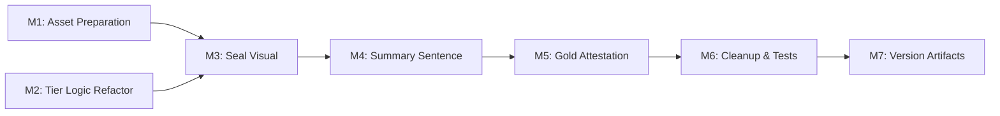

# Plan 138 — Wax Seal Trust Tiers (Bronze / Silver / Gold)

| Field          | Value                                                                                                                                                   |
| -------------- | ------------------------------------------------------------------------------------------------------------------------------------------------------- |
| Plan ID        | 138                                                                                                                                                     |
| Target Release | Bundled with Plans 133–137 on session/133-halal-proof-rework branch; next available minor after current origin/main v0.12.17; confirm at DevOps Stage 1 |
| Epic Alignment | Halal Proof Tier Rework (Session 133)                                                                                                                   |
| Related Issues | None                                                                                                                                                    |
| Classification | Feature                                                                                                                                                 |
| Pipeline       | Abbreviated                                                                                                                                             |
| GitHub Issue   | https://github.com/abu-lina/uflow/issues/241                                                                                                            |
| Created        | 2026-06-01T22:00Z                                                                                                                                       |

## Release Strategy

Bundled with: Plans 133, 134, 135, 136, 137 — all on `session/133-halal-proof-rework` branch. This plan supersedes Plans 136 (arc gauge) and 137 (dimension matrix) visuals with a new wax seal metaphor. No sequencing dependency beyond existing DB migration (Plan 135).

## Value Statement and Business Objective

**As a** Muslim user browsing provider listings, **I want to** see a clear, culturally resonant visual (bronze / silver / gold wax seal) that instantly communicates the verification trust level, **so that** I can quickly assess provider credibility without reading detailed text.

## Decision Record

1. **[RESOLVED] 3-tier model over 4-level**: Collapse the 2×2 matrix into 3 tiers — certificate is the primary trust differentiator, not verification method. Rationale: Simpler, matches real-world user mental model ("do they have a certificate?").

2. **[RESOLVED] Tier mapping**:
   - **Bronze**: `hasCertificate = false` AND `verificationMethod = 'online'`
   - **Silver**: `hasCertificate = false` AND `verificationMethod = 'onsite'`
   - **Gold**: `hasCertificate = true` (regardless of verification method)
     Rationale: Certificate is the strongest trust signal; online vs onsite is secondary.

3. **[RESOLVED] Wax seal visual using static images**: Use 3 pre-designed PNG/WebP images (bronze, silver, gold seal with حلال calligraphy) provided by the product owner. Not SVG-generated. Rationale: The seal design has rich texture (wax, foil, embossing) that requires authored artwork, not procedural rendering.

4. **[RESOLVED] Show all 3 seals inline, active one highlighted**: Display all 3 seals in a row; the active tier's seal is full-color and larger/elevated; inactive seals are faded/desaturated. Rationale: Shows the scale at a glance without needing a separate label.

5. **[RESOLVED] Summary sentence replaces dimension rows + arc**: A single sentence below the seals (e.g., "Der Anbieter wurde **vor Ort** geprüft und hat ein **Halal Zertifikat** nachgewiesen.") replaces both the arc gauge and the dimension chip rows. Rationale: Solves triple-redundancy feedback from UAT.

6. **[RESOLVED] Gold tier integrates attestation inline**: For gold providers that also have attestation declarations (no_alcohol, no_pork, no_gambling), the attestation content ("Der Inhaber bezeugt bei Allah...") renders inside the ProofTierCard below the checklist — not as a separate AttestationCard. Rationale: User feedback requested removing the separate testification section.

7. **[RESOLVED] AttestationCard removed from ProviderDetailSections**: The standalone `<AttestationCard>` render call in `ProviderDetailSections.tsx` was already removed in a prior iteration. This plan formalizes that the attestation content is absorbed into the gold tier of ProofTierCard.

8. **[RESOLVED] No schema changes**: The existing `verification_method` + `has_certificate` columns (Plan 135) fully support the 3-tier derivation. No migration needed.

9. **[RESOLVED] Bold formatting via split-and-wrap pattern**: Summary sentences use the "split around token" approach (split translated string on a known marker, wrap the segment in `<strong>`). This reuses the proven pattern from `AttestationCard`'s "Allah" gold-gradient split. Rationale: Avoids embedding raw HTML in translation strings (fragile for translators); token boundaries are stable across locales including RTL Arabic.

## Assumptions

1. Product owner will provide 3 seal image files (bronze, silver, gold) before implementation begins.
2. Images will be in PNG or WebP format, suitable for retina displays (2x resolution recommended).
3. The existing `computeVerificationLevel` 4-level function will be replaced with a 3-tier function.
4. Translation keys will be updated/added for the summary sentences and tier labels.
5. The "What we verified" checklist and "How do we check?" expandable section are retained.

## Plan

### Milestone 1: Asset Preparation

**Objective**: Obtain and place seal images in the project.

**Tasks**:

1. Product owner provides 3 wax seal images (bronze, silver, gold) — each with حلال calligraphy
2. Place images in `public/images/seals/` as `seal-bronze.webp`, `seal-silver.webp`, `seal-gold.webp`
3. Verify images render at appropriate sizes (approximately 80–100px diameter on mobile)

**Image requirements for the product owner**:

- 3 files: bronze seal, silver seal, gold seal
- Format: WebP preferred (with PNG fallback if needed)
- Size: At least 200×200px for retina clarity
- Background: transparent
- Content: Wax seal texture with حلال calligraphy centered
- Visual style: As per the Figma drafts (bronze = warm copper, silver = metallic gray, gold = warm gold)

**Acceptance**: All 3 images placed in `public/images/seals/`, loading correctly in `` tags.

---

### Milestone 2: Tier Logic Refactor

**Objective**: Replace 4-level `computeVerificationLevel` with 3-tier `computeSealTier`.

**Tasks**:

1. Replace `computeVerificationLevel` with a new function returning `'bronze' | 'silver' | 'gold'`
2. Update `ProofTierCardProps` — no interface change needed (same `verificationMethod` + `hasCertificate` inputs)
3. Remove `VerificationArc` sub-component entirely (arc gauge no longer used)
4. Remove arc-related imports and types (`VerificationArcProps`, level-related code)
5. Update existing tests to use 3-tier assertions instead of 4-level

**Acceptance**: `computeSealTier` returns correct tier for all input combinations. No references to arc gauge remain.

---

### Milestone 3: Seal Visual Implementation

**Objective**: Render the 3-seal row with active tier highlighted.

**Tasks**:

1. Create a `SealRow` sub-component (private, inline in ProofTierCard.tsx) that renders 3 `<Image>` (or ``) elements side by side
2. Active seal: full opacity, slightly larger (scale or size class)
3. Inactive seals: reduced opacity (~40%), grayscale filter, slightly smaller
4. Use Next.js `<Image>` component with `priority={false}`, appropriate `width`/`height`, and meaningful `alt` text per tier — alt text must convey the trust-level meaning (e.g., "Online verified" / "On-site verified" / "Certificate verified"), not just the visual description ("bronze seal"). Add translation keys `proofTier.sealAltBronze`, `sealAltSilver`, `sealAltGold`
5. Ensure RTL layout mirrors correctly (bronze left in LTR, right in RTL)
6. Add `onError` fallback: if a seal image fails to load, render a colored circle with the tier initial (B/S/G) so the tier is still communicated visually

**Acceptance**: 3 seals render in a row. Active tier visually distinct. Responsive on 320px–1920px. RTL verified. Broken image fallback renders gracefully.

---

### Milestone 4: Summary Sentence

**Objective**: Replace dimension rows with a human-readable summary sentence below the seals.

**Tasks**:

1. Add new translation keys for summary sentences per tier across all 6 locales (en, de, ar, tr, ur, ps):
   - `proofTier.summaryBronze`: "This provider was checked **online**."
   - `proofTier.summarySilver`: "This provider was checked **on-site**."
   - `proofTier.summaryGoldCert`: "This provider was checked **on-site** and has provided a **Halal certificate**."
   - `proofTier.summaryGoldCertOnly`: "This provider was checked **online** and has provided a **Halal certificate**."
2. Render the appropriate summary sentence below the seal row
3. Bold the key verification details using the split-and-wrap pattern (Decision 9): translation strings contain a known marker token; the component splits on that token and wraps the segment in `<strong>`. Reuse the same approach as `AttestationCard`'s "Allah" gradient split
4. Remove the dimension rows (Check method / Certificate chip boxes)
5. Remove unused translation keys from the old dimension/level labels

**Acceptance**: Summary sentence renders correctly for all tier × method combinations. Bold formatting applied. Old dimension rows removed.

---

### Milestone 5: Gold Tier Attestation Integration

**Objective**: For gold-tier providers with attestation declarations, render the attestation content inline within ProofTierCard.

**Tasks**:

1. Accept additional props on `ProofTierCard`: `noAlcohol`, `noPork`, `noGambling`, `listingType`
2. For gold tier only, if any declaration is true, render the attestation section (subtitle + commitment items) below the "What we verified" checklist
3. Reuse the attestation rendering logic from `AttestationCard` (the "Allah" gold-gradient split, RowItem list) — either inline or extract a shared sub-component
4. Ensure the standalone `AttestationCard` is no longer rendered anywhere (already removed from `ProviderDetailSections.tsx`)
5. Pass the additional props from `ProviderDetailSections.tsx` to `ProofTierCard`

**Acceptance**: Gold-tier providers with declarations show attestation inline. Non-gold tiers never show attestation. Providers without any declarations show no attestation section even at gold tier.

---

### Milestone 6: Cleanup and Tests

**Objective**: Remove dead code, update all tests, close superseded plans.

**Tasks**:

1. Remove or deprecate `VerificationArc` component code
2. Remove unused translation keys (old level labels, dimension labels, status chips)
3. Update `ProofTierCard.test.tsx` — test all 3 tiers, RTL, attestation integration
4. Update `ProviderDetailSections.test.tsx` if it references old attestation rendering
5. Verify `AttestationCard` is still exported (other consumers may exist) but no longer rendered in the Halal Check section
6. Update Plans 136 and 137: set Status to "Superseded by Plan 138" and move documents to `agent-output/planning/closed/`
7. Implementer may rename `ProofTierCard` → `HalalCheckCard` if it improves clarity after the attestation merge (discretionary)

**Acceptance**: No dead code. All tests pass. No unused translation keys for removed features. Plans 136 and 137 closed as superseded.

---

### Milestone 7: Version and Release Artifacts

**Objective**: Update version artifacts to match release target.

**Tasks**:

1. Update CHANGELOG.md with Plan 138 entry under the unreleased section
2. Confirm version in `package.json` matches release target (coordinated with DevOps Stage 1)

**Acceptance**: CHANGELOG reflects wax seal changes. Version consistent.

## Milestone Dependencies



M1 (assets) and M2 (logic) can proceed in parallel. M3 requires both. Remaining milestones are sequential.

## Image Delivery Instructions

**Product owner**: Place your 3 seal images in:

```
public/images/seals/
├── seal-bronze.webp   (or .png)
├── seal-silver.webp   (or .png)
└── seal-gold.webp     (or .png)
```

Requirements:

- **Minimum size**: 200×200px (for retina/2x)
- **Background**: Transparent
- **Format**: WebP preferred, PNG acceptable
- **Naming**: Exactly as above

If you'd prefer to provide the images via a different channel (Figma export, Slack, etc.), the implementer will place them in this directory.

## Testing Strategy

- **Unit tests**: Tier derivation function for all input combinations (3 tiers × method permutations)
- **Component tests**: Seal row rendering, active/inactive states, summary sentence content, attestation integration for gold tier, RTL layout
- **Visual regression**: Manual verification on mobile viewport (320px, 375px, 414px)
- **No e2e tests**: This is a visual/UI change with no new API surface

## Risks

| Risk                      | Likelihood | Impact       | Mitigation                                                                            |
| ------------------------- | ---------- | ------------ | ------------------------------------------------------------------------------------- |
| Image assets delayed      | Medium     | Blocks M1→M3 | M2 (logic refactor) can proceed independently; use placeholder images for development |
| Image file size too large | Low        | Performance  | Compress to <50KB each; use WebP; lazy load inactive seals                            |
| RTL seal order confusion  | Low        | UX           | Explicit test for RTL mirror behavior                                                 |

## Duration Estimates

| Phase                  | Estimate  | Notes                                      |
| ---------------------- | --------- | ------------------------------------------ |
| Asset preparation      | 0.5–1 day | Depends on product owner providing images  |
| Implementation (M2–M5) | 1–2 days  | Straightforward component refactor         |
| Cleanup & tests (M6)   | 0.5 day   | Mostly removing dead code, updating tests  |
| Total                  | 2–3 days  | Primary uncertainty: image delivery timing |

## Critique Findings Resolution

| Finding                                       | Severity | Resolution                                                                                    |
| --------------------------------------------- | -------- | --------------------------------------------------------------------------------------------- |
| F1: Plans 136+137 supersession not formalized | LOW      | Added M6 task 6 — close both as "Superseded by Plan 138"                                      |
| F2: Bold formatting in translation strings    | MEDIUM   | Added Decision 9 — split-and-wrap pattern (reuse AttestationCard approach); updated M4 task 3 |
| F3: ProofTierCard responsibility widening     | LOW      | Added M6 task 7 — optional rename to HalalCheckCard at implementer discretion                 |
| F4: Seal image alt text                       | LOW      | Updated M3 task 4 — alt text must convey tier meaning, not visual description                 |
| F5: Image load fallback                       | LOW      | Added M3 task 6 — onError fallback renders colored circle with tier initial                   |

## Changelog

| Date              | Agent   | Action                              |
| ----------------- | ------- | ----------------------------------- |
| 2026-06-01T22:00Z | Planner | Plan created                        |
| 2026-06-01T22:30Z | Planner | Revised per critique findings F1–F5 |
| ------            | ------- | --------                            |
| 2026-06-01T22:00Z | Planner | Plan created                        |
