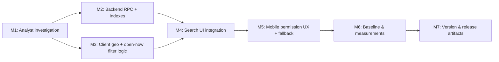

# Plan 196 — "Near Me + Open Now" Restaurant Search (Mobile-First)

| Field          | Value                                                                                        |
| -------------- | -------------------------------------------------------------------------------------------- |
| Plan ID        | 196                                                                                          |
| Target Release | next available minor after current origin/main version (`0.14.0`); confirm at DevOps Stage 1 |
| Epic Alignment | Discovery & Search — help users find relevant food providers quickly                         |
| Related Issues | https://github.com/abu-lina/uflow/issues/282                                                 |
| Classification | Feature                                                                                      |
| Pipeline       | Full (13 phases)                                                                             |
| GitHub Issue   | https://github.com/abu-lina/uflow/issues/282                                                 |
| Created        | 2026-07-21T00:00Z                                                                            |

---

## Value Statement and Business Objective

**As a** mobile user out in the evening looking for somewhere to eat,
**I want to** search for restaurants that are **near my current location** and **open right now**,
**so that** I can quickly decide where to go without manually checking each listing's address and opening hours.

**Business objective:** Increase discovery success and engagement for food providers by turning the existing `/search` experience into a location-aware, "open now"-aware flow. This directly improves the core UFlow value of connecting users with relevant nearby services at the moment of need.

---

## Context Snapshot (what already exists)

This is an **enhancement**, not a greenfield build. The following primitives are already in the codebase and MUST be reused (do not duplicate):

| Capability              | Location                                                                                                                                                      | Notes                                                                                  |
| ----------------------- | ------------------------------------------------------------------------------------------------------------------------------------------------------------- | -------------------------------------------------------------------------------------- |
| Provider coordinates    | `providers.location_latitude`, `providers.location_longitude` (`numeric`)                                                                                     | Baseline schema + multi-location table (`101_plan_151_multi_location.sql`)             |
| Opening hours data      | `providers.opening_hours` JSONB (`078_provider_opening_hours.sql`) + per-location hours                                                                       | Structured by weekday windows                                                          |
| Open-now computation    | [`src/utils/openStatus.ts`](../../src/utils/openStatus.ts) (`getOpenStatus`) + [`OpenStatusLine`](../../src/features/providers/components/OpenStatusLine.tsx) | Client-side, already renders open/closed + next-change                                 |
| Haversine proximity RPC | `public.find_nearby_food_providers` (`093_plan_141_nearby_food_haversine.sql`)                                                                                | Scoped to **related** nearby food (excludes a provider, food-only, no open-now filter) |
| Public search surface   | [`src/app/(public)/search/page.tsx`](<../../src/app/(public)/search/page.tsx>)                                                                                | Restaurant search exists; **no** geolocation / distance / open-now today               |

**Gap being closed:** a user-facing "search near me for open restaurants" flow on the public search page — geolocation-driven radius search, an "open now" filter, distance-aware ordering, and mobile permission handling with graceful fallback.

---

## Decision Record

1. **[RESOLVED]** Target users / geo focus: existing UFlow food providers with coordinates; mobile-first (primary reported context is evening mobile use). Desktop remains supported but is not the design driver.
2. **[RESOLVED]** North-star metric for this plan: successful "near me" searches that surface ≥1 open result. Rationale: directly reflects the user pain being solved.
3. **[RESOLVED]** Postgres-first: reuse existing haversine approach and `opening_hours` JSONB; no PostGIS unless Analyst proves the haversine + partial index approach cannot meet the latency budget at current scale. Rationale: matches project convention ("Start with Postgres") and existing `find_nearby_food_providers`.
4. **[RESOLVED]** Entity ownership scope: search returns **approved** food providers regardless of claimed/unclaimed status (`review_status = 'approved'`). This is a **read-only** discovery surface — no provider rows are written. Ownership (`provider_owner_id`) does not gate visibility.
5. **[RESOLVED]** Open-now source of truth: reuse the existing `getOpenStatus` logic so open/closed rendering is consistent across the app. **REQUIRES ANALYSIS** confirms whether open-now filtering happens client-side over a radius-limited set (recommended default, KISS/YAGNI) or is pushed into SQL for scale.
6. **[DEFERRED: Product owner — analytics instrumentation of search funnel — target a future analytics plan]** Detailed event tracking (impressions, permission grant rate) beyond the north-star signal is out of scope for this release.
7. **[RESOLVED]** No new external services (no Redis / geocoding provider / maps SDK) in this plan. Location comes from the browser Geolocation API; fallback is manual city/area text using the existing search inputs.

No `[OPEN]` decisions remain.

---

## Assumptions & Open Questions

**Assumptions:**

- Enough approved food providers have populated `location_latitude`/`location_longitude` and `opening_hours` for the feature to be useful. Data coverage is verified in the Baseline milestone.
- The browser Geolocation API is acceptable for obtaining user coordinates on mobile (HTTPS is already in place for the deployed app).
- The existing `/search` page is the correct home for this capability (rather than a brand-new route).

**Open questions (to be resolved by Analyst before implementation):**

- **OPEN QUESTION [RESOLVED via Analyst gate]**: Should open-now filtering execute in SQL or client-side? Recommended default: client-side over the radius-limited candidate set. Analyst confirms based on candidate-set size.
- **OPEN QUESTION [RESOLVED via Analyst gate]**: Does the user-facing search need a **new** RPC (e.g., `search_food_near_me` with `p_lat`, `p_lon`, `p_radius_km`, optional text/category, no `p_exclude_id`) or can `find_nearby_food_providers` be safely generalized without breaking its current detail-page caller? Recommended default: add a new RPC to avoid regressing the existing caller.
- **OPEN QUESTION [RESOLVED via Analyst gate]**: Multi-location providers — does distance use the nearest location's coordinates or the provider-level coordinates? Analyst confirms against `101_plan_151_multi_location.sql`.

**REQUIRES ANALYSIS (scope-limited for Analyst — do not expand beyond these):**

1. Data coverage: % of approved food providers with usable coordinates + opening hours.
2. RPC strategy: new vs. generalized function; exact signature and index needs.
3. Open-now placement: SQL vs client-side, with a recommendation and rationale.
4. Multi-location distance semantics.

---

## Release Strategy

**Standalone** (no other known non-closed plan targets the same version). If the Roadmap/DevOps confirms bundling with another `0.15.x`-targeted plan at DevOps Stage 1, update this section and the changelog. Multiple unrelated `*-open-actions.md` docs exist in planning but are not release-bundled with this feature.

---

## Milestone Dependencies

**Sequencing rule:** Backend (M2) and the client-side open-now/geo logic (M3) can proceed in parallel once the Analyst gate (M1) resolves the RPC strategy and open-now placement. UI integration (M4) begins only after both M2 and M3 are complete.

---

## Plan (Milestones)

### M1 — Analyst Investigation (gate before implementation)

**Objective:** Convert the four REQUIRES ANALYSIS items into resolved decisions.
**Tasks:**

1. Measure data coverage (coordinates + opening hours) for approved food providers.
2. Recommend RPC strategy (new `search_food_near_me` vs. generalize existing) with exact signature and index plan.
3. Recommend open-now placement (SQL vs client-side) with rationale.
4. Confirm multi-location distance semantics.
   **Acceptance criteria:** Analysis doc (ID 196) records a clear recommendation for each item; no REQUIRES ANALYSIS item remains unresolved; findings feed M2/M3 without further ambiguity.

### M2 — Backend: proximity search RPC + indexes

**Objective:** Provide a Postgres function that returns approved food providers within a radius of a point, distance-sorted, without regressing the existing detail-page nearby feature.
**Tasks:**

1. Add an additive migration in `supabase/migrations/` implementing the RPC chosen in M1 (default: a new `search_food_near_me`). Reuse the clamped-haversine pattern from `093_plan_141_nearby_food_haversine.sql`.
2. Filter to `review_status = 'approved'`, non-null coordinates, and (if M1 chooses SQL open-now) apply open-now logic consistent with `getOpenStatus`.
3. Add/confirm a supporting partial index for the radius query; grant EXECUTE to `anon`, `authenticated`, `service_role` matching existing convention.
4. Preserve `find_nearby_food_providers` unchanged unless M1 explicitly approves generalization.
   **Acceptance criteria:** RPC returns correct distance-ordered results within radius; existing detail-page nearby behavior is unchanged; migration is additive (no destructive `DROP`/`RENAME` of existing columns/enums); EXPLAIN confirms index usage on the radius filter.
   **Critic conditions (Critique 196):**

- Query surface is the `locations` table with nearest-location-per-provider semantics (Analysis #4); add a **partial index on `locations`** for the approved-food + non-null-coords predicate and confirm usage via `EXPLAIN` (F3).
- `p_radius_km` is **clamped to a documented server-side maximum** and the RPC always applies a **hard server-side `LIMIT`** (server-authoritative candidate cap, not client-trusted) (F1).
- Coordinate inputs are range-validated server-side (`p_lat ∈ [-90,90]`, `p_lon ∈ [-180,180]`); out-of-range returns empty (F2).

> **Schema mutation note:** This milestone is **additive** (new function + new index). No enum rename, column drop, or table rename is planned. If M1's generalization option is chosen instead, the Implementer MUST run the write/read inventory grep for every caller of `find_nearby_food_providers` before altering its signature.

### M3 — Client: geolocation acquisition + open-now filter logic

**Objective:** Obtain the user's coordinates and expose an "open now" filter that reuses existing open-status logic.
**Tasks:**

1. Add a small, testable client utility/hook to request device location via the Geolocation API, exposing states: idle, prompting, granted (coords), denied, unavailable, timeout.
2. Reuse `getOpenStatus` (`src/utils/openStatus.ts`) to determine open-now for candidate results; do not fork the logic.
3. Encapsulate distance formatting/labels using existing i18n keys where present (e.g., the `nearby` translations already in `src/translations/*`).
   **Acceptance criteria:** Location hook returns each documented state deterministically; open-now determination matches `OpenStatusLine` output for the same data; no duplication of open-status logic.

### M4 — Search UI integration

**Objective:** Wire "near me" and "open now" into the public search page.
**Design decision (owner-approved):** "Near me" and "Open now" are placed as a **quick-filter chip row** below the sticky `SectionSelector` tabs and above the accordion body — NOT inside any existing accordion. They are always visible without expanding. Uses `Button` variant `secondary` (inactive) / `primary` (active) size `sm`. "Near me" opens the geolocation flow and shows radius pills inline; "Open now" is a simple on/off toggle. The existing Filter accordion retains values & amenities only. See [prototype](../../docs/design/196-near-me-open-now-prototype.html).
**Tasks:**

1. Add a sticky quick-filter chip row below `SectionSelector` containing "📍 In der Nähe" and "🟢 Jetzt geöffnet" toggle chips in [`src/app/(public)/search/page.tsx`](<../../src/app/(public)/search/page.tsx>). When "Near me" is active, show radius pills (2/5/10 km) inline below the chip row.
2. When "near me" is active, call the M2 RPC with the user's coordinates + chosen radius and order results by distance; surface a per-result distance label.
3. Ensure results include loading, empty ("no open restaurants within X km"), and error states per project UI requirements.
   **Acceptance criteria:** With location granted, results are restaurants within the radius, distance-labeled and distance-ordered; "open now" toggle filters to currently-open results; existing (non-geo) search continues to work when "near me" is off; loading/empty/error states present.
   **Critic conditions (Critique 196):**

- Final result ordering is by **ascending distance** even after the nearest-location `DISTINCT ON` step; add a test asserting this (F4).
- Cards render open/closed status (via `getOpenStatus`/`OpenStatusLine`) **regardless** of the "Open now" toggle; the toggle only filters, it does not own the labels (F5).

### M5 — Mobile permission UX + fallback

**Objective:** Make the geolocation flow robust on mobile, including denial/failure.
**Tasks:**

1. Provide a clear permission prompt and a graceful fallback to manual city/area entry (reusing existing search inputs) when location is denied, unavailable, or times out.
2. Ensure the flow is accessible (keyboard, ARIA, semantic controls) and responsive from 320px to 1920px.
3. Persist a sensible default radius; allow adjustment.
   **Acceptance criteria:** Denied/unavailable/timeout each lead to a usable fallback (no dead-end); prompt copy is translated across supported locales; passes accessibility checks; verified at 320px width.

### M6 — Baseline & Measurements

**Objective:** Record performance and data-coverage baselines and confirm success thresholds.
**What is measured:** (a) coordinate + opening-hours coverage for approved food providers; (b) end-to-end "near me" search latency (RPC + render) on a representative dataset; (c) result correctness spot-checks.
**Where:** Local/dev against seed or a representative dataset; UAT for realistic latency where available.
**Success thresholds:**

- A "near me" search returns within a reasonable interactive budget (target: RPC p95 under ~300ms on current dataset; confirm actual at UAT).
- ≥1 open result surfaced for a location known to have open providers in the test window.
  **Allowed deferral:** If representative data/UAT latency cannot be captured pre-merge, record an explicit deferral with owner + rationale and capture at UAT.
  **Acceptance criteria:** Baseline numbers recorded in the implementation doc **or** an explicit, owner-attributed deferral is documented.

### M7 — Version & Release Artifacts

**Objective:** Align release metadata with the target release.
**Tasks:**

1. Update `package.json` version to the DevOps-confirmed target (see header — minor bump expected for a user-facing feature).
2. Add a `CHANGELOG.md` entry describing the near-me + open-now search.
3. Update user-facing docs/README if the search capability is documented there.
   **Acceptance criteria:** Version artifacts updated and consistent; CHANGELOG reflects this plan's deliverables; version matches the release confirmed at DevOps Stage 1.

---

## Testing Strategy (high-level — QA owns concrete cases)

- **Unit:** geolocation state hook (all states), distance/label formatting, open-now determination parity with existing `getOpenStatus`.
- **Integration:** search page behavior with "near me" on/off and "open now" on/off; RPC contract (radius filtering, distance ordering, approved-only).
- **Migration/DB:** additive migration applies cleanly; index used by the radius query; existing `find_nearby_food_providers` caller unaffected.
- **Coverage expectations:** critical paths (permission granted/denied, open/closed filtering, empty results) covered; regression coverage for the existing detail-page nearby feature.
- QA defines the concrete test cases and thresholds in `agent-output/qa/196-*`.

---

## Duration Estimates (rough, phase-level)

| Phase          | Range      | Key uncertainty                             |
| -------------- | ---------- | ------------------------------------------- |
| Analysis       | 0.5–1 day  | Data-coverage query + RPC strategy decision |
| Planning       | (complete) | —                                           |
| Implementation | 1.5–3 days | RPC + UI integration + permission UX        |
| QA             | 0.5–1 day  | Geolocation mocking across states           |
| UAT            | 0.5 day    | Real-device mobile verification             |
| DevOps         | 0.5 day    | Migration deploy + version bump             |

Primary uncertainty drivers: data coverage of coordinates/opening-hours, and whether open-now must move into SQL for scale.

---

## Risks & Mitigations

| Risk                                               | Impact                         | Mitigation                                                                                                            |
| -------------------------------------------------- | ------------------------------ | --------------------------------------------------------------------------------------------------------------------- |
| Sparse coordinate/opening-hours data               | Feature returns few/no results | Measure coverage in M6; fallback to city search; consider surfacing "closed" results de-emphasized rather than hidden |
| Regressing existing detail-page nearby feature     | Broken related-providers UI    | Default to a **new** RPC; if generalizing, run caller inventory + regression tests (M2)                               |
| Geolocation denied/unreliable on mobile            | Dead-end UX                    | Mandatory fallback to manual area entry (M5)                                                                          |
| Open-now edge cases (timezones, overnight windows) | Wrong open/closed labels       | Reuse the single `getOpenStatus` source of truth; add unit coverage for overnight/next-day windows                    |
| Latency on large radius                            | Slow search                    | Partial index + radius cap; measure in M6 before widening defaults                                                    |

---

## Rollback Considerations

- Backend change is an additive migration (new function/index); rollback = drop the new function/index without touching existing schema.
- UI change is gated behind the "near me"/"open now" controls; disabling the controls reverts to current search behavior.

---

## Changelog

| Date (UTC)        | Agent   | Change           | Notes                                                                                                                           |
| ----------------- | ------- | ---------------- | ------------------------------------------------------------------------------------------------------------------------------- |
| 2026-07-21T00:00Z | planner | Plan 196 created | Enhancement scope confirmed against existing geo/opening-hours/haversine primitives; NO-MEMORY MODE (memory daemon unavailable) |
