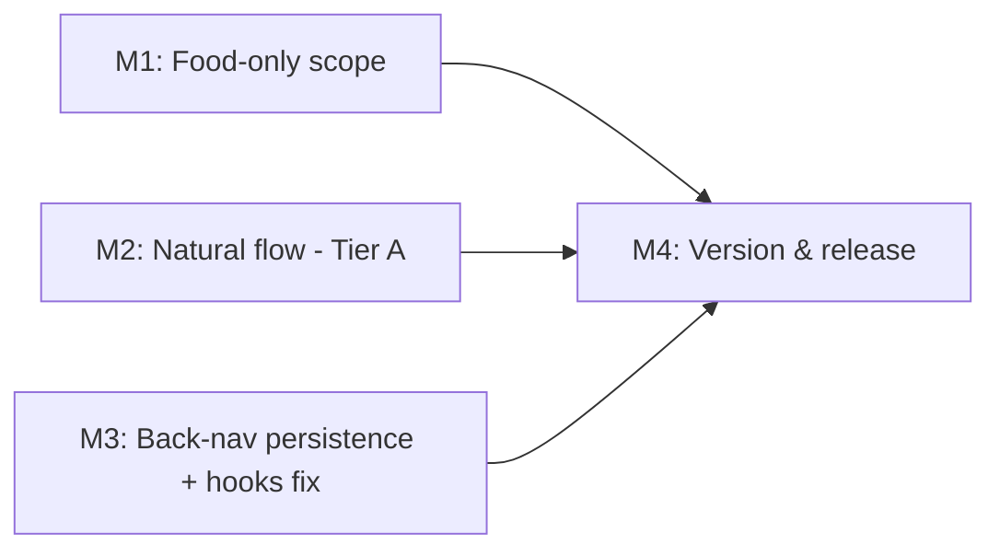

# Plan 198 — Chatbot Flow Improvements (Food-only scope, natural flow, back-nav fix)

| Field | Value |
|-------|-------|
| Plan ID | 198 |
| Target Release | next available patch after current origin/main version (origin/main = v0.15.1 → expected v0.15.2); confirm at DevOps Stage 1 |
| Epic Alignment | Conversational Discovery / Chatbot (follow-on to Plans 176, 197) — supports Ummah-first discovery |
| Related Issues | None (originated from user-reported chatbot UX feedback, 2026-08-02) |
| Classification | Bugfix + Improvement bundle |
| Pipeline | Abbreviated (Analyst → Planner → Critic → Implementer → Code Review → QA → DevOps) |
| GitHub Issue | https://github.com/abu-lina/uflow/issues/286 |
| Created | 2026-08-02T00:00Z |
| Source Analysis | [198-chatbot-flow-improvements-analysis.md](../analysis/closed/198-chatbot-flow-improvements-analysis.md) |

## Changelog

| Date | Author | Change |
|------|--------|---------|
| 2026-08-02T00:00Z | Planner | Initial plan from analysis 198. Item-2 Tier resolved as Tier A. NO-MEMORY MODE. |
| 2026-08-02T00:00Z | Planner | Revised per Critic findings F1+F2: added mandatory multi-select semantic regression test to Testing Strategy (F1); added session-boundary note to M3 scope item 1 (F2). |

---

## Value Statement and Business Objective

**As a** user of the UFlow chatbot,
**I want** the assistant to only offer what actually exists (food), converse naturally, and keep my recommendation list when I open a result and press back,
**so that** I can browse → inspect → return without losing context and trust the assistant enough to keep using it for discovery.

This restores a broken core loop (item 3), removes dead-end options (item 1), and raises perceived quality (item 2) — all supporting frictionless, trustworthy discovery.

---

## Decision Record

- **D1 [RESOLVED]** — Item-2 scope is **Tier A** (prompt copy polish + remove leaked machine artifacts + de-duplicate heuristics). Rationale: delivers natural-feel value at low risk without redesigning the response protocol; keeps the bundle a Bugfix/Improvement. Tier B (structured option protocol) is **[DEFERRED: owner=Planner; reason=larger design change to LLM↔client contract; target=future Feature plan]**.
- **D2 [RESOLVED]** — Classification stays **Bugfix + Improvement** (not Feature), consistent with D1. Confirms the analysis gate recommendation.
- **D3 [RESOLVED]** — Food-only scoping is **prompt + tool-contract level, not data deletion**. Store/ummah/business rows remain in the DB; the assistant simply will not offer or search them. Rationale: reversible, low-risk, avoids destructive changes.
- **D4 [RESOLVED]** — Item 3 (back-nav) is the **highest-priority** deliverable and must ship in this release. Rationale: it is a broken core loop causing drop-off.
- **D5 [RESOLVED]** — Target users/geo and analytics stack are **inherited unchanged** from existing product (German-first community discovery); no new analytics introduced by this plan.
- **D6 [DEFERRED: owner=Planner; reason=product UX question, not required for the fix; target=item-3 follow-up]** — Whether desktop card clicks should open provider detail *inside* the chat vs. navigating the page (Open Question Q2). The fix in this plan preserves conversation state regardless of which is chosen.

**Enum note (for Implementer awareness):** category `applicable_section` values in the DB are `food | store | business | all`, while chat tool enums use `food | store | ummah`. Item 1 must scope category injection to food (and treat `all` per implementer judgment); it does not need to reconcile the `ummah`/`business` naming mismatch.

---

## Assumptions

1. The three-type clarifying question is LLM-generated from prompt scope (proven in analysis F1.1); narrowing the prompt + tool enums removes the business/social branch.
2. Conversation history already persists in the DB (`conversations`/`messages`) and endpoints exist to read it back ([conversations route](../../src/app/api/chat/conversations/route.ts), [[id] route](../../src/app/api/chat/conversations/[id]/route.ts)); the gap is purely client-side rehydration.
3. `origin/main` is v0.15.1; no other non-closed plan currently targets v0.15.2 (see Release Strategy).
4. No DB migration is required for any item in this plan.

## Open Questions

- **OPEN QUESTION [RESOLVED]:** Item-2 Tier A vs B → **Tier A** (D1).
- **OPEN QUESTION [DEFERRED]:** Q2 desktop card navigation model → deferred (D6); does not block item 3.

---

## Release Strategy

**Standalone** for the target patch (no other known non-closed plan targets v0.15.2 at time of writing). If DevOps Stage 1 finds a collision, bump to the next available patch and update this header.

---

## Milestone Dependencies

Sequencing rule: **M1, M2, M3 are independent** and may be implemented in any order (or parallel). M4 (version/release artifacts) runs last. Recommended priority order by value/risk: **M3 → M1 → M2**.

---

## Milestones

### M1 — Food-only recommendations (Item 1)

**Objective:** The assistant only discovers, searches, and offers **food** listings; it no longer asks users to choose between food/business/social.

**Scope of changes (WHAT, not HOW):**
1. Narrow the system-prompt SCOPE and TOOL USAGE wording to food/restaurants only — [system-prompt.ts](../../src/features/chat/prompts/system-prompt.ts).
2. Scope the runtime category injection to the food section only (DB has `food | store | business | all`) so non-food categories are never suggested — [system-prompt.ts](../../src/features/chat/prompts/system-prompt.ts) `buildSystemPrompt`.
3. Constrain the chat tool contract to food: `search_providers`, `get_categories`, `register_provider` `listing_type` handling and `VALID_LISTING_TYPES` — [tool-executor.ts](../../src/features/chat/services/tool-executor.ts). Keep changes reversible (favor defaulting/guarding to food over deleting enum members if that reduces blast radius — implementer's call).
4. Update the out-of-scope redirect copy that lists "restaurants, stores, or community services" — [route.ts](../../src/app/api/chat/route.ts) (~line 285).
5. (Optional, cosmetic) non-food icons in `getProviderIcon` may remain — [ChatMessage.tsx](../../src/features/chat/components/ChatMessage.tsx).

**Removal Surface Enumeration (capability removed = business/social recommendations):**

| Surface | Disposition |
|---------|-------------|
| System-prompt scope wording | Removed in M1 |
| Category injection (non-food sections) | Removed in M1 (scoped to food) |
| Tool enums / `VALID_LISTING_TYPES` | Constrained to food in M1 |
| Redirect copy (route.ts) | Updated in M1 |
| Registration suggestion card ("Restaurant registrieren") | Already food — retained |
| `getProviderIcon` store/ummah icons | Intentionally retained (cosmetic, harmless) |
| DB rows for store/ummah/business | Out of scope — retained by design (D3) |

**Acceptance criteria:**
- Sending "Empfiehl mir etwas" no longer produces a food/business/social choice; the assistant proceeds within a food-only context.
- The assistant does not suggest or return non-food categories/providers in exploration.
- Out-of-scope redirect copy no longer implies stores/community services are available.
- No DB migration; store/ummah data untouched.

### M2 — Natural flow polish, Tier A (Item 2)

**Objective:** Remove robotic/machine artifacts and fragile duplication so conversations read naturally.

**Scope of changes (WHAT, not HOW):**
1. Polish system-prompt CONVERSATION STYLE / clarifier phrasing for a warmer, more natural tone — [system-prompt.ts](../../src/features/chat/prompts/system-prompt.ts).
2. Eliminate the user-visible machine artifact `"Folgendes trifft zu: …"` from multi-select confirmation — [QuickReplies.tsx](../../src/features/chat/components/QuickReplies.tsx) (and any coupled parsing in [system-prompt.ts](../../src/features/chat/prompts/system-prompt.ts) MULTI-SELECT ANSWERS that depends on that literal prefix must be kept consistent).
3. De-duplicate the `singleSelect` detection regex duplicated across the SSE and JSON branches — [useChat.ts](../../src/features/chat/hooks/useChat.ts) (~L119 and ~L158).
4. Tidy the content-stripping edge cases that can truncate messages or leave awkward gaps — [useChat.ts](../../src/features/chat/hooks/useChat.ts) (~L94–L118).

**Explicitly out of scope (Tier B, deferred):** replacing prose-parsed options with a structured option protocol between the API and client. Do **not** change the LLM↔client response contract in this plan.

**Coupling caution (for Implementer):** the `"Folgendes trifft zu:"` prefix is currently a semantic signal consumed by the prompt's MULTI-SELECT rules. If the visible artifact is removed, ensure the multi-select "means YES" semantics still work (e.g., preserve the signal without showing it to the user). This is a correctness constraint, not a redesign.

**Acceptance criteria:**
- No machine artifacts (e.g., `"Folgendes trifft zu:"`) are visible to users.
- Single-select detection logic exists in exactly one place (no duplicated regex).
- Clarifier/greeting copy reads naturally (qualitative; validated in QA/UAT).
- Multi-select "each selected item = YES" behavior is preserved.

### M3 — Back-navigation: conversation persistence + hooks fix (Item 3) — HIGHEST PRIORITY

**Objective:** When a user opens a recommendation and presses back, they return to the chat **with the recommendation list and conversation intact**.

**Root cause (from analysis F3.1–F3.4):** conversation state lives only in ephemeral `useChat` `useState`, destroyed on every `ChatWidget` unmount (route change on mobile, modal close on desktop), with no rehydration. Plus a Rules-of-Hooks violation in `ChatFloatingWidget`.

**Scope of changes (WHAT, not HOW — solution space left to Implementer):**
1. Introduce a client-side persistence/rehydration path so the chat restores its `messages` + `conversationId` after remount. Candidate approaches (implementer chooses; do not implement more than one): rehydrate from the existing conversation endpoints by a persisted `conversation_id`; persist to `sessionStorage`; or hoist chat state to a provider above the route boundary. Constraint: must survive a full `<Link>` navigation to `/providers/[id]` and browser back on **mobile `/chat`**. **Session boundary (F2):** a fresh conversation (greeting + suggestion cards) should start only when there is no prior `conversation_id` for the current browser session — i.e., the first visit or after an explicit reset; returning to the page within the same session must restore the existing conversation.
2. Fix the Rules-of-Hooks violation in [ChatFloatingWidget.tsx](../../src/features/chat/components/ChatFloatingWidget.tsx) — the `pathname === '/chat'` early return currently precedes `useAuth()`/`useState()`; reorder so all hooks run unconditionally.
3. Ensure returning to chat restores scroll-to-latest and the rendered recommendation cards, not just the greeting.

**State/branch coverage (per state-machine requirement) — enumerate the render branches touched:**

| Branch | In scope? | Expected post-fix |
|--------|-----------|-------------------|
| Empty state (greeting + suggestion cards, `!hasMessages`) | Yes | Only shown for a genuinely new conversation, not after back-nav |
| Populated state (`hasMessages`, incl. `results` list) | Yes | **Restored** on back-nav to `/chat` |
| Mobile `/chat` full page (`router.push('/chat')`) | Yes (primary repro) | Conversation restored on back |
| Desktop floating modal (`isOpen`) | Yes | Conversation restored when reopened (D6 navigation model deferred) |
| Registration mode conversation | Confirmed unaffected by inspection — same state path; restoration applies uniformly | Restored like any conversation |

**Acceptance criteria:**
- **Primary (measurable):** On mobile, from `/chat` showing a recommendation list → tap a card → land on `/providers/[id]` → browser back → the chat shows the **same list and prior messages** (not the greeting), with `conversation_id` preserved.
- `ChatFloatingWidget` no longer calls hooks conditionally (no Rules-of-Hooks violation; lint/`react-hooks/rules-of-hooks` clean).
- No regression to sending new messages, streaming, or registration flow.
- No new conversation row is created on back-navigation.

### M4 — Version & release artifacts

**Objective:** Update release metadata to the confirmed target patch.

**Tasks:**
1. Bump `package.json` version to the DevOps-confirmed patch (expected v0.15.2).
2. Add a CHANGELOG entry summarizing M1–M3.
3. Update README/roadmap references only if needed.

**Acceptance criteria:** version artifacts consistent; CHANGELOG reflects the three deliverables; version matches the confirmed release.

---

## Testing Strategy (high-level — QA owns specifics)

- **Unit:** option-extraction / single-select detection after de-duplication (M2); food-only scoping guards in the tool layer (M1); persistence/rehydration helper logic (M3).
- **Component/integration:** `ChatWidget`/`useChat` restore path — a populated conversation survives an unmount/remount cycle (M3); `ChatFloatingWidget` hooks run unconditionally across pathname changes (M3).
- **Client-state precedence regression (per repo guidance):** M3 must include a focused test that mirrors the exact pre-fix vs post-fix behavior — e.g., a remount yields empty state pre-fix vs restored `messages`/`conversationId` post-fix. Name it to make the bug visible (`[pre-fix FAILS]` / `[post-fix PASSES]`).
- **Multi-select semantic regression (F1 — MANDATORY before QA handoff):** M2 must include a test verifying that after the `"Folgendes trifft zu:"` artifact is removed, the confirmation signal (in whatever form the Implementer chooses) is still correctly consumed by the `MULTI-SELECT ANSWERS` rule in `system-prompt.ts`. The test must assert that N selected items are interpreted as YES by the prompt — not just that no artifact is shown.
- **Regression:** streaming responses, registration flow, and out-of-scope redirect remain correct.
- **Manual (QA/UAT):** natural-tone copy (M2) and the mobile back-nav repro on the provided `/food` → `/chat` path.

Coverage expectation: new/changed logic covered; the back-nav regression is mandatory before QA handoff.

---

## Validation & Handoff Notes

- Run `npm run type-check`, `npm run lint`, and `npm test` before handoff to QA.
- Repro anchor for M3: `http://localhost:3000/food?section=food&near_lat=50.11&near_lon=8.68&near_radius=10` → open chat → get recommendations → open a card → browser back.
- Rollback: all three items are code-level (no migration); revert the commit(s) to restore prior behavior.

## Duration Estimates (rough, phase-level)

| Phase | Estimate | Uncertainty drivers |
|-------|----------|---------------------|
| Analysis | Done | — |
| Planning | Done | — |
| Implementation | ~0.5–1.5 days | M3 persistence approach choice; M2 artifact/prompt coupling |
| Code Review | ~0.5 day | M3 architecture (state persistence) |
| QA | ~0.5 day | Back-nav repro + natural-tone judgment |
| UAT | ~0.5 day | Qualitative flow feel |
| DevOps | ~0.25 day | Version confirmation |

Primary uncertainty is M3's persistence approach and M2's `"Folgendes trifft zu:"` semantic coupling.

## Risks

| Risk | Likelihood | Impact | Mitigation |
|------|-----------|--------|------------|
| Removing the visible multi-select prefix breaks "means YES" semantics | Medium | Medium | Keep the internal signal; only hide it from users (M2 coupling caution) |
| M3 persistence introduces stale/duplicate conversations | Medium | Medium | Rehydrate by existing `conversation_id`; assert no new row on back-nav (acceptance) |
| Food-only scoping misses a surface, letting non-food leak | Low | Low | Removal Surface Enumeration table in M1 |
| Hooks reorder changes `/chat` mount behavior | Low | Medium | Covered by M3 hooks test across pathname changes |
