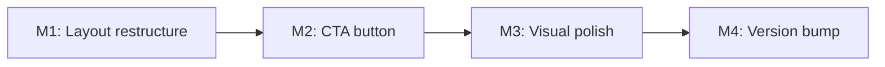

# Plan 200 — Desktop Search Bar Simplification

| Field          | Value |
|----------------|-------|
| Plan ID        | 200 |
| Target Release | next available patch after current origin/main version (v0.15.3 → expected v0.15.4); confirm at DevOps Stage 1 |
| Epic Alignment | Search & Discovery UX |
| Related Issues | None (originated from product owner UX review on UAT desktop, 2026-08-02) |
| Classification | Refactor (UI simplification — no new functionality) |
| Pipeline       | Abbreviated (Planner → Critic → Implementer → Code Review → QA → UAT → DevOps) |
| GitHub Issue   | https://github.com/abu-lina/uflow/issues/288 |
| Created        | 2026-08-02T21:00Z |

## Changelog

| Date | Author | Change |
|------|--------|--------|
| 2026-08-02T21:00Z | Planner | Initial plan from Architect Direction A recommendation. |

---

## Value Statement and Business Objective

> "As a desktop user of UFlow, I want a clean, scannable search bar that doesn't overwhelm me with controls, so that I can quickly find what I'm looking for without cognitive overload."

**Alignment**: Supports master product objective — making UFlow the first thought requires a frictionless, confidence-inspiring discovery experience. A cluttered search bar undermines trust and slows task completion.

---

## Decision Record

| ID | Decision | Status |
|----|----------|--------|
| D1 | Direction A: search input + location in bar; Wer + Filter as pills below | [RESOLVED] — Architect evaluated 3 directions; A is lowest-risk, proven pattern (Google Maps, DoorDash), keeps all functionality accessible |
| D2 | Desktop-only change; mobile accordion UX unchanged | [RESOLVED] — Mobile search is a different component (`HomeSearchBar`/accordion); no regression risk |
| D3 | Remove all vertical dividers from bar; use spacing/padding for grouping | [RESOLVED] — Dividers add visual noise at current density; spatial separation is cleaner |
| D4 | Add filled "Suchen" CTA button right-aligned in bar | [RESOLVED] — Gives bar a clear endpoint; improves Fitts's law target; matches Airbnb/Booking pattern |
| D5 | Filter pills render below bar as `rounded-full` chips at `md:` breakpoint | [RESOLVED] — Secondary filters visible but visually subordinate; no hidden functionality |
| D6 | No logic/state changes to Wer or Filter dropdowns — only visual relocation | [RESOLVED] — Minimizes risk; same dropdown content, just rendered in a different container |

---

## Release Strategy

Release Strategy: Standalone (no other known plans for this version).

---

## Assumptions

1. The desktop SearchBar is rendered from `src/features/search/components/SearchBar.tsx` and embedded in `src/components/layout/Header.tsx` with `className="!w-[800px] !shadow-none"`.
2. Wer and Filter state (`selectedWer`, `selectedFilters`) already live in `SearchBarContent` — they can be passed down to a child pill component via props or kept in the same component with conditional rendering.
3. The `md:` Tailwind breakpoint (768px) is the correct desktop/mobile boundary for this change.
4. No i18n key additions required for the "Suchen" button — `search.submit` or equivalent likely exists; if not, one key across 6 locales is needed.

---

## Milestones

### M1 — Restructure SearchBar layout: bar + pill row

**Objective**: The desktop SearchBar renders as two visual layers: a clean primary bar (location + input + CTA) and a secondary pill row (Wer + Filter).

**Scope**:
- In `SearchBar.tsx`, wrap the desktop layout in a flex-col container
- Primary bar (top): location dropdown + search input + "Suchen" button
- Secondary row (below bar): Wer pill + Filter pill, styled as `rounded-full bg-gray-100 text-sm`
- Remove all 3 `border-l border-[#999999]` dividers
- Add appropriate `gap-2` or `gap-3` between pill row items
- Guard pill row with `hidden md:flex` so mobile is unchanged

**Acceptance Criteria**:
- [ ] Desktop bar contains only: location dropdown, search input, submit button
- [ ] Wer and Filter dropdowns render as pills below the bar on `md:` and above
- [ ] No vertical dividers remain in the bar
- [ ] Mobile layout unchanged (Wer/Filter still in-bar on mobile, or hidden if mobile uses accordion)
- [ ] All existing dropdown functionality works (location, Wer count, Filter checkboxes)

### M2 — Add "Suchen" CTA button

**Objective**: A filled primary-color button on the right side of the bar provides a clear search endpoint.

**Scope**:
- Add a `<button>` with `onClick={handleSearch}` at the right end of the bar
- Style: `rounded-xl bg-primary text-white px-4 py-2 text-sm font-medium`
- Label: `t('search.submit')` (add i18n key if missing)
- Desktop-only visibility (`hidden md:flex`)

**Acceptance Criteria**:
- [ ] "Suchen" button visible on desktop, triggers search
- [ ] Button not visible on mobile (mobile uses Enter key / implicit submit)
- [ ] i18n key exists in all 6 locale files

### M3 — Visual polish and spacing

**Objective**: The search bar feels spacious, clean, and scannable.

**Scope**:
- Location dropdown: slightly bolder text weight (`font-medium` → `font-semibold`) to anchor the left side
- Search input: flex-1 with generous left padding after location
- Pill row: `mt-2` gap below bar, pills have `px-3 py-1.5 text-sm text-neutral-600 hover:bg-gray-200 transition-colors`
- Active filter badge: pill shows count (e.g., "Filter (2)") with subtle accent

**Acceptance Criteria**:
- [ ] Visual hierarchy is clear: bar dominates, pills are secondary
- [ ] Spacing feels comfortable at 800px width
- [ ] Hover states on pills provide feedback

### M4 — Version & Release Artifacts

**Objective**: Version bump and CHANGELOG entry.

**Scope**:
- `package.json` + `package-lock.json`: version bump to target release
- `CHANGELOG.md`: entry under `[Unreleased]`

**Acceptance Criteria**:
- [ ] Version bumped
- [ ] CHANGELOG entry documents the refactor

---

## Milestone Dependencies

Sequencing: M1 must complete first (structural change). M2 and M3 could technically parallel but are trivial to sequence. M4 always last.

---

## Testing Strategy

- **Unit tests**: Verify SearchBar still renders all interactive elements (location dropdown, search input, Wer, Filter) — update selectors if DOM structure changes
- **Regression**: Existing `SearchBar.test.tsx` tests must pass (may need minor selector updates for relocated elements)
- **Visual**: Manual desktop inspection at 800px, 1024px, 1440px widths
- **Mobile regression**: Confirm no visible change on mobile viewport

---

## Risks

| Risk | Likelihood | Impact | Mitigation |
|------|-----------|--------|-----------|
| Existing tests break due to DOM restructure | Medium | Low | Tests assert behavior (search, location change), not DOM order — most should pass unchanged |
| Pill row increases total header height | Low | Low | Only adds ~36px; acceptable tradeoff for clarity |
| Users miss Wer/Filter in new location | Very Low | Low | Pills are visible, labeled, and immediately below bar — no hidden functionality |

---

## Duration Estimates

| Phase | Estimate | Uncertainty |
|-------|----------|-------------|
| Planning | 15 min | Low |
| Critique | 10 min | Low |
| Implementation | 45–90 min | Low (CSS/JSX restructure, no logic change) |
| Code Review | 10 min | Low |
| QA | 15 min | Low |
| UAT | 10 min | Low (visual confirmation) |
| DevOps | 15 min | Low |
| **Total** | ~2–3h | Low — pure layout refactor |

---

## Validation

- Desktop: bar shows [📍 Location ▾] [🔍 input] [Suchen] — clean, spacious
- Below bar: [Wer: 1 Person ▾] [Werte & Ausstattung ▾] as pills
- Mobile: unchanged from current behavior
- All search/filter functionality works identically

---

## Rollback

If issues arise post-deploy:
- Revert the single SearchBar.tsx + Header.tsx commit
- No DB changes, no API changes, no state logic changes
- Pure CSS/JSX — fully reversible in one `git revert`
