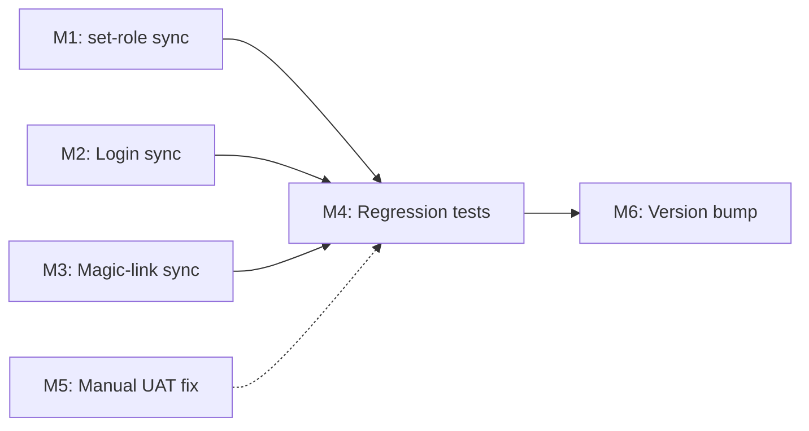

# Plan 203 — Fix Provider Edit Authorization & Harden Role Sync

| Field          | Value |
|----------------|-------|
| Plan ID        | 203 |
| Target Release | Next available patch after current origin/main v0.15.6; confirm at DevOps Stage 1 |
| Epic Alignment | Platform Stability & Admin Tooling |
| Related Issues | None (user-reported UAT bug via naveed@yaneel.com) |
| Classification | Bugfix |
| Pipeline       | Full |
| GitHub Issue   | https://github.com/abu-lina/uflow/issues/297 |
| Created        | 2026-08-05T14:00Z |

**Changelog**

| Date | Author | Change |
|------|--------|--------|
| 2026-08-05T14:00Z | @Planner | Initial plan created from analysis 203 |
| 2026-08-05T07:00Z | @Implementer | Implementation started |

---

## Value Statement and Business Objective

As a **platform admin/moderator**, I want my elevated role to be correctly reflected in the UI immediately after assignment, so that I can perform provider edits without workaround navigation or manual metadata fixes.

As a **platform operator**, I want the authentication system to have a single reliable source of truth for role-based UI gating, so that no future role assignment silently fails to propagate.

---

## Decision Record

| # | Decision | Status |
|---|----------|--------|
| D-1 | `set-role` API must sync role to Supabase Auth `user_metadata.role` | [RESOLVED] — The DB is authoritative, but the client JWT must carry a UI hint. Writing to metadata on role change ensures the next token refresh propagates. |
| D-2 | Login route must sync DB role to `user_metadata.role` on each successful login | [RESOLVED] — Covers users whose role was granted while they were offline or using a stale JWT. Cost: one extra DB read per login. Acceptable at current DAU. |
| D-3 | `useIsAdmin()` continues to read `user_metadata.role` (not a separate API call) | [RESOLVED] — Client-side API calls to determine role add latency and complexity. Metadata is the intended JWT-embedded claim mechanism. The fix ensures it is populated. |
| D-4 | `user_metadata.role` is a UI visibility hint only — never trusted server-side | [RESOLVED] — Existing security pattern (F-049) is correct. All API gates continue using DB-backed `isAdminOrModerator()`. |
| D-5 | `AuthSyncer` does NOT need to poll role changes | [RESOLVED] — Token refresh (automatic every hour) picks up metadata changes. If same-session immediacy is needed, `set-role` returns the updated role, and the admin can instruct the target user to refresh the page. No real-time push required at current scale. |
| D-6 | Scope: applies to ALL roles (admin, moderator, owner, user) | [RESOLVED] — The sync must handle role downgrades (admin→user) as well to prevent stale elevated UI after demotion. |
| D-7 | No new middleware introduced — fix lives in existing code paths | [RESOLVED] — Adding middleware adds complexity beyond YAGNI. Two targeted insertions (set-role + login) suffice. |

---

## Release Strategy

Standalone (no other known plans for this version).

---

## Assumptions

1. The `handle_new_user` trigger is active on UAT (inserts `role='user'` into `public.users` on auth signup). If not, a separate infrastructure fix is needed — out of scope.
2. `naveed@yaneel.com` has `public.users.role` correctly set to `admin` or `moderator` in UAT. If not, a one-time manual fix via Supabase dashboard or `set-role` call is needed before testing.
3. Supabase Auth `updateUserById` correctly merges `user_metadata` without overwriting other fields (documented behavior).

---

## Milestones

### M1 · Sync role to `user_metadata` in `set-role` API

**Objective**: After a successful DB role update/insert, write the same role value to Supabase Auth `user_metadata.role`.

**Acceptance Criteria**:
- `POST /api/admin/set-role` with valid role → `user_metadata.role` matches `public.users.role`
- Existing metadata fields (language, email_confirmed, etc.) are preserved (merge, not overwrite)
- A failure in the metadata sync does not roll back the DB update (DB is authoritative), but is logged as a warning
- Regression tests updated to verify metadata sync

**Files in scope**: `src/app/api/admin/set-role/route.ts`

---

### M2 · Sync DB role to `user_metadata` on login

**Objective**: On each successful password login, read `public.users.role` and update `user_metadata.role` if they differ.

**Acceptance Criteria**:
- After `signInWithPassword` succeeds, the response JWT carries the correct `user_metadata.role` matching the DB
- Login latency increase is negligible (one indexed SELECT on `users.user_id`)
- If the user has no row in `public.users`, metadata is NOT changed (avoids writing `role: 'user'` for users who haven't been assigned)
- Login still succeeds even if the metadata sync call fails (non-blocking, logged)

**Files in scope**: `src/app/api/auth/login/route.ts`

---

### M3 · Sync DB role to `user_metadata` on magic-link verification

**Objective**: Users who authenticate via magic link (not password) also receive the role sync.

**Acceptance Criteria**:
- Same behavior as M2 but in the `verify-magic-link` route
- If user logs in via magic link after role assignment, `useIsAdmin()` returns correct value without page refresh

**Files in scope**: `src/app/api/auth/verify-magic-link/route.ts`

---

### M4 · Regression tests for role sync

**Objective**: Prevent future regressions of the split-brain role issue.

**Acceptance Criteria**:
- Unit test: `set-role` calls `updateUserById` with `user_metadata.role` matching the target role
- Unit test: `set-role` preserves existing `user_metadata` fields (non-destructive merge)
- Unit test: Login route syncs DB role to metadata when roles differ
- Unit test: Login route does NOT call updateUserById when roles already match (optimization)
- Pre-fix/post-fix test naming pattern per copilot-instructions

**Files in scope**: `src/__tests__/api/` (new or existing test files)

---

### M5 · One-time fix for `naveed@yaneel.com` on UAT

**Objective**: Unblock the reporting user immediately while code fix is deployed.

**Acceptance Criteria**:
- Verify `public.users.role` for naveed via `check-role` API or Supabase dashboard
- If DB role is correct: set `user_metadata.role` to match in Supabase Auth dashboard (or via admin SDK one-liner)
- If DB role is missing: use `set-role` API (from an existing admin account) to assign
- Verify naveed can see edit button on provider detail page
- Verify naveed can navigate to `/dashboard/providers/53e3cc73-1ef2-438a-9cbb-989b508218ce/edit` and load the form

**Type**: Manual / script — no code change needed for this milestone

---

### M6 · Update Version and Release Artifacts

**Objective**: Bump patch version, update CHANGELOG.

**Acceptance Criteria**:
- `package.json` version bumped to next available patch
- `CHANGELOG.md` entry documenting the bugfix
- Version matches roadmap target

---

## Milestone Dependencies

Sequencing rule: M1, M2, M3 can be implemented in parallel. M4 tests all three. M5 can be executed immediately (independent of code deployment). M6 is the final gate.

---

## Testing Strategy

- **Unit tests**: Mock `supabaseAdmin.auth.admin.updateUserById` and verify it's called with correct metadata merge after role update (M1), after login (M2), after magic-link (M3)
- **Integration tests**: Not required — the DB + Auth interaction is via service-role client, which is mocked in unit tests. E2E would require a running Supabase instance.
- **Regression tests**: Pre-fix/post-fix pattern confirming `useIsAdmin()` returns true when `user_metadata.role` is set (existing tests in `useIsAdmin.test.tsx` already cover this — no change needed for the hook itself)
- **Manual UAT**: naveed sees edit button after fix is deployed

---

## Risks

| Risk | Impact | Mitigation |
|------|--------|------------|
| `updateUserById` API rate limit on bulk role changes | Low — only called on individual set-role or login events | Monitor; at current DAU (<100 admins), not a concern |
| Metadata merge overwrites unexpected fields | Medium — could lose user preferences | Use spread operator `{ ...existingMetadata, role }` to preserve all existing fields |
| Login becomes slightly slower (extra DB read) | Low — one indexed SELECT on PK | Negligible; measurable only under extreme load |
| Future auth provider migration breaks `user_metadata` | Low — speculative | Document dependency on Supabase Auth metadata in architecture docs |

---

## Duration Estimates

| Phase | Estimate | Uncertainty |
|-------|----------|-------------|
| Planning | 30min | Low (complete) |
| Implementation (M1-M3) | 1-2 hours | Low — three targeted insertions |
| Testing (M4) | 1-2 hours | Low — mock-based unit tests |
| Manual UAT fix (M5) | 15min | Low — dashboard access required |
| QA / UAT verification | 30min | Low |
| DevOps / Release (M6) | 30min | Low |
| **Total** | **~4-6 hours** | Low overall uncertainty |

---

## Validation

- [ ] `GET /api/admin/check-role` shows correct `databaseRole` for naveed
- [ ] After `set-role` call, `user_metadata.role` matches (verifiable in Auth dashboard)
- [ ] After re-login, naveed sees edit button on provider detail page
- [ ] Existing security test F-049 still passes (server never trusts metadata)
- [ ] `npm run test` passes with new regression tests
- [ ] `npm run type-check` passes

---

## Rollback

If the metadata sync causes issues:
1. Revert the `set-role` and login route changes
2. `user_metadata.role` becomes stale again but system is functionally equivalent to pre-fix
3. Admin users can still access dashboard via direct URL (server gate unaffected)

No DB schema changes. No RLS changes. No migration required. Rollback is a simple code revert.
