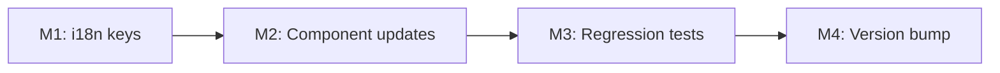

# Plan 209 — Near Me Permission-Denied UX Guidance

| Field          | Value                                                                                       |
| -------------- | ------------------------------------------------------------------------------------------- |
| Plan ID        | 209                                                                                         |
| Target Release | next available patch after current origin/main v0.15.14; confirm at DevOps Stage 1          |
| Epic Alignment | PWA Geolocation UX (follow-on from Plan 212 Near Me viewport fix)                           |
| Related Issues | DF-3 in `agent-output/planning/212-near-me-pwa-fix-open-actions.md`                         |
| Classification | Bugfix                                                                                      |
| Pipeline       | Full                                                                                        |
| GitHub Issue   | https://github.com/abu-lina/uflow/issues/319                                               |
| Created        | 2026-08-16T16:30Z                                                                           |

## Value Statement and Business Objective

**As a** mobile PWA user on iOS who has previously denied location permission,
**I want to** see clear guidance on how to re-enable location access when I tap "In der Nähe",
**so that** I can use the Near Me feature without being stuck at an unhelpful "Standort nicht verfügbar" dead-end.

## Background

Plan 212 (v0.15.14) correctly surfaced the `denied`/`unavailable`/`timeout` geolocation states — previously, the chip silently failed. However, on-device UAT testing (DF-3) revealed that the "Standort nicht verfügbar" message provides no recovery path. On iOS, once location permission is denied for a PWA origin, the browser will **never re-prompt** — the user must manually navigate to iOS Settings. Android behaves similarly after "Don't allow" + "Don't ask again". The current UX offers no indication of this.

### Observed Behaviour (iPhone SE PWA, UAT 2026-08-16)

1. User taps "IN DER NÄHE" chip
2. iOS returns `PERMISSION_DENIED` instantly (no dialog — previously denied)
3. Chip resets to neutral, inline text shows "Standort nicht verfügbar"
4. No indication of what to do next → user is stuck

### Desired Behaviour

1. Same trigger
2. Same detection (Plan 212 already handles this correctly)
3. Instead of bare text, show a contextual hint with platform-appropriate guidance:
   - iOS: "Standort gesperrt. Öffne Einstellungen → Datenschutz → Ortungsdienste, um den Zugriff zu erlauben."
   - Android: "Standort gesperrt. Erlaube den Zugriff in den Browser-Einstellungen."
   - Fallback: "Standort gesperrt. Bitte erlaube den Standortzugriff in deinen Geräteeinstellungen."

## Decision Record

| # | Decision | Status |
|---|----------|--------|
| D1 | Target: iOS + Android PWA users who previously denied location | [RESOLVED] — these are the only platforms where re-prompting is blocked by the OS |
| D2 | Guidance is inline text below the chip (not a modal/toast) | [RESOLVED] — consistent with existing `permissionDenied` placement; modals are disruptive for a passive hint |
| D3 | Platform detection via `navigator.userAgent` for iOS vs Android hint text | [RESOLVED] — lightweight, no new dependencies; acceptable accuracy for hint text (not security-critical) |
| D4 | i18n keys: **separate keys per platform** — `suchen.nearMe.permissionDeniedHintIos`, `suchen.nearMe.permissionDeniedHintAndroid`, `suchen.nearMe.permissionDeniedHintFallback` | [RESOLVED] — the three platform variants are complete, independent sentences that cannot share a common interpolation template across all 6 locales (word-order and sentence structure differ); separate keys are the only approach that localizes cleanly |
| D5 | Scope: `HomeSearchBar` + `NearMeOpenNowFilters` — both show the denied state | [RESOLVED] — both components already render `permissionDenied`; both need the guidance hint |
| D7 | Hint renders **only when `geoStatus === 'denied'`**, not for `timeout` or `unavailable` | [RESOLVED] — `timeout` is transient (retry resolves it); `unavailable` may be hardware/signal — telling users to visit Settings is misleading for both; the existing bare `permissionDenied` label is sufficient for non-denied states |
| D6 | No iOS deep-link to Settings (not possible from PWA web context) | [RESOLVED] — `app-settings:` URL scheme is not available to web apps; text guidance is the only option |

## Assumptions

1. The `useGeolocation` hook's `denied`/`unavailable`/`timeout` status mapping from Plan 212 is correct and stable.
2. Platform-specific hint text is acceptable even if user-agent detection is imperfect — the fallback text covers all edge cases.
3. The existing 6 locale files (de, en, ar, tr, ur, ps) all need the new key.

## Plan

### Milestone 1: Add i18n keys for permission-denied guidance

**Objective**: Add a new translation key `suchen.nearMe.permissionDeniedHint` across all 6 locale files with platform-appropriate variants.

**What**: Each locale file gets three new keys under `suchen.nearMe`: `permissionDeniedHintIos`, `permissionDeniedHintAndroid`, `permissionDeniedHintFallback`. The component selects the appropriate key at render time via a lightweight platform detection (UA sniff). For ar/ur/ps locales, all three keys MAY ship initially with the same fallback-variant text; human translation review is required before those locales receive platform-specific Settings paths.

**Acceptance Criteria**:
- Three new keys (`permissionDeniedHintIos`, `permissionDeniedHintAndroid`, `permissionDeniedHintFallback`) exist in all 6 locale files
- de/en keys contain platform-appropriate Settings path text
- ar/ur/ps keys may initially contain the same text as `permissionDeniedHintFallback`; a TODO comment marks them for human translation review
- Text provides actionable guidance (iOS: mentions Einstellungen → Datenschutz → Ortungsdienste; Android: browser settings; fallback: generic device settings)

**Files touched**: `src/translations/{de,en,ar,tr,ur,ps}.ts`

### Milestone 2: Update denied-state rendering in HomeSearchBar and NearMeOpenNowFilters

**Objective**: Replace the bare "Standort nicht verfügbar" dead-end with the guidance hint when geolocation is denied.

**What**:
- In both `HomeSearchBar.tsx` and `NearMeOpenNowFilters.tsx`, when **`geoStatus === 'denied'`** (not `timeout`, not `unavailable`), render the platform-appropriate hint key below the existing `permissionDenied` label.
- Add a lightweight platform detection utility (or inline check) to determine iOS vs Android vs fallback, mapping to the correct i18n key (`permissionDeniedHintIos` / `permissionDeniedHintAndroid` / `permissionDeniedHintFallback`).
- The hint should be visually secondary (smaller font, muted color) to the existing denied label.
- `timeout` and `unavailable` states retain the existing bare `permissionDenied` label only — no Settings hint.

**Acceptance Criteria**:
- `geoStatus === 'denied'`: renders both the existing label AND the new guidance hint
- `geoStatus === 'timeout'` or `'unavailable'`: renders only the existing label (no guidance hint)
- iOS UA → `permissionDeniedHintIos`; Android UA → `permissionDeniedHintAndroid`; other → `permissionDeniedHintFallback`
- Guidance is accessible (rendered as visible text, not just tooltip)
- No additional layout shift between `timeout`/`unavailable` and `denied` states (hint appears alongside denied label, not as a separate delayed element)

**Files touched**: `src/features/search/components/HomeSearchBar.tsx`, `src/features/search/components/NearMeOpenNowFilters.tsx`, optionally a small utility

### Milestone 3: Regression tests

**Objective**: Verify the guidance hint renders correctly for each platform scenario.

**What**: Add tests to the existing `HomeSearchBar.test.tsx` and `NearMeOpenNowFilters.test.tsx` covering:
- `geoStatus === 'denied'` renders both the existing label AND the guidance hint (all 3 platform paths)
- `geoStatus === 'timeout'` renders the existing label only — NO guidance hint
- `geoStatus === 'unavailable'` renders the existing label only — NO guidance hint
- iOS user-agent → `permissionDeniedHintIos` text
- Android user-agent → `permissionDeniedHintAndroid` text
- Unknown/desktop → `permissionDeniedHintFallback` text

**Acceptance Criteria**:
- Tests cover 3 platform detection paths × denied state = 6 scenarios
- Tests cover timeout/unavailable: hint must NOT appear = 2 guard scenarios
- All new tests pass in `vitest`
- No existing Plan 212 tests broken

**Files touched**: `src/__tests__/features/search/HomeSearchBar.test.tsx`, `src/features/search/components/NearMeOpenNowFilters.test.tsx`

### Milestone 4: Update version and release artifacts

**Objective**: Bump version, update CHANGELOG.

**Tasks**:
- Update `package.json` version
- Update `package-lock.json` version
- Add CHANGELOG entry
- Commit with plan reference

**Acceptance Criteria**:
- Version artifacts updated and consistent
- CHANGELOG reflects the change

## Testing Strategy

- **Unit tests**: Platform detection logic (iOS/Android/fallback)
- **Component tests**: `HomeSearchBar` + `NearMeOpenNowFilters` — denied state renders hint (3 platform paths); timeout/unavailable states do NOT render hint
- **Coverage**: 3 platform paths × denied + 2 non-denied guard scenarios = 8 scenarios minimum across both components
- **Regression**: Existing Plan 212 tests continue to pass

## Milestone Dependencies

Sequencing: M1 must complete before M2 (components reference new keys). M3 follows M2. M4 is final.

## Release Strategy

Standalone (no other known active plans targeting the next patch).

## Duration Estimates

| Phase | Estimate | Notes |
|-------|----------|-------|
| Planning | 30min | This document |
| Critique | 15min | Straightforward scope |
| Implementation | 1–2h | 6 locale files + 2 components + utility + tests |
| QA | 30min | Automated gates |
| UAT | 15min | Quick visual check (DF-3 can be combined) |
| DevOps | 30min | Standard patch release |
| **Total** | **~3–4h** | Low uncertainty — well-scoped, no DB/API changes |

**Uncertainty drivers**: None significant. All touchpoints are well-understood from Plan 212.

## Risks

| Risk | Impact | Mitigation |
|------|--------|------------|
| User-agent detection unreliable for some browsers | LOW — fallback text covers all cases | Always show `permissionDeniedHintFallback` if neither iOS nor Android detected |
| RTL locale translation quality (ar, ur, ps) | LOW — fallback text covers worst case | Ship ar/ur/ps initially with fallback-variant text; mark with a TODO comment for human translation review; platform-specific Settings paths require native-speaker review before activating |

## Validation

- `npm run type-check` passes
- `npm test` passes (full suite + new tests)
- `npm run lint` passes
- On-device spot check: iOS PWA shows iOS-specific guidance in denied state

## Rollback

Revert the single patch commit. No DB migrations, no API changes, no breaking contract changes.

## Changelog

| Date (UTC) | Agent | Change |
|---|---|---|
| 2026-08-16T16:30Z | planner | Plan created from DF-3 on-device UAT finding |
| 2026-08-16T17:15Z | planner | Revision R1: addressed Critic F1 (committed to separate keys per platform in D4 + M1 AC), F2 (hint scoped to `denied` only via new D7; `timeout`/`unavailable` guard added to M2 + M3), F3 (RTL TODO note in M1 + Risks) |
| 2026-08-16T17:30Z | implementer | Status → In Progress; started TDD implementation for M1/M2/M3 |
