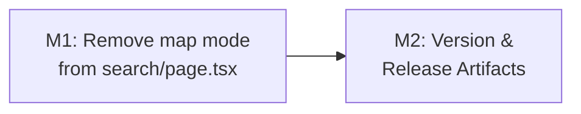

# Plan 213 — Restore Filter Controls on Mobile Search Page

| Field          | Value                                                                                  |
| -------------- | -------------------------------------------------------------------------------------- |
| Plan ID        | 213                                                                                    |
| Target Release | next available patch after current origin/main version (v0.15.14); confirm at DevOps Stage 1 |
| Epic Alignment | Mobile-first restaurant discovery — core search flow integrity                         |
| Related Issues | https://github.com/abu-lina/uflow/issues/321                                           |
| Classification | Bugfix                                                                                 |
| Pipeline       | Abbreviated (Analysis → Plan → Implementer → Code Review → QA → DevOps)              |
| GitHub Issue   | https://github.com/abu-lina/uflow/issues/321                                           |
| Created        | 2026-08-16T18:30Z                                                                      |

## Changelog

| Date              | Agent   | Change                                                    |
| ----------------- | ------- | --------------------------------------------------------- |
| 2026-08-16T18:30Z | planner | Plan created; inherited from Analysis 213 (UUID 9d4a1f3c) |
| 2026-08-16T18:50Z | implementer | Status updated to In Progress; implementation started |
| 2026-08-16T19:05Z | code-reviewer | Status updated to Code Review Approved |

---

## Value Statement and Business Objective

**As a** mobile user on iPhone SE PWA,  
**I want to** see the filter controls (Was / Wo / Wer / Filter) when I navigate to `/search?section=food` from the home map,  
**so that** I can set category, location, and audience criteria before executing a food search — restoring the core discovery flow that has been blocked since Plan 208 (v0.15.10).

**Intended flow (post-fix)**:

1. Home (`/`) → map with all restaurant pins + search bar
2. Tap filter icon (sliders) in `HomeSearchBar` → navigates to `/search?section=food`
3. `/search` → filter controls visible (Was / Wo / Wer / Filter accordions)
4. Set filters → tap "Suchen" → navigates to `/food?...` results (list view)

Steps 1, 3, and 4 of this navigation chain already work correctly. Step 2 is the regression this plan fixes.

---

## Assumptions

1. The fix is isolated to `src/app/(public)/search/page.tsx`. No other files need modification for the regression fix.
2. `useIsMobile`, `mapPins` state, the pins-fetching `useEffect`, the `SearchMap` dynamic import, and the `ErrorBoundary` import added by Plan 208 are dead code once the map mode is removed from this page and may all be cleaned up.
3. The `HomeSearchBar` sliders button already navigates to `/search?section=${activeSection}` — this leg requires no changes.
4. The `/food` results page is currently list-only. The results map+toggle is a separate feature enhancement and is explicitly deferred from this plan (see Deferred scope below).
5. `ummah` and `store` sections are unaffected — they never had `isMobileFoodMapMode = true` and continue to work correctly.

---

## Decision Record

| # | Decision | Status | Rationale |
|---|---|---|---|
| D1 | Remove the `isMobileFoodMapMode` map rendering from `search/page.tsx` entirely | [RESOLVED] | The `/search` route is the filter-configuration page. The map belongs on the home page and (deferred) on the results page — not on the page whose purpose is to collect search parameters. Confirmed by user: "On the filter page I want to see the different filters I can set." |
| D2 | Clean up all dead code introduced by Plan 208 on this file | [RESOLVED] | YAGNI + DRY: `mapPins` state, pins `useEffect`, `SearchMap` import, `useIsMobile` import, and `ErrorBoundary` import are all exclusively used to support `isMobileFoodMapMode`. Removing them with the feature removes complexity. |
| D3 | Do NOT add a map view to the results page (`/food`, `ProvidersContent.tsx`) in this plan | [DEFERRED: User/Planner; results map is a new feature, not a regression; target a future plan (214 or later)] | The results page has always been list-only. Making it display a map is an enhancement, not a regression fix. Keeping it out of scope ensures this plan ships the regression fix quickly without risking the results page. |
| D4 | The `useIsMobile` hydration flash (analysis W3) is not addressed in this plan | [DEFERRED: minor UX issue; separate concern unrelated to filter access] | The flash (filter briefly visible then replaced by map) disappears when the map mode is removed. No separate fix needed. |

---

## Release Strategy

Standalone — no other known open plans targeting v0.15.15. Plans 211 and 212 open-actions are post-deploy tracking docs for earlier releases and do not compete.

---

## Deferred Scope

| Item | Owner | Deferred To |
|---|---|---|
| Results page (`/food`) map view with list/map toggle | Planner | Plan 214 or later — this is a new feature; user confirmed it as part of the desired end state |
| `useIsMobile` flash on initial render | Planner | Future plan — minor UX issue; low priority |

---

## Milestones

### M1: Remove Map Mode from Search Filter Page

**Objective**: On `src/app/(public)/search/page.tsx`, remove the `isMobileFoodMapMode` conditional and all code that was introduced solely to support it, so that the filter accordion always renders regardless of device width or selected section.

**Affected file**: `src/app/(public)/search/page.tsx` only.

**What changes**:
- The `isMobileFoodMapMode` derived variable and every branch conditioned on it are removed
- The `PageHeader`, `accordionBody`, and fixed bottom bar render unconditionally (as they did before Plan 208)
- All imports and state that are exclusively used by the removed map mode are cleaned up

**State-machine impact** (per Analysis F8): Only the `food + mobile` branch is affected by this change. All other branches (`ummah + mobile`, `store + mobile`, any + desktop) are already rendering the accordion and are unaffected.

**Acceptance criteria**:
- Navigating to `/search?section=food` on a mobile viewport (< 768px) renders the filter accordion, not a map
- The `PageHeader` (back button + "Suchen" title) is visible on mobile food
- The "Clear all" + "Suchen" bottom bar is visible on mobile food
- Switching to `section=ummah` or `section=store` on mobile continues to show the accordion (no regression)
- Desktop (`>= 768px`) with `section=food` continues to show the accordion (no regression)
- No TypeScript errors (`tsc --noEmit` passes)
- No lint errors (`eslint` passes)

---

### M2: Update Version and Release Artifacts

**Objective**: Bump version to target release, update CHANGELOG.

**Tasks**:
- Update `package.json` version to confirmed target release
- Add CHANGELOG entry: `fix(search): Restore filter controls on mobile food section`

**Acceptance**:
- `package.json` version matches confirmed target release
- CHANGELOG entry documents this fix

---

## Milestone Dependencies

**Sequencing rule**: M2 begins after M1 is complete and tests pass.

---

## Testing Strategy

Per `copilot-instructions.md` — Client-State Precedence Regression Pattern applies here:

- **Do not rely on SSR/page tests alone** — this is a client-state precedence bug (`isMobile` hook initialization)
- **Write focused logic tests** mirroring the pre-fix and post-fix conditional expressions
- **Make the bug visible in test naming**: tests must include `[pre-fix FAILS]` and `[post-fix PASSES]` labeling in the regression suite
- **Unit tests**: Confirm filter accordion renders when `isMobile=true` and `selectedSection='food'` (the bug case); confirm no regression for other branches
- **Type check**: `tsc --noEmit` must pass cleanly
- **Lint**: `eslint` must pass with no new warnings

_Specific test cases are QA's responsibility._

---

## Validation

- On-device UAT: Navigate to `https://uat.ummahflow.com/search?section=food` on iPhone SE Safari/PWA — filter accordion visible, map not shown
- Regression check: `?section=ummah` and `?section=store` on mobile — accordion visible
- Desktop check: `?section=food` on desktop — accordion visible
- Navigate from home sliders button → `/search` → filter controls visible → "Suchen" → `/food` results

---

## Risks

| Risk | Likelihood | Impact | Mitigation |
|---|---|---|---|
| Plan 208 implementer added dependencies on `mapPins` or `isMobileFoodMapMode` elsewhere | Low | Medium | Implementer must `grep` for any cross-file usages before removal |
| Removing `useIsMobile` import leaves it orphaned if used elsewhere in the file | Low | Low | Confirmed by analysis: `useIsMobile` on `search/page.tsx` is used only for `isMobileFoodMapMode` |

---

## Duration Estimates

| Phase           | Estimate   | Uncertainty Driver                                  |
| --------------- | ---------- | --------------------------------------------------- |
| Planning        | < 1h       | This document                                       |
| Implementation  | 0.5–1h     | Single file; well-understood removal + cleanup      |
| QA              | 0.5–1h     | Logic tests + regression sweep; no new UI to test   |
| UAT             | 0.5h       | On-device validation of one URL on iPhone SE        |
| DevOps          | 0.5h       | Standard patch release                              |

Total: **~2–3h end-to-end**. No uncertainty drivers — root cause and fix vector are L1 Proven.
