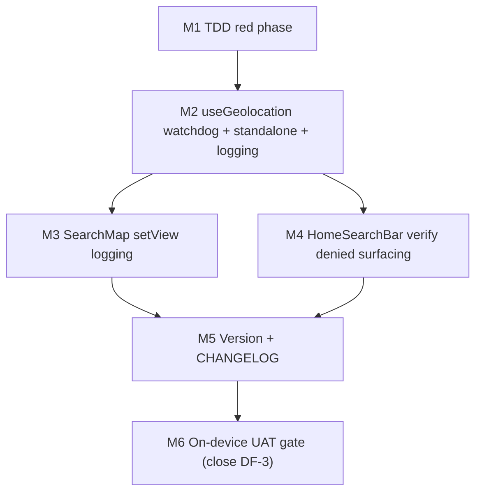

# Plan 215 — iOS PWA Geolocation Hang Fix (Near Me Never Resolves on iPhone SE)

**Target Release:** v0.15.16 (next available patch after v0.15.15; confirm at DevOps Stage 1)
**Epic Alignment:** Near Me discovery on the home map (Plan 212 refactor + Plan 209 denied-state guidance)
**Related Issues:** None (continues context of GitHub #316 Plan 212 and #319 Plan 209)

## Changelog

| Date (UTC)        | Agent   | Change |
| ----------------- | ------- | ------ |
| 2026-08-16T22:45Z | planner | Plan created from Analysis 215 (UUID 140019f7). Inherited ID/Origin 215. |
| 2026-08-16T23:30Z | code-reviewer | Code review completed | APPROVED_WITH_COMMENTS; one required guard fix in isStandaloneDisplayMode(). |
| 2026-08-16T23:25Z | qa | QA validation completed | QA Complete — all automated gates pass (50/50 targeted, 1906/1906 full suite, type-check, delta lint, build); on-device M6/DF-3 gate deferred to user iPhone SE with evidence checklist in QA doc. |
| 2026-08-16T23:50Z | devops | Status: Committed — Stage 1 lifecycle commit for release v0.15.16 (PR raised, CI verified); on-device M6 gate remains open until user validates |

---

## Value Statement and Business Objective

**As an** iPhone SE user running the ummahflow.com standalone PWA, **I want** tapping
"Near Me" on the home page to either pan the map to my location or, if location cannot
be resolved, to show me clear next-step guidance, **so that** I am never left with a
silently stuck chip and can discover nearby food providers on my primary mobile device.

The core value delivered is: **the geolocation request always reaches a terminal,
actionable state** — it resolves (map pans), or it fails with guidance (not a silent
hang). This closes the Plan 212 DF-3 gap that shipped v0.15.15 without on-device
validation.

---

## Plan Reference

- Analysis: `agent-output/analysis/215-near-me-iphone-se-analysis.md` (ID 215, UUID 140019f7)
- Prior implementation (contract): `agent-output/implementation/closed/212-near-me-pwa-fix-implementation.md`
- Prior implementation (denied hints): `agent-output/implementation/closed/209-near-me-denied-ux-guidance-implementation.md`
- Open action to close (DF-3): `agent-output/planning/212-near-me-pwa-fix-open-actions.md`

---

## Root Cause Summary

On iPhone SE standalone PWA, tapping Near Me reaches
`useGeolocation.requestLocation()` → `navigator.geolocation.getCurrentPosition()`.
iOS never shows the permission prompt and **never fires the success or error callback** —
the request hangs. `useGeolocation` status stays `prompting` forever, `userCoords` stays
`null`, `SearchMap.setView` never runs, the map never pans, and no stores appear. The chip
shows no terminal feedback because `denied`/`timeout`/`unavailable` are only reachable via
the error callback, which never fires.

The "font turns black" symptom is a CSS `:hover` effect (iOS simulates hover on tap), not a
state transition. The React wiring is intact and unit-tested (31/31 passing). The defect is
in the iOS standalone PWA geolocation runtime, which the app has no watchdog or fallback for.

Confirmed root cause classification (Analysis F4/F7/F9): **Plan 212 DF-3 gap CONFIRMED;
Plan 214 touch-interception overlap RULED OUT** (chip is tappable).

---

## Objectives

1. Add a client-side watchdog to `useGeolocation` that forces a terminal state when
   `getCurrentPosition` hangs (neither callback fires), so the chip never stays stuck in
   `prompting`.
2. Detect iOS PWA standalone mode and map the hung request to the correct terminal state
   (`denied` on standalone → reuse Plan 209 `permissionDeniedHintIos`; `timeout` elsewhere).
3. Ensure `HomeSearchBar` surfaces the terminal "location unavailable — check Settings"
   guidance from the watchdog (no new translation keys required; reuse existing denied hint).
4. Add Normal-level instrumentation: geolocation outcome `{ status, errorCode?, standalone,
   elapsedMs }` and `SearchMap` `setView` executed/skipped.
5. Bump version + CHANGELOG for the patch release.
6. Close Plan 212 DF-3 through an on-device iPhone SE validation gate with explicit evidence
   requirements (resolve the open questions that only device access can answer).

---

## Milestones

### M1 — TDD red phase: watchdog + standalone + instrumentation tests

Write failing tests before implementation, in the existing test files (no new test file
required; see TDD Requirements table).

**Acceptance criteria:**
- New tests in `src/__tests__/hooks/useGeolocation.test.ts` and
  `src/features/search/components/SearchMap.test.tsx` are present and **failing** against
  current `useGeolocation` / `SearchMap` code (red phase captured).
- Existing 31 tests across the four Near-Me suites remain passing (no regression introduced
  by test scaffolding).
- Tests use `vi.useFakeTimers()` for the watchdog; standalone detection is exercised via a
  stubbed `navigator.standalone` and `matchMedia`.

### M2 — Implement watchdog + standalone detection + outcome logging in `useGeolocation`

Primary fix. Add to `useGeolocation.ts`:

- A standalone-detection helper (exported for testing): `navigator.standalone === true` OR
  `matchMedia('(display-mode: standalone)').matches`, both guarded against absence in
  non-browser/jsdom contexts.
- A per-request client-side `setTimeout` (watchdog) armed when `requestLocation()` is called
  and cleared on success, error, `reset()`, and unmount. On expiry, force a terminal state:
  standalone → `denied`, otherwise → `timeout`.
- Normal-level outcome logging of `{ status, errorCode?, standalone, elapsedMs }` computed
  with `performance.now()` from request start.

**Acceptance criteria:**
- Hung `getCurrentPosition` (no callback) transitions out of `prompting` to a terminal state
  at the watchdog deadline; standalone → `denied`, non-standalone → `timeout`.
- Success/error callbacks before the deadline clear the watchdog and behave exactly as today
  (no double-fire, no late override).
- `reset()` clears an in-flight watchdog (no post-reset terminal transition; no
  setState-after-unmount warning).
- Outcome log emitted once per terminal transition; contains `standalone` boolean and
  `elapsedMs`; no PII.
- `PositionOptions` (`{ enableHighAccuracy: false, timeout: 10000, maximumAge: 5*60*1000 }`)
  remain unchanged; the watchdog supplements, not replaces, the browser timeout.

### M3 — `SearchMap` setView executed/skipped logging

Add Normal-level logging to the pan effect in `SearchMap.tsx`: log `setView(lat, lon, 14)`
on execution and `setView skipped (mapRef null)` when the map is not yet mounted.

**Acceptance criteria:**
- Log line emitted on the near-me pan path; skip log emitted when `userCoords` present but
  `mapRef` null. No behavior change to map panning.

### M4 — Verify `HomeSearchBar` terminal-state surfacing (expect no code change)

Confirm the watchdog's `denied` mapping surfaces Plan 209's `permissionDeniedHintIos` via the
existing `geoStatus === 'denied'` branch (`showNearMeDenied` / `showNearMeDeniedHint`).

**Acceptance criteria:**
- Documented verification that `denied` renders both "Standort nicht verfügbar" and the iOS
  Settings hint for iOS UA (existing `HomeSearchBar.test.tsx` cases cover this).
- **No new translation keys and no new `GeolocationStatus` value introduced** (KISS/YAGNI).
  If the UAT gate (M6) reveals the "blocked" wording is misleading (location actually set to
  "Allow" but still hanging), open a follow-up for a neutral wording — do not block this plan.

### M5 — Version bump + CHANGELOG

Bump `package.json` and `package-lock.json` to `0.15.16`, add a `CHANGELOG.md` entry under
`## [0.15.16] - 2026-08-16` describing the watchdog fix and instrumentation.

**Acceptance criteria:**
- Version consistent across `package.json`, `package-lock.json`, and CHANGELOG heading.
- CHANGELOG entry references Plan 215, the hang → terminal-state behavior, and the two
  Normal-level instrumentation lines.

### M6 — On-device UAT gate (closes Plan 212 DF-3)

Validation milestone requiring the user's iPhone SE. See the Validation/UAT Gate section for
the concrete evidence requirements.

**Acceptance criteria:**
- DF-3 evidence collected and recorded; open questions Q3/Q4/Q5 resolved (or explicitly
  recorded as unresolved with a follow-up plan).
- If UAT reveals the watchdog mapping needs refinement, a follow-up is logged — but the core
  "no silent hang" behavior is confirmed on device before release.

---

## Milestone Dependency Graph

---

## Decision Record

1. **[RESOLVED]** Use a client-side `setTimeout` watchdog as the primary fix: iOS standalone
   WKWebView suppresses the permission prompt and the error callback, so the browser
   `PositionOptions.timeout` is unreliable (Analysis F7/F9). A JS watchdog is the only
   guaranteed terminal path.
2. **[RESOLVED]** Watchdog deadline = **12,000 ms**, above the 10,000 ms browser timeout so
   well-behaved browsers resolve via the real error callback first, while iOS standalone gets
   a terminal state ~12 s after tap instead of hanging forever. (Tunable if UAT evidence
   warrants.)
3. **[RESOLVED]** Terminal-state mapping on watchdog expiry: **standalone → `denied`**
   (reuses Plan 209 `permissionDeniedHintIos` "check Settings" guidance), **otherwise →
   `timeout`**. No new `GeolocationStatus` value (YAGNI).
4. **[RESOLVED]** Standalone detection = `navigator.standalone === true` OR
   `matchMedia('(display-mode: standalone)').matches`, guarded for absence. Exported as a
   pure helper for testability.
5. **[RESOLVED]** No new translation keys; reuse existing `suchen.nearMe.permissionDenied*`
   keys (all 6 locales already populated).
6. **[DEFERRED: QA/UAT operator — revisit if a non-iOS hang is later reported]** Permissions
   probe via `navigator.permissions.query({ name: 'geolocation' })`: iOS Safari/WKWebView does
   not support geolocation permission query, so it adds no value for this bug; platforms where
   it works already fire the error callback correctly.
7. **[DEFERRED: QA/UAT operator — follow-up plan if evidence supports it]** Retry-on-fresh-
   gesture semantics (whether a second tap can elicit the suppressed prompt): speculative and
   needs an on-device experiment; out of scope for this fix.
8. **[RESOLVED]** Instrumentation at **Normal** level (low-volume, no PII): geolocation
   outcome `{ status, errorCode?, standalone, elapsedMs }` and `SearchMap` setView
   executed/skipped.

---

## TDD Requirements

Every behavioral change has a test written first. Test intents (all red-before-green):

| # | Test intent | File | Exercises |
|---|-------------|------|-----------|
| 1 | Watchdog forces terminal `timeout` when `getCurrentPosition` never calls back (non-standalone) | `src/__tests__/hooks/useGeolocation.test.ts` | hang → timeout |
| 2 | Watchdog forces `denied` when standalone + no callback (suppressed prompt) | `src/__tests__/hooks/useGeolocation.test.ts` | standalone → denied |
| 3 | Watchdog cleared when success fires before deadline (no post-grant override) | `src/__tests__/hooks/useGeolocation.test.ts` | timer teardown on success |
| 4 | Watchdog cleared when error fires before deadline | `src/__tests__/hooks/useGeolocation.test.ts` | timer teardown on error |
| 5 | `reset()` clears in-flight watchdog (no terminal transition after reset) | `src/__tests__/hooks/useGeolocation.test.ts` | reset/unmount safety |
| 6 | Standalone detection helper: `navigator.standalone` true, `matchMedia` standalone true, and false/absent cases | `src/__tests__/hooks/useGeolocation.test.ts` | platform detection |
| 7 | Outcome log emitted with `{ status, errorCode?, standalone, elapsedMs }` on terminal state | `src/__tests__/hooks/useGeolocation.test.ts` | instrumentation |
| 8 | `setView` executed/skipped logging | `src/features/search/components/SearchMap.test.tsx` | instrumentation |

Regression baseline: the existing 31 tests (SearchMap, HomeSearchBar,
plan212-near-me-viewport, useGeolocation) must remain green throughout.

---

## Files to Modify

| File | Change | Scope |
|------|--------|-------|
| `src/hooks/useGeolocation.ts` | Watchdog + standalone detection + outcome logging | Primary |
| `src/features/search/components/SearchMap.tsx` | `setView` executed/skipped logging | Instrumentation |
| `src/__tests__/hooks/useGeolocation.test.ts` | New watchdog/standalone/logging tests | Tests |
| `src/features/search/components/SearchMap.test.tsx` | setView logging test | Tests |
| `package.json` / `package-lock.json` | Version 0.15.15 → 0.15.16 | Versioning |
| `CHANGELOG.md` | Plan 215 entry | Versioning |

Expected **no change** (verify only): `src/features/search/components/HomeSearchBar.tsx`,
`src/components/shared/RootPageContent.tsx`. No translation files change.

---

## Instrumentation (Normal level, no PII)

- `useGeolocation` terminal outcome: `{ status, errorCode?, standalone, elapsedMs }`.
- `SearchMap`: `setView(lat, lon, 14)` executed vs `setView skipped (mapRef null)`.
- `errorCode` captures `1` (denied) / `2` (unavailable) / `3` (timeout) when the browser
  error callback fires; watchdog-forced transitions log a distinct marker so the two paths
  are distinguishable in production logs.

---

## Duration Estimates

| Phase | Range | Notes |
|-------|-------|-------|
| M1 TDD red | 1–2 h | Fake timers + standalone stubbing |
| M2 hook impl | 2–3 h | Core watchdog + logging |
| M3 SearchMap logging | 0.5–1 h | Trivial |
| M4 HomeSearchBar verify | 0.5 h | Verification only |
| M5 version + changelog | 0.5 h | Mechanical |
| M6 on-device UAT | 0.5–1 day | **Blocked on user device access** (human gate) |

Implementation total: **~1 day (0.5–1.5 days)**. Uncertainty drivers: whether the 12 s
deadline needs tuning from on-device evidence, and whether UAT reveals the `denied` mapping
needs a neutral wording (follow-up, not a blocker).

---

## Out of Scope

- **Plan 214 coordination — MOOT.** The chip is tappable (Analysis F4); no header z-index /
  pointer-events changes. This plan touches `useGeolocation` and `SearchMap` logging only, so
  no merge conflict with Plan 214.
- **Path B (`/providers` results) — not implicated** (Analysis F8); no change to
  `useNearMeToggle` / `useNearMeSearch` / RPC.
- **Distance-filtering of home-map pins (F2 product decision)** — defer to Product Owner.
- **Permissions probe** and **retry-on-fresh-gesture** — deferred (Decision Record #6, #7).
- **New translation keys / new `GeolocationStatus` value** — avoided (KISS/YAGNI).
- **Changing `PositionOptions.timeout` (10 s)** — left as-is; the watchdog supplements it.

---

## Risks / Open Questions

| # | Item | Status / Mitigation |
|---|------|---------------------|
| Q3 | Does the browser 10 s timeout fire on iOS standalone, or does the request hang past it? | UAT gate: user waits >12 s after tap and reports whether any message appears. Determines if the watchdog is the sole terminal path. |
| Q4 | Was location previously denied for ummahflow.com in Safari (inherited into PWA)? | UAT gate: user checks Safari → Settings → Location Services. Refines whether "blocked" wording is accurate. |
| Q5 | Does the prompt appear in regular (non-standalone) Safari for the same site? | UAT gate: open in Safari (not standalone), tap Near Me. Confirms the defect is standalone-specific. |
| R1 | `denied` hint says "blocked" but location may be "Allow" yet still hanging | Mitigated by UAT evidence (Q4); if "Allow" is already set, log a follow-up for a neutral wording — does not block release. |
| R2 | Watchdog timer leaks (setState after unmount / after reset) | Mitigated by clearing the timer on success, error, `reset()`, and unmount; covered by TDD intents #3–#5. |
| R3 | 12 s feels long for a failed request | Acceptable for a bugfix; tunable after UAT. A terminal state with guidance is strictly better than an infinite hang. |

---

## Validation / UAT Gate (on-device iPhone SE — closes Plan 212 DF-3)

Owner: UAT operator (human, device access). All scenarios run in the **standalone PWA** on
iPhone SE against the staged `0.15.16` build.

| Scenario | Action | Required evidence (accept =) |
|----------|--------|------------------------------|
| A. Hung → guidance (the bug) | Fresh install / cleared state, tap Near Me, wait 15 s | Chip transitions from pulsing `prompting` to a terminal state; iOS Settings hint ("Standort gesperrt…") appears; **no infinite hang**. Log shows `{ status, standalone: true, elapsedMs }`. |
| B. Happy path | Location enabled (Safari → Allow), tap Near Me | Permission prompt appears (or already allowed) and map pans to location at zoom 14 within 12 s; chip turns green. |
| C. Denied | Revoke location in Settings, tap Near Me | Immediate denied state + iOS hint (no hang). |
| D. Deactivate | With granted state, tap Near Me again | Map stays at local position; no centroid snap-back (regression from Plan 212). |
| E. Q3/Q4/Q5 evidence | See Open Questions | Recorded answers: browser-timeout behavior, Safari permission state, non-standalone comparison. |

DF-3 closure: on recording evidence for A–D, mark DF-3 resolved in
`agent-output/planning/212-near-me-pwa-fix-open-actions.md` (DevOps/QA closes it after release).

---

## Versioning Notes

- Version pre-flight: `origin/main` is `0.15.15` (HEAD `1cd6389a`); latest tag `v0.15.15`.
  Target = **0.15.16** (next available patch). Confirm at DevOps Stage 1.
- No release bundling conflict detected: no other non-closed plan in `agent-output/planning/`
  targets v0.15.16.

## Handoff Notes

- Branch-first rule: implementation occurs on `fix/215-<slug>` created from latest `main` at
  the Implementer handoff (not this planner's action).
- No QA process/test cases are defined here — QA owns test cases and QA docs.
- Rollback: the fix is additive (watchdog + logging); reverting the version bump restores
  prior behavior. No schema or data migration.

## Next Steps

- Architect review (expect APPROVED before Implementer handoff).
- On APPROVED: hand to Implementer on `fix/215-<slug>`; UAT gate (M6) requires the user's
  iPhone SE and blocks the DF-3 closure, not the code commit.
