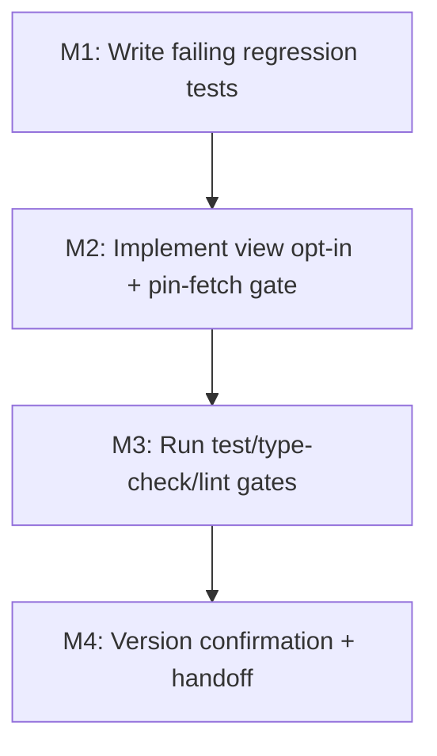

# Plan 216: Filter Button Redirects to Map Instead of Filter Page

## Changelog

| Date | Agent | Action | Notes |
|------|-------|--------|-------|
| 2026-08-17 | Planner | Plan created | Inherits ID/Origin 216 from analysis 216; bugfix pipeline Phase 2 |
| 2026-08-17 | Code Reviewer | Code review approved | Verdict: APPROVED; no blocking findings |

---

## Plan Header

| Field | Value |
|-------|-------|
| Plan ID | 216 |
| Target Release | v0.15.17 (next available patch after current origin/main `0.15.16`; confirm at DevOps Stage 1) |
| Epic Alignment | Search funnel — mobile filter access (regression of Plan 208) |
| Status | Active |
| Related Issues | #307 (Plan 208 "mobile map view with restaurant pins" — the commit `4c10e903` that introduced the regression); user bug report "filter button redirects to another map" (iPhone + desktop) |

---

## Value Statement and Business Objective

As a mobile user on iPhone and a desktop user, I want tapping the filter (sliders) button on the home searchbar (and the equivalent edit button on the results page) to show me the filter page with all filters (Wo / Was / Wer / Filter accordions), so that I can refine my search instead of being dropped onto a full-screen map with no way back.

This is the primary search-refinement funnel; when it silently renders a map on mobile, the core "find and filter providers" journey is blocked. The fix restores the filter page for filter-button entry while preserving the intentional mobile map view.

---

## Root Cause Summary (from analysis 216)

The filter button is correctly wired to navigate to `/search?section=food` (the filter page's correct path). The regression is at the destination: Plan 208 (`4c10e903`) made `/search` render a full-screen `SearchMap` whenever `isMobile && section === 'food'` (`src/app/(public)/search/page.tsx:591` + `:782-788`), replacing the filter accordions (`accordionBody`, lines 593-759) and hiding the back button (`:764`) and bottom action bar (`:792`).

Because the home searchbar defaults its active section to `food`, every filter-button tap on mobile lands on the map. There are two filter-button entry points — `HomeSearchBar.tsx:79-81` and `SearchContextBar.tsx:130-137` — plus an empty-query submit path (`HomeSearchBar.tsx:66`), all funneling into the same collision.

Key verified facts (L1 from analysis):
- No dedicated `/filter` route exists; the filter page **is** `/search` rendering `accordionBody`.
- The mobile home screen is itself already a map (`RootPageContent` defaults `viewMode` to `'map'`), so the `/search` map is a redundant second map from the user's perspective.
- No in-app entry point navigates to `/search` with an *intentional* "show me the map" intent; all discovered `/search` navigations are filter/search intents (`HomeSearchBar` sliders, `HomeSearchBar` empty submit, `SearchContextBar` edit, legacy `/suchen` redirect).
- Desktop (>= 768px) does not reproduce via the identified path — the buttons are mobile-only (`md:hidden` / `sm:hidden`) and `isMobileFoodMapMode` requires `window.innerWidth < 768`. The desktop report is carried to QA/UAT as gap G1 (see Risks).

---

## Intent Mechanism Decision

**Chosen mechanism: an explicit `?view=map` opt-in query parameter.** Map mode renders only when `view === 'map'`; every other value (absent, `filters`, unknown) renders the filter accordions.

- `search/page.tsx` reads a new `urlView` (`searchParams.get('view')`).
- The map predicate changes from `isMobile && selectedSection === 'food'` to `isMobile && selectedSection === 'food' && urlView === 'map'`.
- Default (no `view` param) is **filters**, so the filter buttons, the empty-query submit, the legacy `/suchen` redirect, and any direct URL to `/search?section=food` all show filters without any change to the buttons.
- The intentional map view is preserved via the deep-link `/search?section=food&view=map`.

**Why this is the cleanest option:**

1. **Single source of truth.** The bug lives entirely in the destination's render condition; fixing the predicate fixes all three entry paths at once (KISS, DRY). No need to touch `HomeSearchBar` or `SearchContextBar`.
2. **Preserves the Plan 208 feature.** The map remains reachable for any deliberate map entry (`?view=map`), satisfying "must be preserved for intentional map entry."
3. **Fail-safe.** Unknown/typo'd `view` values fall back to filters, not map — a wrong value can never strand the user on the map.
4. **No param collision.** Verified: no existing `view` query-param usage anywhere in `src/`.

**Alternatives considered and rejected:**

- *Add `?view=filters` to both buttons and keep map as the no-param default.* Rejected: touches two extra files, and makes the dangerous state (map) the default rather than the opt-in — worse for safety and more surface area (YAGNI).
- *Remove the `/search` mobile map entirely.* Rejected: violates the constraint to preserve the intentional map feature.
- *Add a back button / filter toggle inside map mode instead of fixing the destination.* Rejected: treats the symptom, leaves the filter button landing on the wrong screen, and does not satisfy "I want to see the filter page."
- *Key the mode on `referrer` or sessionStorage.* Rejected: stateful and fragile; a plain URL param is deterministic, shareable, and testable.

---

## Decision Record

| # | Decision | Status | Rationale |
|---|----------|--------|-----------|
| D1 | Intent is expressed via an explicit `?view=map` opt-in; absence or any non-`map` value renders filters. | [RESOLVED] | Single-source-of-truth fix at the destination; preserves the map feature; fails safe to filters. |
| D2 | The two filter buttons (`HomeSearchBar`, `SearchContextBar`) keep their existing URLs (`/search?section=…`) and are **not** modified. | [RESOLVED] | With map opt-in, the existing URLs already produce the correct (filters) result; changing them is redundant (YAGNI). |
| D3 | The map-pin fetch (`search/page.tsx:440-464`) is gated on map mode so pins are not fetched when filters are shown. | [RESOLVED] | After the fix, mobile-food default becomes filters; the existing effect would otherwise run a wasted Supabase query on every filter open (performance). |
| D4 | `view` is not added to the SectionSelector section-change navigation; it persists if present in the URL. | [RESOLVED] | Minimal change; a user who explicitly chose `view=map` keeps map intent across a section round-trip (see Edge Cases E5). |
| D5 | Desktop header `SearchBar` "Filter" pill is out of scope (it opens an in-place dropdown, not a navigation). | [RESOLVED] | It is a different control and does not route to `/search` (analysis F6). |
| D6 | The unresolved desktop repro (analysis G1/G2) is not resolved by this plan; it is carried forward to QA/UAT. | [DEFERRED: QA/UAT — reproduce at <768px viewport or clarify exact control with reporter; no target plan] | The mobile code path is fixed here; a true desktop-width repro has no code path to fix. |
| D7 | No `?view=filters` value is actively emitted by any component yet; `filters` is accepted only as a fail-safe default. | [DEFERRED: Planner/product — introduce explicit `view=filters` links only if/when a symmetric map↔filters toggle is added] | Keeps URL surface minimal now. |

---

## File Change List

### Files to modify (2)

**1. `src/app/(public)/search/page.tsx`** (destination render logic — the actual fix)
- Read the `view` query param alongside `section` (e.g., `urlView = searchParams.get('view')`).
- Change `isMobileFoodMapMode` to require `urlView === 'map'` in addition to `isMobile && selectedSection === 'food'`.
- Gate the map-pin fetch effect (currently `isMobile && selectedSection === 'food'`, lines 440-464) on the same map-mode condition so pins are fetched only when the map is actually rendered.
- No other change. The header (`:764`), body branch (`:782-788`), and bottom bar (`:792`) all derive from the same `isMobileFoodMapMode` predicate, so they fix automatically once the predicate is corrected.

**2. `src/__tests__/regression/plan208-mobile-search-map-switch.test.tsx`** (test updates + regression coverage)
- Extend the `useSearchParams` mock to include an optional `view` param (add a `mockView` variable; reset it in `beforeEach`).
- Update the two existing map-positive tests ("renders map on mobile for food section" and "[post-fix] passes provider pins…") to set `mockView = 'map'` so they still exercise the intentional-map path.
- Add the new regression tests listed in the TDD Plan below.

### Files explicitly NOT changed

| File | Why not |
|------|---------|
| `src/features/search/components/HomeSearchBar.tsx` | Button URL is already correct; unchanged. |
| `src/features/search/components/SearchContextBar.tsx` | Button URL is already correct; unchanged. |
| `src/app/(public)/suchen/page.tsx` | Legacy redirect; unchanged (lands on filters under the new default). |
| `src/components/shared/RootPageContent.tsx` | Home-screen map is a separate `SearchMap` instance, not part of this bug. |
| `src/features/search/components/SearchMap.tsx` | Component itself is fine. |
| `src/hooks/useIsMobile.ts` | Breakpoint logic unchanged. |
| `src/features/search/components/SectionSelector.tsx` | Section switching unchanged. |
| `src/components/layout/Header.tsx` / desktop `SearchBar.tsx` | Desktop filter pill is an in-place dropdown, out of scope (D5). |
| `src/app/(public)/search/page.test.tsx` | Existing assertions unaffected (no map/view assertions found in it). |

---

## State-Machine Coverage (conditional-render branch enumeration)

The bug is inside the conditional render at `search/page.tsx:782-788` (`isMobileFoodMapMode ? <SearchMap/> : accordionBody`) plus the two `!isMobileFoodMapMode` guards at `:764` (header/back) and `:792` (bottom bar). All three share the single predicate, so the following is the complete branch inventory after the fix:

| Branch | `isMobile` | `section` | `view` | Expected render | Disposition |
|--------|-----------|-----------|--------|-----------------|-------------|
| B1 | true | food | `map` | Map (header + bottom bar hidden) | Intentional map path — **preserved** (tested) |
| B2 | true | food | absent | Filters (header + bottom bar visible) | **Bug path — fixed** (primary regression test) |
| B3 | true | food | `filters` / any non-`map` | Filters | **Fixed** (fail-safe) — tested |
| B4 | true | ummah | any | Filters | Confirmed not broken (map never applied to non-food) |
| B5 | true | store | any | Filters | Confirmed not broken |
| B6 | false (desktop) | food | `map` | Filters (map requires `isMobile`) | Confirmed not broken — tested |
| B7 | false (desktop) | food | absent | Filters | Confirmed not broken (pre-existing desktop behavior) |
| B8 | true | food | `map` + SearchMap throws | Filters (ErrorBoundary fallback = `accordionBody`) | Confirmed not broken; fallback unchanged |

The ErrorBoundary (`:783`) still wraps `SearchMap` with `fallback={accordionBody}`, so map-mode failure degrades to filters — no change needed. Only B2 and B3 (and the derived header/bottom-bar visibility) are the paths being fixed; B1 and B4-B8 are confirmed intact and covered to prevent over-correction.

---

## TDD Plan (developer tests written first)

Write/update these tests before touching the source, and confirm they fail for the right reason, then implement, then confirm green. (These are the implementer's red-green-refactor unit tests; formal QA test cases remain QA's domain.)

**In `src/__tests__/regression/plan208-mobile-search-map-switch.test.tsx`:**

1. `[pre-fix FAILS / post-fix PASSES] mobile food without view param renders filters, not map`
   - `mockIsMobile = true`, `mockSection = 'food'`, `mockView` unset.
   - Assert `queryByTestId('search-map')` is **not** in the document (pre-fix: it IS — this is the bug).
   - Assert the filter accordion content is present (e.g., the "Wo" accordion title renders).
2. `[pre-fix FAILS / post-fix PASSES] mobile food with view=filters renders filters, not map`
   - `mockView = 'filters'`; assert map absent and accordions present.
3. `renders map on mobile food when view=map` (updated existing test)
   - `mockView = 'map'`; assert `search-map` present (intentional map preserved).
4. `does not render map on desktop even with view=map` (updated/extended existing desktop test)
   - `mockIsMobile = false`, `mockView = 'map'`; assert `search-map` absent.
5. `[post-fix] passes provider pins to SearchMap when view=map` (updated existing test)
   - `mockView = 'map'`; assert pins flow through.
6. `[post-fix] does not fetch pins when filters shown (mobile food, no view)` (optional but recommended)
   - `mockView` unset; assert the `supabase.from('locations')` chain is **not** invoked.

**In `src/__tests__/features/search/HomeSearchBar.test.tsx`** (no functional change required — existing assertions already pin the URL — add one guard):

7. `[post-fix PASSES] sliders button does not append a view=map param`
   - Assert `mockPush` was called with exactly `/search?section=food` (i.e., the argument does **not** contain `view=map`). This locks in that filter-button intent remains map-off.

**In `src/features/search/components/SearchContextBar.test.tsx`** (no change required; existing test at line 131-141 already asserts the edit button navigates to `/search?section=ummah` with no `view` param — this is now, and remains, the filters default).

---

## Edge Cases

- **E1 — `section !== 'food'` on mobile (Ummah/Stores):** map never renders (B4/B5). Ummah/Stores are also inactive (`SECTION_META` → toast). Unchanged by this plan.
- **E2 — Direct URL `/search?section=food` on mobile (deep link/bookmark):** now renders filters (B2) — this is the correct, consistent behavior and matches desktop. Previously rendered map.
- **E3 — Direct URL `/search?section=food&view=map`:** renders map (B1) — intentional map preserved.
- **E4 — Viewport resize crossing 768px:** `useIsMobile` recomputes on resize (throttled 100ms). Map mode requires `isMobile`, so shrinking below 768px while on `/search?section=food` (no `view`) now shows filters instead of flipping to map; crossing the threshold in either direction only toggles the map when `view=map` is present. No extra work needed — the predicate already depends on live `isMobile`.
- **E5 — `view=map` persists across section switches:** `handleSectionChange` copies existing params, so `view=map` survives a round-trip to Ummah/Stores and back to Food (re-enters map). Accepted for this bugfix; flagged in D7 for a future map↔filters toggle.
- **E6 — Empty-query submit path:** `HomeSearchBar` empty-query Enter navigates to `/search?section=food` (no `view`), so it now correctly shows filters, not map (B2). This was a second latent bug and is fixed by the same predicate change.
- **E7 — ErrorBoundary fallback:** if `SearchMap` throws in map mode, `accordionBody` (filters) renders (B8). Unchanged; already the safety net.
- **E8 — Unknown `view` value (e.g., `view=Map`):** fails safe to filters (B3). No user can be stranded on the map by a malformed link.

---

## Milestones

Single-layer frontend fix (no backend/API/DB), so the dependency graph is linear; no multi-layer blocking.

**M1 — Regression tests first**
- Update `plan208-mobile-search-map-switch.test.tsx` (mock `view`, update 2 map-positive tests, add tests 1, 2, 4, 6).
- Add guard test 7 to `HomeSearchBar.test.tsx`.
- Run `npx vitest run src/__tests__/regression/plan208-mobile-search-map-switch.test.tsx src/__tests__/features/search/HomeSearchBar.test.tsx` and confirm the new tests fail (red).

**M2 — Implement the fix**
- Edit `search/page.tsx`: read `view`, update the map predicate, gate the pin fetch.
- Re-run the targeted tests; confirm green.

**M3 — Full gates**
- `npm test`
- `npm run type-check`
- `npm run lint`
- Confirm no unrelated test regressions (especially `SearchContextBar.test.tsx`, `search/page.test.tsx`, `plan212-near-me-viewport.test.tsx`).

**M4 — Version management + handoff**
- Confirm Target Release `v0.15.17` against current origin/main at DevOps Stage 1.
- Update this plan's changelog with any version change; hand off to Architect for review (gate integrity: do not proceed to Implementer until an explicit APPROVED verdict).

---

## Testing Strategy (high level — no test cases)

- **Unit tests (Vitest + Testing Library):** the destination render decision (`search/page.tsx`) and the filter-button URL guards. This is the core coverage and the primary bug mirror.
- **Regression tests:** extend the existing `plan208-mobile-search-map-switch.test.tsx` to pin the new opt-in semantics so the map feature is not lost while the bug is fixed.
- **Type/lint gates:** `npm run type-check` and `npm run lint` as static-analysis backstops.
- Manual browser validation (iPhone width, desktop width, 768px crossing, `?view=map` deep link) remains a QA/UAT responsibility.

---

## Duration Estimates

| Phase | Estimate | Notes |
|-------|----------|-------|
| M1 regression tests | 0.5-1 hr | Straightforward mock + assertions |
| M2 implementation | 0.5-1 hr | Two-line predicate change + effect gating |
| M3 gates | 0.5-1 hr | Test run + type-check + lint |
| M4 handoff | 0.25 hr | Version confirm + changelog |
| **Total** | **~1.5-3.5 hrs** | Well under the <3-day / <10-file guideline |

**Uncertainty drivers:** whether the pin-fetch gating (D3) is folded into M2 or deferred; whether the optional pin-fetch test (test 6) is included; QA/UAT time for the unresolved desktop repro (G1) is outside this plan.

---

## Risks & What the Code Reviewer Should Check

**Risks:**

1. **Over-correction removing the map feature entirely.** Mitigation: B1 (`view=map`) keeps the map; regression test 3 pins it.
2. **Missing the second latent bug (empty-query submit).** Mitigation: B2 covers all no-`view` entry paths; E6 documents it; test 1/2 assert filters.
3. **Wasted Supabase pin query after the fix.** Mitigation: D3 gates the fetch on map mode.
4. **`view=map` persisting across section switches (E5)** is accepted behavior, not a bug — reviewer should not "fix" it without a product decision (D7).
5. **Unresolved desktop report (G1/G2)** remains open; this plan fixes only the mobile code path. Reviewer should confirm the plan does not claim to fix a true desktop-width repro.

**Code Reviewer checklist focus:**

- Predicate change is confined to `search/page.tsx` and is the single source of truth (no duplicate logic in the buttons).
- `urlView` is read safely from `useSearchParams`; `view=map` comparison is exact; non-`map` fails safe to filters.
- Pin-fetch effect is correctly gated and its dependency array is updated (no stale-closure on `urlView`).
- No accidental changes to the header (`:764`), bottom bar (`:792`), or ErrorBoundary (`:783`) — they should still key off the same predicate.
- Tests fail pre-fix and pass post-fix (red-green evidence), and the map-preservation test (test 3) remains green.
- No change to `HomeSearchBar`/`SearchContextBar` URLs (confirm the "do NOT change" list is respected).

---

## Handoff Notes

- This is a bugfix pipeline (Phase 2 of 6). Next: **Architect for review**. Do not hand off to Implementer until the architecture review records an explicit APPROVED verdict (gate integrity).
- Branch-first rule: create `fix/216-filter-button-redirect` from latest `main` at Implementer handoff (not in this phase).
- Analysis G1/G2 are carried forward to QA/UAT (D6) — not resolved here.

---

*Status: Active. Inherits ID/Origin 216 from analysis 216. DevOps closes this document after successful commit.*
