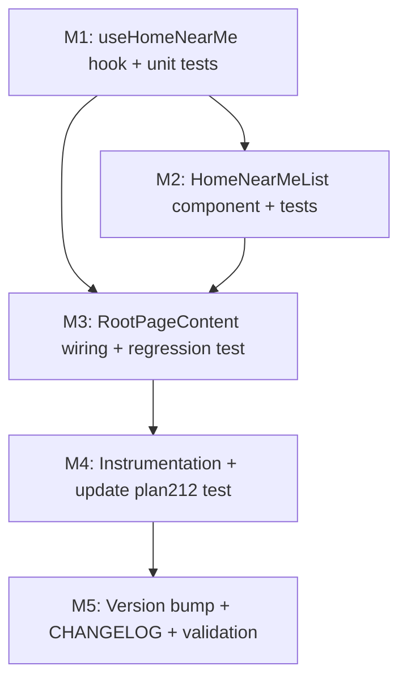

# Plan 217 — Fix "Near me" on the Home List View

| Field | Value |
| --- | --- |
| Plan ID | 217 |
| Target Release | next available patch after `v0.15.17` on `origin/main` → **v0.15.18** (preliminary; confirm at DevOps Stage 1) |
| Epic Alignment | Mobile Stage 2/3 discovery home — "near me" discovery affordance |
| Status | Code Review Approved |
| Related Issues | None (internal bug report; no GitHub/Jira ticket on file) |
| Pipeline | Bugfix (Analyst → **Planner** → Implementer → Code Reviewer → QA → DevOps) |
| Analysis Reference | [217-near-me-bug-analysis.md](../analysis/217-near-me-bug-analysis.md) — root cause L1 proven |

## Changelog

| Date (UTC) | Agent | Action |
| --- | --- | --- |
| 2026-08-17 | Planner | Opened plan from analysis 217. Target release v0.15.18. |
| 2026-08-17 | Code Reviewer | Code review completed. Verdict: APPROVED. One MEDIUM finding (loading-state flash on activation) + two LOW findings routed to QA as awareness. |

---

## Value Statement and Business Objective

**As a mobile user** on the home screen (root `/`, Stage 2/3), **I want** to tap the "In der Nähe / Near me" chip while in List view and see providers reordered nearest-first and limited to those within 25 km — with a distance label on each card, **so that** I can find nearby providers without switching to the map or manually reading addresses.

This plan makes the home **List branch** consume the same near-me signal the Map branch already uses, by reusing the proven `search_food_near_me` RPC (deployed and live on DEV, PROD-expected). It delivers the product decision confirmed with the user: **reorder nearest-first AND radius-filter (≤25 km), same UX as the search page (ProviderCard `distanceKm` badge)**. The Map view behavior is left unchanged.

---

## Version Pre-Flight

```
git tag --list "v*" | sort -V | tail -5   → v0.15.13 … v0.15.17
git show origin/main:package.json | grep version → 0.15.17
```

Target release: **v0.15.18** = next available patch after `0.15.17` on `origin/main`; confirm at DevOps Stage 1.

**Release bundling check**: scanned `agent-output/planning/` for other non-closed plans targeting v0.15.18 — **none found**. No `## Release Strategy` section required.

---

## Decision Record

| # | Decision | Status | Rationale |
| --- | --- | --- | --- |
| D1 | Reuse the `search_food_near_me` RPC for the home List branch (not client-side haversine over `pins`) | [RESOLVED] | RPC is live, already distance-ordered, and enforces server-side radius clamp (≤25 km) + nearest-location-per-provider + hard result cap. Client-side sort of `pins` would lack the radius clamp and duplicate the RPC's haversine logic. |
| D2 | Fixed radius = 25 km (no radius-pill UI on home) | [RESOLVED] | Product decision is ≤25 km; the home near-me chip is a simple toggle (no radius selector exists today). The RPC clamps `LEAST(p_radius_km, 25)` server-side anyway. |
| D3 | New hook `useHomeNearMe` uses a simple `useEffect` fetch, **not** React Query / the search page's `useNearMeSearch`+`useNearMeToggle` stack | [RESOLVED] | Home has no URL-param near-me state (the search hooks are URL-driven and don't fit), and `RootPageContent` already loads `allRows` via a plain `useEffect` fetch — consistent, simpler, and avoids a `QueryClientProvider` dependency in `RootPageContent` tests. YAGNI: no caching/stale-time need for a once-per-granted-session list. |
| D4 | New `HomeNearMeList` component rather than reusing `NearMeResultsGrid` | [RESOLVED] | `NearMeResultsGrid` couples results to bookmarks (`bookmarkedProviderIds` + `onBookmarkChange`), which the home List view does not render today. Reusing it would introduce bookmark affordances that don't exist on the non-near-me home list (UX inconsistency + scope creep). A thin home component reuses `ProviderCard`/`SkeletonGrid`/`EmptyState` instead. |
| D5 | Show the distance badge on home near-me cards | [RESOLVED] | Product decision: "same UX as the search page." `ProviderCard` already accepts `distanceKm` (confirmed, `ProviderCard.tsx:46,77,205,455-459`). |
| D6 | Open-now chip stays client-side and order-preserving on the near-me path | [RESOLVED] | Reuse `filterOpenNow` (already applied to `pins` and to search-page near-me results). It is order-preserving, so distance ordering survives open-now filtering (same rationale as Plan 196 Critic F4). |
| D7 | Migration 122 / Plan 204 category-field drift (F6) is out of scope for this fix | [DEFERRED: DevOps + owner — applies migration 122 to DEV RPC; target: independent DB-drift remediation, no version] | The home list is written defensively (category `?? ''` fallback, mirroring `NearMeResultsGrid`) so it is safe whether or not category fields are present. |
| D8 | Keep the home Map branch untouched | [RESOLVED] | Map centering via `SearchMap.setView` is already functional and QA'd (Plans 208/209/212). No regression surface should be opened. |

---

## Behavior Specification

### Near-me granted (List view)

When `viewMode === 'list'` **and** `geolocation.status === 'granted'` with coords:

- The List branch renders **distance-ordered, radius-filtered** results from `search_food_near_me({ lat, lon, radiusKm: 25 })`, nearest first (the RPC returns `ORDER BY distance_km ASC`).
- Each card shows the distance badge via `ProviderCard distanceKm` (reuses `formatDistance`).
- The "Open now" chip, if also active, filters these results client-side via `filterOpenNow` (order preserved; distance-ordered open providers only).

### Near-me off / denied / unavailable / timeout / prompting / idle (List view)

- Current behavior unchanged: `HomeListView` renders the existing unordered `pins` (open-now-filtered as today).

### Map view (any geolocation state)

- Unchanged: `SearchMap` receives `pins` + `userCoords` and centers/zooms as it does today.

### RPC path states (all three required by repo conventions)

| State | UI | Reuses |
| --- | --- | --- |
| Loading | `SkeletonGrid count={8}` inside the fixed inset scroll wrapper | `SkeletonGrid` |
| Error | `EmptyState` (`suchen.nearMe.errorTitle` / `suchen.nearMe.errorLoading`) + retry button (`suchen.nearMe.retry`) → `refetch` | `EmptyState`, existing i18n keys |
| Empty | `EmptyState` (`suchen.nearMe.emptyTitle` / `suchen.empty.noNearby`) | existing i18n keys |

Note: the existing `suchen.nearMe.emptyTitle` string reads "No **open** restaurants nearby", which is technically imprecise when the open-now chip is off (near-me alone with zero results within 25 km). This matches the search page's existing behavior; flagging for QA/UAT awareness rather than changing i18n strings in this bugfix.

---

## Wiring Design

### Where near-me state meets the List view

The home page's near-me state lives in `RootPageContent` (`geolocation` → `userCoords`). The List branch (`HomeListView`) currently receives only `pins`. The fix adds a **second, list-specific consumer** of `userCoords` without touching `SearchMap`.

Three pieces:

1. **`useHomeNearMe(coords, enabled, openNowActive)`** (new hook) — the single new source of near-me list data.
2. **`HomeNearMeList`** (new component) — renders `NearMeFoodResult[]` with distance badges.
3. **`RootPageContent`** — computes `enabled = viewMode === 'list'` and conditionally renders `HomeNearMeList` instead of `HomeListView` when near-me is active.

`HomeListView` is left **completely unchanged** (no new props), so its existing behavior and any tests are untouched.

### Hook contract (`useHomeNearMe`)

```
Input:  coords: { lat, lon } | null      (already-computed userCoords)
        enabled: boolean                  (= viewMode === 'list')
        openNowActive: boolean            (existing isOpenNow state)
Output: isActive: boolean                 (enabled && coords !== null)
        results: NearMeFoodResult[]       (RPC output, open-now filtered, order preserved)
        isLoading: boolean
        error: Error | null
        refetch: () => void
```

Behavior:
- Fetches only when `isActive` (effect keyed on `isActive`/`coords`; guard against stale responses with an effect-cleanup "cancelled" flag).
- Calls `searchFoodNearMe({ lat, lon, radiusKm: 25 })` (import from `@/services/providers`).
- Applies `filterOpenNow(results, openNowActive)` — order-preserving.
- Emits `home_list_nearme_*` instrumentation (see Instrumentation).

### Component contract (`HomeNearMeList`)

```
Props:  results: NearMeFoodResult[]
        isLoading: boolean
        error: Error | null
        headerOffset: number
        onRetry: () => void
```

- Mirrors `HomeListView`'s layout wrapper exactly (fixed inset scroll container, `paddingTop: headerOffset`, same bottom padding, same 2-col grid) so the list scrolls under the header identically.
- Maps `NearMeFoodResult[]` → `ProviderCard` the same way `NearMeResultsGrid` does (category `?? ''` fallback for F6 safety, `distanceKm={result.distance_km}`, `hideWebsiteButton={true}`), but **without** bookmark props (consistent with the existing home list).
- Uses `useRouter` internally for `router.push(\`/providers/${provider_id}\`)` (matches `HomeListView`, keeps props minimal).

### Why not the search page's hook stack

`useNearMeSearch` + `useNearMeToggle` are **URL-param-driven** (`near_lat`/`near_lon`/`near_radius`/`open_now`) and section-scoped to `food` via the search provider. The home page has no such URL state and must not introduce one (the home near-me chip already uses in-memory `geolocation` state). Copying that two-hook + `router.replace` machinery would be worse than the small adapter above (DRY vs. YAGNI/KISS — the simpler adapter wins).

---

## State-Machine / Conditional-Render Coverage (mandatory)

The bug lives inside a conditional render block (`viewMode === 'list'`). All state/branch paths are enumerated; none are "unverified":

| Branch | Near-me effect after this fix | Status |
| --- | --- | --- |
| `list` + `granted` (coords present) | Render `HomeNearMeList` (distance-ordered, ≤25 km, distance badge) | **FIXED** |
| `list` + `idle` / `prompting` / `denied` / `unavailable` / `timeout` | Render `HomeListView` with existing unordered `pins` | Unchanged (confirmed not broken) |
| `map` + any status | `SearchMap` centers/zooms via `userCoords` | Unchanged (confirmed functional, Plans 208/209/212) |

There is no third `viewMode` branch, and no other geolocation status value. The near-me chip remains visible in the shared header in both branches (unchanged).

---

## Milestones

> M1 → M2 → M3 → M4 → M5 (M2 depends on M1; M3 depends on M1+M2; M4 depends on M3; M5 depends on all)



### M1 — `useHomeNearMe` hook (TDD)
- Create `src/features/search/hooks/useHomeNearMe.ts` per the contract above.
- Create `src/__tests__/hooks/useHomeNearMe.test.tsx` first (red), then implement (green).

### M2 — `HomeNearMeList` component (TDD)
- Create `src/features/search/components/HomeNearMeList.tsx`.
- Create `src/__tests__/features/search/HomeNearMeList.test.tsx` first (red), then implement (green).

### M3 — `RootPageContent` wiring + regression test (TDD)
- Wire the hook + conditional render (see File-by-file below).
- Create `src/__tests__/regression/plan217-near-me-list.test.tsx` first (red), then wire (green).

### M4 — Instrumentation + update existing tests
- Add `home_list_nearme_*` logging (see Instrumentation).
- Update `src/__tests__/regression/plan212-near-me-viewport.test.tsx` with additive mocks.

### M5 — Version & release artifacts
- Bump `package.json` + `package-lock.json` → `0.15.18` (preliminary).
- Add `CHANGELOG.md` entry under `[Unreleased]`.
- Run `npm run type-check`, `npm run lint`, `npx vitest run`, `npm run build`.

---

## File-by-File Change List (implementation order)

| # | File | Action | Rationale |
| --- | --- | --- | --- |
| 1 | `src/features/search/hooks/useHomeNearMe.ts` | **Create** | Single source of near-me list data; reuses `searchFoodNearMe` + `filterOpenNow`; effect-based fetch consistent with `RootPageContent`'s existing `allRows` load. |
| 2 | `src/__tests__/hooks/useHomeNearMe.test.tsx` | **Create** | Unit tests for the hook (TDD). |
| 3 | `src/features/search/components/HomeNearMeList.tsx` | **Create** | Renders `NearMeFoodResult[]` with `distanceKm`; mirrors `HomeListView` layout; no bookmarks. |
| 4 | `src/__tests__/features/search/HomeNearMeList.test.tsx` | **Create** | Component tests (loading/error/empty/grid + distance badge + order). |
| 5 | `src/components/shared/RootPageContent.tsx` | **Modify** | Add `useHomeNearMe` + `HomeNearMeList`; compute `enabled = viewMode === 'list'`; conditional render in the `viewMode === 'list'` branch. |
| 6 | `src/__tests__/regression/plan217-near-me-list.test.tsx` | **Create** | Regression wiring test (pre/post-fix expressions). |
| 7 | `src/__tests__/regression/plan212-near-me-viewport.test.tsx` | **Modify** | Add `vi.mock` for `useHomeNearMe` (inactive) + `HomeNearMeList` (stub) — same pattern it already uses for `HomeListView`. |
| 8 | `package.json`, `package-lock.json` | **Modify** | Version bump → `0.15.18` (preliminary). |
| 9 | `CHANGELOG.md` | **Modify** | Plan 217 entry under `[Unreleased]`. |

`RootPageContent.tsx` change (conceptual — ILLUSTRATIVE ONLY, not prescriptive):

```tsx
const homeNearMe = useHomeNearMe({
  coords: userCoords,
  enabled: viewMode === 'list',
  openNowActive: isOpenNow,
});

// in the list branch:
{viewMode === 'list' && (
  homeNearMe.isActive ? (
    <HomeNearMeList
      headerOffset={headerHeight}
      isLoading={homeNearMe.isLoading}
      error={homeNearMe.error}
      results={homeNearMe.results}
      onRetry={homeNearMe.refetch}
    />
  ) : (
    <HomeListView
      headerOffset={headerHeight}
      isLoading={pinsLoading}
      isOpenNow={isOpenNow}
      pins={pins}
    />
  )
)}
```

The Map branch (`<SearchMap pins={pins} userCoords={userCoords} />`) is unchanged.

---

## TDD-First Test Plan

Implementation-time unit/regression coverage. Functional/QA test cases and manual device QA are **QA's exclusive domain** and are not defined here.

### New test files

**1. `src/__tests__/hooks/useHomeNearMe.test.tsx`** (mock `@/services/providers` `searchFoodNearMe`; use real `filterOpenNow` with controlled `opening_hours`)
- `[post-fix PASSES]` inactive when `coords === null` → `isActive: false`, `results: []`, no RPC call.
- `[post-fix PASSES]` inactive when `enabled === false` (map view) even with coords → no RPC call.
- `[post-fix PASSES]` active calls `searchFoodNearMe` with `{ lat, lon, radiusKm: 25 }`.
- `[post-fix PASSES]` preserves RPC distance order (returns mocked results in input order, no re-sort).
- `[post-fix PASSES]` open-now interplay: with `openNowActive: true`, `filterOpenNow` filters to open-only and preserves order; with `false`, results pass through unchanged.
- `[post-fix PASSES]` error propagation: RPC rejects → `error` set, `results: []`.
- `[post-fix PASSES]` `refetch()` re-invokes the RPC.

**2. `src/__tests__/features/search/HomeNearMeList.test.tsx`** (mock `ProviderCard` to a stub capturing props)
- `[post-fix PASSES]` loading → `SkeletonGrid`.
- `[post-fix PASSES]` error → error message + retry button; clicking retry calls `onRetry`.
- `[post-fix PASSES]` empty → empty-state message.
- `[post-fix PASSES]` renders a card per result **in the given order** (assert captured provider_ids order = results order → distance order).
- `[post-fix PASSES]` each card receives `distanceKm = result.distance_km` (distance badge shown).

**3. `src/__tests__/regression/plan217-near-me-list.test.tsx`** (mirror plan212's mock set; mock `useHomeNearMe` returning controlled active/inactive + results)
- `[pre-fix FAILS / post-fix PASSES]` near-me granted + list view renders the near-me list component (not `HomeListView`) — this is the core pre/post-fix expression: **pre-fix** the list rendered `HomeListView` with identical `pins` whether or not near-me was granted; **post-fix** granting near-me switches the list branch to the near-me results.
- `[pre-fix FAILS / post-fix PASSES]` near-me denied/idle + list view renders `HomeListView` (unchanged), near-me list NOT rendered.
- `[post-fix PASSES]` map view with granted coords still renders `SearchMap`, near-me list NOT rendered (map unchanged).

### Existing tests that would break (and the required fix)

- **`src/__tests__/regression/plan212-near-me-viewport.test.tsx`** — renders `RootPageContent` and mocks `HomeListView`. After this plan, `RootPageContent` also imports `useHomeNearMe` and `HomeNearMeList`. **Fix**: add two mocks (additive, no assertion changes):
  - `vi.mock('@/features/search/hooks/useHomeNearMe', () => ({ useHomeNearMe: () => ({ isActive: false, results: [], isLoading: false, error: null, refetch: vi.fn() }) }))`
  - `vi.mock('@/features/search/components/HomeNearMeList', () => ({ HomeNearMeList: () => <div data-testid="home-near-me-list" /> }))`
  - Rationale: keeps plan212 isolated from the new list consumer; its two geolocation assertions (requestLocation/reset) remain valid and unchanged.

- **`src/__tests__/components/RootPageContent.layout-regression.test.tsx`** — does **not** mock `HomeListView`/`SearchMap`, but renders in default `map` view, so the near-me list never renders. Verify it still passes; if the new `HomeNearMeList`/`useHomeNearMe` imports add an unresolved transitive dependency, add the same two mocks as plan212. (Expected: passes as-is, since `useHomeNearMe` is `enabled:false` in map view and `ProviderCard` is already in the module graph via `HomeListView`.)

- **`src/__tests__/regression/plan208-mobile-search-map-switch.test.tsx`** — renders `SearchPage` (`/search`), **not** `RootPageContent`. No impact.

---

## Instrumentation

Add `home_list_nearme_*` events so the List-branch consumer is observable in production (closes analysis gap #4). All via `logApp` (`@/lib/logger`).

| Event | Level | Emitted from | Payload |
| --- | --- | --- | --- |
| `home_list_nearme_activated` | info | `useHomeNearMe` (on fetch start) | `{ lat (truncated), lon (truncated), radiusKm, viewMode }` |
| `home_list_nearme_success` | info | `useHomeNearMe` (on success) | `{ resultCount, radiusKm }` |
| `home_list_nearme_error` | error | `useHomeNearMe` (on error) | `{ error: message }` |
| `home_list_nearme_skipped` | info | `RootPageContent` (when `viewMode==='list'` and `userCoords===null`, once per transition) | `{ status }` |

`home_list_nearme_skipped` makes the "List branch active but near-me not granted" state observable — the complement of `geolocation_outcome` (already logged in `useGeolocation`) and `searchmap_setview_executed/skipped` (already logged in `SearchMap`), which today has no List-branch equivalent.

---

## Open Items (for Implementer / QA to verify)

1. **`ProviderCard` `distanceKm` prop signature** — confirmed present (`ProviderCard.tsx:46` `distanceKm?: number`, rendered at line 455-459 with `data-testid="provider-distance"`). Verify no drift in the current `main` before relying on it.
2. **`NearMeResultsGrid` reuse constraints** — confirmed NOT reused (bookmark coupling, D4). If a reviewer later wants bookmark parity on the home list, that is a separate feature decision, not this bugfix.
3. **Category props vs F6 drift** — `HomeNearMeList` must build the `category` object with `category_name_de ?? category_name_en ?? ''` and `category_images ?? undefined` (mirroring `NearMeResultsGrid.tsx:92-96`). On DEV the RPC may omit category fields (migration 122 not applied to DEV RPC); this fallback keeps cards rendering. DevOps to confirm PROD has migration 122 applied (out of scope here — see Out of Scope).
4. **Empty-state i18n wording** — `suchen.nearMe.emptyTitle` says "open restaurants" even when open-now is off. Confirm whether to accept (matches search page) or add a near-me-only empty string in a follow-up.
5. **`logApp` availability on the client** — `logApp` is a no-op-safe client logger (`@/lib/logger.ts`); confirm it's safe to call from `useHomeNearMe` in the browser bundle (it is — same logger `useGeolocation` uses).

---

## Out of Scope

- **DB migrations** — none; the RPC already exists.
- **PROD migration-122 drift** — DevOps concern (flagged, not part of this fix).
- **Map view changes** — `SearchMap` behavior is left untouched.
- **Bookmark affordances on the home list** — intentionally not added (D4).
- **Radius-pill UI on home** — no radius selector; fixed 25 km (D2).

---

## Mandatory Checks (N/A declarations)

- **Shared Results Actionability Check** — N/A: the home List view has no inline per-row actions; results are single-type (`NearMeFoodResult` → providers only).
- **Entity Ownership Check** — N/A: no `providers` rows are created/modified/enriched/moderated; read-only discovery.
- **Removal Surface Enumeration** — N/A: no user-visible capability is removed/deprecated/hidden.
- **Schema Mutation Inventories** — N/A: no enum rename, column drop, or table rename.
- **Third-Party Source Verification** — N/A: no third-party public source is imported.

---

## Duration Estimates

| Phase | Effort | Notes |
| --- | --- | --- |
| M1 hook + tests | 0.5 day | Small, well-scoped hook. |
| M2 component + tests | 0.5 day | Mirrors `HomeListView`/`NearMeResultsGrid`; minor layout duplication accepted (see D4). |
| M3 wiring + regression test | 0.5–1 day | `RootPageContent` has many mocked deps; most effort is test harness. |
| M4 instrumentation + plan212 update | 0.25–0.5 day | Additive mocks + log calls. |
| M5 version + validation | 0.25 day | type-check / lint / vitest / build. |
| **Total** | **~2–2.75 days** | |

**Uncertainty drivers**: `plan212` mock surface; `ProviderCard` real-render verification of the distance badge; DEV-vs-PROD category-field drift (defensive handling, D7).

---

## Testing Strategy (high-level; QA owns concrete cases)

- **Unit** (Vitest): hook logic (activation, RPC args, radius, order preservation, open-now interplay, error, refetch) and component states (loading/error/empty/grid/order/distance badge).
- **Regression** (Vitest + React Testing Library): the pre-fix/post-fix expression — activating near-me in List view now changes the rendered list; denied/idle and Map paths unchanged.
- **Static**: `npm run type-check` + `npm run lint`.
- **Build**: `npm run build`.
- **Manual device pass (QA/UAT)**: real-device geolocation grant/deny on the home List view at 320px width; distance ordering and ≤25 km radius clamp observed live. Not defined here (QA domain).

---

## Rollback Considerations

- The fix is additive and isolated behind `viewMode === 'list' && granted`. Rolling back the `RootPageContent` wiring change restores the prior behavior with no schema or service change.
- `HomeListView`, `SearchMap`, `useGeolocation`, `searchFoodNearMe`, and `filterOpenNow` are unmodified, so rollback risk is confined to the three new/changed client files.

## Handoff Notes

- Branch: create `feature/217-near-me-list-fix` (or `fix/217-…`) from latest `main` before implementation (branch-first rule).
- Gate for next phase: Architect review must record an explicit APPROVED verdict before Implementer handoff.
- Target release is preliminary; DevOps Stage 1 confirms `0.15.18` against `origin/main`.
