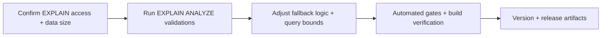

# 008 — Search Index Validation & Fallback Guards

## Changelog

| Date              | Agent       | Change                         | Rationale                                                                                              |
| ----------------- | ----------- | ------------------------------ | ------------------------------------------------------------------------------------------------------ |
| 2026-02-22        | Planner     | Plan created from Analysis 008 | Close remaining performance gaps: index validation + bounded fallbacks                                 |
| 2026-02-22        | Implementer | Status → In Progress           | Beginning implementation. Version confirmed v0.4.1 by user.                                            |
| 2026-02-22T22:20Z | QA          | Status → QA Complete           | Automated gates pass; acceptance criteria met; ready for UAT                                           |
| 2026-02-22T22:20Z | UAT         | Status → UAT Approved          | APPROVED FOR RELEASE — implementation delivers stated value; index validation proves GIN effectiveness |

## Target Release: v0.4.1 (tentative)

## Epic Alignment

- Supports the Master Product Objective by keeping discovery fast and trustworthy.
- Follow-up hardening after Plan 007 (v0.4.0) performance improvements.

## Value Statement and Business Objective

As a **mobile service seeker**, I want **search to remain fast and consistent even under edge conditions**, so that **I can discover providers and community services without delays or surprising results**.

## Objective

Close the remaining high-value performance gaps identified in Analysis 008:

1. **Prove** GIN indexes are used (EXPLAIN ANALYZE)
2. **Prevent unnecessary ILIKE fallbacks**, especially when RPC returns empty results
3. Reduce payload/scan risk in fallbacks (explicit selects + limits)
4. Document rationale for key query limits to reduce future maintenance risk

## Scope

**In scope**

- Database-side validation of the search indexes added in migration 056
- Service-layer hardening for fallback logic and fallback query bounding:
  - `src/services/communityServices.ts`
  - `src/services/needs.ts`
  - `src/services/offers.ts`
- Documentation of limit constants/rationale in the above services and in migration 056 helper RPCs
- Version and release artifacts for the patch release

**Out of scope**

- Cursor-based pagination refactors (defer)
- Broad replacement of `select('*')` across non-hot paths (defer)
- Middleware size reduction work (defer)

## Success Metrics (Acceptance Criteria)

- [ ] **Index usage proven**: `EXPLAIN (ANALYZE, BUFFERS)` confirms the search predicates use the intended GIN indexes (no sequential scan on representative data sizes).
- [ ] **No fallback-on-empty**: community services search does **not** run ILIKE when full-text RPC returns an empty result set (fallback only on errors / function-missing).
- [ ] **Fallback queries bounded**: all ILIKE fallbacks have explicit column selects and a sane limit aligned with UX needs.
- [ ] **Limit rationale documented**: the limits (e.g., 100/500/1000) have short comments stating the UX/ops reason.
- [ ] Quality gates: `npm test`, `npm run type-check`, `npm run lint`, `npm run build` all pass.
- [ ] Version artifacts updated consistently for the target release.

## Assumptions

- UAT/staging environment access exists to run `EXPLAIN (ANALYZE, BUFFERS)` against the database.
- Representative data exists (or can be seeded) such that index usage is observable (order-of-magnitude 10k+ rows for searched tables).
- Patch release (v0.4.1) is acceptable for these changes (no UX changes intended).

## Milestone Dependencies

Sequencing rule: DB validation should happen before code changes so fixes are driven by real query plans.

## Plan

### Milestone 1 — Environment & Baseline (Required)

**Objective**: Ensure we can run DB query-plan validation meaningfully.

**Deliverables**

- Confirm where EXPLAIN will be executed (Supabase SQL editor in UAT/staging, or local `supabase db` against a restored dataset).
- Confirm approximate row counts for `providers` and `community_services` (document the numbers used for validation).

**Acceptance**

- A single place/process exists to run EXPLAIN for this plan.

### Milestone 2 — DB Index Validation (P0, Required)

**Objective**: Prove the indexes added in migration 056 are effective.

**Deliverables**

- Execute `EXPLAIN (ANALYZE, BUFFERS)` on representative queries matching:
  - provider-name full-text predicate used by `search_provider_ids_by_name`
  - community-services name+description full-text predicate used by `search_community_services_enhanced`
- Record the resulting query-plan summary (index scan vs seq scan) and execution time.

**Acceptance**

- Query plans show index usage for full-text predicates on representative datasets.
- If index usage is not observed: document the reason (e.g., too-small dataset, planner choice) and the required follow-up.

### Milestone 3 — Fallback Logic Hardening (Required)

**Objective**: Prevent expensive and inconsistent fallback behaviors.

**Deliverables**

- Update community services search flow so that:
  - ILIKE fallback happens **only** on RPC error / function-missing
  - RPC returning an empty array results in an empty result set (no fallback query)
- Ensure fallbacks are bounded and consistent with UX.

**Acceptance**

- No ILIKE query executes when RPC succeeds with an empty result set.

### Milestone 4 — Bound & Slim Fallback Queries (Required)

**Objective**: Reduce payload size and scan risk in the rare fallback path.

**Deliverables**

- Replace `select('*')` in needs/offers fallback queries with explicit columns.
- Add explicit `.limit(...)` for fallback queries aligned with the RPC limit.

**Acceptance**

- Fallback queries cannot return unbounded rows.
- Returned fields match what the UI needs.

### Milestone 5 — Document Limit Rationale (Required)

**Objective**: Reduce maintenance ambiguity around limits.

**Deliverables**

- Add short comments near the key limits (100/500/1000) explaining rationale (UX, safety, load).

**Acceptance**

- A maintainer can quickly understand why each limit exists.

### Milestone 6 — Validation (Required)

**Objective**: Ensure the patch is safe and releasable.

**Deliverables**

- Run automated gates: tests, lint, type-check, production build.

**Acceptance**

- All gates pass.

### Milestone 7 — Version & Release Artifacts (Required)

**Objective**: Align artifacts with the target release.

**Deliverables**

- Bump version (expected: `0.4.1`).
- Add CHANGELOG entry summarizing:
  - EXPLAIN validation executed and outcome
  - fallback-on-empty removed
  - fallback queries bounded and slimmed

**Acceptance**

- Version and changelog are consistent.

## Validation Notes (Non-QA)

- DB: `EXPLAIN (ANALYZE, BUFFERS)` results saved in the implementation/uat artifacts.
- App: `ANALYZE=true npm run build` optional sanity check (target already met, but ensures no regression).

## Risks

- Changing fallback behavior could slightly change edge-case search results (only in “no matches” cases).
- EXPLAIN results may differ between small vs representative datasets; data sizing is critical.

## Rollback

- Code changes are revertible by git.
- DB changes are additive-only for this plan (no index drops expected).

## Duration Estimates

- Analysis: 0.5–1.5 hours (complete; Analysis 008)
- Planning: 0.5–1.0 hours
- Implementation: 2–4 hours
- QA: 0.5–1.0 hours
- UAT: 0.5–1.0 hours (depends on DB access + dataset)
- DevOps: 0.5–1.0 hours

Uncertainty drivers: ability to run EXPLAIN in UAT/staging and having representative row counts.

## Open Questions

- **OPEN QUESTION**: Confirm target release version.
  - Proposal: v0.4.1 (package.json is currently 0.4.0; this is patch-sized hardening)
- **OPEN QUESTION**: Where will EXPLAIN ANALYZE be executed (UAT Supabase SQL editor vs local restored DB)?
- **OPEN QUESTION**: Do we have representative data volumes for `providers` and `community_services`, or do we need a seed/import step?
