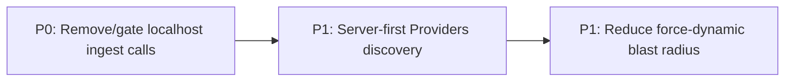

# 010 - Next.js App Router Refactor (Best Practices)

**Target Release**: v0.5.0
**Epic Alignment**: Cross-cutting quality refactor supporting "trust-first discovery" reliability and performance (Architecture Findings: `agent-output/architecture/010-nextjs-app-router-best-practices-architecture-findings.md`)
**Status**: Committed for Release v0.5.0

**Release Rationale**: v0.5.0 is chosen to align with the roadmap’s current working release and to group this meaningful App Router boundary/caching refactor into a single release train.

## Changelog

| Date       | Agent  | Change              | Rationale |
| ---------- | ------ | ------------------- | --------- |
| 2026-02-23 | planner | Initial plan created | Deliver P0 safety + P1 App Router alignment for discovery |
| 2026-02-23 | planner | Address critique F1/F3 | Add duration estimates + explicit caching semantics |
| 2026-02-23 | code-reviewer | Status: Code Review Approved | All P0+P1 objectives met; 0 CRITICAL/HIGH findings; 2 MEDIUM optional improvements |
| 2026-02-22 | qa | Status: QA Complete | Tests/type-check/delta-lint/build gates passed; ready for UAT value validation |
| 2026-02-23 | uat | Status: UAT Approved | Value statement delivered; APPROVED FOR RELEASE (v0.5.0) |
| 2026-02-23 | devops | Status: Committed | Commit 9316f72 created; documents closed; ready for release bundling |
| 2026-02-23 | devops | Status: Released | v0.5.0 tagged and pushed; commit 9316f72 live on origin/main |

---

## Value Statement and Business Objective

As a UFlow service seeker, I want faster and more reliable discovery pages (especially Providers search) with fewer client-side failures, so that I can find halal services quickly and trust the app to work consistently across devices and network conditions.

---

## Objective

Deliver P0+P1 improvements from Architecture 010 without changing UX:

- **P0 Safety**: Remove or strictly gate localhost “agent log” network calls from client code.
- **P1 App Router Alignment**: Move Providers discovery to a server-first model (server-render initial results; client only for interactivity/pagination).
- **P1 Caching Discipline**: Reduce the blast radius of `dynamic = 'force-dynamic'` where feasible, keeping dynamic behavior only where truly required.

---

## Scope

### In Scope

- Remove/gate localhost ingest calls in splash-related client components.
- Refactor Providers discovery route to server-first initial render.
- Introduce a server boundary for incremental pagination (route handler or Server Action), keeping client bundle minimal.
- Re-evaluate `force-dynamic` usage at:
  - `src/app/layout.tsx`
  - `src/app/page.tsx`
  - `src/app/(public)/providers/page.tsx`
  - `src/app/waitlist/page.tsx`

### Out of Scope (Explicit)

- UI redesign, new features, or new pages.
- Replacing Supabase, adding Redis/Elastic, or non-Postgres-first services.
- Broad migration away from React Query across the entire app (focus only on Providers discovery path).

---

## Assumptions

- Providers search continues to rely on Postgres full-text search via RPC (no `ILIKE`-based search).
- Bookmarks and user-specific data remain protected by RLS and session context.
- The production build must not contain runtime behavior that attempts to call `127.0.0.1` from user devices.

---

## Duration Estimates

Rough phase-level estimates (uncertainty drivers: hydration mismatch debugging, caching correctness, pagination boundary choice).

- **Analysis**: 0.25–0.5 day (confirm current `/providers` data flow + bookmark constraints)
- **Planning**: 0.25 day (this plan + critique-driven clarifications)
- **Implementation**: 2–5 days
  - P0 localhost-ingest removal/gating: 0.5–1 day
  - P1 server-first `/providers` initial render + pagination boundary: 1–3 days
  - P1 reduce `force-dynamic` blast radius + validation: 0.5–1 day
- **QA**: 1–2 days (regression on discovery, bookmarks, auth/language)
- **UAT**: 0.5–1 day
- **DevOps**: 0.25–0.5 day (release grouping + artifacts)

---

## Milestone Dependencies

Sequencing rule: Begin Providers server-first work after P0 safety cleanup is merged to keep debugging noise out of perf/caching measurements.

---

## Plan

### 1) P0 Safety: Remove/Gate localhost ingest calls

**Objective**: Ensure the client bundle does not attempt localhost network calls in production.

**Tasks**:

- Identify all occurrences of `127.0.0.1:7243/ingest` in `src/`.
- Replace with one of:
  - Full removal, OR
  - A small telemetry helper that is **disabled by default** and only enabled via an explicit debug env var / runtime flag.

**Acceptance Criteria**:

- No `127.0.0.1:7243/ingest` references remain in production-facing code paths.
- No new runtime errors introduced in splash/onboarding flows.

**Primary Targets**:

- `src/components/shared/SplashContent.tsx`
- `src/components/shared/MobileSplashScreen.tsx`

---

### 2) P1 App Router: Server-first Providers discovery

**Objective**: Render the first page of Providers discovery results on the server (Server Component), preserving current UX while reducing client bundle size and improving time-to-content.

**Tasks**:

- Split Providers discovery into:
  - Server parent: fetch initial results and render empty/error states server-side.
  - Client child: handle interactions that must stay client-side (infinite pagination, URL param syncing, bookmark toggles, router navigation).
- Move the **initial search query** from `useInfiniteQuery` to server execution.
- Introduce a server boundary for pagination requests:
  - Route handler under `src/app/api/...` OR
  - Server Action (if compatible with current routing + caching needs).
- Ensure search continues using Postgres full-text RPC functions through the services layer.

**Acceptance Criteria**:

- `GET /providers` shows initial results without waiting for client-side fetch.
- Infinite pagination still works and yields the same result ordering.
- Client bundle for `/providers` is reduced (measured via existing build/analyze tooling if available).
- Bookmarks behavior remains correct for authenticated users.

**Primary Targets**:

- `src/app/(public)/providers/page.tsx`
- `src/app/(public)/providers/ProvidersContent.tsx` (expected to be split/renamed into server+client pieces)
- `src/services/providers.ts` and/or `src/services/providers.server.ts` (ensure server-safe query path)

---

### 3) P1 Caching Discipline: Reduce `force-dynamic` blast radius

**Objective**: Keep dynamic rendering only where required (session/language/feature-flag correctness), and allow caching where safe.

**Tasks**:

- Re-assess why `dynamic = 'force-dynamic'` is set globally in `src/app/layout.tsx`.
- Where possible, move dynamic needs into narrower segments:
  - Session-dependent reads should be isolated to routes that require them.
  - Language detection should not force every route to be dynamic if it can be derived from stable inputs.
- For Providers discovery, define caching semantics explicitly:
  - What can be cached (public search results) vs what must be per-user (bookmarks, personalization).

**Caching Semantics (Explicit)**:

- **Never cache personalized HTML**: any response that includes user-specific state (e.g., bookmarks) must not be rendered into cacheable server HTML.
- **User-specific data** (bookmarks): must be fetched per-user (client-side after hydration, or via a user-scoped server request) and treated as `no-store`.
- **Public discovery results** (unauthenticated):
  - Default browse state (no free-text query): cacheable with a short TTL (recommend 60 seconds) to reduce backend load while staying fresh.
  - Arbitrary free-text queries (`q` present): treat as `no-store` to avoid unbounded cache key growth and unpredictable caching behavior.

**Acceptance Criteria**:

- Fewer routes/layouts are forced dynamic without losing correctness.
- No regressions in authentication-dependent UI or language directionality.

---

### 4) Version Management and Release Artifacts

**Objective**: Ensure release artifacts reflect the v0.5.0 release grouping.

**Tasks**:

- Coordinate with the Roadmap/DevOps flow so Plan 010 is included in the v0.5.0 release train.
- Update versioned artifacts at release cut time:
  - `package.json` version to `0.5.0` (if not already done by the release coordinator)
  - `CHANGELOG.md` entry referencing Plan 010

**Acceptance Criteria**:

- Release artifacts are consistent (single version across repo).
- CHANGELOG includes a concise entry for the refactor and safety cleanup.

---

## Validation (Engineering)

- `npm run type-check`
- `npm run lint:check`
- `npm test`
- `npm run build`

---

## Testing Strategy (High Level Only)

- Unit tests for any new telemetry gating helper(s) and server/client boundary utilities.
- Integration-level coverage for pagination boundary (route handler or server action), focusing on typed responses and error handling.
- Component-level coverage (RTL) for Providers discovery initial render and basic interactions.

---

## Risks and Mitigations

- **Hydration mismatch risk** when splitting Providers into server+client: mitigate by keeping the client child responsible for browser-only state and avoiding server-only imports in client files.
- **Caching/correctness regression** when reducing `force-dynamic`: mitigate by narrowing changes to a small set of routes and validating auth/language behavior.
- **Bookmark security**: ensure any server-rendered bookmarks remain user-scoped; avoid leaking user-specific info into cached HTML.

---

## Rollback Plan

- If server-first Providers discovery introduces regressions, revert to the existing client-driven Providers implementation while keeping the P0 localhost ingest cleanup.

---

## OPEN QUESTIONS [CLOSED]

None.
