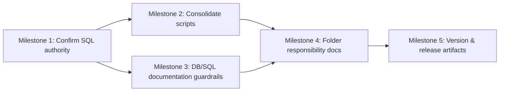

# Plan 011 — Repo Structure Refactor (No UX Change)

**Target Release**: v0.6.0
**Epic Alignment**: Platform maintainability / contributor velocity (supports Master Product Objective)
**Status**: Released (v0.6.0, 2026-02-23)

## Changelog

| Date       | Agent         | Change                                 | Rationale                                                                                                            |
| ---------- | ------------- | -------------------------------------- | -------------------------------------------------------------------------------------------------------------------- |
| 2026-02-23 | planner       | Initial plan created                   | Turn Arch 011 findings into scoped, incremental refactor work                                                        |
| 2026-02-23 | implementer   | Status → In Progress                   | Implementation started; OPEN QUESTION resolved (sql/migrations is archival only)                                     |
| 2026-02-23 | implementer   | Status → Implementation Complete       | All 5 milestones done; validation passed (type-check, lint, tests, build)                                            |
| 2026-02-23 | code-reviewer | Status → Code Review Approved          | 0 findings (CRIT/HIGH/MEDIUM); validation clean; documentation quality exceeds expectations                          |
| 2026-02-23 | qa            | Status → QA Complete (PASS_WITH_NOTES) | Type-check/tests/build pass; follow-ups: update setup-uat DB doc + add Plan 011 to roadmap v0.6.0 tracker            |
| 2026-02-23 | uat           | Status → UAT Approved                  | Value delivered: placement rubric + folder READMEs eliminate "where should this go?" ambiguity; APPROVED FOR RELEASE |
| 2026-02-23 | devops        | Status → Committed for Release v0.6.0  | Local commit 42eab19; 23 files (1350 ins, 175 del); docs-only changes; awaiting release bundle                       |
| 2026-02-23 | devops        | Status → Released                      | Stage 2: v0.6.0 released (bundled with Plan 012); CHANGELOG updated, tag created/pushed                              |

## Value Statement and Business Objective

As a **contributor (core dev or community)**,
I want **a predictable repository structure with clear folder responsibilities**,
so that **I can ship features quickly with lower regression risk and less time spent hunting code**.

## Objective

Deliver a small, low-risk structure cleanup that:

- Clarifies folder responsibilities (reduce “where should this go?” ambiguity)
- Removes the most confusing duplicate roots (scripts + SQL/migrations authority)
- Keeps Next.js App Router server/client boundaries safe (no accidental server-only imports into client code)

## Inputs / References

- Architecture findings: [agent-output/architecture/011-repo-structure-architecture-findings.md](agent-output/architecture/011-repo-structure-architecture-findings.md)
- App Router audit (boundary constraints): [agent-output/architecture/010-nextjs-app-router-best-practices-architecture-findings.md](agent-output/architecture/010-nextjs-app-router-best-practices-architecture-findings.md)
- Repo conventions: [.github/copilot-instructions.md](.github/copilot-instructions.md)
- Roadmap release tracker: [agent-output/roadmap/product-roadmap.md](agent-output/roadmap/product-roadmap.md)

## Scope

### In Scope

1. Make folder responsibilities explicit (short READMEs / notes where contributors look first)
2. Consolidate scripts location (remove `src/scripts/` by moving its contents to root `scripts/`)
3. Clarify “authoritative” database migration location (Supabase migrations are canonical)
4. Add a small set of guardrails in docs to prevent boundary drift recurring

### Out of Scope (Explicit)

- No UX changes, UI redesigns, or new pages
- No feature work (this is structure-only)
- No mass move of all domain components from `src/components/*` into `src/features/*` in this release
- No new infrastructure/services (e.g., Redis/queues/search engines)

## Assumptions

- Root `scripts/` is the intended home for dev/ops tooling scripts.
- `supabase/migrations/` is the only migration source applied in CI/CD and production workflows.
- `sql/` contains reference/debug/one-off utilities and is not executed automatically in deployment.

## OPEN QUESTION (Requires confirmation before implementation)

1. Is anything in `sql/migrations/` currently executed as part of UAT/prod setup scripts?
   - If **yes**, we must either (a) migrate those SQL files into `supabase/migrations/`, or (b) explicitly document and gate the execution path.
   - If **no**, we can safely re-label/re-home `sql/migrations/` as non-authoritative reference.

## Milestone Dependencies

Sequencing rule: documentation and small moves can proceed immediately after SQL authority is confirmed.

## Plan (Milestones)

### Milestone 1 — Confirm DB migration authority

**Objective**: Ensure there is exactly one “source of truth” for migrations.

- Tasks
  - Audit deploy/setup scripts and docs for any reference to `sql/migrations/` execution.
  - Decide (based on evidence) whether `sql/migrations/` is archival/reference-only.

- Acceptance Criteria
  - A single statement exists in docs: “Authoritative migrations live in `supabase/migrations/`.”
  - Any discovered execution path referencing `sql/migrations/` is either removed or explicitly documented and justified.

- Owner: Implementer (with DevOps input)
- Dependencies: None

### Milestone 2 — Consolidate scripts (remove `src/scripts/`)

**Objective**: Eliminate confusion between runtime code and dev scripts.

- Tasks
  - Move `src/scripts/*` into root `scripts/`.
  - Update any references/imports (if any) to the moved scripts.
  - Add a short note in `scripts/README` (or a new short file) stating: scripts are not runtime modules.

- Acceptance Criteria
  - `src/scripts/` no longer exists (or is empty and removed).
  - No build/test regressions.

- Owner: Implementer
- Dependencies: None

### Milestone 3 — Clarify SQL folder purpose

**Objective**: Prevent accidental “two migration systems” drift.

- Tasks
  - Add/update a short README in `sql/` describing what belongs there (debug queries, exports, one-offs) and what does not (authoritative migrations).
  - If `sql/migrations/` remains, re-label it as `sql/archive/migrations/` (or similar) _only if_ it is confirmed not to be executed.

- Acceptance Criteria
  - A contributor can tell in <30 seconds where schema changes go.
  - No deployment process relies on the non-authoritative location.

- Owner: Implementer
- Dependencies: Milestone 1

### Milestone 4 — Document and reinforce folder responsibilities

**Objective**: Reduce boundary drift between `src/components/` and `src/features/`.

- Tasks
  - Add a short `src/components/README.md` explaining:
    - `ui/`, `common/`, `shared/`, `layout/` are shared building blocks
    - domain UI should move toward `src/features/<domain>/components` over time
  - Add a short `src/features/README.md` describing the feature-module intent.
  - Add one small “placement rubric” to docs (where to put: UI, hooks, services, supabase queries, migrations).

- Acceptance Criteria
  - New contributors have a single clear reference for “where should I add this file?”
  - No code behavior changes are required to adopt the docs.

- Owner: Implementer (Architect consult as needed)
- Dependencies: Milestones 2–3

### Milestone 5 — Update version and release artifacts

**Objective**: Ensure the refactor is correctly tracked for the v0.6.0 release train.

- Tasks
  - Add a CHANGELOG entry summarizing structural changes (no UX change).
  - Coordinate with Roadmap agent to include Plan 011 in the v0.6.0 release batch.
  - Confirm package version bump is done once per release (DevOps responsibility).

- Acceptance Criteria
  - CHANGELOG contains an entry referencing Plan 011.
  - Roadmap release tracker reflects the plan’s inclusion in v0.6.0.

- Owner: DevOps (version), Roadmap agent (release assignment), Implementer (CHANGELOG entry)
- Dependencies: Milestone 4

## Validation (Non-QA)

- `npm run type-check`
- `npm run lint:check`
- `npm test`

## Risks & Rollback

- Risk: Large import churn from moves → Mitigation: keep changes mechanical and scoped; land as a single PR.
- Risk: Server/client boundary violations → Mitigation: ensure moved files do not change module directives; re-run type-check and build.
- Rollback: revert the PR (moves are file-system only).

## Duration Estimates (Rough)

- Analysis: 0.5–1.0 hours (confirm `sql/migrations` usage paths)
- Planning: 0.5–1.0 hours (this document, plus scope lock)
- Implementation: 2–5 hours (moves + docs + references)
- QA: 0.5–1.0 hours (existing automated suites)
- UAT: 0–1.0 hours (only if any runtime behavior unexpectedly affected)
- DevOps: 0.5–1.0 hours (release bookkeeping; CHANGELOG + version consistency at release)

Uncertainty drivers: whether `sql/migrations` is currently part of any environment bootstrap.
