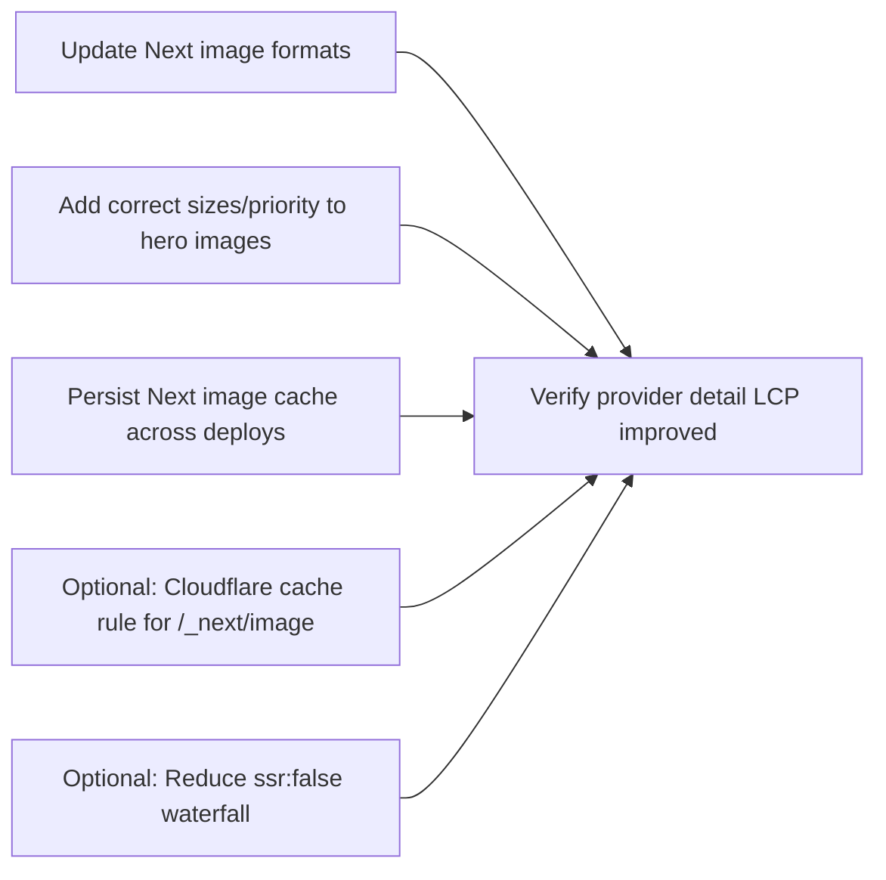

# Plan 034: Fix Provider Detail Page Image Load Latency

**Target Release**: v0.6.12 (patch)  
**Epic Alignment**: Performance + Trust-first discovery (provider profile credibility)  
**Related Issues**: None  
**Status**: Committed  
**Source Analysis**: `agent-output/analysis/034-provider-image-loading-analysis.md`

**Changelog**:

- 2026-03-07 | devops | Status → Committed | Stage 1 commit — all Plan 034 changes committed locally for release v0.6.12; documents closed |
- 2026-03-07 | uat | Status → UAT Approved | APPROVED FOR RELEASE — value delivered; cold load latency eliminated by design; timing targets deferred to post-deploy smoke test |
- 2026-03-07 | qa | Status → QA Complete | Automated gates pass; ready for UAT validation |
- 2026-03-07 | code-reviewer | Status → Code Review Approved | Finding 1 (CI/CD workflows missing volume mount) fixed in-review |
- 2026-03-07 | implementer | Status → In Progress | Implementation started |
- 2026-03-07 | planner | Created plan for v0.6.12 | Based on Analysis 034 | Initial draft |

---

## Value Statement and Business Objective

As a **desktop user browsing provider profiles**, I want the **provider hero image to load quickly (not >10s)**, so that I can **evaluate trust and make a contact decision without delay**.

Business objective: Provider images are the primary trust signal on the detail page; reducing image LCP latency should increase profile engagement and contact intent.

---

## Objective

Eliminate multi-second image delays on `/providers/[provider_id]` (desktop and mobile), especially after deployments, by addressing the confirmed root causes from Analysis 034.

**Measurable success criteria**:

- **Cold load (post-deploy / cache-miss)**: hero image request completes and renders in **< 500ms** on desktop for typical provider images.
- **Warm load (same URL requested again)**: hero image request completes in **< 200ms** and should not trigger server-side re-encoding.

---

## Target Release Rationale

- Repository version is currently `0.6.11` (`package.json`).
- This is a production-facing performance regression/defect with direct UX impact; a patch release is appropriate.
- Roadmap’s “Current Version” field is known to lag; confirm release grouping in the Roadmap/DevOps workflow before shipping.

---

## Release Strategy

Standalone (no other known active plans targeting v0.6.12 in `agent-output/planning/`).

---

## Assumptions

- Provider images are stored in Supabase Storage as public URLs (current create flow uses `getPublicUrl`).
- UAT/prod run in Docker standalone mode on Hetzner (Next.js server handles `/_next/image`).
- Cloudflare is in front of the origin and currently does not cache `/_next/image` by default.

---

## Milestone Dependencies

Sequencing rule: Land the lowest-risk, highest-impact changes first (formats + sizes), then address deployment/cache persistence, then optional CDN/SSR improvements.

---

## Plan

### 1) Baseline and Repro Confirmation

**Objective**: Make the regression measurable and confirm the “cold image” path.

**Tasks**:

- Capture a before baseline on UAT for at least one affected provider profile:
  - Page load timing (LCP if available; otherwise time-to-first-image-render)
  - `/_next/image` request timing (TTFB + total time)
- Confirm whether the problem is consistently worst after deployment (cold `.next/cache/images`) vs subsequent visits.

**Acceptance Criteria**:

- Baseline numbers and a short “cold vs warm” observation recorded for the implementer/QA handoff.

---

### 2) Reduce Compute Cost: Prefer WebP Over AVIF

**Objective**: Remove AVIF cold-encode latency as the dominant contributor.

**Tasks**:

- Adjust Next.js image `formats` so that the origin avoids AVIF encoding on the server (WebP-only or WebP-first, per implementer judgment).

**Acceptance Criteria**:

- First request for a previously-uncached provider hero image no longer takes multiple seconds due to server-side encoding (target: **< 500ms** cold load per Objective).
- No functional regression in image rendering across major browsers.

**Risk**: Low. Tradeoff is slightly larger images vs AVIF, but with substantially better worst-case latency.

---

### 3) Reduce Requested Dimensions: Add Correct `sizes` (and missing `priority`)

**Objective**: Prevent Next.js from requesting very large widths (e.g., `w=3840`) for a ~704px desktop hero container.

**Tasks**:

- Add explicit `sizes` to the provider hero image(s):
  - Desktop path (`ProviderDetailModal`) uses a fixed-width image pane; size hint should reflect the real rendered width.
  - Mobile path (`ProviderDetailPage`) uses a smaller container; size hint should reflect the real rendered width.
- Ensure the first hero image has `priority` on any above-the-fold path where it’s missing.

**Acceptance Criteria**:

- On desktop, the hero image request width matches the actual display width (no oversized downloads/encodes).
- No visual regressions (layout, cropping, CLS) and skeleton-to-image transition remains correct.

**Risk**: Low.

---

### 4) Persist Optimized Image Cache Across Deployments

**Objective**: Prevent post-deploy “cold start” behavior where all images re-encode.

**Tasks**:

- Update deployment configuration so `.next/cache/images/` persists across container restarts/deployments (e.g., volume mount).
- Confirm filesystem permissions for the runtime user allow cache writes.

**Acceptance Criteria**:

- After a deployment, visiting the same provider image twice shows a clear warm-cache improvement.
- Cache persistence survives container restart.

**Risk**: Medium. Requires coordination with deployment infrastructure and correct permissions/paths.

**Rollback (if this introduces issues)**:

1. Remove/disable the `.next/cache/images/` volume mount.
2. Restart the container(s) to return to stateless runtime behavior.
3. Keep Milestones 2–3 in place (WebP + `sizes`) so that cold encodes remain fast even without persistence.

---

### 5) Optional: Edge Caching for `/_next/image`

**Objective**: Reduce origin load and latency by caching optimized image responses at the CDN.

**Tasks**:

- Configure Cloudflare Cache Rule for `/_next/image*` honoring origin `Cache-Control` headers (or an explicit rule), while ensuring no caching of user-specific content.

**Acceptance Criteria**:

- Second request for the same `/_next/image` URL returns `CF-Cache-Status: HIT`.

**Risk**: Low-to-medium. Must ensure no sensitive responses are cached (should be safe for image optimization responses).

---

### 6) Optional: Reduce the “ssr:false” Waterfall for Above-the-Fold Content

**Objective**: Start the hero image request earlier in the load timeline.

**Tasks**:

- Re-evaluate whether the desktop provider hero content can be server-rendered (fully or partially), or otherwise started earlier (without changing UX).

**Acceptance Criteria**:

- Provider hero image request initiates earlier (less time spent waiting for hydration + dynamic import) on desktop.

**Risk**: Medium. May require refactoring server/client boundaries.

---

### 7) Version and Release Artifacts

**Objective**: Ensure release artifacts reflect the target patch release.

**Tasks**:

- Update version references and `CHANGELOG.md` for v0.6.12 consistent with the repo’s versioning conventions.

**Acceptance Criteria**:

- Version artifacts consistently reflect v0.6.12 and include a changelog entry referencing Plan 034.

---

## Validation (Non-QA)

- `npm run type-check`
- `npm test`
- `npm run build` (or `npm run build:standalone` if this is the deployment build)
- Verify provider detail page shows a fast hero image render on desktop in UAT, including immediately after a deploy/restart.

---

## Rollback Considerations

- Image `formats` change can be reverted independently if unexpected browser issues occur.
- `sizes` changes are localized and safe to revert.
- Cache persistence changes should be reversible by removing the volume mount if it causes permission or disk growth issues (see Milestone 4 rollback steps).

---

## Duration Estimates

- Analysis: 0.5–1.0h (baseline + confirm cold/warm behavior)
- Planning: 0.5h (this document + release coordination)
- Implementation: 2–6h (formats + sizes + cache persistence; optional items add 2–8h)
- QA: 1–2h (smoke + perf confirmation in UAT)
- UAT: 0.5–2h (user-visible confirmation on desktop)
- DevOps: 1–3h (deploy + volume mount + potential Cloudflare rule)

Uncertainty drivers: Hetzner CPU capacity; current deployment mechanism (compose vs systemd vs platform tooling); Cloudflare rule permissions.

---

## OPEN QUESTION

OPEN QUESTION [CLOSED]: **Target Release v0.6.12** confirmed as the next patch after repo version `0.6.11`. Roadmap “Current Version” field may lag; DevOps should bundle this work into the next patch release train.
