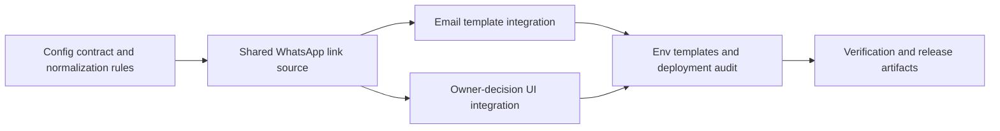

# Plan 040: Replace Hardcoded WhatsApp Number with WHATSAPP_CONTACT_NUMBER

**Target Release**: v0.8.1  
**Epic Alignment**: Plan 038 follow-up — outreach quality + operational configurability  
**Status**: UAT Approved  
**Related Issues**: Plan 038 code review MEDIUM finding (hardcoded WhatsApp number); v0.8.0 deployment pre-operation item  

## Changelog

| Date | Change | Agent | Notes |
|------|--------|-------|-------|
| 2026-03-13T07:15Z | Initial plan created | Planner | Follow-up to remove hardcoded outreach WhatsApp number and bundle with v0.8.1 before release |
| 2026-03-13T08:22Z | Status: Active → Critic Approved | Critic | APPROVED — 2 LOW findings applied as plan clarifications (M3 prop mechanism, M6 scope); critique closed |
| 2026-03-13T09:00Z | Status: Active → In Progress | Implementer | All milestones complete (M1–M7), 8 TDD tests, all gates pass (243 tests, type-check, build, lint) |
| 2026-03-13T09:30Z | Status: In Progress → Code Review Approved | Code Reviewer | APPROVED — 2 LOW findings (operational logging, test coverage), zero blocking issues; exemplary TDD execution |
| 2026-03-13T08:37Z | Status: Code Review Approved → QA Complete | QA | QA passed — added owner-decision null-path regression test, full suite 244 passed / 18 skipped, type-check, lint, build, and placeholder grep all clean |
| 2026-03-13T09:00Z | Status: QA Complete → UAT Approved | UAT | APPROVED FOR RELEASE — all 6 UAT scenarios pass, value statement fully delivered, no blocking findings |

## Value Statement and Business Objective

As a provider owner contacting UFlow from an outreach email or owner-decision page, I want the WhatsApp link to use the real configured UFlow contact number, so that I reach the correct team and UFlow can change contact operations without code changes.

## Objective

Eliminate the hardcoded WhatsApp placeholder number from outreach-related surfaces by introducing `WHATSAPP_CONTACT_NUMBER` as the canonical configuration source and using it consistently for:

- Outreach email WhatsApp CTA links
- Owner-decision page WhatsApp CTA link
- Environment templates and deployment instructions required to operate the feature safely

## Scope

**In scope**:

- Replace the hardcoded `wa.me/4915123456789` links in outreach email templates
- Replace the hardcoded WhatsApp link in the owner-decision UI
- Introduce a single configuration path for `WHATSAPP_CONTACT_NUMBER`
- Ensure the client-facing owner-decision page receives the derived link safely without ad hoc duplication
- Update environment templates and release/deployment documentation for the new variable
- Add or update automated tests covering configured and missing-number behavior
- Keep the work bundled into v0.8.1 before Stage 2 release

**Out of scope**:

- Adding outbound WhatsApp messaging workflows
- Provider-specific WhatsApp numbers
- Changing outreach copy beyond replacing the contact link source
- New database schema, migrations, or external messaging services

## Assumptions

- `WHATSAPP_CONTACT_NUMBER` will store the UFlow-owned contact number in normalized digit form suitable for `wa.me`
- Outreach email sending must not fail solely because the WhatsApp contact number is missing
- The owner-decision page can receive server-derived configuration without exposing raw environment access in the client component
- v0.8.1 has not been released yet, so this plan can still be bundled into the same release train as Plan 039

## Release Strategy

Bundled with: Plan 039 — outreach email provider name v0.8.1.

Sequencing notes:
- Plan 039 is already committed locally for v0.8.1 Stage 1 and must remain unpushed until this plan is complete.
- Plan 040 should complete full workflow and local commit before DevOps executes Stage 2 release approval for v0.8.1.

## Decision Record

- [RESOLVED] Use `WHATSAPP_CONTACT_NUMBER` as the single canonical configuration source — the current hardcoded number is an operational liability and was explicitly called out as a pre-operation item.
- [RESOLVED] Keep the raw environment variable server-side and pass a derived WhatsApp link into client-rendered UI — this avoids scattering environment access and preserves a single formatting path.
- [RESOLVED] If the configured number is missing or blank, suppress the WhatsApp CTA instead of rendering a broken or misleading link — contacting the wrong number is worse than temporarily hiding the optional CTA.
- [RESOLVED] Update all environment templates together (`env.template`, `env.uat.template`, `env.production.template`) — partial documentation would reintroduce deployment drift.
- [DEFERRED: product owner + future outreach roadmap + post-v0.8.1] Evaluate richer WhatsApp UX (prefilled messages, provider-specific threads, analytics) separately from this configuration fix.

## Milestone Dependencies

Sequencing rule: integration work for email and UI should start only after the configuration contract and shared link source are defined.

## Plan

### Milestone 1 — Define Configuration Contract

**Objective**: Establish exactly how `WHATSAPP_CONTACT_NUMBER` is read, normalized, and consumed.

**Acceptance Criteria**:

- Implementer identifies the single source module or helper responsible for producing the WhatsApp contact link.
- The plan of record defines accepted input format for `WHATSAPP_CONTACT_NUMBER` (expected: digits suitable for `wa.me`).
- Runtime behavior for missing or empty config is explicit and consistent across email and UI.

**Dependencies**: None

---

### Milestone 2 — Replace Hardcoded Email Links

**Objective**: Remove hardcoded WhatsApp links from outreach email templates.

**Acceptance Criteria**:

- Both German and English outreach email templates stop embedding `4915123456789` directly.
- Email rendering uses the shared WhatsApp link source from Milestone 1.
- If no valid number is configured, email rendering degrades safely without broken CTA output.

**Dependencies**: Milestone 1

---

### Milestone 3 — Replace Hardcoded Owner-Decision UI Link

**Objective**: Remove the hardcoded WhatsApp link from the owner-decision page without introducing direct client-side env coupling.

**Acceptance Criteria**:

- The owner-decision CTA no longer embeds the placeholder number.
- The client component receives only the data it needs to render the CTA via a prop passed from the server `page.tsx` (not a `NEXT_PUBLIC_` prefix — the raw env var is read server-side only).
- Missing-number behavior matches the email path so users never see a dead or placeholder contact link.

**Dependencies**: Milestone 1

---

### Milestone 4 — Update Environment Templates and Deployment Guidance

**Objective**: Make the new configuration operable across local, UAT, and production environments.

**Acceptance Criteria**:

- `env.template`, `env.uat.template`, and `env.production.template` document `WHATSAPP_CONTACT_NUMBER`.
- Deployment/release documentation for outreach references the new variable instead of a manual code change.
- Existing pre-operation note about the hardcoded number is cleared or superseded by this plan’s implementation path.

**Dependencies**: Milestones 2 and 3

---

### Milestone 5 — Verification Gates

**Objective**: Prove the fix is safe and release-ready.

**Acceptance Criteria**:

- Automated tests cover configured-number rendering and missing-number behavior for the affected surfaces.
- `npm run type-check` passes.
- Relevant lint gate passes for changed files.
- `npx vitest run` passes.
- `npm run build` passes.

**Dependencies**: Milestones 2, 3, and 4

---

### Milestone 6 — Deployment Path Audit

**Objective**: Ensure the new environment variable is wired consistently wherever deployment configuration is defined.

**Acceptance Criteria**:

- Verify that no existing CI/CD workflow file (`.github/workflows/`), Dockerfile `ENV` entry, or production deployment script hardcodes the placeholder number or requires a separate configuration path for `WHATSAPP_CONTACT_NUMBER`.
- If none are affected (expected), document that confirmation with evidence (e.g., grep result) in the implementation doc.
- Any gaps found must be resolved before M7.

**Dependencies**: Milestone 4

---

### Milestone 7 — Update Version and Release Artifacts

**Objective**: Keep release artifacts aligned while bundling this fix into v0.8.1.

**Acceptance Criteria**:

- Version remains `0.8.1` (no bump beyond the already-targeted release unless scope changes and Planner reassigns release).
- CHANGELOG entry for v0.8.1 reflects the WhatsApp contact configuration fix.
- DevOps notes clearly state that v0.8.1 Stage 2 must wait for both Plan 039 and Plan 040 Stage 1 completion.

**Dependencies**: Milestones 5 and 6

## Testing Strategy

- Unit tests for the shared WhatsApp link/config path.
- Integration-level tests for outreach email rendering and owner-decision UI behavior.
- Regression coverage to ensure no placeholder number remains in affected flows.
- Build and type-check validation to catch client/server boundary mistakes.

## Validation (Non-QA)

- Functional sanity: render one outreach email preview and one owner-decision page instance with configured number to confirm the CTA points to the configured `wa.me` link.
- Functional sanity: confirm both surfaces hide or safely omit the CTA when `WHATSAPP_CONTACT_NUMBER` is absent.

## Risks

- **Client/server boundary risk**: exposing raw env access in a client component would create maintainability and security drift; mitigated by server-derived props.
- **Config formatting risk**: non-normalized phone input could break `wa.me` links; mitigated by a single normalization/validation path.
- **Release sequencing risk**: Stage 2 for v0.8.1 must not proceed with only Plan 039 committed; mitigated by explicit bundle sequencing.

## Duration Estimates

- Analysis / discovery: 0.25–0.5h
- Planning: 0.25h
- Implementation: 1–2h
- Code Review: 0.5–1h
- QA: 0.5–1h
- UAT: 0.25–0.5h
- DevOps: 0.25–0.5h

Uncertainty drivers: exact shared config location for client/server reuse; preferred missing-config UX for the owner-decision CTA.

## Handoff Notes

- This plan is intentionally small and should stay tightly scoped to outreach WhatsApp contact configuration.
- Implementer should remove all placeholder-number usage from the affected surfaces in one pass to avoid partial rollout.
- DevOps must treat Plan 039’s existing local commit as part of the same unreleased v0.8.1 bundle.

## Open Questions

None.

✅ PHASE COMPLETE: ① Planner
📄 Output: agent-output/planning/040-whatsapp-contact-number-config-v0.8.1.md
➡️ NEXT: Pick "③ Critic" from the Orchestrator handoff suggestions
   Gate: Critique verdict must be APPROVED before implementation