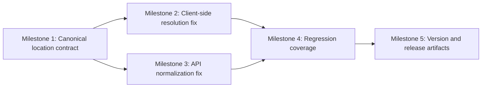

# Plan 044 — Providers Location Empty-Filter Bugfix

## Plan Header

- **Target Release**: v0.8.3 (v0.8.2 was already released as footer overlay fix; corrected during implementation)
- **Epic Alignment**: Provider discovery reliability / browse funnel integrity
- **Status**: Committed for Release v0.8.3
- **Related Issues**: None

## Release Strategy

Release Strategy: Standalone (no other known plans for this version).

## Value Statement and Business Objective

As a **service seeker browsing providers**, I want **`/providers` and `/providers?location=` to return the same complete provider list when no city is selected**, so that **I can reliably discover all providers, paginate through results, and refine filters without silent result loss**.

## Objective

Ship a focused bugfix that restores canonical "all locations" behavior across the providers discovery flow by keeping the empty-string sentinel intact from URL parsing through client query composition, API normalization, and Supabase filtering.

This plan must eliminate the silent partial-results failure described in Analysis 044 without changing the intended city-filter UX for real city names.

## Source Analysis

- Root cause analysis: ../analysis/closed/044-root-cause.md

## Context

Analysis 044 proved that the first server-rendered providers page is correct, but client pagination and filter interactions diverge when the `location` query param is present with an empty value. The current discovery flow mixes canonical sentinel values (`''`) with localized display labels (`Everywhere`, `Überall`) and uses JavaScript truthiness in places where empty string is a meaningful state.

The defect is conversion-relevant because provider discovery is a primary browse funnel. In its current state, affected users see only the first SSR page, lose infinite scroll, and can collapse the entire result set to zero after any client-side interaction.

This is a small-scope bugfix, but it crosses UI and API boundaries and must preserve the Postgres-first search behavior already established in the providers/community-services services layer.

## Decision Record

- [RESOLVED] Treat `''` as the only canonical runtime sentinel for "all locations" across providers discovery. Rationale: the codebase already defines `LOCATION_ALL = ''`, and localized labels are display concerns, not transport values.
- [RESOLVED] Fix both the client resolution path and the API normalization path in the same release. Rationale: either fix alone leaves independently reachable zero-result regressions.
- [RESOLVED] Keep the search services’ `isValidLocation()` contract unchanged for this patch. Rationale: the root problem is upstream normalization drift, and widening service-level heuristics would add avoidable ambiguity.
- [RESOLVED] Preserve SSR-first discovery behavior from Plan 010 and scope this release to correctness, not a larger search architecture refactor. Rationale: KISS and low regression risk.
- [RESOLVED] Add regression coverage for empty-location URL handling on the client/API path. Rationale: SSR-only validation would miss this bug again.
- [DEFERRED: future planner + reason + target plan/version] Consolidate duplicated location normalization into a shared helper after this hotfix. Reason: worthwhile cleanup, but not required to restore user-visible correctness in v0.8.2. Target: next discovery-maintenance plan after v0.8.2.

## Assumptions

- The providers discovery page should interpret both missing `location` and empty `location` as "no city filter".
- Legacy links or bookmarks may still contain `location=Everywhere` or `location=Überall`, and those should continue to resolve to "all locations" rather than zero results.
- No database migration is required; the defect is caused by request normalization and filter application, not schema/index gaps.

## Scope

### In Scope

- Providers discovery client-side location resolution for query key composition and pagination requests.
- API route normalization for missing, empty, and legacy translated location values.
- Regression coverage for empty-location browse/pagination behavior.
- Release artifact updates for v0.8.2.

### Out of Scope

- Redesigning the search-provider context or replacing the current sentinel design.
- Refactoring all search/filter normalization into a shared abstraction across the app.
- Changing full-text search logic, pagination model, or ranking behavior.

## Milestone Dependencies

UI and API milestones should land against the same canonical contract before regression coverage is finalized.

## Plan (Milestones)

1. **Establish canonical location handling contract**
   - Objective: make the expected semantics of `location` explicit at the providers discovery boundary.
   - Work:
     - Document in the touched providers discovery modules that `''` means "all locations" and localized labels must not enter API/query transport.
     - Align the route and client paths to the same normalization rules already used by SSR.
   - Acceptance Criteria:
     - A single canonical rule is applied consistently: missing `location`, empty `location`, `Everywhere`, and `Überall` all resolve to `''` before filter execution.

2. **Fix client-side location resolution and pagination inputs**
   - Objective: prevent the client from converting an empty URL param into a translated city label.
   - Work:
     - Update the providers discovery client to distinguish `null`/`undefined` from `''` when resolving location.
     - Ensure the React Query key and pagination request builder preserve `''` as the all-locations sentinel.
     - Keep UI display text localized without using localized strings as request values.
   - Acceptance Criteria:
     - Navigating to `/providers?location=` produces the same first-page and subsequent-page browse behavior as `/providers`.
     - Infinite scroll requests for all-locations browsing do not send a translated `location` value.

3. **Fix API route normalization for all-locations requests**
   - Objective: ensure the providers search API never treats UI display labels as city filters.
   - Work:
     - Normalize missing, empty, and legacy all-locations values in the API route before calling the providers/community-services search services.
     - Remove any route-level default that turns an omitted location into a non-empty localized string.
   - Acceptance Criteria:
     - `GET /api/providers/search` with no `location` param behaves as an all-locations browse request.
     - `GET /api/providers/search?location=` behaves the same as no `location` param.
     - Legacy `location=Everywhere` and `location=Überall` requests resolve to the same all-locations behavior.

4. **Add regression coverage for empty-location discovery flows**
   - Objective: prevent future regressions in the client/API interaction path that SSR-only testing would miss.
   - Work:
     - Add automated coverage around providers discovery requests that exercise empty-location and missing-location flows through the client/API boundary.
     - Cover pagination/follow-up fetch behavior, not just the initial server-rendered page.
     - **Update existing test expectations in `src/__tests__/api/providers-search.test.ts`** — two test cases currently assert `'Everywhere'` as the correct default location argument (lines ~62 and ~91). These expectations encode the pre-fix broken behavior and MUST be updated to assert `''` after the Milestone 3 route fix is applied. Leaving them unchanged will produce failing tests that may be misread as regressions.
   - Acceptance Criteria:
     - Automated coverage fails if empty-string location is converted into a translated request value or if the API applies a city filter for all-locations browsing.
     - Coverage demonstrates equivalence between `/providers` and `/providers?location=` for browse results.
     - No test cases assert `'Everywhere'` or `'Überall'` as an expected location argument to `searchProvidersAndCommunityServices`.

5. **Update version and release artifacts**
   - Objective: prepare the bugfix for release as v0.8.2.
   - Work:
     - Update the appropriate version artifact(s) and release notes/changelog entries for the v0.8.2 bugfix.
     - Record the customer-visible symptom and the corrected behavior in release documentation.
   - Acceptance Criteria:
     - Version artifacts and changelog/release notes consistently reflect v0.8.2.
     - Release notes make clear that all-locations providers discovery now behaves correctly for empty and missing `location` values.

## Testing Strategy

- Unit/integration coverage for location normalization at the client boundary and API route boundary.
- Integration-style coverage for the providers browse pagination path, including a second-page fetch under all-locations conditions.
- Regression validation that real city filters still apply correctly and that legacy all-locations strings normalize safely.

## Validation (Non-QA)

- Type-check and lint on touched modules.
- Targeted automated test run covering providers discovery normalization/pagination behavior.
- Manual smoke verification of:
  - `/providers`
  - `/providers?location=`
  - `/providers?location=Everywhere`
  - `/providers?location=Überall`
  - `/providers?location=<real-city>`

## Risks

- **Boundary drift risk**: fixing only one layer would leave another path broken; mitigated by explicit dual-layer milestones.
- **Regression risk for real city filters**: normalization logic must not collapse legitimate city names; mitigated by focused regression coverage.
- **Localized-string leakage risk**: UI display helpers may still tempt future misuse; mitigated by documenting the canonical transport contract.

## Duration Estimates

- Analysis: 0.5h completed
- Planning: 0.5h completed
- Implementation: 1-2h
- QA: 0.5-1h
- UAT: 0.25-0.5h
- DevOps: 0.25-0.5h

Uncertainty drivers: existing test coverage around providers discovery client/API boundaries may be thin, and the exact minimal regression-test placement may require brief repository exploration during implementation.

## Changelog

| Date (UTC) | Agent | Change | Rationale |
| --- | --- | --- | --- |
| 2026-03-18T14:54Z | planner | Created plan from Analysis 044 | Scope the empty-location providers discovery bugfix for the next patch release |
| 2026-03-18T14:55Z | critic | Amended Milestone 4 — added explicit note to update existing `providers-search.test.ts` expectations that assert the broken `'Everywhere'` default | Critic F-1 MEDIUM: prevents implementer confusion from failing build after route fix |
| 2026-03-18T16:58Z | qa | Status updated to QA Complete after re-evaluation | Corrected build evidence showed the remaining build limitation is an unrelated credentialed-environment requirement, not a Plan 044 regression |
| 2026-03-18T17:00Z | uat | Status updated to UAT Approved | Value statement fully delivered — empty-location browsing now reliable, all technical gates pass, approved for v0.8.3 release |
