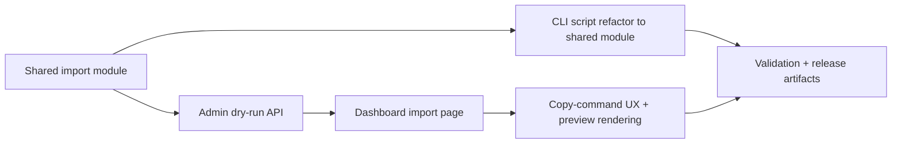

# Plan 048 — JoinHalal Admin Dry-Run Dashboard UI

## Plan Header

- **Target Release**: next available patch after current `origin/main` version (currently `v0.8.7`; provisional `v0.8.8`, confirm exact tag at DevOps Stage 1)
- **Epic Alignment**: Provider supply growth / admin operations usability / faster operator review workflow
- **Status**: Committed
- **Related Issues**: None

## Changelog

| Date | Change | Agent | Notes |
|---|---|---|---|
| 2026-03-19T15:15Z | Initial plan created from approved feature request | Planner | Admin dashboard dry-run preview for JoinHalal import; dry-run UI only, CLI write remains the operational mutation path |
| 2026-03-19T16:35Z | Status updated to Code Review Approved | Code Reviewer | APPROVED — no blocking findings; 3 LOW items noted for future polish |
| 2026-03-19T15:59Z | QA failed | qa | Preview count correctness gap: `wouldInsert` can be wrong for duplicate+unmapped overlap; rework required before UAT |
| 2026-03-19T17:14Z | Status updated to QA Complete | qa | QA-1 and QA-2 resolved; fresh tests/type-check/delta-lint pass; unrelated local env build failure remains informational |
| 2026-03-19T17:30Z | Status updated to UAT Approved | uat | APPROVED FOR RELEASE v0.8.8 — all 8 UAT scenarios PASS; value statement satisfied; 4 deferred LOW follow-ups recorded with owners; handing off to DevOps |

## Release Strategy

Release Strategy: Standalone (no other known active plans targeting this provisional release).

## Value Statement and Business Objective

As an admin/operator, I want to trigger a JoinHalal dry-run import from the dashboard at `/dashboard/import`, so that I can review import counts, unmapped categories, and sample records without opening a terminal.

## Objective

Deliver an admin-only dashboard experience that reuses the existing JoinHalal import logic to run **dry-run previews only** from the browser, returning structured preview data through an authenticated admin API route and presenting it in a clear operator-focused UI. The implementation must preserve the current CLI write path for actual imports, avoid creating long-running UI-triggered write operations in v1, and prevent divergence between script behavior and dashboard preview logic.

## Scope

### In Scope

- New dashboard page at `src/app/(dashboard)/dashboard/import/page.tsx`
- New authenticated API route at `src/app/api/admin/import-joinhalal/dry-run/route.ts`
- Refactor of reusable import orchestration into a server-safe shared module at `src/lib/import/joinhalal.ts`
- Dry-run execution only from the browser with configurable limit choices: `10`, `50`, `100`, `all`
- Preview UI for counts, unmapped categories, and sample records
- Copy-to-clipboard command surface for the CLI write command so operators can execute writes deliberately in the terminal
- Admin/moderator authorization on both page access and API execution using existing auth helpers
- Release artifact updates for the final assigned patch version

### Out of Scope

- Running `--write` imports directly from the UI in v1
- Streaming progress, SSE, websockets, or background job infrastructure
- Persistent import-job history, audit tables, or database schema changes for run storage
- Automatic scheduling, cron-based imports, or recurring sync jobs
- Replacing the existing CLI script as the operational write mechanism

## Context

Plan 047 delivered a reliable admin-only CLI importer at `scripts/import-joinhalal.ts`, backed by pure parser helpers in `src/utils/joinhalal-parser.ts`. The current script already performs sitemap discovery, structured-data extraction, category resolution, deduplication against existing providers, and dry-run reporting. Operators can use it safely, but must leave the dashboard and execute a terminal command.

The existing dashboard architecture already supplies the patterns needed for a browser-based admin surface:

- dashboard access control is enforced in `src/app/(dashboard)/layout.tsx` using `getUserFromCookie()` and `isAdminOrModerator()`
- dashboard pages use a server entrypoint plus dynamic client content in `src/app/(dashboard)/dashboard/providers/page.tsx`
- admin API routes enforce authorization with the same role helper in `src/app/api/admin/review-provider/route.ts`

The architecture overview confirms the relevant boundaries for this work:

- Next.js 15 App Router with server components by default and interactive client components where needed
- authenticated server-side API routes under `app/api/`
- Supabase as the backend system of record with service-role/admin flows for operational tasks
- no new deployment or infrastructure surface is required for a dry-run-only UI release

This plan therefore focuses on reusing proven import logic behind an admin UI, while deliberately deferring long-running write orchestration until there is a validated need for background execution.

## Assumptions

- The existing JoinHalal dry-run logic can be extracted into a shared module without changing its business behavior.
- Returning a full JSON dry-run result is acceptable for v1 because the preview use case is bounded by operator-selected limits and does not require streaming progress.
- The dashboard page will live under the existing `(dashboard)` segment and inherit its access control rather than introducing a new route-group authorization model.
- Operators still accept CLI as the mutation surface for actual imports in v1 as long as the UI gives them a copyable write command and clear preview results.
- The current service-role configuration used by the import logic is available in server runtime contexts used by the API route.

## Decision Record

- [RESOLVED] The browser UI is **dry-run only** in v1 — actual imports remain terminal-triggered so the release avoids long-running request complexity and accidental browser-initiated writes.
- [RESOLVED] Shared import behavior must move into `src/lib/import/joinhalal.ts` and be reused by both the CLI script and the admin API route — this prevents logic drift between terminal and dashboard preview paths.
- [RESOLVED] The dashboard page must reuse the existing `(dashboard)` authorization boundary and the API route must separately verify `isAdminOrModerator()` — defense-in-depth is required for admin-only operations.
- [RESOLVED] The page should follow the established dashboard pattern of a route entrypoint plus dynamic client component — this keeps the browser UI consistent with existing admin pages and avoids unnecessary client bundle cost at the route boundary.
- [RESOLVED] The API route should return one completed JSON preview payload, not a streaming protocol — the operator need is reviewable preview data, not real-time telemetry in v1.
- [RESOLVED] Limit presets `10`, `50`, `100`, and `all` are the supported operator choices — these bound runtime expectations while still allowing a full preview when needed.
- [DEFERRED: Product/Ops + requires validation that operators need browser-triggered writes + follow-up plan/version after this release] Add UI-triggered write execution, progress streaming, cancellation, and resumable background jobs.
- [DEFERRED: Product/Ops + requires product decision on operational audit visibility + follow-up plan/version after this release] Persist import-run history, actor metadata, and result snapshots for dashboard review.

## Milestone Dependencies

Sequencing rule: UI milestones begin once the shared module and API contract are stable enough that the browser flow can consume the same preview shape as the CLI dry-run path.

## Plan

### Milestone 1 — Extract a Shared, Server-Safe Import Core

**Objective**: Move JoinHalal dry-run behavior out of the script-only entrypoint into a reusable module that can be called from both server routes and the CLI wrapper.

**Acceptance Criteria**:

- A shared module location is defined under `src/lib/` with import-safe, server-runtime-compatible functions.
- Environment handling, return values, and error behavior are refactored so the shared module does not rely on `dotenv`, `process.exit()`, or terminal-only side effects.
- The shared module exposes a dry-run-oriented result contract suitable for both JSON API responses and CLI report rendering.
- The existing CLI script is updated to consume the shared module rather than duplicating orchestration logic.
- Dry-run behavior remains aligned with Plan 047 decisions, including DB-aware deduplication and existing provider key loading in preview mode.

**Dependencies**: None

---

### Milestone 2 — Add an Authenticated Admin Dry-Run API Route

**Objective**: Provide a server endpoint that executes a JoinHalal dry-run preview for authorized dashboard users.

**Acceptance Criteria**:

- The route lives at `src/app/api/admin/import-joinhalal/dry-run/route.ts`.
- Authentication is enforced with `getUserFromCookie()` and authorization with `isAdminOrModerator()`.
- The route accepts a bounded limit input aligned to `10`, `50`, `100`, or `all`.
- The route returns structured JSON including at minimum: total URLs processed, parsed count, mapped count, unmapped category groups, skipped duplicates, failures, and sample records.
- Errors are returned as proper HTTP responses instead of terminating the process.
- No write-mode behavior is exposed through this endpoint.

**Dependencies**: Milestone 1

---

### Milestone 3 — Add the Dashboard Import Page Entry Point

**Objective**: Create a dashboard route that surfaces the dry-run feature in a way consistent with the existing admin UI structure.

**Acceptance Criteria**:

- The page lives at `src/app/(dashboard)/dashboard/import/page.tsx`.
- The route is accessible only through the existing dashboard auth boundary.
- The route follows the same server-entry + dynamic client content pattern used by `dashboard/providers`.
- The dashboard landing page is updated so admins can discover the import page without manually typing the URL.
- The page remains usable on mobile and desktop layouts.

**Dependencies**: Milestone 2

---

### Milestone 4 — Build the Operator Preview Experience

**Objective**: Present dry-run results clearly enough that an operator can decide whether to proceed to the CLI write command.

**Acceptance Criteria**:

- The client UI provides an explicit limit selector with the supported choices.
- The UI has loading, error, and empty/result states.
- Preview output includes operator-meaningful counts, unmapped category summaries, and sample records.
- The UI clearly distinguishes dry-run preview from actual import execution.
- The page provides a copyable terminal command for the corresponding write-mode invocation, including the selected limit when applicable.
- The UI avoids exposing service-role credentials or server-internal details to the browser.

**Dependencies**: Milestone 3

---

### Milestone 5 — Validate Security, Consistency, and Regression Boundaries

**Objective**: Ensure the new dashboard surface does not weaken admin controls or diverge from CLI dry-run semantics.

**Acceptance Criteria**:

- The API route rejects unauthenticated and unauthorized callers.
- The shared module preserves dry-run counts and deduplication semantics established in Plan 047.
- The CLI script and dashboard API consume the same preview contract or clearly documented adapters.
- The implementation identifies any runtime limits for the `all` option and documents the operator expectation if full previews are slow.
- The page and route remain isolated to admin workflows and do not affect public discovery/runtime code paths.

**Dependencies**: Milestone 4

---

### Milestone 6 — Update Version and Release Artifacts

**Objective**: Align release metadata and operator-facing notes with the final shipped feature.

**Acceptance Criteria**:

- `package.json` and lockfile versions are updated to the confirmed release tag at DevOps Stage 1.
- `CHANGELOG.md` includes an entry describing the JoinHalal admin dry-run dashboard preview.
- The plan, implementation, QA, UAT, and deployment docs all inherit the same plan ID and lifecycle flow.
- Any operator-facing instructions added for the dashboard dry-run stay aligned with the retained CLI write path.

**Dependencies**: Milestone 5

## Testing Strategy

- Unit-level validation for any extracted shared-module parsing/normalization helpers that change shape or ownership during the refactor
- Integration-level validation for the admin API route, especially auth rejection paths, input handling, and dry-run response structure
- Component-level validation for the dashboard import client UI, covering loading, success, error, and copy-command presentation states
- Regression validation that CLI dry-run output semantics remain aligned with the shared module after refactoring
- Standard repository gates for changed TypeScript and React files: type-checking, linting, and relevant test suites

## Validation (Non-QA)

- Confirm the dry-run browser preview and the CLI dry-run derive results from the same shared import core.
- Confirm `/dashboard/import` is only accessible to authenticated admin/moderator users through the existing dashboard boundary.
- Confirm the API route returns dry-run data only and never exposes write execution.
- Confirm the copyable write command reflects the operator-selected limit and uses the existing CLI entrypoint.
- Confirm the dashboard page includes clear loading, error, and result states.
- Confirm the `all` option behavior is acceptable for a synchronous request path or is documented with operator expectations if it is slow.

## Risks

- **Runtime duration risk**: full `all` previews may be slow for a single HTTP request; mitigate with explicit limit presets, warning copy, and deferral of browser-triggered writes/streaming.
- **Logic drift risk**: API and CLI may diverge if both implement preview behavior separately; mitigate by making the shared module the source of truth.
- **Security exposure risk**: admin-only operational logic could leak to unauthorized users if page-only auth is trusted; mitigate with route-level authorization checks and server-side execution only.
- **UX ambiguity risk**: operators may confuse dry-run preview with actual import; mitigate with explicit dry-run labeling and a separate copy-command action for write mode.
- **Source fragility risk**: JoinHalal HTML/schema changes can still break previews; mitigate by preserving existing parser isolation and failure reporting.

## Handoff Notes

- Preserve the script as the operational write surface in v1 even after extracting shared logic.
- Prefer a single preview result type shared across CLI and API instead of multiple loosely aligned payload shapes.
- Keep the client component thin; data fetching and import orchestration belong on the server.
- Reuse existing dashboard and admin API patterns rather than inventing a new auth or layout system.
- If the `all` option proves too slow for the API route during implementation, escalate before widening scope to streaming or background jobs.

## Duration Estimates

- Analysis: 0.5–1.0h
- Planning: 0.5h
- Implementation: 5–8h
- Code Review: 0.5–1.0h
- QA: 1–2h
- UAT: 0.5–1.0h
- DevOps: 0.5h

**Uncertainty drivers**: how cleanly the current CLI orchestration extracts into a shared module, response size/runtime of the `all` option in a synchronous API route, and the amount of UI state required to make preview data legible without overbuilding the feature.
