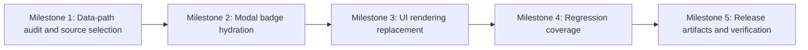

# Plan 048 — Provider modal Barakah badge visuals

**Target Release**: `v0.8.9` (v0.8.8 tag already existed on origin — JoinHalal admin dashboard Plan; bumped at DevOps Stage 1)  
**Epic Alignment**: Epic 2.1 Trust-first discovery, with supporting alignment to Epic 2.3 rich provider profiles  
**Status**: QA Complete  
**Related Issues**: Customer/UAT report: provider modal for `https://uat.ummahflow.com/providers/be186e0a-ae33-42d6-951c-6cc4c455ba56` shows placeholder Barakah content instead of actual badge visuals

## Release Strategy

Standalone (no other known active plans in `agent-output/planning/` currently target the next patch after `origin/main` `0.8.7`).

## Changelog

| Date (UTC) | Agent | Change | Rationale |
| --- | --- | --- | --- |
| 2026-03-19T15:59Z | planner | Created plan | User requested actual badge visuals in provider modal Barakah Effekte section instead of placeholder text |
| 2026-03-19 | code-reviewer | Code Review Approved | All gates passed; verdict APPROVED; no required actions |
| 2026-03-22T09:31Z | qa | QA Complete | Verified hydration path and automated gates; remaining risk deferred to UAT visual validation |
| 2025-07-24T00:00Z | uat | UAT Approved | All acceptance criteria met by code; structured badge rendering confirmed; live URL verification deferred to DevOps post-deploy gate |

## Value Statement and Business Objective

As a **service seeker browsing a provider in the desktop modal**, I want **the Barakah Effekte section to show the provider's actual badge visuals and trust signals**, so that **I can quickly understand what makes the provider trustworthy and Islamically relevant without seeing placeholder or legacy content**.

## Context

The current provider modal still renders the Barakah Effekte area from legacy `barakah_effects` string data in `src/components/providers/ProviderDetailModal.tsx`. That path currently contains:

- a hard-coded placeholder subtitle (`Hatem Ipsum`)
- a hard-coded icon mapping for a few legacy text labels (`Iman`, `Zakat`, `Sunnah`)
- an empty-state string (`Keine Barakah Effekte`) when no legacy labels are present

This diverges from the structured badge system already used elsewhere in the product:

- `src/components/providers/TrustBadgesSection.tsx` renders trust badges from structured badge data
- `src/components/ui/BadgeLabel.tsx` already provides consistent badge label styling and trust-level icon treatment
- `src/services/providers.ts#getProviderById` already hydrates provider detail payloads with `badges`
- `src/app/api/badges/entity/route.ts` exposes a public badge read path with optional confirmation status support

The result is inconsistent trust presentation between the provider detail page and the provider modal. This directly weakens the roadmap's trust-first discovery goal and leaves visible placeholder content in a user-facing flow.

## Decision Record

1. [RESOLVED] The modal will use the structured badge system as the canonical source for Barakah visuals, not the legacy `barakah_effects` string list.
   Rationale: The structured badge path already carries trust level, localized labels, and privacy-safe semantics used elsewhere in the product.

2. [RESOLVED] Scope is limited to the provider modal's Barakah Effekte section and directly adjacent placeholder copy in the same section.
   Rationale: This delivers the user-visible fix without expanding into unrelated provider card or community-service modal redesign.

3. [RESOLVED] Implementation must avoid maintaining two parallel presentation systems in the same modal (legacy icon mapping plus structured badges).
   Rationale: A single canonical rendering path reduces regression risk and future maintenance cost.

4. [RESOLVED] Badge rendering in the modal must remain privacy-safe and show only aggregate/public trust information.
   Rationale: Existing architecture guidance requires public trust reads to avoid exposing confirmer identities.

5. [RESOLVED] No schema or migration work is required for this plan unless implementation discovers a verified data-gap that prevents modal hydration from existing badge sources.
   Rationale: The codebase already contains badge types, badge fetch services, and a public badge API.

## Assumptions

- The affected modal is `src/components/providers/ProviderDetailModal.tsx`, which is used on desktop provider detail flows.
- The provider detail data path can either consume already hydrated `provider.badges` data or perform a bounded modal-specific badge fetch when badge data is absent.
- The provider referenced in the report has badge data available through the existing structured badge system or can be validated against the existing UAT dataset.
- The requested “icons/images” outcome can be satisfied by rendering the existing badge/trust visuals consistently, without inventing a new badge-media schema.

## Scope

**In scope**

- Replace the modal's current Barakah Effekte rendering path with structured badge rendering.
- Remove user-visible placeholder copy in the same section when it is not backed by real data.
- Ensure modal behavior is correct for populated, empty, and loading states.
- Add or update regression coverage for the actual modal badge path.

**Out of scope**

- Badge schema redesign, new badge taxonomies, or new CMS/admin flows for badge assets.
- Broader refactors of provider cards, community service modals, or search-result badge presentation outside the reported modal path.
- New endorsement UX or trust-level business rules.

## Milestone Dependencies

Sequencing rule: UI rendering work begins only after implementation confirms the modal's canonical badge source and removes reliance on the legacy `barakah_effects` rendering branch for this section.

## Plan

1. **Audit the modal's current Barakah data path**
   Objective: Confirm how `ProviderDetailModal` receives provider data across its active call paths and whether `provider.badges` is reliably present when the modal opens.
   Expected touch points:
   - `src/components/providers/ProviderDetailModal.tsx`
   - `src/services/providers.ts`
   - `src/hooks/useProvider.ts`
   - `src/app/(public)/providers/[provider_id]/ProviderDetailPageClient.tsx`
   Acceptance criteria:
   - The implementation identifies one canonical source for modal badge data.
   - The plan to render badges does not depend on undocumented or incidental data shape.
   - Any gap between server-hydrated and client-opened modal flows is explicitly handled.

2. **Hydrate structured badges for the modal without creating a parallel trust model**
   Objective: Ensure the modal receives the same structured badge data model used by provider detail views.
   Guidance:
   - Prefer reusing `provider.badges` when already available.
   - If modal entry points can lack badge data, use one bounded fetch path based on existing badge services or the public badge API.
   - Avoid introducing N+1 badge fetches or per-badge lookups.
   Acceptance criteria:
   - The modal can access a structured badge array for the target provider.
   - At most one additional badge fetch is needed per modal open when initial provider data lacks badges.
   - No new private badge fields or confirmer identities are exposed.

3. **Replace legacy Barakah pill rendering with actual badge visuals**
   Objective: Render the Barakah Effekte section from structured badge data using existing visual primitives where practical.
   Guidance:
   - Reuse `BadgeLabel` and/or a modal-adapted variant of the existing trust badge presentation rather than inventing a new one-off visual language.
   - Remove the hard-coded `Hatem Ipsum` placeholder and the legacy `Iman`/`Zakat`/`Sunnah` icon switch from this section once the structured path is in place.
   - Preserve empty-state clarity when a provider truly has no badges.
   Acceptance criteria:
   - For providers with badges, the modal shows actual badge visuals instead of `Keine Barakah Effekte`.
   - The section no longer depends on `barakah_effects` label-to-icon mapping for its primary rendering.
   - Placeholder copy is absent from the shipped user-facing section.

4. **Add regression coverage for the real bug path**
   Objective: Prevent the modal from silently falling back to placeholder content when badge data exists.
   Expected coverage areas:
   - `src/__tests__/components/ProviderDetailModal.test.tsx`
   - related mock provider fixtures if badge-bearing provider data is required
   Acceptance criteria:
   - Tests cover a populated badge case that would have shown placeholder content before the fix.
   - Tests cover the true empty-state behavior for providers without badges.
   - If a new hydration branch is introduced, it has focused coverage at the service or component boundary.

5. **Validate release readiness and update release artifacts**
   Objective: Ship the fix as the next patch release after current `origin/main` version.
   Tasks:
   - Update version artifacts once DevOps Stage 1 confirms the exact next patch is available.
   - Add a concise `CHANGELOG.md` entry describing the modal badge-visual fix.
   Acceptance criteria:
   - Version artifacts match the confirmed release number.
   - Changelog reflects the user-visible modal improvement.

## Acceptance Criteria

- The provider modal's Barakah Effekte section renders actual provider badge visuals for providers that have structured badge data.
- The reported UAT provider no longer shows `Keine Barakah Effekte` when badge data exists.
- The shipped modal no longer displays placeholder copy such as `Hatem Ipsum` in the Barakah section.
- Badge rendering in the modal uses the existing trust/badge model and remains privacy-safe.
- The modal retains an explicit, accurate empty state for providers that genuinely have no badges.

## Testing Strategy

- Component tests for populated and empty modal badge states.
- Focused service or integration coverage if badge hydration is added to a previously badge-less modal path.
- Standard validation gates: `vitest`, `npm run type-check`, `npm run lint`, and relevant build verification within normal project constraints.
- Browser-backed verification on the reference UAT provider after deployment to confirm badge visuals render in the real modal surface.

## Validation

- Confirm the modal consumes a single canonical badge source.
- Verify that structured badge labels and trust icons render correctly in both German and English where the modal already supports localization.
- Verify there is no regression to modal open/close, community-service link-out, or existing provider action controls.
- Verify that providers with no badges still produce a truthful empty state rather than stale placeholder content.

## Risks and Mitigations

- **Risk**: Some modal entry points may pass a partial `Provider` object without hydrated badges.
  **Mitigation**: Require an explicit source-selection milestone and allow one bounded fetch fallback when badges are missing.

- **Risk**: Reusing full-page badge UI directly in the modal may create layout overflow or poor density.
  **Mitigation**: Reuse the badge primitives and trust semantics, but allow a modal-specific composition if needed.

- **Risk**: Legacy tests may still validate `barakah_effects` strings rather than structured badges.
  **Mitigation**: Update regression tests to exercise the actual post-fix rendering path and keep a truthful empty-state assertion.

- **Risk**: The reference provider's badge data on UAT may differ from local fixtures.
  **Mitigation**: Require live UAT confirmation against the supplied provider URL before release sign-off.

## Duration Estimates

- Analysis: 0.5–1.0h
- Planning: 0.5h
- Implementation: 1.0–2.0h
- QA: 0.5–1.0h
- UAT: 0.25–0.5h
- DevOps: 0.25–0.5h

Uncertainty drivers: whether all modal entry points already receive `provider.badges`, and whether modal layout needs a lightweight badge-specific composition rather than direct reuse of the full-page trust section.

## Notes

- Version pre-flight completed on 2026-03-19: latest fetched tags include `v0.8.7`, and `origin/main:package.json` reports `0.8.7`.
- No unresolved open questions remain at planning handoff.