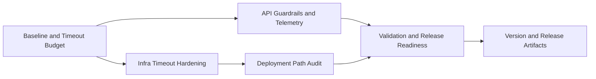

# Plan 049 — JoinHalal Dry-Run Timeout Hardening

## Plan Header

- **Target Release**: `v0.8.10` (bumped from provisional v0.8.9 — version collision: v0.8.9 was released as Plan 048 Barakah badge visuals before Stage 1 commit; confirmed at DevOps Stage 1)
- **Epic Alignment**: Technical foundation and reliability / admin import operability / UAT parity for released tooling
- **Status**: Released v0.8.10
- **Related Issues**: None

## Changelog

| Date | Change | Agent | Notes |
|---|---|---|---|
| 2026-03-20T18:45Z | Initial plan created from Analysis 049 | Planner | Timeout hardening for JoinHalal dry-run across Nginx, API guardrails, and observability |
| 2026-03-20T19:30Z | Revision 1: added Cloudflare 100s hard constraint to Context | Planner | Addresses Critique M-1 |
| 2026-03-22T09:50Z | Code Review Approved | Code Reviewer | APPROVED_WITH_COMMENTS: FIR applied (descCheckMs added to DryRunTiming), MEDIUM finding noted for follow-up |
| 2026-03-22T10:45Z | QA Failed | QA | Unresolved mid-flight abort path can still surface opaque upstream timeout; route-level regression coverage missing |
| 2026-03-22T11:00Z | Implementation Fix Round | Implementer | Fixed: caller signal propagated into fetchText() via AbortSignal.any(), mid-flight abort regression test added, post-fetch signal check added |
| 2026-03-22T11:10Z | Code Review Approved | Code Reviewer | APPROVED: all QA findings resolved; M-1 MEDIUM (abort gap) closed; no new issues in fix round |
| 2026-03-22T10:12Z | QA Complete | QA | Re-QA passed: abort propagation fix verified, regression and route 504 coverage added, full suite green; only pre-existing env-gated build issue remains |
| 2026-03-22T11:30Z | UAT Approved | UAT | Value statement delivered: 3-layer timeout budget eliminates opaque infrastructure 504; APPROVED FOR RELEASE v0.8.10; live browser validation deferred to DevOps |
| 2026-03-22T11:45Z | Committed for Release v0.8.10 | DevOps | Stage 1 commit: version collision resolved (v0.8.9 taken by Plan 048), bumped to v0.8.10; lockfile aligned; all docs moved to closed/ |
| 2026-03-22T11:55Z | Released v0.8.10 | DevOps | Stage 2 complete: tag v0.8.10 (7038c8d) pushed; branch session/047-joinhalal-data-import pushed to origin |

## Release Strategy

Release Strategy: Standalone (no other known plans for this version).

## Value Statement and Business Objective

As an admin/operator, I want the JoinHalal dry-run dashboard to respond reliably on UAT and production-like environments, so that I can validate imports in-browser without infrastructure timeouts and trust the released admin workflow.

## Objective

Harden the released JoinHalal dry-run path so admin preview requests complete reliably behind Cloudflare and Nginx, provide actionable timing visibility when they do not, and fail gracefully before infrastructure timeouts orphan work.

This plan addresses the post-release reliability gap identified in Analysis 049: the browser flow intermittently exceeds the default Nginx upstream timeout even though the underlying fetch/parsing workload is typically fast. The fix must therefore cover both the deterministic infrastructure limit and the missing runtime observability needed to diagnose intermittent slow paths.

## Scope

### In Scope

- Nginx timeout hardening for the admin dry-run route in both UAT and production templates
- Runtime guardrails for the dry-run API path so browser requests fail predictably before upstream infrastructure kills the connection
- Lightweight, operator-visible timing instrumentation for the dry-run response path
- Deployment-path verification across the Nginx templates and the Hetzner deployment workflows that ship them
- Release artifact updates for the next product patch

### Out of Scope

- Replacing the browser dry-run with a background job, queue, or websocket progress channel
- Re-architecting the JoinHalal parser, category mapping, or import write path
- General Supabase performance tuning outside what is necessary to expose timing and protect this endpoint
- Increasing Cloudflare plan limits or introducing new infrastructure services

## Context

Analysis 049 established three stable facts:

1. The proximate 504 cause is the default Nginx upstream timeout because `deploy/nginx/nginx-uat-template.conf` and `deploy/nginx/nginx-template.conf` do not override `proxy_read_timeout`.
2. Hetzner host networking, Docker container networking, JoinHalal page retrieval, and HTML parsing are all fast enough for `limit=10` under normal conditions.
3. The failure is intermittent, which means the system lacks the timing telemetry needed to distinguish between route initialization, Supabase latency, and unusually slow request variants.

The architecture documentation confirms the request chain is Cloudflare → Hetzner → Nginx → Docker standalone Next.js. That means a reliability fix must respect both Nginx behavior and the Cloudflare edge timeout ceiling rather than treating the Next.js route in isolation.

**Hard constraint**: Cloudflare Free-plan enforces a non-configurable **100-second** proxy read timeout. Both the Nginx `proxy_read_timeout` and the application-level timeout guard must be set **below 100s** to ensure the application controls the failure response rather than Cloudflare replacing it with an opaque 504.

## Assumptions

- The browser dry-run experience remains a supported admin capability and should not be downgraded to CLI-only behavior.
- The released `limit=10` path is expected to complete within a sub-minute budget under normal operating conditions.
- A bounded timeout for admin API requests is acceptable if the response explains the timeout clearly and avoids orphaned background work.
- This patch may ship independently of the four lower-priority open actions tracked under Plan 048.

## Decision Record

- [RESOLVED] Treat this as a reliability patch for the released JoinHalal dry-run workflow rather than reopening Plan 048 scope wholesale — the feature already shipped in `v0.8.8`; the new work addresses post-release operational reliability.
- [RESOLVED] Fix the Nginx timeout in both UAT and production templates together — the architecture and deployment flows share the same proxy pattern, and leaving production unchanged would preserve the same latent failure mode.
- [RESOLVED] Keep the browser dry-run synchronous for this patch — raising reliability and observability is the minimum change that restores user value without introducing new queue/job infrastructure.
- [RESOLVED] Add phase-level timing visibility to the dry-run response contract — intermittent behavior cannot be diagnosed responsibly without exposing where time is spent.
- [RESOLVED] Add an application-level timeout guard below the Cloudflare ceiling — graceful, structured failure is preferable to an opaque 504 and reduces orphaned work.
- [RESOLVED] Target the next available product patch after `origin/main` `0.8.8`; confirm exact version at DevOps Stage 1 after tag preflight — this preserves semver discipline without risking version collision.
- [DEFERRED: Product/Architecture + requires separate scope and UX design + target after v0.8.10] Rework long-running admin dry-runs into asynchronous jobs with progress tracking if timing data later shows synchronous browser execution is still too fragile.

## Milestone Dependencies

UI/browser verification begins immediately after the required infrastructure and API guardrails are in place.

## Plan

### Milestone 1 — Baseline and Timeout Budget

**Objective**: Convert Analysis 049 into an explicit operating budget for the browser dry-run path.

**Acceptance Criteria**:

- The implementation records a baseline timing model for the current `limit=10` dry-run path using the analysis evidence as the starting point.
- The route has an explicit target budget that stays below the Cloudflare edge timeout ceiling and leaves operational margin for intermittent slowdown.
- The implementation documents any remaining deferral if a precise Supabase timing breakdown cannot be captured during this change.

**Baseline & Measurements**:

- **What**: total request duration and phase timings for categories lookup, provider-key lookup, sitemap retrieval, page processing, and overall total.
- **Where**: local verification plus UAT browser/API verification after deployment.
- **Success Thresholds**: `limit=10` completes within the chosen route budget on UAT, and timing output is available for operators; if exact Supabase phase timing cannot be captured pre-release, the response must still expose enough timing to distinguish DB/setup cost from page-fetch cost.
- **Allowed Deferral**: if UAT cannot reproduce intermittent slowdown during implementation, the team may defer root-cause isolation of the hidden slow phase only if timing telemetry ships and an owner/rationale are recorded in the implementation handoff.

**Dependencies**: None

---

### Milestone 2 — Infrastructure Timeout Hardening

**Objective**: Remove the deterministic 60-second proxy failure from the admin dry-run path.

**Acceptance Criteria**:

- The UAT and production Nginx templates define an explicit timeout policy for the affected admin API route or route family.
- The configured timeout leaves margin above expected dry-run completion time while remaining intentionally below the Cloudflare hard ceiling.
- The timeout change is scoped so it does not unintentionally weaken unrelated proxy behavior.

**Dependencies**: Milestone 1

---

### Milestone 3 — API Guardrails and Operator Telemetry

**Objective**: Make the dry-run route observable and fail predictably before infrastructure does.

**Acceptance Criteria**:

- The API route enforces an application-level timeout budget aligned with Milestone 1 rather than relying on Nginx to terminate the request.
- The dry-run response exposes phase-level timing information sufficient to isolate DB/setup time from external fetch/page-processing time.
- Timeout or abort behavior returns a structured error contract that an operator can understand and act on.
- The implementation preserves the existing dry-run-only contract and does not introduce write-side effects.

**Dependencies**: Milestone 1

---

### Milestone 4 — Deployment Path Audit

**Objective**: Ensure the timeout hardening actually ships through every deployment entrypoint that can affect UAT or production.

**Acceptance Criteria**:

- The deployment audit enumerates every relevant entrypoint verified for this change, including the Hetzner deployment workflows and both Nginx templates.
- The audit confirms there is no mismatch where one environment receives the timeout override and another does not.
- Any manual operator steps required after merge are explicitly documented for DevOps handoff.

**Dependencies**: Milestone 2

---

### Milestone 5 — Validation and Release Readiness

**Objective**: Demonstrate the browser dry-run behaves reliably enough for release and exposes useful evidence when it does not.

**Acceptance Criteria**:

- Validation covers the dry-run API route, the admin dashboard browser flow, and at least one repeated-run scenario on UAT.
- Evidence shows the route completes successfully under the chosen test limit with timing output visible to operators or developers.
- If an intermittent slow-path still appears, the new telemetry is sufficient to identify which phase consumed the budget.

**Dependencies**: Milestone 3, Milestone 4

---

### Milestone 6 — Update Version and Release Artifacts

**Objective**: Align release metadata with the next patch that contains the reliability hardening.

**Acceptance Criteria**:

- `package.json` and any other release-version artifacts are updated consistently to the confirmed next patch version at DevOps Stage 1.
- `CHANGELOG.md` includes a user/operator-facing entry describing the JoinHalal dry-run timeout hardening.
- Release evidence references both the proxy timeout adjustment and the new route observability/guardrails.

**Dependencies**: Milestone 5

## Testing Strategy

- Unit or focused logic coverage for timeout-budget handling and any timing/response-shape additions
- Integration-level validation for the admin API route under authenticated access, including success and bounded-timeout behavior
- Deployment-surface verification for the Nginx templates and workflow-driven rollout path
- UAT browser verification of repeated dry-run requests at a constrained limit to confirm the operator experience
- Standard repository gates for changed application and deployment files, including linting, type-checking, and relevant automated tests

## Validation (Non-QA)

- Confirm the admin dry-run route no longer depends on the default 60-second Nginx timeout behavior.
- Confirm the configured timeout budget remains compatible with the Cloudflare edge ceiling.
- Confirm the route emits phase timing data or an equivalent structured timing signal on successful runs.
- Confirm bounded-timeout failures return a useful structured response rather than an opaque upstream 504 where the application can still control the response.
- Confirm UAT and production deployment templates are consistent for the affected timeout policy.

## Risks

- **Budget mismatch**: raising the proxy timeout without adding route guardrails would hide but not solve intermittent slow paths; mitigate by coupling Milestone 2 with Milestone 3.
- **Cloudflare ceiling risk**: an over-generous proxy timeout could still leave the user with a 100-second Cloudflare 504; mitigate by setting the app budget intentionally below the edge limit.
- **Observability drift**: adding timing output without preserving response clarity could confuse operators; mitigate by keeping the output concise and tied to the existing dry-run result structure.
- **Environment drift**: fixing UAT only would leave production exposed to the same latent defect; mitigate by auditing both templates and deployment entrypoints together.

## Duration Estimates

- **Analysis**: Completed in Analysis 049
- **Planning**: 0.5 day
- **Implementation**: 0.5–1.0 day
- **QA**: 0.5 day
- **UAT**: 0.25–0.5 day
- **DevOps**: 0.25 day

**Uncertainty Drivers**:

- Whether intermittent slowdown is reproducible on demand during implementation
- How much response-contract change is needed to expose timing cleanly without destabilizing the dashboard UI
- Whether deployment verification requires any environment-specific Nginx reload or template handling nuance beyond the existing workflows

## Handoff Notes

- Use Analysis 049 as the factual basis for the timeout budget and avoid reopening disproven network hypotheses.
- Keep the change minimal and reliability-focused: restore browser usability first, then collect the evidence needed for any deeper architectural follow-up.
- Do not expand this patch into asynchronous job orchestration unless the new telemetry proves synchronous dry-run remains non-viable after timeout hardening.
