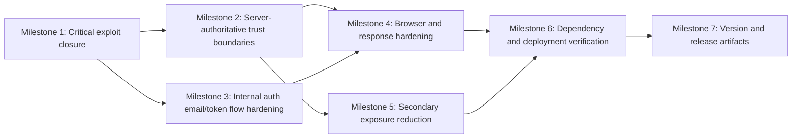

ID: 49
Origin: 49
UUID: 7dfe4b10
Status: Committed

# Plan 049 — UFlow v0.8.7 Security Remediation

## Plan Header

- **Target Release**: `v0.8.16` — confirmed at DevOps Stage 1; tags v0.8.13/v0.8.14/v0.8.15 already existed on origin at pre-flight check (origin/main was at v0.8.15 when this worktree was released; next available patch is v0.8.16)
- **Epic Alignment**: Platform security hardening / trust-first discovery platform reliability
- **Status**: UAT Approved
- **Related Issues**: Security Audit 049 (`agent-output/security/049-full-security-audit-v0.8.7.md`); roadmap blocker: Dependabot delta investigation noted in `agent-output/roadmap/product-roadmap.md`

## Release Strategy

Release Strategy: Standalone (no other known active plans currently targeting the next patch after `v0.8.12`).

## Value Statement and Business Objective

As a **Muslim user relying on UFlow for trusted discovery and account safety**, I want **critical access-control, auth-flow, and exposure vulnerabilities remediated before the next patch release**, so that **I can use UFlow without risk of account abuse, phishing through official channels, unauthorized privilege escalation, or avoidable data disclosure**.

## Objective

Ship a focused security remediation release that closes the two critical findings and the highest-risk follow-on findings from Security Audit 049 without expanding scope into unrelated refactors.

This plan must restore minimum acceptable production security posture for the current release train by:

1. removing immediate privilege-escalation and token/email abuse paths,
2. re-establishing server-authoritative authorization checks,
3. restoring baseline browser-side hardening via CSP and safer trust boundaries,
4. reducing user-enumeration and debug-surface exposure,
5. re-verifying dependency and deployment security gates before release.

## Source Audit

- Security findings source: `agent-output/security/049-full-security-audit-v0.8.7.md`
- Historical dependency-only remediation reference: `agent-output/security/closed/037-npm-dependency-vulnerability-audit.md`

## Context

The roadmap still shows `Current Version: v0.8.6`, but git pre-flight confirms `origin/main` and tags already reach `v0.8.12`. This plan must therefore target the next available patch in the `v0.8.x` line rather than the stale roadmap header. The work is security-sensitive and crosses route handlers, auth helpers, email/token flows, CSP configuration, and deployment configuration because at least one remediation requires environment-variable hardening.

The audit identifies two immediately exploitable issues: unauthenticated role escalation and unauthenticated auth-email/token generation. These block release on their own. Several high-severity findings share the same root theme: the system is trusting caller-controlled state or debug defaults where the platform should instead rely on server-owned authority and explicit production-safe configuration.

The plan should stay narrow and pragmatic: fix root causes, add regression coverage around the exploited paths, validate release security posture, and defer non-blocking structural cleanup unless directly required to deliver the value statement.

## Decision Record

- [RESOLVED] The release is security-first and patch-scoped, not a broader auth architecture rewrite. Rationale: the critical business need is to remove exploitable paths quickly with low regression surface.
- [RESOLVED] Server-authoritative role checks must come from the database-backed role helper, not client-mutable metadata or implicit trust in authenticated presence. Rationale: broken trust boundaries caused multiple high-severity findings.
- [RESOLVED] Auth email and token generation must become internal-only or equivalently server-owned in practice. Rationale: user-facing API exposure is the root cause of phishing and token abuse risk.
- [RESOLVED] CSP must be restored as a response-header control in this release even if the first iteration remains pragmatic rather than fully nonce-hardened. Rationale: current posture has no effective browser-enforced policy layer.
- [RESOLVED] User-enumeration fixes should favor ambiguous, workflow-safe responses over UX precision. Rationale: privacy and credential-stuffing resistance take precedence for this maintenance release.
- [RESOLVED] Deployment-path verification is mandatory because remediations touch environment-variable expectations and runtime security headers. Rationale: code-only validation is insufficient if deployed entrypoints diverge.
- [DEFERRED: future planner + reason + target plan/version] Replace in-memory rate limiting with shared durable infrastructure if product scale or abuse levels justify it. Reason: architecture guidance remains Postgres-first / no premature Redis adoption, and this is not required to close the current critical exploit paths. Target: future platform-hardening plan after the `v0.8.13` release window.

## Assumptions

- The next patch release is reserved primarily for security remediation, not feature work.
- Existing auth, admin, and push route tests may need augmentation because current coverage did not catch the broken authorization assumptions.
- Internalizing the auth-email/token flows can be achieved without changing user-facing auth UX if the route boundaries are reshaped carefully.
- The deployment stack can safely carry one or more new required environment variables if needed, provided all deployment entrypoints are audited in the same release.

## Scope

### In Scope

- Critical remediation for `src/app/api/admin/set-role/route.ts`.
- Critical remediation for auth-email and confirmation-token generation flows.
- Hardening of debug/admin endpoints that currently rely on unsafe defaults.
- Push notification authorization fix to remove trust in `user_metadata` role claims.
- CSP response-header restoration and review of directly relevant HTML/script injection surfaces.
- User-enumeration reduction in exposed auth/account discovery flows.
- Targeted hardening for the Instagram scrape route input boundary.
- Dependency re-verification and Next.js vulnerability closure for the current patch train.
- Deployment path audit for env vars, headers, and release entrypoints.

### Out of Scope

- A complete redesign of the UFlow authentication model or session architecture.
- Replacing the current rate-limiting implementation with Redis or a distributed service.
- Broad content sanitization refactors outside surfaces directly implicated by the audit.
- Non-security product enhancements or unrelated cleanup.

## Milestone Dependencies

Critical route fixes land first; CSP, secondary exposure cleanup, and release verification should only finalize after the core trust-boundary changes are stable.

## Plan (Milestones)

1. **Close immediate critical exploit paths**
   - Objective: eliminate trivially exploitable access-control and auth-abuse routes before broader cleanup.
   - Work:
     - Add explicit authorization enforcement to the role-setting admin route.
     - Remove unauthenticated public exposure from confirmation-token generation and branded auth-email dispatch.
     - Ensure the chosen hardening pattern cannot be bypassed by direct route invocation from an unauthenticated caller.
   - Acceptance Criteria:
     - A non-admin authenticated user cannot change any user role, including their own.
     - An unauthenticated caller cannot generate confirmation/reset-style tokens or trigger branded auth emails.
     - The critical findings F-049-01 and F-049-02 are fully addressed in code and regression coverage.

2. **Re-establish server-authoritative authorization boundaries**
   - Objective: ensure privileged actions rely on server-owned authority, not caller-controlled metadata or assumptions.
   - Work:
     - Replace client-mutable role trust in push notification authorization with database-backed role checks.
     - Review adjacent privileged routes touched by the audit to ensure they use the same role authority pattern.
     - Normalize privileged route expectations around `isAdminOrModerator()` or an equally authoritative server-side contract.
   - Acceptance Criteria:
     - Privileged route decisions are based on server-authoritative role data.
     - No privileged route in scope relies on `authUser.user_metadata.role` or equivalent caller-mutable fields for authorization.

3. **Harden auth-email and token workflows at the boundary**
   - Objective: prevent phishing, arbitrary link injection, and token abuse while preserving intended signup/login/reset flows.
   - Work:
     - Move confirmation/reset URL construction to trusted server-side inputs only.
     - Define a single internal invocation pattern for auth email dispatch and token creation.
     - Add abuse controls such as rate limiting and caller scoping where those routes still exist.
   - Acceptance Criteria:
     - Confirmation URLs in auth emails are derived only from trusted server-side configuration and route composition.
     - Callers cannot inject arbitrary destinations into branded auth emails.
     - Remaining route surfaces, if any, are authenticated, scoped, and rate-limited.

4. **Restore browser-side and response hardening**
   - Objective: add back a meaningful response-header CSP and align directly related rendering surfaces with that policy.
   - Work:
     - Reintroduce CSP as an HTTP response header in the application config.
     - Audit the limited set of `dangerouslySetInnerHTML` consumers implicated by the audit and ensure the chosen CSP remains compatible with legitimate usage.
     - Keep the policy pragmatic for this patch while reducing obviously weak allowances where feasible.
   - Acceptance Criteria:
     - Production responses include an explicit Content-Security-Policy header.
     - The CSP meaningfully constrains script execution relative to the current no-CSP state.
     - In-scope HTML/script rendering paths remain functional under the restored policy.

5. **Reduce secondary exposure and diagnostic risk**
   - Objective: close high/medium exposure paths that materially affect account safety and data leakage.
   - Work:
     - Remove hardcoded debug-key fallbacks and require explicit safe configuration for diagnostic access.
     - Reduce user enumeration in exposed account discovery/signup-adjacent flows.
     - Add validation and abuse controls to the Instagram scrape route input boundary.
     - Reduce avoidable PII leakage in auth logging where touched by the remediation.
   - Acceptance Criteria:
     - Diagnostic endpoints in scope no longer fall back to a code-known admin secret.
     - User-facing account discovery responses do not reveal registration state with high confidence.
     - Instagram scrape requests reject malformed usernames before outbound fetch.

6. **Audit deployment path and verify dependency/security gates**
   - Objective: ensure runtime configuration, dependency state, and deployment entrypoints all reflect the intended hardened posture.
   - Work:
     - Upgrade or otherwise remediate the current `next` advisory and re-run dependency audit checks.
     - Verify all deployment entrypoints that can supply env vars or headers: GitHub Actions workflows, Docker build/runtime path, deployment scripts, and any nginx/runtime header responsibilities.
     - Confirm the release does not depend on one deployment path carrying a secret/header config that another path omits.
   - Acceptance Criteria:
     - `npm audit` no longer reports the current `next` moderate advisory in the release candidate.
     - Deployment audit explicitly enumerates every verified entrypoint and confirms env-var/header consistency.
     - Any required new secret or env var is documented and wired consistently across deploy paths.

7. **Update version and release artifacts**
   - Objective: prepare the patch release with accurate security remediation bookkeeping.
   - Work:
     - At DevOps Stage 1, confirm the exact next patch version after `v0.8.12` with a fresh tag pre-flight and stamp release artifacts accordingly.
     - Update changelog/release notes to describe the security remediation at a customer-appropriate level.
     - Keep roadmap/release tracking aligned with the actual shipped version.
   - Acceptance Criteria:
     - Exact version is confirmed only after Stage 1 pre-flight and then applied consistently across release artifacts.
     - Changelog/release notes reflect the security nature of the patch without disclosing exploit details beyond what is appropriate.

## Deployment Path Audit

This plan touches deployment surface area because it may introduce new required environment variables and restores/changes security-header behavior.

Required audit scope:

- GitHub Actions deployment workflows under `.github/workflows/`
- Docker build/runtime path via `Dockerfile` and any related deploy scripts
- Runtime proxy/header responsibilities under `deploy/nginx/`
- Environment templates and release documentation that define required secrets or env vars

Acceptance requirement: Implementation must enumerate every verified deployment entrypoint and confirm they are consistent for env vars, security headers, and release startup behavior.

## Testing Strategy

- Unit and route-level integration coverage for authorization gates on admin, push, and auth-support endpoints.
- Regression coverage for the exact exploit paths called out in Audit 049, including unauthenticated invocation attempts and non-admin privilege escalation attempts.
- Config/runtime validation for CSP/header behavior and dependency remediation.
- Targeted security smoke coverage for user-enumeration-safe responses and validated outbound request boundaries.

## Validation (Non-QA)

- `npm run type-check`
- `npm run lint`
- targeted automated test runs for touched auth/admin/push/API surfaces
- `npm audit`
- release pre-flight/version confirmation at DevOps Stage 1
- deployment path audit evidence covering workflows, Docker, nginx, and env templates

## Risks

- **Auth flow regression risk**: internalizing email/token generation may break signup, magic-link, or reset flows if route boundaries are changed without corresponding callers updated.
- **CSP compatibility risk**: restoring CSP may surface hidden inline-script/style dependencies; mitigated by patch-scoped audit of known rendering surfaces.
- **Version drift risk**: roadmap version metadata is stale relative to git; mitigated by using git tags and `origin/main` as the authoritative release source.
- **Deployment inconsistency risk**: env-var based hardening can fail open if one deploy path is missed; mitigated by the mandatory deployment path audit milestone.

## Duration Estimates

- Analysis: 1.5-2.5h completed via Security Audit 049 and release/version pre-flight
- Planning: 0.75-1.25h completed
- Implementation: 4-8h
- QA: 1.5-3h
- UAT: 0.5-1h
- DevOps: 0.75-1.5h

Uncertainty drivers: the exact minimal internalization pattern for auth email/token flows, CSP compatibility with current inline behaviors, and the size of regression coverage needed around existing auth UX.

## Open Questions

None. The plan is ready for critique and implementation handoff without unresolved blocking questions.

## Changelog

| Date (UTC) | Agent | Change | Rationale |
| --- | --- | --- | --- |
| 2026-03-22T00:00Z | planner | Created Plan 049 from Security Audit 049 | Convert the audit findings into an implementation-ready remediation release plan for the next available patch after `v0.8.12` |
| 2026-03-22T21:24Z | qa | Updated status to QA Complete | Auth-flow caller regression fixed, caller-level regression tests added, and QA rerun gates passed |
| 2026-03-22T21:30Z | uat | Updated status to UAT Approved | All 13 findings remediated, value statement delivered, APPROVED FOR RELEASE as v0.8.13 |