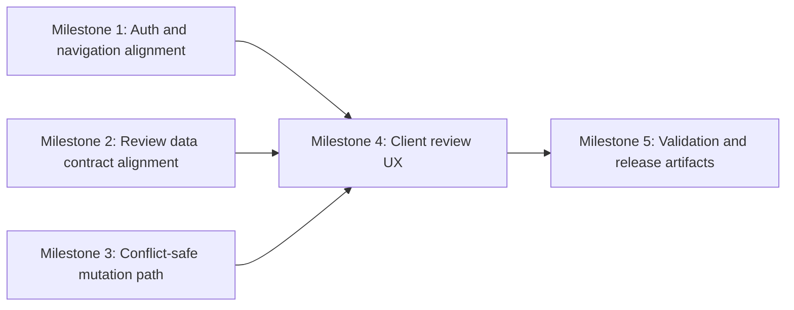

# Plan 050 — Admin Provider Review Panel

## Plan Header

- **Target Release**: v0.8.17 (confirmed at DevOps Stage 1 — v0.8.16 tag already existed on origin, used by Plan 049 security release; bumped to next available patch)
- **Epic Alignment**: Admin moderation workflow / provider quality control
- **Status**: UAT Approved
- **Related Issues**: None

## Release Strategy

Release Strategy: **Standalone** (no other known active plans in `agent-output/planning/` currently target the next post-`v0.8.15` patch release).

## Value Statement and Business Objective

As an **admin reviewing newly submitted providers**, I want a **reliable provider review panel with decision comments, conflict-safe updates, and direct access from the home profile menu**, so that **new listings can be approved or rejected quickly without overwriting another admin's work or forcing staff to use hidden routes**.

## Objective

1. Ensure admins can reach the provider review experience from the existing home-header profile menu.
2. Ensure the review panel reliably lists reviewable providers and lets admins confirm or reject them with persisted feedback.
3. Ensure `review_status` and `review_feedback` remain the system-of-record fields for review outcomes.
4. Prevent silent overwrite when multiple admins review the same provider concurrently.
5. Preserve existing server-side role enforcement, rate limiting, and audit logging while closing the workflow gaps.

## Context

Current repository state indicates this feature is partially implemented already:

- A protected dashboard route exists at `src/app/(dashboard)/dashboard/providers/page.tsx` and loads an admin review UI.
- Admin review APIs already exist at `src/app/api/admin/pending-providers/route.ts` and `src/app/api/admin/review-provider/route.ts`.
- Provider review persistence already writes to `review_status` and `review_feedback` in `src/services/admin/providers.ts`.
- The home header profile dropdown currently links to `/profile` and logout only; no admin entry is exposed there.
- The mutation path currently updates by `provider_id` alone and therefore does not guard against stale reads or competing reviewers.
- The review list contract is inconsistent today: the client expects a nested `providers` payload while the API returns top-level `data` plus `pagination`. This is a likely root cause for the “admin can review providers in the UI” requirement not being fully met despite the existing route.

Version pre-flight completed on 2026-03-23:

- `git fetch origin --tags`
- latest tags: `v0.8.11`, `v0.8.12`, `v0.8.13`, `v0.8.14`, `v0.8.15`
- `origin/main:package.json` version: `0.8.15`

Roadmap note: `agent-output/roadmap/product-roadmap.md` still reports `Current Version: v0.8.6`, so release assignment must follow git state, not the stale roadmap header.

## Scope

### In Scope

- Complete the existing admin provider review workflow rather than introducing a second review surface.
- Fix the pending-provider list contract so the current admin UI can render real reviewable items.
- Add explicit admin navigation from the home profile dropdown to the existing dashboard route.
- Extend the review mutation contract with optimistic concurrency protection and user-facing conflict handling.
- Preserve comment persistence in `review_feedback` and decision persistence in `review_status`.
- Keep authorization server-side and aligned with the current Supabase-backed role checks.

### Out of Scope

- Bulk moderation actions, queues, or advanced workflow automation.
- New moderation entities beyond providers.
- Replacing the existing admin dashboard IA with a broader redesign.
- Cross-cutting legacy component relocation unless an implementation touch makes a small, low-risk move unavoidable.

## Assumptions

1. The business requirement is minimum access for admins, not admin exclusivity; preserving current moderator access is acceptable unless product direction changes.
2. The existing `providers.updated_at` field is available and reliable enough to serve as the review concurrency token unless implementation proves otherwise.
3. Provider review remains a low-volume admin operation; optimistic concurrency is sufficient and a pessimistic lock or queue is unnecessary.

## Decision Record

1. **[RESOLVED] Reuse the existing dashboard and admin API surface.** Rationale: the repo already contains a review page, list endpoint, mutation endpoint, validation schema, and audit logging, so the fastest path is to complete and harden that flow instead of creating duplicate routes.
2. **[RESOLVED] Keep `review_status` and `review_feedback` as the canonical persisted review fields.** Rationale: these columns already exist in the core schema and are referenced throughout approved-provider reads, so adding parallel review storage would create drift without user value.
3. **[RESOLVED] Use optimistic concurrency on provider review updates.** Rationale: multiple admins need to work in parallel, but review volume does not justify long-lived locks; stale-write detection plus a clear conflict response satisfies the requirement with less complexity.
4. **[RESOLVED] Enforce access with server-side role verification backed by Supabase user-role lookup.** Rationale: this matches current auth patterns (`isAdminOrModerator`) and avoids trusting client-side role state.
5. **[RESOLVED] Expose admin entry through the existing home profile menu rather than a separate global nav item.** Rationale: this matches the requirement directly and minimizes visual churn in public navigation.
6. **[DEFERRED: roadmap/planner + legacy placement cleanup adds scope without changing user value + target plan/version: next admin-module refactor after v0.8.16]** Move legacy admin UI files from `src/components/admin/` into `src/features/admin-review/` only in a dedicated follow-up, unless implementation discovers a very small safe move is required.

## Milestone Dependencies

Sequencing rule: UI completion begins immediately after the list-response contract and mutation contract are stable enough for the client to consume without guessing response shape or concurrency behavior.

## Plan

1. **Milestone 1 — Align admin access and entrypoints**
   - Owner: Implementer
   - Dependencies: None
   - Objective: make the review panel discoverable from the public home experience while preserving server-side access control.
   - Work:
     - Audit the existing header/profile dropdown and any mobile-equivalent profile entry path that originates from home.
     - Add an admin-only menu item that routes authorized users to the existing dashboard entrypoint.
     - Ensure unauthorized users never see the admin action and still rely on server-side redirects/403s if they deep-link manually.
     - Reuse existing role-resolution helpers rather than introducing duplicate client-side role logic.
   - Acceptance Criteria:
     - Admin users can navigate from the home profile menu to the review panel in one interaction path.
     - Non-admin users do not see the menu item and cannot gain access by URL alone.
     - Existing logout/profile actions remain intact.

2. **Milestone 2 — Align the pending-provider data contract with the UI**
   - Owner: Implementer
   - Dependencies: None
   - Objective: ensure the review panel can actually render reviewable providers from the current API.
   - Work:
     - Reconcile the server response shape and client query expectations for pending providers.
     - Keep pagination/status filtering behavior explicit and typed end-to-end.
     - Verify the list includes every field needed for the review card, including prior feedback and the concurrency token required by Milestone 3.
     - Preserve current loading, error, and empty states instead of replacing them.
   - Acceptance Criteria:
     - The client receives a stable typed payload that can populate provider cards without fallback guessing.
     - Pending and needs-revision filters both render correctly.
     - The list contract carries the record revision marker needed for conflict-safe reviews.

3. **Milestone 3 — Add conflict-safe review persistence**
   - Owner: Implementer
   - Dependencies: Milestone 2
   - Objective: prevent one admin from silently overwriting another admin's review decision.
   - Work:
     - Extend the review mutation contract so the client submits the provider identifier plus the revision marker it last read.
     - Update the persistence path to succeed only when the provider is still at the expected revision and still reviewable under the allowed business rule.
     - Return a deterministic conflict response when another admin has already changed the record.
     - Ensure audit logging captures successful review decisions without logging unsanitized feedback.
     - Reuse existing `review_status`, `review_feedback`, and `updated_at` semantics where possible; add schema support only if the existing timestamp proves insufficient.
   - Acceptance Criteria:
     - A stale client review attempt does not overwrite a more recent decision.
     - Conflict responses are distinguishable from validation errors and generic failures.
     - Successful decisions persist to `review_status` and `review_feedback` exactly once.

4. **Milestone 4 — Harden the client review experience for confirm/reject flows**
   - Owner: Implementer
   - Dependencies: Milestone 1, Milestone 2, Milestone 3
   - Objective: make the current UI satisfy the feature requirements cleanly for real admin use.
   - Work:
     - Preserve approve/reject/comment behavior while wiring it to the corrected API contracts.
     - Ensure comment capture flows behave correctly for rejection and revision requests, including optimistic updates rollback when the server rejects the write.
     - Add explicit conflict handling in the UI so admins are told when a provider was already reviewed elsewhere and can refresh state safely.
     - Confirm prior feedback is rendered safely and remains useful context for subsequent reviewers.
   - Acceptance Criteria:
     - Admins can confirm or reject a provider with a comment.
     - Comments saved by a successful review reappear through the list/detail surface from `review_feedback`.
     - Conflict handling communicates what happened and refreshes the affected card/list state.
     - Loading, empty, and failure states remain accessible and intact.

5. **Milestone 5 — Validation, release coordination, and artifacts**
   - Owner: Implementer, then DevOps
   - Dependencies: Milestone 4
   - Objective: release the feature through the normal product workflow with clear evidence.
   - Work:
     - Run relevant static analysis and automated test suites for the touched admin/auth/provider paths.
     - Update release artifacts for the confirmed next patch version at DevOps Stage 1.
     - Record this feature in `CHANGELOG.md` with the final confirmed patch number.
     - Add the required implementation handoff artifact in `agent-output/implementation/050-*.md` when implementation begins.
   - Acceptance Criteria:
     - Validation evidence exists for the touched surfaces.
     - Version artifacts and changelog are updated only after final patch confirmation.
     - Handoff artifacts are complete enough for Critic, Implementer, QA, UAT, and DevOps to proceed without re-planning.

## Testing Strategy

Expected automated coverage at a high level:

- Unit/service coverage for review-state persistence and stale-write rejection behavior.
- API/route coverage for authentication, authorization, validation, and conflict-status responses.
- Client/component coverage for admin menu visibility, review actions, and conflict/error messaging.
- Regression coverage for the exact bug path where the list payload shape and client expectation diverge.

Critical validation themes:

- authorized admin access works from the home profile menu,
- persisted decisions update provider visibility state correctly,
- review comments survive round-trip storage/display,
- concurrent admin writes do not silently overwrite.

## Validation (Non-QA)

- Type-check for touched TypeScript surfaces.
- Lint for touched files.
- Relevant automated test runs for admin APIs, admin UI, and provider review services.
- If a migration is required for concurrency support, validate schema application plus backward compatibility with existing provider rows.

## Risks

1. **Medium**: Existing client/server contract drift may hide additional bugs once the list starts rendering real data.
2. **Medium**: `updated_at` precision or trigger behavior may be insufficient for concurrency checks, forcing a targeted schema adjustment.
3. **Low**: Header/menu changes may require both desktop and mobile entrypoint review if the home experience exposes different profile controls by breakpoint.
4. **Low**: Preserving moderator access may surprise stakeholders if they expected admin-only exclusivity; clarify only if product direction changes.

## Rollback Considerations

1. Keep navigation exposure separable from persistence hardening so the admin menu item can be disabled without reverting the entire review backend.
2. If optimistic concurrency support introduces regression risk, revert to the prior mutation path only with an explicit acknowledgment that parallel-admin safety is lost.
3. Any schema change for concurrency must be backward compatible and safe to leave dormant if the UI/API rollback is needed.

## Duration Estimates

- Analysis: 1.0–1.5h
- Planning: 0.75–1.0h
- Implementation: 4–7h
- QA: 1.5–2.5h
- UAT: 0.5–1.0h
- DevOps: 0.5–1.0h

Uncertainty drivers: whether `updated_at` is sufficient as the concurrency token, whether the header has a separate mobile admin-entry requirement, and how much existing admin UI behavior depends on the current list-response mismatch.

## Open Questions

None.

## Changelog

| Date (UTC) | Agent | Change | Rationale |
| --- | --- | --- | --- |
| 2026-03-23T11:31Z | planner | Created Plan 050 | Scoped the work to existing admin review surfaces; identified missing home-menu access, client/server list contract drift, and absent optimistic concurrency protection as the primary delivery gaps |
| 2026-03-23T12:50Z | implementer | Status → In Progress; all milestones implemented | Implementation complete; all 5 milestones delivered |
| 2026-03-23T13:05Z | code-reviewer | Status → Code Review Approved | APPROVED_WITH_COMMENTS; 2 MEDIUM fixed in-review (conflict discriminator, double toast); 3 LOW noted |
| 2026-03-23T13:30Z | qa | Status → QA Complete | QA report completed; inherited automated evidence accepted, QA added focused admin-page regression coverage, browser/session validation deferred to UAT |
| 2026-03-23T14:00Z | uat | Status → UAT Approved | APPROVED FOR RELEASE; all 5 milestones confirmed via code evidence; value statement fully delivered; browser-level entry visibility deferred to DevOps smoke test |
| 2026-03-23T14:10Z | devops | Target Release → v0.8.17; version collision on v0.8.16 (Plan 049 security release) | Bumped to v0.8.17 per collision resolution rules |
| 2026-03-23T14:15Z | devops | Status → Committed | All plan docs moved to closed/; local commit staged for v0.8.17 release |