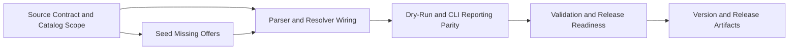

# Plan 051 — JoinHalal Speisen Offers Mapping

## Plan Header

- **Target Release**: `v0.8.11` (confirmed at DevOps Stage 1 after tag pre-flight)
- **Epic Alignment**: Provider supply growth / admin ingestion quality / faster searchable provider coverage
- **Status**: Committed for Release `v0.8.11`
- **Related Issues**: None

## Changelog

| Date | Change | Agent | Notes |
|---|---|---|---|
| 2026-03-22T15:42Z | Initial plan created from Analysis 051 | Planner | Extends the JoinHalal import pipeline to resolve `Speisen` into `offers_ids`, seed missing food offers, and surface unmapped offer reporting |
| 2026-03-22T17:14Z | QA execution completed | QA | QA gates passed for Plan 051 scope; status moved to QA Complete and handed off to UAT |
| 2026-03-22T17:30Z | UAT value validation complete | UAT | APPROVED FOR RELEASE — all 5 UAT scenarios PASS; implementation delivers stated value; status moved to UAT Approved |
| 2026-03-22T16:21Z | Stage 1 local commit prepared | DevOps | Target release confirmed as `v0.8.11`; lifecycle closure prepared; status moved to Committed |

## Release Strategy

Release Strategy: Standalone (no other known plans for this version).

## Value Statement and Business Objective

As an admin/operator, I want JoinHalal imports to populate provider offers from each listing's `Speisen` field, so that imported providers arrive with meaningful searchable offer metadata and users can immediately understand what each provider serves.

## Objective

Extend the existing JoinHalal ingestion workflow so both dry-run and write paths extract the Schema.org `additionalProperty[name="Speisen"]` field, resolve those food terms against the UFlow offers catalog, populate `providers.offers_ids`, and report any unmapped terms without degrading the safety or repeatability of the existing import flow.

This plan also closes the current catalog gap identified in Analysis 051 by seeding the missing food offers required for high-coverage matching, while keeping the offers model aligned with the existing catalog-first architecture.

## Scope

### In Scope

- Pure parser support for extracting `Speisen` values from JoinHalal Schema.org JSON-LD
- Offer catalog loading and deterministic offer-name resolution inside the shared import core
- CLI and admin dry-run parity for `offers_ids` population
- Seed migration for the missing food-related offer vocabulary discovered in analysis
- Dry-run and operator-facing reporting for unmatched `Speisen` values
- Regression-safe updates to import fixtures/tests and release artifacts for the next patch

### Out of Scope

- Fuzzy matching, synonym inference, or auto-translation of offer names beyond deterministic catalog lookup
- Creating a new junction-table model for provider offers
- Reworking the general provider import architecture, sitemap discovery, or deduplication logic
- New admin UI flows for manual offer curation beyond the existing dry-run/reporting surface
- Search/ranking redesign outside the existing `offers_ids`-backed model

## Context

Analysis 051 established five implementation-relevant facts:

1. JoinHalal stores the requested source field in Schema.org JSON-LD as `additionalProperty[name="Speisen"]`, not as a DOM-only taxonomy field.
2. The value is a comma-delimited string of German food terms, observed consistently across sampled restaurants, food trucks, and metzgerei pages.
3. The current import pipeline already has the correct extension point: both the shared dry-run core and the CLI write path set `offers_ids: []` today and already depend on shared parsing utilities.
4. The database model remains catalog-first: `providers.offers_ids` stores `offer_id` UUIDs, `offers.name_de` is unique, and `category_suggested_offers` is a separate UX layer rather than the source of truth for provider-offer assignment.
5. Existing offer-catalog coverage is only 3/24 sampled values, so resolving `Speisen` without catalog seeding would deliver weak value on the first release.

This work therefore needs to combine data seeding and pipeline wiring in one scoped feature release, rather than shipping a parser-only change that would mostly emit unmatched values.

## Assumptions

- The sampled `Speisen` vocabulary is representative enough to justify seeding the 21 missing food offers in this release.
- The offers catalog is the correct persistent home for these food terms because the provider model already references catalog UUIDs and the application uses those references for filtering and display.
- Matching should remain deterministic and case-insensitive for this release; ambiguous normalization rules can be deferred until real unmapped samples justify them.
- The admin dry-run route and CLI importer must remain behaviorally aligned so operators do not see mismatched preview versus write results.

## Decision Record

- [RESOLVED] Ship catalog seeding and import wiring together in one plan — parser-only delivery would provide low user value because current catalog coverage is only 12.5%.
- [RESOLVED] Keep provider-offer assignment on the existing `providers.offers_ids` UUID-array model — this matches the current schema, indexes, and downstream search/filter assumptions.
- [RESOLVED] Use deterministic exact name matching with case-insensitive normalization for this release — it is auditable, low-risk, and sufficient once the missing food offers are seeded.
- [RESOLVED] Add unmapped-offer reporting to the dry-run contract rather than silently dropping unknown `Speisen` values — operators need visibility when JoinHalal introduces new vocabulary.
- [RESOLVED] Preserve parity between the shared import core and the CLI write path — dry-run and write behavior must not diverge on offer resolution or reporting.
- [RESOLVED] Seed the missing food offers via migration rather than auto-creating rows during import — catalog changes should remain explicit, reviewable, and idempotent.
- [DEFERRED: Product/Implementer + requires real unmatched production samples + target follow-up after this release] Add fuzzy/synonym matching if future imports surface recurring variants such as pluralization, slash-separated aliases, or near-duplicates.

## Milestone Dependencies

Importer-facing UI or CLI output changes begin only after the catalog and shared resolver behavior are defined, so preview and write paths stay consistent.

## Plan

### Milestone 1 — Confirm Source Contract and Catalog Scope

**Objective**: Convert Analysis 051 into an explicit source-to-catalog contract for implementation.

**Acceptance Criteria**:

- The implementation treats `additionalProperty[name="Speisen"]` as the authoritative source field for this release.
- Parsing rules are explicit for delimiter handling, trimming, empty-value handling, and duplicate suppression within a single provider record.
- The set of missing food offers to seed is fixed for this release and documented from the analysis evidence.
- The plan for unknown future values is explicit: unmatched items are reported, not silently created.

**Dependencies**: None

---

### Milestone 2 — Seed Missing Food Offers

**Objective**: Raise first-run match coverage by inserting the missing `Speisen` vocabulary into the offers catalog with the correct category alignment.

**Acceptance Criteria**:

- A migration inserts the 21 missing food offers identified in Analysis 051 using idempotent semantics.
- Seeded rows align with the existing food/drink category strategy rather than creating a parallel categorization model.
- The migration does not duplicate existing offers and remains safe on repeated execution.
- If any seeded term needs to be excluded after implementation review, the rationale is documented before handoff.

**Dependencies**: Milestone 1

---

### Milestone 3 — Wire Shared Parser and Offer Resolution

**Objective**: Populate `offers_ids` from JoinHalal `Speisen` values in the shared import core.

**Acceptance Criteria**:

- A pure parser helper extracts `Speisen` values from `JoinHalalSchemaData` without introducing side effects.
- The shared import logic loads the offers catalog and resolves parsed food terms to `offer_id` UUIDs deterministically.
- `transformPage` and the CLI write-path equivalent stop hardcoding `offers_ids: []` and instead use the resolved catalog IDs.
- Duplicate offer IDs are not emitted for a single provider record even if the source repeats a term.
- Existing category resolution, deduplication, and pending-review behavior remain unchanged.

**Dependencies**: Milestone 1, Milestone 2

---

### Milestone 4 — Add Dry-Run and CLI Reporting Parity

**Objective**: Surface unmatched `Speisen` terms clearly so operators can detect future catalog drift.

**Acceptance Criteria**:

- The dry-run result contract includes an operator-visible unmapped-offers structure parallel to existing unmapped-category reporting.
- The CLI path surfaces the same unmatched-offer information using its existing reporting conventions.
- The admin dashboard consumer remains compatible with the updated dry-run contract, including safe handling when no unmapped offers are present.
- Reporting distinguishes parser failures from successful parses with unmapped offer terms.

**Dependencies**: Milestone 3

---

### Milestone 5 — Validation and Release Readiness

**Objective**: Prove the new offer-mapping path works without regressing the existing import behavior.

**Acceptance Criteria**:

- Validation covers parser behavior, shared resolution logic, migration safety, and at least one end-to-end dry-run/import path that exercises populated `offers_ids`.
- Regression coverage makes the pre-fix state visible for the offer-mapping gap, not just adjacent parser behavior.
- Evidence shows dry-run and write paths remain aligned on resolved offer IDs and unmapped reporting.
- The change remains compatible with existing provider moderation, search, and import deduplication assumptions.

**Dependencies**: Milestone 4

---

### Milestone 6 — Update Version and Release Artifacts

**Objective**: Align release metadata with the next patch that ships offer mapping.

**Acceptance Criteria**:

- `package.json` and any related version artifacts are updated consistently to the confirmed next patch version at DevOps Stage 1.
- `CHANGELOG.md` includes a user/operator-facing entry describing JoinHalal `Speisen` to offers mapping.
- Release notes and lifecycle documents reference both the catalog seeding and the import-pipeline mapping behavior.

**Dependencies**: Milestone 5

## Testing Strategy

- Focused unit coverage for `Speisen` extraction, empty/duplicate handling, and deterministic offer resolution
- Regression-oriented logic coverage for the exact pre-fix versus post-fix `offers_ids` behavior in shared import transformation code
- Migration/application validation for idempotent offer seeding and safe category assignment
- Integration-level validation for dry-run and CLI import paths so preview/write parity is preserved
- Standard repository gates for changed TypeScript, SQL migration, and import-path files, including linting, type-checking, and relevant automated tests

## Validation (Non-QA)

- Confirm the parser reads only Schema.org `additionalProperty` for `Speisen` in this release and does not depend on brittle DOM selectors.
- Confirm seeded offer rows land in the existing offers catalog without duplicate `name_de` conflicts.
- Confirm `providers.offers_ids` is populated with `offer_id` UUIDs rather than free-text names.
- Confirm dry-run and CLI write-path reporting both expose unmatched future `Speisen` values.
- Confirm the admin dry-run consumer tolerates the expanded result shape without breaking the current preview workflow.
- Confirm existing deduplication and pending-review import semantics remain intact.

## Risks

- **Vocabulary drift**: JoinHalal may introduce new food terms after release; mitigate with explicit unmapped-offer reporting and deterministic matching.
- **Catalog inflation**: seeding too many marginal terms could dilute offer quality; mitigate by limiting the seed set to verified analysis evidence and keeping additions reviewable in migration form.
- **Preview/write drift**: updating only one import path would create misleading dry-runs; mitigate by treating parity as a release-critical acceptance condition.
- **Contract drift in admin preview**: adding unmapped-offer data could break consumers expecting the previous dry-run shape; mitigate with compatibility-minded response extension and validation.
- **Data quality overlap**: some seeded food terms may later need synonym consolidation; mitigate by deferring fuzzy logic until real production evidence exists.

## Duration Estimates

- **Analysis**: Completed in Analysis 051
- **Planning**: 0.5 day
- **Implementation**: 0.5–1.0 day
- **QA**: 0.5 day
- **UAT**: 0.25–0.5 day
- **DevOps**: 0.25 day

**Uncertainty Drivers**:

- Whether the admin preview consumer already assumes a fixed dry-run response shape
- Whether any of the 21 seeded food terms conflict with existing unpublished catalog cleanup work
- How much fixture or regression coverage is needed to keep parser behavior stable against upstream page-shape changes

## Handoff Notes

- Use Analysis 051 as the source-of-truth evidence for field naming (`Speisen`) and the initial seed vocabulary.
- Keep the solution catalog-first; do not bypass `offers` by storing raw food names in providers.
- Treat dry-run/write parity and unmapped reporting as part of the delivered value, not optional polish.
- Keep matching deterministic for this release; if implementation uncovers ambiguous terms, escalate rather than silently broadening the matcher.
- If seeded offers appear to require curated suggestion ordering for specific categories, treat that as separate follow-up scope rather than widening this plan.
