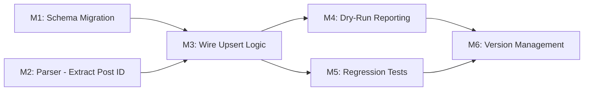

# Plan 052 — JoinHalal Import Upsert with Unique ID

**Target Release**: Next available patch after current `origin/main` version (v0.8.11); confirm exact version at DevOps Stage 1.
**Epic Alignment**: Data Import Pipeline — provider data freshness and re-import capability.
**Related Issues**: None (originated from operator requirement during Plan 051 release).

## Changelog

| Date       | Agent         | Change                                             | Rationale                                                                                                                                   |
| ---------- | ------------- | -------------------------------------------------- | ------------------------------------------------------------------------------------------------------------------------------------------- |
| 2026-03-22 | planner       | Plan created from Analysis 052                     | Upsert capability required for production imports                                                                                           |
| 2026-03-22 | planner       | Revision R1: address Critic findings M-1, M-2, M-3 | M-1: dedup fallback retained for NULL `import_source_id`; M-2: backfill scope limited; M-3: `updated_at` trigger verification added         |
| 2026-03-22 | code-reviewer | Status updated to Code Review Approved             | APPROVED_WITH_COMMENTS; two fix-in-review applied (intra-run dedup gap, unused `count: 'exact'`)                                            |
| 2026-03-22 | qa            | QA Failed — blocking findings                      | [HIGH] conflict updates overwrite admin fields; [MED] WriteStats.updated dead; [MED] missing preservation regression coverage               |
| 2026-03-22 | implementer   | QA re-fix complete                                 | Created RPC function 063 with DO UPDATE SET allowlist; WriteStats.updated populated via xmax; seenImportKeys bugfix; 395 tests pass, tsc ok |
| 2026-03-22 | qa            | Status updated to QA Complete                      | Re-QA passed: RPC allowlist closes overwrite path, updated reporting works, dry-run regressions fixed, independent gates rerun               |
| 2026-03-22 | uat           | Status updated to UAT Approved                     | All 6 milestones verified; value statement delivered; admin-field preservation confirmed via SQL contract; APPROVED FOR RELEASE at v0.8.12   |

## Value Statement and Business Objective

**As an** import operator, **I want to** re-run the JoinHalal import and have it update existing providers with fresh data instead of skipping or duplicating them, **so that** provider information stays current as JoinHalal listings change over time.

## Decision Record

1. **[RESOLVED]** Use `vxconfig.current_post.id` (WordPress post ID) as the JoinHalal unique identifier — it is an immutable integer PK, compact, and already available in the parsed HTML (same `vxconfig` script tag as `extractDisplayNameFromHtml`).

2. **[RESOLVED]** Add two columns to `providers` table: `import_source TEXT` + `import_source_id TEXT` with `UNIQUE(import_source, import_source_id)` — composite design supports future import sources (Google Maps, Lieferando, etc.) without schema changes.

3. **[RESOLVED]** Upsert strategy: update source-data fields (name, address, contacts, category, social links, offers_ids, updated_at) on conflict; preserve admin/user-controlled fields (review_status, review_feedback, provider_owner_id, user_created_id, created_at, provider_images, barakah_effects, needs_ids, show_address) — admin moderation state must never be overwritten by automated re-imports.

4. **[RESOLVED]** The unique constraint is a _partial_ unique index `WHERE import_source IS NOT NULL AND import_source_id IS NOT NULL` — organically created providers (NULL import columns) are unaffected, and no false UNIQUE violations occur between user-submitted and imported records.

5. **[RESOLVED]** CLI write path switches from `.insert()` to Supabase `.upsert()` with `onConflict: 'import_source,import_source_id'` — minimal code change, fully supported by supabase-js.

6. **[RESOLVED]** Dry-run reporting will indicate how many providers would be **created vs. updated** — operators need visibility into the upsert disposition before committing a write.

## Release Strategy

Release Strategy: Standalone (no other known plans for this version).

## Assumptions

1. The `vxconfig` script tag with `current_post.id` is present on all (or nearly all) JoinHalal location pages. Analysis 052 verified this for the test fixture; at-scale verification is an implementation milestone.
2. The Supabase `.upsert()` method with `onConflict` works correctly through service-role access (bypasses RLS). No RLS policy changes are needed.
3. The WordPress post ID is globally unique within JoinHalal (standard WordPress behavior — auto-increment PK).

## Success Criteria

- Re-running `--write` against the same JoinHalal sitemaps updates existing providers instead of skipping or duplicating.
- Admin-modified fields (review_status, images, barakah_effects) are preserved across re-imports.
- Dry-run report shows **created** vs. **updated** counts.
- All existing tests continue to pass; new coverage for upsert logic added.
- Migration is idempotent (safe to re-run).

## Plan

### Milestone 1: Schema Migration

**Objective**: Add `import_source` and `import_source_id` columns to the `providers` table with a partial unique index.

**Tasks**:

1.1. Create migration `062_add_import_source_columns.sql` in `supabase/migrations/`.
1.2. Add two nullable TEXT columns: `import_source`, `import_source_id`.
1.3. Create a partial unique index: `CREATE UNIQUE INDEX idx_providers_import_source_unique ON providers (import_source, import_source_id) WHERE import_source IS NOT NULL AND import_source_id IS NOT NULL;`
1.4. **Do not backfill `import_source` on existing rows.** Leave all pre-migration rows with `import_source = NULL` and `import_source_id = NULL`. These rows will remain outside the partial unique index and will continue to be de-duplicated by the existing `makeProviderKey(name, city)` client-side dedup on every import run (see Task 3.7). On re-import, any provider whose page yields a resolved `import_source_id` will INSERT a new row with both columns set; the operator can then clean up stale name+city duplicates at their own pace via admin tooling. This avoids a first-import duplicate explosion while keeping migration scope minimal and safe.

**Acceptance**:

- Migration runs without errors on a fresh schema and on a schema with existing imported providers.
- `import_source` and `import_source_id` columns exist and are nullable.
- Partial unique index enforces uniqueness only for non-NULL pairs.
- Idempotent: safe to re-run.

### Milestone 2: Parser — Extract JoinHalal Post ID

**Objective**: Add a pure parser function to extract `current_post.id` from the Voxel `vxconfig` JSON embedded in JoinHalal pages.

**Tasks**:

2.1. Add `extractJoinHalalPostId(html: string): string | null` function to `src/utils/joinhalal-parser.ts`. Returns the post ID as a string (for storage as `import_source_id TEXT`), or null if the `vxconfig` tag or `current_post.id` is absent.
2.2. Add unit tests in `src/__tests__/utils/joinhalal-parser.test.ts` covering: valid extraction, missing vxconfig tag, missing id field, non-numeric id.

**Acceptance**:

- Function extracts the WordPress post ID from existing HTML fixtures.
- Returns `null` gracefully for pages without the `vxconfig` tag.
- All existing parser tests continue to pass.

### Milestone 3: Import Core — Wire Upsert Logic

**Objective**: Update `transformPage()` and `ProviderRecord` types to include `import_source` and `import_source_id`, and update the write path to use upsert.

**Tasks**:

3.1. Update `ProviderRecord` interface in `src/lib/import/joinhalal.ts` to include `import_source: string | null` and `import_source_id: string | null`.
3.2. Update `transformPage()` in `src/lib/import/joinhalal.ts` to call `extractJoinHalalPostId(html)` and populate `import_source: 'joinhalal'` and `import_source_id: <extracted post ID>`.
3.3. Update `ProviderUpsert` interface in `scripts/import-joinhalal.ts` similarly.
3.4. Update `transformPageToProvider()` in `scripts/import-joinhalal.ts` to populate the new fields.
3.5. Switch CLI write path from `.insert(cleanBatch)` to `.upsert(cleanBatch, { onConflict: 'import_source,import_source_id' })`.
3.6. Remove the `import_source_url` stripping logic — `import_source_url` is no longer needed as a separate tracking field since `import_source` + `import_source_id` now provide provenance. Keep `import_source_url` in types if it is used for dry-run reporting, but do not persist it.
3.7. **Retain `makeProviderKey` client-side dedup as a fallback, applied selectively by key availability:** - Records **with** a resolved `import_source_id` (vxconfig post ID extracted successfully): skip client-side name+city dedup and allow the DB upsert to handle conflict resolution. These records will be upserted into rows that already have both columns set. - Records **without** a resolved `import_source_id` (vxconfig absent or id field missing): apply the existing `makeProviderKey(name, city)` dedup as before — skip if name+city already exists, to prevent duplicates. These records fall back to insert-only behavior. - Update `skipped` stat to reflect the name+city dedup hits (for NULL-key records only). Add a new `updated` stat to report actual DB upsert updates on the write path.

**Acceptance**:

- Records with a JoinHalal post ID are inserted with `import_source = 'joinhalal'` and `import_source_id = '<post_id>'` and upserted on subsequent re-imports.
- Records without a post ID (vxconfig absent) fall back to the existing name+city dedup insert-only path — no duplicates created.
- Re-importing the same provider (with post ID) updates source-data fields and preserves admin fields.
- The `WriteStats` struct includes an `updated` counter reflecting actual DB upsert updates.

### Milestone 4: Dry-Run Reporting — Created vs. Updated

**Objective**: Enhance the dry-run report to show how many providers would be created vs. updated.

**Tasks**:

4.1. Add `wouldUpdate` counter to `DryRunStats` in `src/lib/import/joinhalal.ts`.
4.2. During dry-run processing, check if a provider with the same `import_source + import_source_id` already exists in the DB. If yes, count as `wouldUpdate`; if no, count as `wouldInsert`. For NULL-key records, continue to use `makeProviderKey` dedup as before (`skipped` count).
4.3. Extend `loadExistingProviderKeys()` to also load `import_source` and `import_source_id` for import-sourced providers, building a secondary Set of `'import_source:import_source_id'` keys alongside the name+city key Set.
4.4. Update CLI dry-run report output to show the new counter.
4.5. Update dashboard dry-run UI (`ImportDryRunPageContent.tsx`) to display created vs. updated split if the API response includes it.
4.6. Verify whether the `providers` table has an `updated_at` trigger for UPDATE operations (check existing migrations). If no trigger exists, add it in migration 062, or add an explicit `updated_at: new Date().toISOString()` field to every record before upsert. This ensures `updated_at` reflects the last re-import time, not just the original insert time.

**Acceptance**:

- Dry-run report distinguishes between new inserts, updates, and skipped (name+city dedup) records.
- `updated_at` behaviour on the upsert UPDATE path is verified and documented.
- Operators can assess upsert impact before committing a write.

### Milestone 5: Regression Tests

**Objective**: Ensure upsert behavior is correct and existing functionality is not broken.

**Tasks**:

5.1. Add unit tests for `extractJoinHalalPostId()` (covered in Milestone 2).
5.2. Add integration-style tests for `transformPage()` verifying `import_source` and `import_source_id` are correctly populated.
5.3. Add tests for upsert field preservation logic — mock a conflict scenario and verify admin fields are not overwritten.
5.4. Verify all existing 381+ tests continue to pass.

**Acceptance**:

- New test coverage for parser, transform, and upsert behavior.
- No regressions in existing test suite.

### Milestone 6: Version Management

**Objective**: Update version artifacts to match target release.

**Tasks**:

6.1. Update `package.json` version.
6.2. Update `package-lock.json` version.
6.3. Add CHANGELOG entry describing the upsert capability.

**Acceptance**:

- Version artifacts updated.
- CHANGELOG reflects the upsert feature and migration.
- Version matches target release.

## Milestone Dependencies

Sequencing rule: Parser (M2) and Migration (M1) can proceed in parallel. M3 depends on both. M4 and M5 depend on M3. M6 is last.

## Testing Strategy

- **Unit tests**: Pure parser function (`extractJoinHalalPostId`), `resolveOfferIds` with upsert-related edge cases.
- **Integration tests**: `transformPage()` output includes new fields; dry-run stats include `wouldUpdate`.
- **Regression**: All 381+ existing tests pass unchanged.
- **Manual verification**: Operator runs `--dry-run` and `--write` against a small JoinHalal sitemap subset and confirms update vs. create behavior.

## Risks

| Risk                                                         | Likelihood | Impact                                            | Mitigation                                                                                                                                                                         |
| ------------------------------------------------------------ | ---------- | ------------------------------------------------- | ---------------------------------------------------------------------------------------------------------------------------------------------------------------------------------- |
| `vxconfig` tag absent on some JoinHalal pages                | Low        | Medium — those providers fall back to insert-only | Fallback: extract numeric ID from URL slug suffix as secondary strategy                                                                                                            |
| Supabase `.upsert()` behavior differs from raw `ON CONFLICT` | Low        | High — wrong fields updated                       | Test with service-role client against staging before production write                                                                                                              |
| Partial unique index not supported by Supabase client        | Very Low   | High — upsert fails                               | Verified: Supabase supports `onConflict` with named columns; partial index is transparent to the client                                                                            |
| First re-import creates duplicates for pre-migration rows    | Low        | Medium — data integrity                           | No backfill performed; pre-migration rows retain NULL import columns and continue to be deduped by name+city; operator can clean up stale rows via admin tooling at their own pace |

## Duration Estimates

| Phase          | Estimate      | Uncertainty Drivers                                        |
| -------------- | ------------- | ---------------------------------------------------------- |
| Implementation | 2–4 hrs       | Straightforward; parser + migration + type updates         |
| QA             | 1–2 hrs       | Unit + integration test coverage                           |
| UAT            | 0.5–1 hr      | Dry-run + small write test                                 |
| DevOps         | 0.5 hr        | Standard release flow                                      |
| **Total**      | **4–7.5 hrs** | Low uncertainty — well-scoped, builds on existing pipeline |

## Validation & Handoff

- All tests pass (`npm test`).
- Type check clean (`npm run type-check`).
- Lint clean (`npm run lint`).
- Migration applied successfully to staging DB.
- Dry-run shows created vs. updated split.
- Write mode updates existing providers on re-import.
- Admin-modified fields preserved after upsert.

## Rollback Considerations

- Migration 062 adds nullable columns and a partial index — **non-destructive**. Rollback: `ALTER TABLE providers DROP COLUMN import_source, DROP COLUMN import_source_id;`
- Code changes are backward-compatible: if migration hasn't been applied, the old `.insert()` behavior still works since the columns won't exist and the upsert conflict target won't match.
