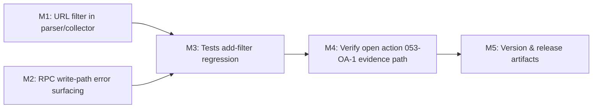

ID: 054
Origin: 054
UUID: c4e81a2f
Status: Released
---

# Plan 054 — JoinHalal Sitemap Non-Detail Filter + RPC Write-Path Fix

**Plan ID**: 054
**Target Release**: v0.8.14 (next available patch after origin/main v0.8.13; confirm at DevOps Stage 1)
**Epic Alignment**: JoinHalal Data Import — import pipeline correctness and operational safety
**Status**: Released in `v0.8.14`
**Related Issues**: None (user-reported live regression after v0.8.13 release, documented in Analysis 054)
**Analysis Source**: `agent-output/analysis/054-joinhalal-limit-10-single-entry-analysis.md`

## Changelog

| Date (UTC)         | Agent   | Change                                                   |
| ------------------ | ------- | -------------------------------------------------------- |
| 2026-03-22T22:45Z  | planner | Initial plan created from Analysis 054                   |
| 2026-03-22T22:46Z  | planner | Revised after Critic finding: clarified duplicated collectors and narrowed RPC exit-code scope |
| 2026-03-22         | qa      | QA completed; shared extractor filter validated, changed-file diagnostics clean, residual risk limited to deferred live command execution |
| 2026-03-22T23:30Z  | uat     | UAT Complete — APPROVED FOR RELEASE; both root causes fixed; value statement delivered; 053-OA-1 remains open as operational gate for staging validation |
| 2026-03-22T23:07Z  | devops  | Stage 1 local commit prepared; status moved to Committed for Release `v0.8.14`; lifecycle closure initiated |
| 2026-03-22T23:14Z  | devops  | Release completed; tag `v0.8.14` published on `release/v0.8.14-prep`; lifecycle docs marked Released |

---

## Value Statement and Business Objective

> As an operator running the JoinHalal import pipeline,
> I want a limit-10 import run to produce 10 real provider candidates and to surface any write-path failures clearly,
> so that staging validation reflects actual ingestion behavior and a single generic listing page can never silently stand in for a complete batch of real providers.

---

## Objective

Fix two root causes that together explained the "only one entry created despite selecting 10" regression reported after v0.8.13:

1. **Sitemap non-detail-URL contamination** — the URL collector ingests listing pages (e.g., `https://joinhalal.com/locations/`) alongside real provider detail pages because the parser applies no URL-shape filter.
2. **RPC write-path silent failure** — when the RPC function `upsert_joinhalal_providers` is absent or fails in the target environment, only insert-only records persist; the error is not surfaced clearly to the operator.

Both fixes are required for the importer to be safe for production use. Either one in isolation would leave partial breakage.

---

## Assumptions

1. The target URL pattern for JoinHalal provider detail pages is `/locations/{category-slug}/{name-slug}-{id}/` — i.e., exactly three path segments under `/locations/`.
2. The generic `/locations/` page and category listing pages such as `/locations/restaurant/` will never be valid provider candidates.
3. The RPC function `upsert_joinhalal_providers` is the only write-mode path for records with a non-null `import_source_id`.
4. The `open-actions.md` tracker for 053-OA-1 (live staging validation) remains open until a write run with this fix demonstrates real import success.
5. Existing tests cover parser extraction mechanics; targeted regression tests for the non-detail filter are not yet present.

---

## Decision Record

| # | Topic | Decision | Status |
|---|-------|----------|--------|
| 1 | URL filter scope | Filter by URL shape (path segment count + trailing structure); do not attempt to follow redirects or fetch pages speculatively to decide candidate inclusion | [RESOLVED] — minimal cost; no network calls needed; consistent with existing parser's stateless design |
| 2 | Filter placement | Filter must be applied before the numeric `limit` slice so that the limit accurately reflects accepted detail-page candidates | [RESOLVED] — any post-slice filter would allow listing pages within the limit window |
| 3 | RPC failure surfacing | The write path already logs batch-level RPC failures to stderr; this plan adds a non-zero process exit when any upsert batch fails so the operator cannot miss it | [RESOLVED] — preserves existing error output and closes the real operational gap |
| 4 | Target release | Patch increment from v0.8.13 → v0.8.14 | [RESOLVED] — isolated bugfix; no new features; confirm tag availability at DevOps Stage 1 |
| 5 | Dry-run vs write fix scope | `extractUrlsFromSitemapXml()` is shared, but `collectLocationUrls()` is duplicated in the dry-run and write-mode paths; the filter must therefore be implemented in the shared extractor or applied consistently in both collectors | [RESOLVED] — this avoids a partial fix where preview and write behavior diverge |
| 6 | Environment migration state | Migration 063 application to the target environment is a deployment/operational concern; this plan closes the code-side write-path error surfacing gap | [RESOLVED] — operator must verify `upsert_joinhalal_providers` exists before running write mode; plan adds a clear error to make missing function obvious |

---

## Release Strategy

Standalone — no other known active plans targeting v0.8.14.

Open action `053-OA-1` (live staging validation) was blocked by the same underlying defects this plan fixes. Closing this plan unlocks the first valid evidence run for that open action.

---

## Milestone Dependencies

Sequencing rule: M1 and M2 are independent and may be implemented in any order or in parallel. M3 depends on both. M4 depends on M3.

---

## Milestones

### M1 — Filter Non-Detail URLs Before the Limit Slice

**Objective**: Ensure `collectLocationUrls()` (and by extension, the dry-run preview) only includes URLs that match the JoinHalal provider detail page URL shape, before applying the numeric limit.

**Files in scope**:
- `src/utils/joinhalal-parser.ts` — or the collector in `src/lib/import/joinhalal.ts` (implementer chooses the responsible layer, preferring the utility if the logic is stateless)
- `scripts/import-joinhalal.ts` — if its collector does not share the same call chain, it also needs the same filter applied

**Acceptance criteria**:
- A URL such as `https://joinhalal.com/locations/` (fewer than three path segments under origin) is excluded from the candidate list.
- A category listing URL such as `https://joinhalal.com/locations/restaurant/` is also excluded from the candidate list.
- A URL such as `https://joinhalal.com/locations/restaurant/name-26548/` passes through.
- The numeric limit is applied only after filtering, so a limit of 10 yields up to 10 detail-page candidates.
- The dry-run route and the write-mode script cannot diverge: either both collectors use the shared extractor-level filter, or the same collector-level filter is applied in both files.

**REQUIRES ANALYSIS (already resolved in Analysis 054)**: The real first sitemap entry is confirmed as `https://joinhalal.com/locations/`, and real detail page URLs matched the three-segment pattern. No additional discovery needed.

---

### M2 — Surface RPC Write-Path Failures Clearly

**Objective**: Preserve the existing batch-level stderr logging for RPC failures, and add a non-zero process exit when any RPC upsert batch fails (function missing, permissions error, schema mismatch) so scripted and manual runs cannot be mistaken as successful.

**Files in scope**:
- `scripts/import-joinhalal.ts` — the RPC batch invocation block, specifically the `supabase.rpc('upsert_joinhalal_providers', { p_providers: cleanBatch })` call and its surrounding error handling.

**Acceptance criteria**:
- Existing stderr logging for a failed RPC batch remains visible and continues to include the PostgreSQL or Supabase error message.
- The operator cannot complete a write run without noticing if RPC upsert fails.
- The process exits non-zero if any RPC upsert batch fails, even if insert-only records succeeded in the same run.
- Insert-only records (those without `import_source_id`) are not affected by this change.

**Note**: This does not require deploying migration 063 to the target environment. It only makes the failure visible so the operator knows to apply the migration before re-running.

---

### M3 — Regression Tests

**Objective**: Add targeted tests that make both bugs visible and prevent regression.

**Files in scope** (tests only):
- `src/__tests__/utils/joinhalal-parser.test.ts` — test that extraction remains correct, and confirm that a filter correctly excludes the real first-entry shape `https://joinhalal.com/locations/`
- `src/__tests__/lib/import/joinhalal.test.ts` — test that a simulated sitemap containing a listing page + 10 real detail URLs returns only detail-page candidates when limit=10 is applied

**Acceptance criteria**:
- At minimum one test named to reference the pre-fix failure behavior and confirm post-fix behavior (following the `[pre-fix FAILS]` / `[post-fix PASSES]` naming convention from `.github/copilot-instructions.md`).
- Tests cover the filter logic directly (unit level), not only the end-to-end sitemap fetch flow.

---

### M4 — Validate 053-OA-1 Evidence Path

**Objective**: Confirm that after these code fixes, a write run can produce the evidence required to close `053-OA-1`:
- At least one imported provider with a non-null `import_source_id`
- At least one `offers` row auto-created for a Speisen-missing provider
- At least one provider with non-empty `offers_ids`

This milestone is not a blocking gate for the code changes, but ensures the open action has a clear operator runbook so that when staging is available, evidence collection is straightforward.

**Files in scope** (documentation only):
- `agent-output/planning/053-open-actions.md` — add a note that 054 fixes the code-level blockers; clarify the exact validation steps for the operator.

**Acceptance criteria**:
- `053-open-actions.md` references this plan and provides the exact `--write --limit 10` command to use for evidence capture.
- The command is safe to run against staging (not production) until evidence is confirmed.

---

### M5 — Version and Release Artifacts

**Objective**: Update version, CHANGELOG, and related release files to match v0.8.14.

**Files in scope**:
- `package.json` — version field
- `CHANGELOG.md` — new entry for v0.8.14 describing both fixes
- Supabase migration check: no new migration needed for this plan (both fixes are application-layer)

**Acceptance criteria**:
- `package.json` version = `0.8.14` (after DevOps Stage 1 confirms the tag is available)
- `CHANGELOG.md` entry present for v0.8.14
- No stale references to 0.8.13 remain in release-relevant files

---

## Baseline & Measurements

The changes do not affect page rendering, bundle size, or DB query performance. No latency baselines are required.

Measurable correctness indicator for acceptance:
- A dry-run with limit=10 should return exactly 10 real provider detail URLs with no `https://joinhalal.com/locations/` in the candidate list.
- Verifiable via the dry-run API response or local `--dry-run --limit 10` terminal output before handoff to QA.

---

## Testing Strategy

- **Unit**: Filter logic in the URL extractor/collector — parametric tests covering both the listing-page shape and several valid detail-page shapes.
- **Unit**: `collectLocationUrls()` with a mock sitemap that includes a listing page as the first entry, confirming it is excluded from the limit-10 result set.
- **Unit**: Parser test confirming the existing extraction is unchanged for detail pages.
- No new integration or E2E tests required; the in-scope scope is pure utility and CLI error-output logic.
- Existing 406-test suite must continue to pass (no regressions).

---

## Validation Steps

1. Run `npm run type-check` — zero errors.
2. Run `npm test` — 406+ tests passing; new regression tests present and green.
3. Run `npx tsx scripts/import-joinhalal.ts --dry-run --limit 10` locally:
   - Confirm no `https://joinhalal.com/locations/` in the 10 candidates.
   - Confirm all 10 candidate URLs match the three-segment detail-page pattern.
4. (Staging, when available) Run `--write --limit 10` against the staging database after confirming `upsert_joinhalal_providers` exists.
5. Confirm at least one row with non-null `import_source_id` is inserted after step 4.

---

## Risks

| Risk | Likelihood | Impact | Mitigation |
|------|-----------|--------|-----------|
| Other non-detail sitemap URL shapes exist beyond `/locations/` | Low | Medium | The filter should be expressed as a positive match (URL must match detail-page pattern) not a blocklist, so unknowns are excluded by default |
| Existing tests rely on unfiltered URL extraction behavior | Low | Low | Add filter in the collector layer so parser-only tests are unaffected |
| Staging database is unavailable for 053-OA-1 evidence | Medium | Low | 053-OA-1 is already deferred; M4 only improves the runbook, not blocks the code change |

---

## Duration Estimates

| Phase       | Range      | Uncertainty drivers                                         |
| ----------- | ---------- | --------------------------------------------------------    |
| Analysis    | Done       | Analysis 054 complete                                       |
| Planning    | Done       | This document                                               |
| Implementation | 1–2h    | Two focused, isolated changes; shared utility layer is small |
| QA          | 30–60m     | Test suite fast; add ~2–4 targeted tests                    |
| UAT         | 30m        | Dry-run terminal output is the primary evidence artifact    |
| DevOps      | 30m        | Patch release; no new migrations; standard checklist        |

---

## Handoff Notes

- **Implementer**: Focus on M1 (filter) and M2 (error surfacing) first before writing tests. The filter must be in the shared collector path, not only in the CLI script. Check that the dry-run route also benefits from the same filter without requiring a second change.
- **QA**: Two critical regression paths:
  1. Listing-page exclusion: a mock sitemap with `/locations/` as the first entry must produce zero listing-page candidates.
  2. Limit accuracy: after filtering, the limit must be respected against the accepted-URL set, not the raw extracted set.
- Rollback: no database migration involved; reverting the code change is safe and complete.
