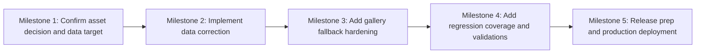

# Plan 055 — Home page category gallery image HTTP 400 bugfix

**Target Release**: v0.8.25 — DevOps Stage 1 preflight confirmed `v0.8.24` tag already exists on origin (origin/main:package.json = 0.8.24). Bumped to next available patch v0.8.25.  
**Epic Alignment**: Home page reliability and trust-first discovery  
**Status**: Committed  
**Related Issues**: None

## Release Strategy

Standalone (no other known active plans in `agent-output/planning/` targeting the next patch after `v0.8.23`).

## Changelog

| Date (UTC)        | Agent         | Change                                 | Rationale                                                                                                  |
| ----------------- | ------------- | -------------------------------------- | ---------------------------------------------------------------------------------------------------------- |
| 2026-03-24T11:50Z | planner       | Created plan from Analysis 055         | Convert verified production bug root cause into implementation-ready work package                          |
| 2026-03-24T12:15Z | code-reviewer | Status updated to Code Review Approved | No CRITICAL/HIGH/MEDIUM findings; fix-in-review applied to migration 061 (RETURNING clause)                |
| 2026-03-24T12:22Z | qa            | Status updated to QA Complete          | Automated QA gates passed; live migration/browser verification explicitly deferred with owner and fallback |
| 2026-03-24T12:40Z | uat           | Status updated to UAT Approved         | APPROVED FOR RELEASE — all deliverables confirmed; version target flagged for DevOps Stage 1 re-verification |
| 2026-03-24T13:00Z | devops        | Status updated to Committed            | Stage 1 complete: v0.8.24 collision resolved → v0.8.25; local commit made; docs moved to closed/ |

## Value Statement and Business Objective

As a **home page visitor**, I want **every category gallery on the landing experience to load real images or a graceful fallback**, so that **UFlow feels trustworthy, polished, and reliable when I browse providers and community services**.

## Context

Analysis 055 verified that the reported `/_next/image` HTTP 400 is not caused by `next.config.js` allow-listing. The failing upstream image URL in Supabase Storage points to a missing object in the public `category-images` bucket. The rendering path is:

- `CategoryGallerySection` loads categories
- `UnifiedGallery` renders three `next/image` tiles per category
- `useImageFallback` prefers entity images, then category fallback images, then local placeholders

The production failure occurs when the category fallback for Clothing & Fashion references `a65-design-2NLeXS3NR5E-unsplash.jpg`, which does not exist in Supabase Storage. Because `UnifiedGallery` currently renders remote URLs without client-side failure handling, the user sees broken image placeholders instead of a safe fallback.

Architecture guidance is straightforward for this change:

- Media stays in Supabase Storage
- Next.js image optimization remains the delivery path
- Deployment follows the existing GitHub Actions/Docker/Hetzner path with post-deploy verification

## Scope

**In scope**

- Correct the broken category image data so the Clothing & Fashion gallery resolves to a valid asset in production
- Add UI resilience so failed remote gallery images fall back to the existing local placeholder instead of rendering a broken image
- Add regression coverage for the bug path that distinguishes pre-fix failure from post-fix recovery behavior
- Ship the fix through the normal release and production deployment workflow

**Out of scope**

- Redesigning the home page gallery layout or changing the category gallery visual language
- Building a full media administration workflow for category images
- Retrofitting every historical category record unless needed to prevent the same failure class from recurring

## Assumptions

1. A valid replacement image can be sourced either by re-uploading the intended asset or by updating the category record to a different existing object in the same public bucket.
2. The current Next.js `images.remotePatterns` entry for `**.supabase.co` remains correct and does not need modification.
3. A small client-side fallback in the gallery component is acceptable even though the immediate root cause is a missing storage object.
4. Production deployment will use the existing release pipeline and does not require deploy-surface changes.

## Decision Record

- [RESOLVED] Treat this as a product bugfix for the next patch release because it directly degrades the landing-page trust experience.
- [RESOLVED] Fix both the data defect and the UI failure mode because restoring one broken asset alone does not protect against future stale storage references.
- [RESOLVED] Keep Next.js image optimization in place; no image delivery architecture change is warranted because same-host Supabase images already optimize successfully.
- [RESOLVED] Use the existing local placeholder asset as the gallery fallback because it is already part of the rendering model and minimizes new surface area.
- [RESOLVED] Capture the database-side change in a proper Supabase migration or equivalent tracked artifact so the category image reference is reproducible across environments.
- [DEFERRED: product owner + source asset unknown + validate during implementation/release v0.8.24] Decide whether the final Clothing & Fashion image should be the original missing file re-uploaded or a different approved replacement asset.

## Milestone Dependencies

Sequencing rule: the UI hardening can begin in parallel with sourcing the replacement asset, but production release cannot proceed until the data correction and regression validations both pass.

## Plan

1. **Confirm the replacement asset and authoritative data update path**
   - Determine whether implementation will restore the missing file in the `category-images` bucket or update the Clothing & Fashion `category_images` reference to an existing approved object.
   - Ensure the chosen path is reproducible in repo-managed artifacts, not a one-off undocumented console action.
   - Record the final object path and affected category identifier in implementation notes.

2. **Correct the broken category image reference**
   - Update the production-bound data path so the Clothing & Fashion category resolves to a valid image.
   - If the category image schema/state is still missing from formal migrations, capture the relevant schema/data correction in `supabase/migrations/` or another tracked, reproducible database artifact consistent with repo standards.
   - Verify the corrected upstream image URL returns a valid image response before app-level testing begins.

3. **Harden gallery rendering against broken remote images**
   - Update the home page gallery rendering path so any failed remote image load swaps to the local placeholder rather than leaving a broken visual tile.
   - Keep the change scoped to the existing category gallery path unless implementation discovers the same gallery component is shared elsewhere and the same fallback behavior is safe there.
   - Preserve accessibility and current layout behavior while introducing the fallback.

4. **Add regression protection for the actual bug path**
   - Add focused automated coverage for the client-side precedence/failure path that caused the visual breakage.
   - Make the bug visible in test naming and assertions so it is clear what failed before and what passes after the fix.
   - Cover both: valid category image behavior and fallback behavior when a category image URL is invalid or unreachable.

5. **Validate end-to-end behavior before release**
   - Run the relevant static and automated checks for the touched code paths.
   - Verify the home page category rows render correctly in a production-like build or environment where `next/image` optimization is active.
   - Confirm no regressions to categories that already render correctly, including Health & Sports and any row using entity-image priority.

6. **Release preparation and deployment**
   - At DevOps Stage 1, confirm the next free patch version after `v0.8.23` is still available and set the final release version.
   - Update release artifacts (`package.json`, `CHANGELOG.md`, and any required deployment notes) for the confirmed patch version.
   - Deploy through the standard production path and capture evidence that the affected home page category loads correctly after release.

## Acceptance Criteria

- The Clothing & Fashion category on the home page no longer produces an HTTP 400 from `/_next/image` in production.
- The affected category row renders a valid image tile set after the data correction.
- If a category gallery image URL is broken in the future, the UI renders the local placeholder rather than a broken image tile.
- Existing working category rows, including Health & Sports, continue to render correctly.
- The data correction is reproducible from tracked repository artifacts, not dependent on undocumented manual state.
- The fix ships under the next confirmed patch release after `v0.8.23`.

## Testing Strategy

- Unit/component coverage for gallery fallback behavior in the client rendering path
- Regression coverage that exercises the exact broken-image scenario verified in Analysis 055
- Type-checking and linting for touched frontend files
- Relevant database validation for the corrected category image reference
- Production-like verification where Next.js image optimization is active

## Validation

- `npm run type-check`
- `npm run lint`
- Targeted `vitest` coverage for the gallery component/hook path
- Data verification that the final Supabase Storage URL returns HTTP 200 with image content
- Post-deploy smoke check on the live home page for the affected category row

## Risks and Mitigations

- **Risk**: The original source image is unavailable.
  - **Mitigation**: Allow implementation to use an approved replacement asset while preserving the same business outcome.

- **Risk**: A manual production-only storage fix drifts from repo-managed state.
  - **Mitigation**: Require the authoritative data/schema correction to be represented in tracked artifacts.

- **Risk**: Fallback hardening changes gallery behavior for successful images.
  - **Mitigation**: Keep the logic minimal and add focused regression coverage for both success and failure states.

- **Risk**: Deployment verification stops at passing CI and misses the optimized image path in production.
  - **Mitigation**: Require a post-deploy live smoke check specifically against the affected home page gallery row.

## Duration Estimates

- Analysis: completed in Analysis 055
- Planning: 0.5h
- Implementation: 1.5-3h
- QA: 0.5-1.0h
- UAT: 0.25-0.5h
- DevOps: 0.5-1.0h

Uncertainty drivers: availability of the intended source asset, whether the category image correction is best expressed as a migration or a tracked operational data patch, and how much existing test scaffolding already covers the gallery component.

## Handoff Notes

- Use Analysis 055 as the source of truth for the verified root cause.
- Do not spend implementation time on `next.config.js` image domains unless fresh evidence contradicts the current analysis.
- If implementation finds additional broken `category_images` references, fix the reported production issue first, then decide whether broader cleanup still fits the release scope.
