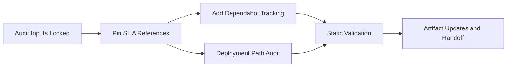

# Plan 056 - GitHub Actions Supply Chain Remediation

## Plan Header

- **Target Release**: N/A (workflow-only security hardening; version pre-flight completed and current product head is `v0.8.23`)
- **Epic Alignment**: Security hardening / CI-CD supply chain resilience
- **Status**: Released
- **Related Issues**: Security Audit 056; Checkmarx KICS compromise advisory (2026-03-23); no internal GitHub issue provided

## Release Strategy

Release Strategy: **Standalone** (no other known active plans in `agent-output/planning/` target this workflow-only remediation release).

## Value Statement and Business Objective

As a **platform operator and deployment owner**, I want **all GitHub Actions workflows to use immutable action references and automated update tracking**, so that **a tag-rewrite or compromised-action incident cannot silently inject attacker-controlled code into CI or production deployment paths**.

## Objective

1. Eliminate mutable GitHub Action references across all UFlow workflows, with priority on deploy and secrets-bearing jobs.
2. Preserve existing CI, UAT, and production deployment behavior while reducing the supply-chain attack surface.
3. Add maintainable action-update hygiene so the repo stays pinned without depending on manual monitoring.
4. Produce verifiable rollout guidance that lets Implementer, Critic, QA, and DevOps validate the hardening change without redefining the remediation scope.

## Strategic Alignment

- **Master Product Objective support**: Trust is central to being the first place users and operators rely on. A compromised deployment pipeline breaks that trust at the infrastructure layer even if the product surface is unchanged.
- **Roadmap alignment**: The roadmap currently flags dependency/security drift and explicitly shows the product release train is ready for the next planning cycle. This plan addresses CI/CD security debt without broadening into unrelated product work.
- **Architecture alignment**: The architecture overview identifies GitHub Actions as the deployment automation control plane for Hetzner, GHCR, and health-check verification. Hardening action references directly protects that control plane and the secrets path flowing through it.

## Repository and Architecture Context

- GitHub Actions is the active CI/CD orchestrator for lint/test/build, production deployment, UAT deployment, dependency review, security scanning, and reporting.
- Deployment workflows touch high-sensitivity secrets and infrastructure paths: SSH to Hetzner, GHCR login, Docker image build/push, Nginx config transfer, and post-deploy health checks.
- Current architecture already relies on blue-green style validation and `/api/health` checks; this plan must preserve those behaviors exactly while hardening only action sourcing.
- The security audit identified 11 mutable action references spanning 37 `uses:` occurrences across 7 workflow files.

## Assumptions

- The resolved SHAs captured in Security Audit 056 are acceptable pin targets unless Implementer discovers a newer vetted SHA is required during execution.
- No business requirement depends on action tags remaining mutable.
- Dependabot for `github-actions` is acceptable in this repository and will not conflict with existing dependency automation.
- This change is workflow-only and should not trigger a product semver bump unless DevOps determines the release process requires one for governance reasons.

## Decision Record

1. **[RESOLVED]** Treat this as a workflow-only security hardening plan rather than a product feature release.
   Rationale: The deliverables change CI/CD configuration and governance, not application runtime behavior or user-facing product functionality.
2. **[RESOLVED]** Use the 056 chain ID for the plan and handoff artifacts.
   Rationale: The user explicitly requested continuing the existing 056 stream and prohibited allocating a new ID outside the active control window.
3. **[RESOLVED]** Prioritize deploy-path actions (`appleboy/*`, `docker/*`) ahead of CI-only actions in implementation and review sequencing.
   Rationale: Those actions execute in the highest-privilege context and can expose SSH credentials, container registry access, and server-side secrets.
4. **[RESOLVED]** Pin every mutable action reference to a full 40-character commit SHA with an adjacent version comment.
   Rationale: Full-length SHAs are the immutable control recommended by GitHub security guidance and preserve maintainability when paired with human-readable versions.
5. **[RESOLVED]** Add `github-actions` Dependabot coverage in the same remediation scope.
   Rationale: SHA pinning without automated update discovery creates predictable drift and encourages later tag-based shortcuts.
6. **[RESOLVED]** Keep remediation scope narrow: workflow references, version-tracking config, and any minimum documentation/comments needed for maintainability.
   Rationale: This addresses the root cause without expanding into broader deployment redesign or unrelated security backlog.
7. **[DEFERRED: owner = future Planner/Security, reason = broader operational redesign exceeds incident scope, target = next security hardening plan]** Evaluate replacing `appleboy/ssh-action` and `appleboy/scp-action` with lower-dependency native SSH/SCP patterns.

## Scope

### In Scope

- Updating all mutable `uses:` references in the affected workflow files to immutable SHAs.
- Preserving or adding succinct version comments beside pinned SHAs.
- Adding `.github/dependabot.yml` coverage for GitHub Actions updates.
- Verifying all deployment entrypoints remain consistent after pinning.
- Updating security/planning artifacts needed for traceable handoff and closure.

### Out of Scope

- Redesigning deployment topology, secrets architecture, or server provisioning.
- Replacing GitHub Actions with another CI/CD platform.
- Refactoring unrelated workflow logic, runtime build scripts, or app code.
- Rotating secrets or changing GitHub environment policies unless a separate finding proves that necessary.
- Converting third-party deployment actions to native shell/SSH patterns in this incident response.

## Milestone Dependencies

Sequencing rule: Workflow pinning is the gate for both Dependabot setup and deployment-path verification; handoff cannot proceed until both validation tracks complete.

## Plan

1. **Lock remediation inputs**
   - Objective: Start implementation from a stable source of truth.
   - Work:
     - Use Security Audit 056 as the authoritative inventory for affected workflows, mutable refs, resolved SHAs, and risk priority.
     - Confirm the remediation stays constrained to the 7 impacted workflow files and one new/update-tracking config file.
   - Acceptance Criteria:
     - Implementer has a single authoritative mapping of action name, current ref, target SHA, and expected version comment.
     - No new mutable references are introduced into scope during execution.

2. **Pin all mutable GitHub Action references**
   - Objective: Remove tag and branch mutability from every affected workflow.
   - Work:
     - Replace all 37 mutable `uses:` occurrences with full SHAs.
     - Preserve existing workflow semantics, inputs, permissions, conditions, and ordering.
     - Add or normalize inline version comments after each SHA pin for maintainability.
     - Address first-party and third-party actions uniformly; do not leave lower-risk CI actions unpinned.
   - Acceptance Criteria:
     - Every `uses:` reference in the targeted workflows is either SHA-pinned or intentionally unchanged because it was already pinned.
     - No workflow loses behavior, inputs, or required permissions as part of the pinning pass.
     - The post-change workflow set contains zero `@v*`, `@master`, or other mutable third-party refs in the affected files.

3. **Add GitHub Actions version tracking**
   - Objective: Keep pinned actions maintainable after remediation.
   - Work:
     - Add `.github/dependabot.yml` with `github-actions` ecosystem coverage at the repository root.
     - Use a conservative review cadence and labels/commit-message conventions consistent with the repo’s workflow practices.
   - Acceptance Criteria:
     - Dependabot is configured to monitor GitHub Actions updates.
     - The configuration does not broaden into unrelated package ecosystems unless already required elsewhere in the repo.

4. **Deployment Path Audit**
   - Objective: Prove the hardening change does not create drift across deployment entrypoints.
   - Work:
     - Enumerate and verify every deploy-surface workflow and path touched by the remediation, including `.github/workflows/deploy-hetzner.yml`, `.github/workflows/deploy-uat.yml`, GHCR login/build steps, SCP/SSH delivery, and Nginx config transfer steps.
     - Confirm that action pins, comments, and any new config remain consistent across production and UAT where the same control path exists.
   - Acceptance Criteria:
     - The implementation notes enumerate every deployment entrypoint verified.
     - Production and UAT deploy workflows are aligned where they should be aligned and intentionally different only where environment-specific behavior already existed.

5. **Static validation and execution evidence**
   - Objective: Verify workflow syntax and repo-level checks remain healthy after the remediation.
   - Work:
     - Run the relevant repository gates for a workflow/configuration change at high level: YAML/workflow validation, lint/type-check gates if impacted by config loading or scripts, and any lightweight checks needed to ensure no malformed workflow definitions ship.
     - Capture evidence that no mutable refs remain in the target workflow set.
   - Acceptance Criteria:
     - Validation evidence exists for the changed workflow files.
     - There is explicit proof that mutable refs in scope were fully eliminated.

6. **Artifact updates and handoff**
   - Objective: Leave the incident stream traceable and ready for downstream agents.
   - Work:
     - Update the security audit and implementation artifact chain as work progresses.
     - Record any deviations, deferred items, or replacement SHAs discovered during implementation.
     - Handoff to Critic after the plan is implemented; do not skip critique because the change is “only workflows.”
   - Acceptance Criteria:
     - The 056 artifact chain remains consistent across planning, implementation, critique, QA/UAT if used, and closure.
     - Any deferred hardening work is explicitly separated from the core remediation and does not block closing the current incident scope.

## Testing Strategy

- **Static/workflow validation**: Validate YAML integrity and workflow configuration correctness after pin updates.
- **Repository guard checks**: Run the minimal relevant project gates that could be affected by workflow/config changes, prioritizing CI confidence over exhaustive runtime testing.
- **Regression confidence**: Confirm that deploy, UAT, CI, dependency review, and scheduled security/reporting workflows still retain their intended trigger paths and action inputs.
- **Security verification**: Re-scan the workflow set to confirm no mutable action refs remain in scope.

## Validation

- Verify all affected workflow files under `.github/workflows/` use immutable SHAs for third-party and first-party actions in scope.
- Verify `.github/dependabot.yml` exists and is valid for the `github-actions` ecosystem.
- Verify existing SHA-pinned actions remain untouched unless a justified update is documented.
- Verify deploy workflows still expose the same approval and health-check behaviors documented in architecture.

## Risks

1. **Workflow breakage from incorrect SHA selection**
   - Mitigation: Use the audited SHA table as source of truth and preserve version comments for traceability.
2. **Partial remediation leaves low-risk CI actions mutable**
   - Mitigation: Treat zero mutable refs in the affected files as the completion condition, not only the critical deploy actions.
3. **Dependabot omission recreates maintenance pressure**
   - Mitigation: Keep Dependabot in the same scoped change rather than deferring it.
4. **Cross-environment drift between production and UAT workflows**
   - Mitigation: Require the deployment path audit milestone before handoff.
5. **Scope creep into broader deployment redesign**
   - Mitigation: Defer `appleboy/*` replacement and secrets redesign to a future plan.

## Rollback Considerations

- If a pinned SHA causes an unexpected workflow failure, rollback should revert only the affected workflow changes while preserving the rest of the remediation where possible.
- If a publisher revokes or force-removes a referenced commit, DevOps/Implementer should replace that SHA with a newly verified immutable commit and document the delta in the 056 artifact chain.
- Dependabot configuration can be rolled back independently if it introduces operational noise, without undoing SHA pinning.

## Version Management

- **Version pre-flight executed**:
  - Latest tags observed: `v0.8.19` through `v0.8.23`
  - `origin/main:package.json` version: `0.8.23`
- **Decision**: No product version bump is planned because this is a workflow-only security hardening change.
- **DevOps checkpoint**: If release governance later requires a product patch tag for this workflow-only change, use the next available patch after current `origin/main` version and confirm exact assignment at DevOps Stage 1.

## Duration Estimates

- **Analysis**: 0.5-1 hour
- **Planning**: 0.5 hour
- **Implementation**: 1-2 hours
- **QA / validation**: 0.5-1 hour
- **UAT**: N/A or 0.25 hour if manual workflow review is requested
- **DevOps**: 0.5 hour

Uncertainty drivers: GitHub Actions syntax sensitivity, whether any action SHA must be revised from the audit table, and whether repository governance requires extra review for deploy-workflow changes.

## Changelog

| Date | Agent | Change |
|---|---|---|
| 2026-03-24 | Planner | Created Plan 056 from Security Audit 056 for GitHub Actions supply-chain remediation; preserved existing stream ID per session control window |
| 2026-03-24 | QA | Completed QA validation: static workflow checks passed, type-check passed, tests passed, plan status advanced to QA Complete |
| 2026-03-24 | UAT | All 5 UAT scenarios PASS; value delivery confirmed; APPROVED FOR RELEASE — no product version bump required |
| 2026-03-24 | DevOps | Document closed | Status: Committed |
| 2026-03-24 | DevOps | Stage 2 pushed to origin | Status: Released — commit 15b2a0b pushed to session/056-gha-supply-chain-audit |