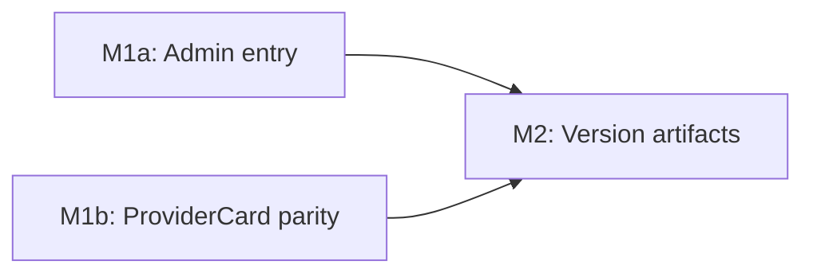

# 057 — Fix Admin Panel Entry Point & Profile Provider Cards on `/profile` Page

| Field | Value |
|-------|-------|
| **Plan ID** | 057 |
| **Target Release** | next available patch after v0.8.17 on origin/main; confirm at DevOps Stage 1 (expected v0.8.18) |
| **Epic Alignment** | Admin Provider Review — navigation completeness; Profile UX parity |
| **Status** | Active |
| **Related Issues** | None (reported directly by product owner via chat) |

## Changelog

| Date | Agent | Change |
|------|-------|--------|
| 2026-03-23T00:00Z | Analyst | Created analysis doc 057 — identified orphan component and desktop placement mismatch |
| 2026-03-23T00:00Z | Planner | Promoted analysis to plan; inherited ID 057/UUID b7e3d4a2 |
| 2026-03-23T00:00Z | Planner | Scope expanded: added M1b — replace profile page provider cards with ProviderCard (list-view parity + click-to-detail) |
| 2026-03-23T16:55Z | Planner | Superseded by Plan 058 after product direction changed from `/profile`-based admin entry to admin review embedded in `/providers` discovery flow |

## Release Strategy

Standalone (no other known plans targeting v0.8.18).

## Value Statement and Business Objective

As an admin user, I want to see an "Admin Panel" entry on the `/profile` page, so that I can reach the provider review panel from the place I naturally navigate to in the app — on both desktop and mobile.

As a user, I want the providers shown on my profile page to look and behave the same as they do in the providers list (same card format, clickable to detail page), so that I have a consistent experience throughout the app.

## Objective

Two related fixes in `ProfileContent.tsx`:

1. **Admin entry point** — Add an "Admin Panel" button visible only to admin/moderator users, directly on the `/profile` page in both mobile and desktop layouts.

2. **Provider card parity** — Replace the current minimal card components (`MobileProfileProviderCard` on mobile, `SelectableCard` on desktop) with the same `ProviderCard` used in the providers list view. Add click-to-detail navigation for all provider and community service entries.

## Background

Plan 050 added an admin entry point to `src/components/common/MobileProfileScreen.tsx`. That component is **never imported or rendered** anywhere in the app — it is effectively dead code. The actual `/profile` page renders `ProfileContent.tsx`, which currently has no admin content at all.

On desktop, Plan 050 also added an admin entry to the `Header.tsx` dropdown (top-right profile icon). That entry is correctly wired and visible on desktop at ≥ md breakpoint when `isAdmin` is true. However, the product owner expects the entry to be on the `/profile` page itself (consistent with the mobile expectation).

## Assumptions

1. The admin entry should appear on the `/profile` page in both mobile and desktop layouts within `ProfileContent.tsx`.
2. The existing `useIsAdmin` hook (already in the codebase) is the correct role-check mechanism — no changes to role logic needed.
3. The Header dropdown admin entry can remain as a secondary entry point — no removal required.
4. The orphan `MobileProfileScreen` component can remain in the codebase for now — removal is a separate cleanup task (no risk, no benefit to rushing).
5. No new i18n keys are needed for this fix if the button label is hardcoded as "Admin Panel" (consistent with existing Header.tsx label). A follow-on i18n pass is already tracked in `050-open-actions.md`.

## Decision Record

| Decision | Status | Rationale |
|----------|--------|-----------|
| Add admin entry to `ProfileContent.tsx` rather than wiring `MobileProfileScreen` | `[RESOLVED]` | `ProfileContent.tsx` is the component that actually renders at `/profile`. Wiring `MobileProfileScreen` into the tree would require architectural changes to RootClientLayout and introduce a new overlay pattern for a single button. |
| Keep Header dropdown admin entry | `[RESOLVED]` | It is correctly wired and visible on desktop; removing it creates unnecessary churn. |
| Do not remove `MobileProfileScreen` orphan | `[RESOLVED]` | No user-visible impact either way; cleanup can be done in a dedicated refactor pass. |
| Hardcode "Admin Panel" label (no new i18n key) | `[RESOLVED]` | Consistent with existing Header.tsx label; i18n follow-up already tracked in open-actions item 5. |
| Replace `MobileProfileProviderCard` and `SelectableCard` with `ProviderCard` for provider entries | `[RESOLVED]` | Product owner explicitly requested "similar to list view." `ProviderCard` is the list-view component. Both `createdProviders` and `recommendations` return `Provider[]` which maps directly. `savedProviders` (`SearchResult[]`) uses the same mapping pattern already in `SearchResultsList.tsx`. |
| Keep existing card components for community services | `[RESOLVED]` | `ProviderCard` is typed for `Provider`, not `CommunityService`. Community services have a different data shape and replacing them is a separate scope item. |
| Target `v0.8.18` | `[RESOLVED]` | `v0.8.17` is the latest tag and current `origin/main` version; next patch is `v0.8.18`. Confirm at DevOps Stage 1. |

## Scope

**Primarily `src/app/(public)/profile/ProfileContent.tsx`**

Changes:
- Import `useIsAdmin` (admin entry, hook already exists)
- Import `ProviderCard` (from `@/components/providers/ProviderCard`)
- Admin panel section in `mobileContent` and `desktopContent`
- Replace `MobileProfileProviderCard` usages with `ProviderCard` + click-to-detail (`/providers/{id}`)
- Replace `SelectableCard` usages in `createdProviders`, `recommendations`, and `savedProviders` sections with `ProviderCard` + click-to-detail
- Community services sections remain on their existing card components (they are not `Provider` type and `ProviderCard` is scoped to providers)

**No database migrations. No API changes. No new files required.**

### Current vs Target: card components in profile

| Section | Current mobile | Current desktop | Target (both) |
|---------|---------------|-----------------|---------------|
| Your Content (providers) | `MobileProfileProviderCard` | `SelectableCard` | `ProviderCard` → `/providers/{id}` |
| Saved (providers) | `MobileProfileProviderCard` | `SelectableCard` | `ProviderCard` → `/providers/{id}` or `/community-services/{id}` |
| Recommendations (providers) | `MobileProfileProviderCard` | `SelectableCard` | `ProviderCard` → `/providers/{id}` |
| Community services (all sections) | `MobileProfileProviderCard` | `SelectableCard` | Unchanged (not Provider type) |

### Data shape compatibility

- `getCreatedProviders` and `getRecommendations` return `Provider[]` — fields map directly to `ProviderCard` props.
- `getAllBookmarkedItems` returns `SearchResult[]` — needs the same `searchResultToProvider()` mapping used in `SearchResultsList.tsx`. The implementer can define a local inline helper or import the pattern from `SearchResultsList`.
- `ProviderCard` props: spread `Provider` fields (minus `id` and `category_id`). Pass `bookmarkableType`, `isBookmarked`, `hideWebsiteButton` as needed.

## Plan

### Milestone 1a — Add Admin Entry to `ProfileContent.tsx`

**Objective**: Admin and moderator users see an "Admin Panel" button on the `/profile` page in both mobile and desktop layouts.

**Tasks**:

1. Import `useIsAdmin` hook at the top of `ProfileContent.tsx`.
2. Call `useIsAdmin()` inside the component function body to obtain `isAdmin`.
3. **Mobile layout** (`mobileContent`): Insert a conditionally-rendered "Administration" section above the Action Items section. When `isAdmin` is true, render an "Admin Panel" button navigating to `/dashboard/providers`. Match the visual style of existing action items (icon + label, full-width, with a divider below).
4. **Desktop layout** (`desktopContent`): Insert a conditionally-rendered admin button in the persistent header area (below the avatar/name/email row), visible regardless of which tab is active. Navigate to `/dashboard/providers` on click.

**Acceptance criteria**:

- Logged-in admin/moderator user sees "Admin Panel" on `/profile` on both mobile and desktop.
- Clicking navigates to `/dashboard/providers`.
- Regular users do not see the button.
- `isAdmin` sourced from `useIsAdmin()`.

### Milestone 1b — Replace Profile Provider Cards with `ProviderCard`

**Objective**: Provider entries in "Your Content", "Saved", and "Recommendations" sections render using `ProviderCard` (same component as the providers list), with click-to-detail navigation.

**Tasks**:

1. Import `ProviderCard` from `@/components/providers/ProviderCard` in `ProfileContent.tsx`.
2. **Mobile layout** — `mobileContent` sections for `createdProviders`, `savedProviders` (provider type), and `recommendations`: replace each `MobileProfileProviderCard` usage with a clickable wrapper containing `ProviderCard`. Wrap in a `div` with `onClick` navigating to `/providers/{provider_id}` (or `/community-services/{id}` for community services). Pass at minimum: spread provider fields, `hideActions={false}`, `hideWebsiteButton={true}`, `bookmarkableType`, `isBookmarked`.
3. **Desktop layout** — `desktopContent` tabs `'created'`, `'saved'`, `'recommendations'`: replace each `SelectableCard` provider usage with the same `ProviderCard` pattern. The existing grid layout (`flex flex-wrap justify-center gap-8`) can be retained as the wrapping grid.
4. For `savedProviders` (type `SearchResult[]`): add a local mapping function (or inline) to convert `SearchResult` → the Provider spread shape, mirroring the logic in `SearchResultsList.tsx` (`searchResultToProvider`).
5. Community service entries across all sections: retain existing `MobileProfileProviderCard` / `SelectableCard` for now. Add `onClick` navigation to `/community-services/{community_service_id}` if not already present.

**Acceptance criteria**:

- Provider entries in "Your Content", "Saved", and "Recommendations" tabs/sections render with the full `ProviderCard` layout (image, name, category, address, bookmark button).
- Clicking a provider card navigates to `/providers/{provider_id}`.
- Clicking a community service card navigates to `/community-services/{community_service_id}`.
- No visual regressions for non-provider content.
- Empty states and loading spinners remain intact.

### Milestone 2 — Update Version Artifacts

**Tasks**: Update `package.json` → `0.8.18`, update `package-lock.json`, add `[0.8.18]` CHANGELOG entry.

## Milestone Dependencies

M1a and M1b are independent and can be implemented in sequence within the same session. M2 follows both.

## Testing Strategy

- Unit/logic test: `useIsAdmin` tests already exist from Plan 050 — confirm they still pass.
- Component rendering test: Render `ProfileContent` with mocked admin user and assert admin button is present; with non-admin user and assert it is absent.
- Component rendering test: Render `ProfileContent` with mocked provider data and assert `ProviderCard` renders (not `MobileProfileProviderCard` or `SelectableCard`); assert click handler navigates to the correct route.
- No E2E required; UAT smoke test (live browser on uat.ummahflow.com) is the acceptance gate.

## Validation Steps

1. `npm run type-check` — zero errors
2. `npm run lint` — zero new warnings
3. `npm test` — all existing tests pass; new rendering tests pass
4. Manual UAT smoke test on `https://uat.ummahflow.com/profile`:
   - Admin user: "Admin Panel" button visible on mobile and desktop; click routes to `/dashboard/providers`
   - Regular user: button absent
   - Provider cards render with image, name, category, address; clicking navigates to `/providers/{id}`
   - Community service cards still render; clicking navigates to `/community-services/{id}`

## Risks

| Risk | Likelihood | Impact | Mitigation |
|------|-----------|--------|-----------|
| `ProviderCard` renders differently in profile context vs list (no search filter, no infinite scroll) | Low | Low | `ProviderCard` is self-contained; `hideWebsiteButton={true}` keeps it compact |
| `SearchResult[]` → `Provider` mapping misses a field | Low | Low | Mirror the `searchResultToProvider` logic from `SearchResultsList.tsx` exactly |
| `useIsAdmin` returns false due to auth timing on profile mount | Low | Medium | Same hook works in `Header.tsx`; no timing difference expected on this page |

## Duration Estimates

| Phase | Estimate | Uncertainty |
|-------|----------|-------------|
| Implementation (M1a + M1b + M2) | 60–90 min | Low — all confined to one file, clear patterns to follow |
| QA | 20–30 min | Low — existing patterns apply |
| UAT smoke test | 15–20 min | Low — four scenarios, two user roles |
| DevOps (commit + tag) | 15–30 min | Low — no migration, no infra change |

Total: **~2–3 hours end-to-end**.

## Handoff Notes

- Implementer: `ProfileContent.tsx` is a large file (1068 lines). Key insertion points:
  - **Mobile admin entry**: insert `isAdmin && (...)` section ~line 666, above the Action Items `ContentSection` (the block starting with "Über Uns")
  - **Desktop admin entry**: insert `isAdmin && (...)` button ~line 700, after the avatar/email row in `desktopContent`
  - **Mobile provider cards**: replace each `MobileProfileProviderCard` in the "Your Content" (~line 547) and "Recommendations" (~line 591) sections with `ProviderCard`
  - **Desktop provider cards**: replace each `SelectableCard` in the `activeTab === 'created'` (~line 710), `activeTab === 'saved'` (~line 749), and `activeTab === 'recommendations'` (~line 790) sections
- `ProviderCard` import: `import { ProviderCard } from '@/components/providers/ProviderCard'`
- `useIsAdmin` import: `import { useIsAdmin } from '@/hooks/useIsAdmin'`
- For saved providers (`SearchResult[]`): define a small local helper that maps `SearchResult` to Provider spread (model after `searchResultToProvider` in `SearchResultsList.tsx`)
- Do not remove the `Header.tsx` dropdown admin entry — it remains as a secondary access point
- Do not remove or wire `MobileProfileScreen` — it stays as-is (cleanup deferred)
