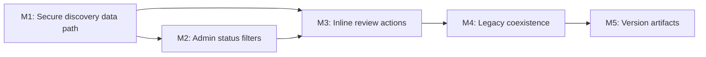

# 058 — Admin Review Inside Providers Discovery

| Field | Value |
|-------|-------|
| Plan ID | 058 |
| Target Release | v0.8.21 (bumped from v0.8.20 — tag already existed on origin) |
| Epic Alignment | Admin Provider Review; provider discovery workflow simplification |
| Status | Active |
| Related Issues | None |

## Changelog

| Date | Agent | Change |
|------|-------|--------|
| 2026-03-23T15:50Z | Planner | Created replacement plan after product direction changed from `/profile`-based admin entry to admin review embedded in `/providers` discovery |
| 2026-03-23T15:50Z | Planner | Supersedes Plan 057 because the review entry point, moderation surface, and filter model changed materially |
| 2026-03-23T16:05Z | Planner | Rev 1 — Addressed critique findings: F1 (M1 reframed to match RLS reality), F2 (reject comment via modal/popover), F3 (caching guidance added) |
| 2026-03-23 | Code Reviewer | Status updated to Code Review Approved; 2 MEDIUM findings fixed in-review (reviewingProviderId wiring, error feedback); 1 LOW dead code fixed in-review; 3 items deferred |
| 2026-03-23T17:15Z | QA | Status updated to QA Complete; regression test added (reviewingProviderId pre-fix/post-fix); useMemo fix applied to ProvidersContent (resolves react-hooks/exhaustive-deps warning); 490/491 tests pass (1 pre-existing failure unrelated to plan) |
| 2026-03-23T17:30Z | UAT | Status updated to UAT Approved; all 5 plan objectives confirmed delivered; APPROVED FOR RELEASE at v0.8.20 |

## Release Strategy

Standalone (no other known plans for this version).

## Value Statement and Business Objective

As an admin, I want to review providers directly from the main providers list, filter them by moderation status, and approve or reject them inline, so that I can work from one familiar discovery surface instead of switching to a separate admin panel.

## Objective

Replace the separate admin review entry-path work with an admin-aware version of the existing `/providers` experience:

1. Public users continue to see only approved providers.
2. Admin users can switch the providers list into moderation mode using status filters.
3. In moderation mode, the provider card action area replaces the save/bookmark action with review actions.
4. Rejecting a provider supports an optional comment.
5. Admins can still click through to the provider detail page from the list.

## Background

Plan 050 completed a dashboard-based review flow and Plan 057 attempted to expose that flow from `/profile`. Product direction has now changed: rather than adding more admin entry points, the preferred workflow is to reuse the main providers discovery page and make it admin-aware.

This is a workflow simplification, not a cosmetic tweak. It changes:
- where admin review starts (`/providers` instead of `/profile` or `/dashboard/providers`)
- how status filtering works (admin-only filters on the main list)
- where moderation actions live (provider card action area instead of dedicated review cards)

## Assumptions

1. `/providers` remains the canonical discovery route for both public browsing and admin moderation.
2. Non-admin users must never gain access to non-approved providers through list search, detail pages, or status filters.
3. The existing review persistence model stays unchanged: `review_status` and `review_feedback` remain canonical fields.
4. Existing review APIs should be reused where possible, especially `/api/admin/review-provider`.
5. The existing dashboard review screen may remain in place as a temporary fallback; removal is not required for this plan.
6. Community services are out of scope for this moderation workflow change.

## Decision Record

| Decision | Status | Rationale |
|----------|--------|-----------|
| Create a new plan instead of revising 057 | [RESOLVED] | The product changed the moderation entry point and interaction model. Revising 057 would leave conflicting scope and critique history. |
| Use `/providers` as the primary admin review surface | [RESOLVED] | This matches the product request to reduce context switching and reuse the existing list view. |
| Keep public discovery approved-only | [RESOLVED] | Public browsing must not expose pending, rejected, or needs-revision providers. |
| Add admin-only status filters to `/providers` | [RESOLVED] | Admins explicitly want to filter by moderation status while working from the discovery page. |
| Reuse the card action area for moderation controls | [RESOLVED] | Product wants the current save area to become approve/reject controls in admin moderation mode. |
| Use modal/popover for reject comment | [RESOLVED] | Product confirmed option B — reject comment appears in a modal/popover triggered from the card. This keeps the card compact and avoids inline form complexity inside the 288px card layout. |
| Keep reject comment optional | [RESOLVED] | Product explicitly requested an optional comment when rejecting. |
| Admin-filtered search responses must not be publicly cached | [RESOLVED] | Any request with a non-default `status` filter parameter must use `no-store` cache control. CDN caching admin-filtered results would expose non-approved providers to public users. |
| Preserve existing review backend fields and route | [RESOLVED] | Reusing `review_status`, `review_feedback`, and the review API keeps scope lower and reduces migration risk. |
| Keep `dashboard/providers` as fallback for now | [RESOLVED] | Removing the existing admin page would expand scope without delivering additional value in this release. |

## Scope

In scope:
- Admin-aware provider search/listing on `/providers`
- Admin-only moderation status filtering
- Inline approve/reject actions in the provider card action area
- Optional reject comment input
- Provider detail visibility rules aligned with admin/public permissions
- URL/filter behavior and query invalidation required to keep moderation state coherent
- Version artifact updates

Out of scope:
- `/profile` admin entry work from Plan 057
- Provider card parity work on `/profile`
- Community service moderation
- Removal of `dashboard/providers`
- New moderation statuses or schema changes
- Full redesign of the provider detail page

## Plan

### Milestone 1 — Admin Status Filter and Caching in the Discovery Data Path

Context: The existing Postgres RLS policy already enforces visibility boundaries:
- **Public/anonymous**: `review_status = 'approved'` only
- **Owner**: sees own providers in any status
- **Admin/moderator**: sees all providers in all statuses

This means the database layer is already secure. The application layer (`searchProviders()`) has no `review_status` filter because the RLS policy is the authoritative guard. Adding a redundant application-level approved-only filter would be misleading and unnecessary.

Objective: Give admins the ability to *isolate* providers by moderation status (narrowing the all-status view the RLS already grants them), expose moderation metadata in the search response for admin users, and ensure admin-filtered responses are not publicly cached.

Tasks:
1. Add an optional `status` filter parameter to the providers search service and `/api/providers/search` route. When present and the caller is an admin, apply an application-level `review_status` filter to the query. When absent or for public callers, the RLS approved-only boundary is the sole guard — no redundant application filter needed.
2. Server-side: verify admin/moderator role before applying the status filter. Return 403 if a non-admin caller sends a `status` parameter.
3. Ensure the search response includes `review_status` and `review_feedback` fields when the caller is admin (these fields must be selected in the query only for admin requests to avoid returning sensitive fields publicly).
4. Update cache-control headers: any response to a request carrying a `status` parameter must use `no-store`. The existing `public, s-maxage=60, stale-while-revalidate=30` header must only apply when no admin status filter is present, ensuring CDN does not cache admin-filtered results and serve them to public users.
5. Align provider detail visibility: `getProviderById` at the client level already has no status filter; the RLS provides the boundary. No change is needed for the approved-only public constraint. For admin access, the RLS already allows it. Document this explicitly in implementation notes rather than adding code.

Acceptance criteria:
- Public users can retrieve only approved providers from `/providers` search and `/providers/{id}` (enforced by RLS; no regression).
- Admin users can pass a `status` parameter and receive providers filtered to that status.
- Non-admin callers receive 403 when attempting to use the `status` filter parameter.
- Admin-filtered search responses carry `no-store` cache control.
- Search results in admin mode include `review_status` and `review_feedback` fields.

### Milestone 2 — Add Admin Moderation Filters to `/providers`

Objective: Give admins a status-filtered moderation mode inside the existing providers list experience.

Tasks:
1. Add an admin-only status filter control to the `/providers` page alongside the existing discovery controls.
2. Support at least the statuses needed by the product request: approved, pending, rejected, and needs_revision. An `all` view may be included if it simplifies workflow without weakening clarity.
3. Keep the current public search, category, and location behavior intact.
4. Persist the selected moderation status in the URL so admin list state is shareable and refresh-safe.

Acceptance criteria:
- Status controls are visible only to admin users.
- Public users do not see moderation controls.
- Changing the moderation filter updates the list contents without breaking existing discovery filters.
- Admin users can explicitly filter to approved providers as requested.

### Milestone 3 — Inline Review Actions in Provider Cards

Objective: Let admins approve or reject directly from the providers list while preserving click-through to provider details.

Tasks:
1. Introduce an admin moderation presentation for provider cards shown in `/providers` when a status filter is active. The recommended approach is a new prop on `ProviderCard` (e.g. `mode: 'public' | 'moderation'`) or an admin-specific wrapper component; the implementer should choose the pattern that causes the least disruption to existing public card behavior — public users must always get the unchanged public experience.
2. In moderation mode, replace the save/bookmark action area with Approve and Reject buttons. The card body and existing visual layout otherwise remain untouched.
3. **Approve**: fires immediately on click, calls `/api/admin/review-provider`, invalidates the list for the current status filter.
4. **Reject**: clicking opens a compact modal/popover (not inline in the card). The modal contains an optional feedback text field and a Confirm Rejection button. On confirmation, submits rejection with optional comment to `/api/admin/review-provider`, closes the modal, and invalidates the list. Pressing Escape or clicking outside cancels without submitting.
5. Preserve card click navigation: clicking the card body (not the action buttons) still opens the provider detail page.
6. After any review action, refresh or invalidate list state so the list reflects the new status immediately. Use the same optimistic-remove pattern already in `AdminProvidersPageContent.handleReview` as a reference.

Acceptance criteria:
- In admin moderation mode, provider cards show Approve and Reject buttons instead of the public save/bookmark action.
- Approve fires without a comment.
- Clicking Reject opens a modal/popover with an optional comment field.
- Reject with or without a comment persists via `/api/admin/review-provider`.
- Modal dismisses on Escape or outside click without submitting.
- Clicking the card body (not action buttons) still opens the provider detail page.
- After a review action, the list updates to reflect the selected status filter.
- Public users on `/providers` are unaffected: bookmark/save behavior is unchanged.

### Milestone 4 — Legacy Coexistence and Release Hygiene

Objective: Ship the new workflow without forcing unnecessary cleanup into the same release.

Tasks:
1. Leave the existing `dashboard/providers` flow intact as fallback during the transition.
2. Do not implement or retain `/profile` admin-entry work from superseded Plan 057.
3. Update release artifacts once implementation scope is complete.

Acceptance criteria:
- The new `/providers` moderation workflow is the primary intended admin path.
- `dashboard/providers` still functions if needed during rollout.
- Version files and changelog reflect the release.

### Milestone 5 — Update Version and Release Artifacts

Objective: Keep version metadata aligned with the release.

Tasks:
1. Update `package.json`
2. Update `package-lock.json`
3. Add a changelog entry describing admin review inside providers discovery

Acceptance criteria:
- Version artifacts are internally consistent.
- Changelog accurately describes the shipped workflow change.

## Milestone Dependencies

UI moderation work starts only after the data path and authorization rules are defined, because the admin list cannot safely exist without server-side access control.

## Testing Strategy

Expected test coverage:
- API/route tests for admin vs non-admin visibility on the providers search route
- Logic or integration tests for status-filter transport and URL synchronization on `/providers`
- Component tests for admin-only filter visibility
- Component tests for provider card moderation mode (approve, reject, optional comment, action-state transitions)
- Route/detail tests ensuring non-admin access to non-approved providers is blocked while admin access is allowed

Critical scenarios to validate:
- Public discovery remains unchanged
- Admin can filter by status and see matching providers
- Approve/reject updates list state correctly
- Reject comment remains optional
- Card click navigation still works in moderation mode

## Validation

Implementation should validate with:
- `npm run type-check`
- `npm run lint`
- `npm test`
- Manual verification on UAT for admin and non-admin users across `/providers` list and provider detail

## Risks

| Risk | Likelihood | Impact | Mitigation |
|------|-----------|--------|-----------|
| Non-admin users gain access to non-approved providers through query params or detail routes | Medium | High | Make server-side authorization the first milestone and validate both list and detail paths before UI work proceeds. |
| Inline moderation controls conflict with existing card click/bookmark interactions | Medium | Medium | Treat moderation mode as a distinct card presentation with explicit action-state handling. |
| List state becomes confusing after review actions | Medium | Medium | Require clear query invalidation and filter-aware refresh after each moderation update. |
| Existing dashboard review page drifts from the new primary workflow | Low | Low | Keep it as temporary fallback only; defer cleanup/removal to a dedicated follow-up plan. |

## Duration Estimates

| Phase | Estimate | Uncertainty |
|-------|----------|-------------|
| Analysis and planning alignment | 0.5 day | Low — product direction is now explicit |
| Implementation | 1.5 to 2.5 days | Medium — requires coordinated list, API, detail, and card-action changes |
| QA | 0.5 day | Medium — both admin and public paths must be checked |
| UAT | 0.5 day | Medium — role-based validation and workflow confirmation required |
| DevOps | 0.25 day | Low — no schema change or deployment-surface change expected |

Main uncertainty drivers: admin authorization threading through discovery APIs, preserving public behavior, and integrating moderation actions into an existing clickable card without introducing interaction regressions.

## Handoff Notes

- This plan replaces 057. Do not implement `/profile` admin entry or profile provider-card parity.
- Reuse existing moderation persistence and status semantics where possible.
- Treat public and admin discovery as the same route with different server-authorized visibility, not as two separate pages.
- If implementation discovers that inline moderation inside the existing card creates excessive interaction conflicts, escalate before inventing a second review surface.
