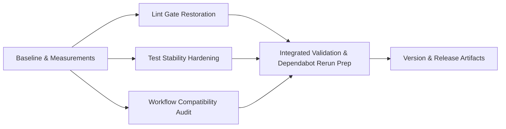

# Plan 059 — Dependabot GitHub Actions CI Fix

**Target Release**: v0.8.26 (confirmed at DevOps Stage 1 from latest origin tag `v0.8.25` and `origin/main` package version `0.8.25`)
**Epic Alignment**: Active Release Tracker / Dependabot security maintenance blocker; supports the Master Product Objective by keeping CI trust, supply-chain hygiene, and release flow reliable
**Status**: Released
**Related Issues**: Dependabot PRs #69, #70, #71, #72, #73, #74, #75, #76, #77; grouped update #2 on `main`

## Release Strategy

Standalone (no other known active plans in `agent-output/planning/` explicitly targeting the same next patch slot after `origin/main` `v0.8.25`).

## Changelog

| Date (UTC) | Agent | Change | Rationale |
| --- | --- | --- | --- |
| 2026-03-24T13:36Z | planner | Created plan | Translate verified CI root-cause analysis into implementation-ready release work |
| 2026-03-24T13:55Z | implementer | Implementation complete | M1–M5 validated; M6 deferred to DevOps Stage 1 |
| 2026-03-24T13:58Z | code-reviewer | Code Review Approved | APPROVED; 1 LOW finding accepted; fix-in-review applied to impl doc wording |
| approx. 2026-03-24T14:06Z | qa | QA Complete | Validation evidence recorded; external Dependabot reruns deferred to maintainer/DevOps |
| 2026-03-24T14:10Z | uat | UAT Approved | APPROVED FOR RELEASE; 3 structured deferred follow-ups recorded (DF-1 external reruns, DF-2 pre-existing test, DF-3 lockfile) |
| 2026-03-24T14:23Z | devops | Stage 1 committed locally | Target release confirmed as v0.8.26; lifecycle closure and local commit prepared |
| 2026-03-24T14:34Z | devops | Released | Branch pushed and release tagged as v0.8.26 |

## Value Statement and Business Objective

As a **maintainer responsible for CI reliability and dependency hygiene**, I want **all Dependabot GitHub Actions update PRs to pass the repository’s required checks**, so that **UFlow can keep its automation dependencies current without blocking merges, accumulating supply-chain risk, or degrading release confidence**.

## Context

The attached analysis for 059 verified that the red Dependabot runs are not caused by breaking API changes in the upgraded actions. Instead, all PRs inherit the same failing baseline from `main`:

- `eslint.config.mjs` does not ignore `tools/**`, while `tsconfig.json` excludes `tools/**/*`, causing TypeScript parser failures during `npm run lint`
- Two unused-variable lint errors in the application code cause the same lint job to fail even after the `tools/` mismatch is fixed
- One CLI-focused Vitest case is timing out intermittently under CI latency
- `ci-summary` fails as a downstream consequence of those upstream failures

Roadmap alignment:
- The roadmap’s Active Release Tracker explicitly lists Dependabot/security follow-up as an open blocking item
- The architecture doc emphasizes security, maintainability, deployment clarity, and per-boundary correctness rather than speculative changes

Version note:
- The roadmap header still says `Current Version: v0.8.21`, but the authoritative release pre-flight shows tags through `v0.8.25` and `origin/main` `package.json` also reports `0.8.25`
- This plan therefore targets the next available patch after `v0.8.25`, with final assignment deferred to DevOps Stage 1 per release-discipline rules

## Scope

**In scope**
- Restore the required GitHub Actions CI checks for Dependabot PRs by fixing shared baseline failures on `main`
- Align ESLint/TypeScript project boundaries so CI linting reflects intended repository scope
- Remove the two verified source-level lint blockers
- Stabilize the intermittent CLI test timeout that blocks some PRs
- Audit workflow compatibility across affected workflow files and only change workflow YAML where validation proves a real compatibility issue
- Prepare the fix set for merge and downstream Dependabot reruns/rebases

**Out of scope**
- Cloudflare Pages / Workers build failures observed outside GitHub Actions CI
- Unrelated lint cleanup beyond the verified blockers
- Broad workflow modernization or pinning strategy redesign unrelated to the failing runs
- Separate Dependabot/npm vulnerability triage beyond what is necessary to unblock the current CI failures

## Assumptions

- The verified root causes from Analysis 059 are sufficient to unblock the failing PRs without invasive workflow redesign
- The newer GitHub Actions major versions in PRs #69-#77 are compatible with repository usage unless validation after baseline fixes proves otherwise
- A small maintenance patch release is acceptable for CI-restoration work because it affects merge velocity and security posture

## Decision Record

- [RESOLVED] Fix the shared `main` branch baseline instead of editing each Dependabot PR independently, because all failing PRs inherit the same lint/test breakage and one fix path unblocks the full batch.
- [RESOLVED] Keep workflow edits conditional, because current evidence shows the upgraded actions execute successfully and the failures occur after workflow startup inside repository lint/test steps.
- [RESOLVED] Treat `tools/**` as out of scope for the app’s main ESLint project, because `tsconfig.json` already excludes it and CI should not parse files the configured TS project intentionally omits.
- [RESOLVED] Stabilize the flaky CLI test at the test boundary rather than loosening CI pass criteria, because the desired outcome is a trustworthy green check, not a weaker gate.
- [RESOLVED] Success will be measured primarily by restored GitHub Actions CI outcomes on representative Dependabot branches and by local reproduction of the previously failing lint/test commands.
- [DEFERRED: DevOps / separate follow-up + out of scope for Plan 059 + target next release planning cycle] Investigate Cloudflare Pages and Workers build failures, because they are not part of the blocking GitHub Actions root cause established by Analysis 059.

## Milestone Dependencies

Sequencing rule: capture the baseline first, then restore the shared lint/test gates in parallel where possible, and only adjust workflow YAML if post-fix validation proves a genuine action-compatibility issue.

## Baseline & Measurements

### Milestone 1: Capture failing baseline and define success thresholds

1. Record the current failing state from Analysis 059 and local reproduction.
   - Baseline measurements:
     - `npm run lint` fails with 10 errors: 8 `tools/` parser errors plus 2 source unused-variable errors
     - `npm run test:coverage` is intermittently red because `src/__tests__/scripts/import-muslimbusiness-cli.test.ts` can exceed the 5000ms default timeout in CI
     - Representative Dependabot PRs (#71, #77, and grouped update #2) are red in GitHub Actions CI
2. Confirm the minimum success thresholds for implementation.
   - Success thresholds:
     - `npm run lint` exits 0 on the fix branch
     - `npm run test:coverage` exits 0 without the known intermittent timeout
     - Required GitHub Actions CI checks pass on the fix branch and are ready to be rerun on the Dependabot PRs
3. Record explicit deferral conditions if a measurement cannot be completed now.
   - Allowed deferral conditions:
     - If rerunning all external PRs is not possible from the current environment, implementation must still record representative branch/PR evidence plus the exact rerun instructions for maintainers

**Acceptance Criteria**
- Baseline metrics are recorded in implementation evidence or an explicit deferral is documented with owner and rationale
- Success thresholds are concrete enough for QA/UAT/DevOps to verify without reinterpretation

## Plan

### Milestone 2: Restore the lint gate at the actual repository boundary

1. Align ESLint ignore behavior with the existing TypeScript project boundary.
   - Update the main ESLint configuration so files under `tools/**` are not parsed by the app-level TypeScript ESLint project.
   - Preserve the current app/runtime lint surface; do not broaden or weaken ignores beyond what is already excluded by `tsconfig.json`.
2. Remove the two verified source-level lint blockers.
   - Clear the unused-variable error in `src/components/common/MobileProfileScreen.tsx`
   - Clear the unused-variable error in `src/components/providers/ProfileProviderDetailButtons.tsx`
3. Keep the implementation small and explicit.
   - Do not expand this milestone into a general lint cleanup sweep.

**Acceptance Criteria**
- `npm run lint` no longer fails because of `tools/` parser drift
- The two verified application lint errors are resolved
- No unrelated lint suppressions or broad rule relaxations are introduced

### Milestone 3: Stabilize the flaky CI test path

1. Tighten the failing test’s CI resilience at the narrowest valid boundary.
   - Adjust the timeout handling for the `import-muslimbusiness` CLI test so expected CI latency does not produce false negatives.
2. Preserve bug-detection intent.
   - The test must still fail for real CLI argument-handling regressions; the fix is to remove timing fragility, not to weaken assertions.
3. Re-verify the broader test suite impact.
   - Ensure the change does not hide other long-running test issues or create global timeout inflation without justification.

**Acceptance Criteria**
- The previously intermittent CLI timeout no longer fails under ordinary GitHub-hosted runner latency
- The affected test still validates the intended bad-input behavior
- `npm run test:coverage` is stable enough to act as a Dependabot gate

### Milestone 4: Audit workflow compatibility and deployment path consistency

1. Audit all workflow entrypoints implicated by the Dependabot batch.
   - Review at minimum:
     - `.github/workflows/ci.yml`
     - `.github/workflows/dependency-review.yml`
     - `.github/workflows/deploy-hetzner.yml`
     - `.github/workflows/deploy-uat.yml`
     - `.github/workflows/performance-test.yml`
     - `.github/workflows/snyk-pr-verification.yml`
     - `.github/workflows/weekly-quality-gates.yml`
     - `.github/workflows/import-joinhalal.yml`
     - `.github/workflows/import-muslimbusiness.yml`
2. Confirm whether any workflow YAML change is genuinely required after baseline fixes.
   - If representative validation shows the newer action majors are compatible, avoid unnecessary workflow churn.
   - If a specific action/input/output contract change is proven, make the smallest compatible workflow adjustment and document why it is necessary.
3. Perform a deployment path audit.
   - Enumerate every GitHub Actions entrypoint reviewed and confirm that CI, deploy, and maintenance workflows remain internally consistent after the fix set.

**Acceptance Criteria**
- Every relevant workflow entrypoint is explicitly enumerated and reviewed
- Any workflow edits are limited to validated compatibility fixes, not speculative cleanup
- CI and deployment workflow assumptions remain consistent after the audit

### Milestone 5: Integrated validation and Dependabot rerun preparation

1. Validate the fix branch end-to-end against the root causes.
   - Re-run the local gates that previously failed
   - Confirm branch CI is green for the required checks
2. Prepare representative Dependabot rerun validation.
   - Use a representative set that covers the observed matrix, such as:
     - PR #69 (`actions/github-script`)
     - PR #71 (`actions/checkout`)
     - PR #77 (`actions/setup-node`)
     - grouped update #2 on `main`
   - Expand to the rest of the batch once representative validation is green
3. Prepare merge-readiness notes.
   - Document which PRs should be rebased, synchronized, or simply rerun after the baseline fix lands on `main`

**Acceptance Criteria**
- The root-cause checks are green on the fix branch
- Representative Dependabot validation demonstrates that action-major bumps are no longer blocked by shared baseline failures
- Merge/retry instructions for the full PR batch are explicit and actionable

### Milestone 6: Update version and release artifacts

1. Reserve the next patch release slot at DevOps Stage 1.
   - Use the next available patch after `origin/main` `v0.8.25`; do not hard-code the exact version until Stage 1 confirms no collision
2. Update release artifacts for the maintenance patch.
   - `package.json`
   - `CHANGELOG.md`
   - Any release notes or deployment metadata required by the standard patch-release process
3. Ensure release notes describe the real customer value.
   - CI restoration for Dependabot/security maintenance
   - Reduced merge friction and preserved supply-chain hygiene

**Acceptance Criteria**
- Version artifacts are updated consistently once DevOps confirms the exact patch number
- Changelog/release notes describe the CI-restoration scope accurately
- Release metadata matches the actual shipped maintenance work

## Testing Strategy

Expected validation layers:
- **Static analysis**: ESLint and TypeScript checks for the affected app/config surface
- **Unit/integration**: Vitest coverage run, with focused confidence on the previously flaky CLI path
- **Workflow validation**: GitHub Actions branch CI plus representative Dependabot reruns/rebases after the baseline fix lands
- **Release validation**: Version/changelog consistency checks during DevOps Stage 1

Coverage expectation:
- The implementation must prove that the original failing path is now green, not merely that adjacent commands still pass

## Validation

Expected commands/evidence at implementation handoff:
- `npm run lint`
- `npm run test:coverage`
- Any focused rerun used to demonstrate CLI test stability
- GitHub Actions evidence for the fix branch and representative Dependabot PR reruns
- Version pre-flight confirmation at DevOps Stage 1 before assigning the exact patch number

## Risks and Mitigations

- **Risk**: Adding `tools/**` to ESLint ignores could hide intended tooling lint coverage.
  - **Mitigation**: Limit the ignore to the already-excluded TypeScript boundary used by the app project; if tooling lint coverage is desired later, it should be added through a separate tooling-specific lint configuration, not forced through the app config.

- **Risk**: A real workflow compatibility issue appears only after the repository lint/test baseline is fixed.
  - **Mitigation**: Keep Milestone 4 explicit so workflow YAML can be adjusted if validation proves it necessary, but only then.

- **Risk**: The CLI timeout remains flaky under heavier GitHub runner load.
  - **Mitigation**: Validate with the exact coverage command used by CI and capture representative rerun evidence, not just one targeted local test.

- **Risk**: Cloudflare failures remain red and create confusion after GitHub Actions CI is repaired.
  - **Mitigation**: Document clearly that Plan 059 addresses required GitHub Actions CI gates only; separate Cloudflare follow-up if those checks are merge-blocking in practice.

## Duration Estimates

- Analysis: 1.0–2.0h completed (root-cause isolation, workflow audit, PR log verification)
- Planning: 0.75–1.25h completed (release pre-flight, scope shaping, lifecycle handling)
- Implementation: 0.75–2.0h (config alignment, two lint fixes, one test stability fix, optional workflow adjustment if validation requires it)
- QA: 0.5–1.0h (command evidence + representative CI verification)
- UAT: 0.25–0.5h (maintenance-release signoff; no product-facing manual browser flow expected unless CI findings indicate otherwise)
- DevOps: 0.5–1.0h (Stage 1 version confirmation, release artifact updates, merge/rerun coordination)

Uncertainty drivers:
- Whether any post-baseline workflow YAML adjustment is genuinely needed
- How many representative Dependabot reruns are required before maintainers are comfortable merging the full batch
- Whether external Cloudflare checks are treated as advisory or blocking by repository policy

## Open Questions

None.
