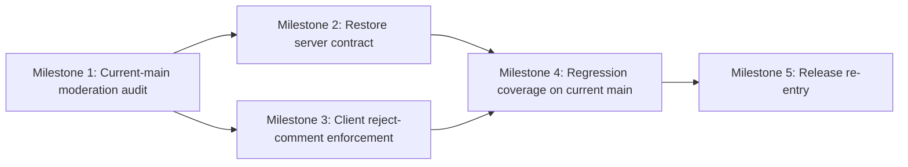

# Plan 059 — Reconcile Plan 062 with Current Main

## Plan Header

- **Target Release**: v0.8.28
- **Epic Alignment**: Admin provider review / moderation workflow hardening
- **Status**: Released in v0.8.28
- **Related Issues**: Session `S062-reject-comment-required`; blocked Stage 2 release attempt for closed Plan 062

## Release Strategy

Release Strategy: Standalone (no other known active product plans in `agent-output/planning/` currently target the next available patch after current `origin/main` version `0.8.27`; the prior local `v0.8.28` Stage 1 commit for Plan 062 did not reserve that version and exact patch must be re-confirmed at future DevOps Stage 1).

## Value Statement and Business Objective

As an **admin reviewing pending providers**, I want to **be required to record a rejection reason before I can reject a provider while still approving providers without extra friction on the current mainline moderation flow**, so that **provider moderation decisions remain accountable and releasable on top of the repository’s actual production codebase rather than a stale session branch**.

## Objective

Reconcile the previously approved Plan 062 requirement with the real `origin/main` architecture after DevOps Stage 2 exposed mergeability drift.

This plan must:

1. preserve the original business rule that rejection requires a non-empty trimmed comment,
2. keep approval comment-free and one-click,
3. re-establish a valid server-authoritative moderation contract on top of current `origin/main`,
4. update the existing `/providers` admin moderation UI on current main rather than relying on the stale Plan 062 branch state,
5. re-run the normal implementation → review → QA → UAT → DevOps flow from a branch that is current with `origin/main`.

## Context

Closed Plan 062 was implemented, reviewed, QA-complete, UAT-approved, and locally committed for Stage 1 as `a4dab30b`, but DevOps Stage 2 found that the session branch was 42 commits behind `origin/main`.

A direct rebase attempt revealed that the original plan assumptions are only partially valid on current main:

- The `/providers` moderation UI still exists on `origin/main`.
- `src/app/(public)/providers/ProvidersContent.tsx` still imports `RejectModal` and `useProviderReview`.
- `src/features/admin/components/RejectModal.tsx` and `src/features/admin/hooks/useProviderReview.ts` still exist on `origin/main` and still use the pre-fix optional-feedback behavior.
- However, `src/app/api/admin/review-provider/route.ts` is not present on `origin/main`.
- `src/lib/validations/adminSchemas.ts` is not present on `origin/main`.

Git archaeology now confirms the specific drift point: `src/app/api/admin/review-provider/route.ts` was added in `v0.8.17`, reused by the `/providers` moderation UI in `v0.8.21`, and then removed by `v0.8.24` commit `03194d75` while `useProviderReview` still posts to `/api/admin/review-provider`.

This means the current-main moderation flow still exposes the reject UX, but its backend submission path is currently absent on `origin/main`. The release blocker is therefore not “the requirement is obsolete”; it is “the requirement must be re-applied against a current-main moderation architecture whose backend contract must be rediscovered and restored or replaced before release.”

Version pre-flight completed for this reconciliation plan:

- `git fetch origin --tags`
- latest tags observed: `v0.8.22`, `v0.8.23`, `v0.8.24`, `v0.8.25`, `v0.8.26`
- `git show origin/main:package.json | grep '"version"'` -> `0.8.27`

The next release remains the next available patch after `0.8.27`, but the exact version must be re-confirmed later because the previous local Stage 1 commit was never pushed or tagged.

## Assumptions

1. The `/providers` moderation experience on current `origin/main` remains the intended product surface for this business rule.
2. The absence of `src/app/api/admin/review-provider/route.ts` and `src/lib/validations/adminSchemas.ts` on `origin/main` may reflect deliberate removal in `v0.8.24` or incomplete architecture follow-through; Milestone 1 must determine whether the correct fix is to restore, relocate, or replace the backend moderation contract.
3. The canonical persistence field for rejection rationale remains `review_feedback`.
4. Reconciliation should start from a branch created or rebased from current `origin/main`, not by releasing the stale `a4dab30b` Stage 1 commit as-is.

## Decision Record

- **[RESOLVED] Treat this as a new reconciliation plan instead of reopening closed Plan 062.** Rationale: Plan 062 already reached Committed status on a stale branch; a new active plan is the clearest way to capture current-main drift and restart the implementation lifecycle cleanly.
- **[RESOLVED] Preserve the original product rule unchanged: reject requires comment; approve does not.** Rationale: DevOps exposed a mergeability issue, not a business requirement change.
- **[RESOLVED] Restore or replace the missing backend moderation contract on current main before changing UI behavior.** Rationale: current main still exposes moderation UI paths, so server-authoritative handling must exist and must not depend on files removed upstream.
- **[RESOLVED] Re-implement against current `origin/main` rather than attempting to push the stale Stage 1 commit.** Rationale: release policy requires sync with current main, and shipping stale code risks conflict with subsequent product changes.
- **[RESOLVED] Exact release version stays provisional until future DevOps Stage 1.** Rationale: the unpushed local `v0.8.28` preparation from Plan 062 does not reserve a release number.

## Shared Results Actionability

The shared `/providers` list can still contain multiple entity types in the discovery experience, but only provider entities may legally receive moderation actions.

- Approve and Reject actions apply only to provider results that map to provider review records.
- Entity-type filtering must remain explicit in the UI and data path so community services do not render moderation controls.
- If a non-provider entity reaches the moderation action path by regression or malformed payload, the action must fail explicitly with a handled error state; silent no-op behavior is not acceptable.
- The reconciliation work must preserve the Plan 058 provider-only moderation gating already present on current `origin/main`.

## Scope

### In Scope

- Audit the current-main moderation path and identify the valid backend integration point replacing or reintroducing the missing review route/schema contract.
- Update current-main `RejectModal`, `useProviderReview`, and `/providers` caller behavior so reject actions require a non-empty trimmed comment.
- Restore server-authoritative enforcement for reject-without-comment attempts on current main.
- Refresh regression coverage so it targets the current-main code paths, not only the stale branch implementation.
- Re-run implementation lifecycle artifacts from implementation through DevOps on a branch based on current main.

### Out of Scope

- Broad redesign of provider moderation UX beyond the reject-comment requirement.
- New moderation statuses, bulk moderation, or community service moderation.
- Shipping the old `a4dab30b` commit directly.
- Roadmap-wide release bookkeeping beyond the eventual release artifact updates for this reconciled change.

## Milestone Dependencies

Sequencing rule: implementation must first confirm the current-main server contract, then update backend and UI together before re-running quality gates and re-entering release preparation.

## Plan

1. **Milestone 1 — Audit and map the current-main moderation architecture**
   - Owner: Implementer
   - Dependencies: None
   - Objective: replace stale branch assumptions with a precise map of the live moderation flow on `origin/main`.
   - Work:
     - Verify the current `/providers` moderation UI path and all active call sites.
     - Identify where the missing route/schema responsibilities now belong on current main.
     - Confirm whether the route should be restored, relocated, or replaced by an existing service-layer pattern.
   - Acceptance Criteria:
     - Implementation has a clear current-main source-of-truth path for moderation submission.
     - No code changes rely on deleted or stale branch-only assumptions.

2. **Milestone 2 — Restore server-authoritative reject-comment enforcement on current main**
   - Owner: Implementer
   - Dependencies: Milestone 1
   - Objective: ensure current-main backend behavior rejects comment-free rejections.
   - Work:
     - Implement the authoritative validation boundary for provider review updates on current main.
     - Ensure reject requests without a non-empty trimmed reason fail deterministically.
     - Preserve approve behavior with comment-free submission.
     - Preserve `review_feedback` as the persisted rationale field.
   - Acceptance Criteria:
     - Current-main backend logic blocks reject-without-comment attempts.
     - Approve behavior remains valid without feedback.
     - Validation failures remain distinguishable from auth/conflict/server failures.

3. **Milestone 3 — Re-apply client enforcement to the current-main moderation UI**
   - Owner: Implementer
   - Dependencies: Milestone 1
   - Objective: prevent invalid reject attempts in the existing UI while keeping approval friction-free.
   - Work:
     - Update `RejectModal` on current main to require non-whitespace input before enabling confirmation.
     - Update hook/caller contracts as needed so the UI passes a required rejection reason while approval remains unchanged.
     - Preserve accessibility improvements such as visible required labeling and `aria-required`.
   - Acceptance Criteria:
     - Reject confirm stays disabled until valid input exists.
     - The reject field is clearly communicated as required.
     - Approval remains a one-click action.

4. **Milestone 4 — Refresh regression coverage for current-main code paths**
   - Owner: Implementer
   - Dependencies: Milestone 2, Milestone 3
   - Objective: prove the reconciled implementation works on the current architecture rather than on the old branch snapshot.
   - Work:
     - Rebase or rewrite the existing Plan 062 tests so they exercise the current-main files and backend boundary.
     - Ensure route or equivalent boundary coverage exists for reject-without-comment failure and approve-without-comment success.
     - Retain explicit regression naming around the before/after behavior.
   - Acceptance Criteria:
     - Automated coverage exists for UI and authoritative backend paths on the current-main architecture.
     - Test evidence clearly maps to the reconciled implementation, not only the stale Plan 062 commit.

5. **Milestone 5 — Re-enter release flow from current main**
   - Owner: Implementer, Code Reviewer, QA, UAT, DevOps
   - Dependencies: Milestone 4
   - Objective: move the reconciled implementation back through the normal lifecycle on a releasable branch.
   - Work:
     - Execute implementation, code review, QA, and UAT on the refreshed branch.
     - At future DevOps Stage 1, re-run version pre-flight and choose the next available patch version after current `origin/main`.
     - Do not reuse stale Stage 1 version assumptions without revalidation.
   - Acceptance Criteria:
     - The reconciled branch is based on current main and can pass remote-sync release checks.
     - Future release artifacts are created only after current-main lifecycle gates pass again.

## Testing Strategy

- Component coverage for required-field behavior in the current-main `RejectModal`.
- Hook/client coverage for reject payload formation and unchanged approve flow.
- Route or equivalent backend-boundary coverage for reject-comment-required semantics.
- Regression coverage explicitly demonstrating reject-without-comment failure and approve-without-comment success on the current-main architecture.
- Full implementation/QA/UAT repetition because the previous completed chain was validated against a stale branch base.

## Validation (Non-QA)

- `npm run type-check`
- `npm run lint`
- targeted automated tests for touched moderation UI, hook, backend boundary, and provider search/moderation surfaces
- remote-sync verification against current `origin/main` before future DevOps Stage 2

## Risks

1. **High**: Current-main moderation backend contract is broken because the UI path remains while `useProviderReview` still targets `/api/admin/review-provider` and the route/schema files are absent on `origin/main`; mitigated by making architecture audit Milestone 1 and server restoration Milestone 2 explicit.
2. **Medium**: Reconciliation could accidentally reintroduce stale branch behavior or file paths; mitigated by requiring a current-main-based branch and explicit no-stale-path acceptance.
3. **Medium**: Shared-list moderation gating could regress while restoring backend handling; mitigated by preserving provider-only actionability requirements.
4. **Low**: Release numbering from the old blocked Stage 1 could be reused incorrectly; mitigated by re-running version pre-flight from scratch.

## Rollback Considerations

1. Keep the reconciled reject-comment rule isolated to the moderation flow so rollback can revert to the pre-reconciliation behavior without disturbing approval semantics.
2. Do not treat the stale Stage 1 commit as rollback-safe for current main; it is a historical reference only.
3. Prefer rollback at the reconciled current-main implementation boundary, not by resurrecting the old branch snapshot.

## Duration Estimates

- Analysis: 0.5-1.0h to verify current-main moderation architecture and backend drift
- Planning: 0.75-1.0h completed
- Implementation: 2-4h
- QA: 1.0-1.5h
- UAT: 0.5-1.0h
- DevOps: 0.5-1.0h

Uncertainty drivers: whether the missing backend route/schema must be restored verbatim or whether current main now expects a different service boundary, and whether current-main provider moderation already has latent breakage beyond the reject-comment requirement.

## Open Questions

None.

## Critique Outcome

- Critique verdict: **APPROVED**
- Blocking findings: none
- Non-blocking findings incorporated into this plan revision:
  - clarified that the current-main moderation backend path is broken, not merely partially drifted,
  - clarified that Milestone 1 must determine whether the correct backend fix is restore, relocate, or replace,
  - confirmed no Architect pass is required before implementation because no new architectural direction is being introduced beyond the Milestone 1 audit.

## Changelog

| Date (UTC) | Agent | Change | Rationale |
| --- | --- | --- | --- |
| 2026-03-25T08:08Z | planner | Created Plan 059 | Re-scope the rejected-comment requirement as a current-main reconciliation plan after DevOps Stage 2 exposed stale-branch release drift in closed Plan 062 |
| 2026-03-25T08:19Z | planner | Revised after Critic approval | Incorporated approved critique clarifications on backend drift framing, preserved Milestone 1 architecture-audit flexibility, and recorded readiness for direct Implementer handoff |
| 2026-03-25T09:05Z | implementer | Implementation M1–M4 complete | Audited current-main architecture, restored backend route/service/schema/audit, updated RejectModal to require feedback, refreshed regression tests; handoff to Code Review |
| 2026-03-25T09:26Z | code-reviewer | Code review complete — APPROVED_WITH_COMMENTS | Verdict: APPROVED_WITH_COMMENTS. F-01 (double sanitization), F-05 (dead export), F-04 (body logging) resolved via fix-in-review. F-02 (audit log migration) risk accepted for this release. F-03 (Zod schema untested) risk accepted — QA negative test required. F-06 (IP header) deferred. |
| 2026-03-25T09:44Z | qa | QA complete | QA gates pass (type-check, tests, lint, build). Negative-check evidence recorded for reject-without-feedback via runtime schema script due to Vitest/Zod ESM limitation. Handoff to UAT. |
| 2026-03-25T09:50Z | uat | UAT Complete — CONDITIONAL APPROVAL | All 5 plan objectives delivered per artifact evidence. Admin runtime smoke gate deferred (MEDIUM severity, 24h post-deploy trigger). `admin_audit_logs` migration deferred. Handoff to DevOps. |
| 2026-03-25T10:55Z | devops | Document closed | Status: Committed for Release v0.8.28 |
| 2026-03-25T10:57Z | devops | Released | Stage 2 branch push completed, compare verified conflict-free, and release tag v0.8.28 created on final HEAD |
