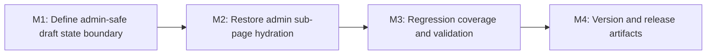

# Plan 060 — Admin Edit State Persistence Fix

**Plan ID**: 060
**Target Release**: v0.9.1
**Epic Alignment**: Admin moderation workflow reliability; provider data quality before approval
**Status**: Released in v0.9.1
**Related Issues**: None (live regression reported after v0.9.0 release during admin verification)

## Changelog

| Date (UTC) | Agent | Change |
|------------|-------|--------|
| 2026-03-25T14:24Z | Planner | Created focused follow-up plan for admin edit sub-page state persistence regression affecting category selection and any admin sub-page values that depend on client-side handoff |
| 2026-03-25T15:50Z | Implementer | Status → In Progress. M1–M3 implemented. All gates pass (type-check, 673 tests, build). M4 deferred to DevOps. |
| 2026-03-25T16:02Z | Code Reviewer | Verdict: APPROVED. Status → Code Review Approved. |
| 2026-03-25T16:18Z | QA | Verdict: QA Complete. Focused regression, full suite, type-check, and build pass; manual browser-path validation deferred to UAT. |
| 2026-03-25T16:24Z | UAT | Verdict: APPROVED FOR RELEASE. Value statement delivered. DF-060-UAT-01 (live back-navigation) deferred to operator before deploy. Status → UAT Approved. |
| 2026-03-25T15:21Z | DevOps | Stage 1 commit prepared for `v0.9.1`. Status → Committed. Lifecycle docs closed; Stage 2 blocked on DF-060-UAT-01 evidence and explicit release approval. |
| 2026-03-25T15:48Z | DevOps | Stage 2 verified complete. Branch `session/061-admin-provider-edit` and tag `v0.9.1` both point to `6d326f1b`; `origin/main` is an ancestor of `HEAD`. Status → Released. |

## Release Strategy

Standalone (no other known active plans for this release line).

This is a post-release regression follow-up to Plan 061 and should ship as a focused patch once the fix is verified.

DevOps Stage 1 confirmed the target release as `v0.9.1` after verifying that `v0.9.0` already exists as the latest git tag and `origin/main` still reports `0.9.0` in `package.json`.

## Pre-Release Verification

### UAT / QA Approval

- **UAT Status**: APPROVED FOR RELEASE
  - One deferred gate remains visible: `DF-060-UAT-01` live browser validation of the admin back-navigation path before Stage 2 tag/push.
  - Value statement delivered: admin sub-page state persists without owner-state leakage.
- **QA Status**: QA Complete
  - Focused regression: 10/10 PASS
  - Broad suite: 673 PASS, 18 skipped
  - Type-check: exit 0
  - Build: exit 0
  - Delta lint: 1 pre-existing warning, no errors

### Version Consistency

| Check | Result |
|-------|--------|
| `package.json` version | 0.9.1 ✅ |
| `package-lock.json` version | 0.9.1 ✅ |
| `CHANGELOG.md` entry | `[0.9.1] - 2026-03-25` ✅ |
| Latest git tag on origin | v0.9.0 ✅ |
| `origin/main` package.json | 0.9.0 ✅ |
| Tag `v0.9.1` does not exist | Confirmed by tag pre-flight ✅ |

### Packaging Integrity

| Check | Result |
|-------|--------|
| `npm run type-check` | exit 0 (QA evidence) |
| `npx vitest run src/__tests__/components/ProviderEditForm.regression.test.tsx --reporter=verbose` | 10/10 PASS |
| `npx vitest run --reporter=dot` | 673 PASS / 18 skipped |
| `npm run build` | exit 0 (QA evidence; dynamic route warnings are pre-existing and non-failing) |
| Lockfile aligned with package version | Both at 0.9.1 ✅ |

### Gitignore Review

| Check | Result |
|-------|--------|
| `public/fallback-development.js` ignored | ✅ `.gitignore` line 75 |
| Production fallback asset restored | ✅ `public/fallback-ce627215c0e4a9af.js` restored from git |
| No env files in staged scope | ✅ |
| No unrelated generated artifacts in current plan scope | ✅ |

### PWA Dev-Artifact Check

- Dev server was active during this session.
- `public/fallback-ce627215c0e4a9af.js` appeared deleted in `git status` and was restored via `git checkout -- public/fallback-ce627215c0e4a9af.js`.
- `public/fallback-development.js` remains dev-only and gitignored.

### Workspace Cleanliness

- Branch: `session/061-admin-provider-edit`
- Current modified/untracked files are Plan 060 implementation and workflow artifacts only.
- Historical note: older released deployment docs (`v0.8.25`, `055-stage1-v0.8.25`, `v0.8.26`, `059-stage1-v0.8.26`) still sit outside `agent-output/deployment/closed/`. They are not mixed into this plan commit per the docs-only cleanup rule.

### CHANGELOG Date Sanity-Check

- New entry reads `[0.9.1] - 2026-03-25`.
- Current UTC date reads `2026-03-25` — matches ✅

### Chain Timestamp Sanity-Check

**Anomaly detected**: source artifact timestamps for QA/UAT are ahead of the current observed system UTC time (`2026-03-25T15:18Z`).

| Artifact | Recorded Timestamp | Observation |
|----------|--------------------|-------------|
| Plan 060 UAT changelog | 2026-03-25T16:24Z | Future-skewed relative to current system UTC |
| QA report completion | 2026-03-25T16:18Z | Future-skewed relative to current system UTC |

**Assessment**: The timestamps are recorded in source artifacts and may reflect prior-session clock skew or manual entry. They are left unchanged. This deployment doc uses the actual current UTC capture and records the anomaly instead of inventing replacement times.

### Post-UAT Delta Check

- No code logic changes were made after UAT approval.
- Post-UAT changes are limited to Stage 1 release artifacts: `package.json`, `package-lock.json`, `CHANGELOG.md`, deployment documentation, lifecycle status updates, and the open-actions tracker.

### Critique Closure Verification

- Critique exists: `agent-output/critiques/closed/060-admin-edit-state-persistence-fix-critique.md`
- Status: `Resolved` — already in `closed/` ✅

## Known Limitations (Pre-Operation)

| Item | Severity | Impact |
|------|----------|--------|
| `DF-060-UAT-01` live admin back-navigation validation not yet evidenced | MEDIUM | Stage 2 tag/push must wait for browser proof |
| `social` and `images` key paths lack dedicated regression assertions | LOW | Shared seam still covered, but live validation should touch at least one additional sub-page |
| `JSON.parse` without `try/catch` in `syncFromLocalStorage` is pre-existing | LOW | Corrupted localStorage could still break hydration; not introduced by this patch |

## Deferred Post-Deploy Tracker

See `agent-output/planning/060-open-actions.md` for deferred validations and follow-ups.

## Documents Closed

| Document | Domain | Terminal Status | Moved To |
|----------|--------|-----------------|----------|
| `060-admin-edit-state-persistence-fix.md` | planning | Pending | `planning/closed/` |
| `060-admin-edit-state-persistence-fix-impl.md` | implementation | Pending | `implementation/closed/` |
| `060-admin-edit-state-persistence-fix-code-review.md` | code-review | Pending | `code-review/closed/` |
| `060-admin-edit-state-persistence-fix-qa.md` | qa | Pending | `qa/closed/` |
| `060-admin-edit-state-persistence-fix-uat.md` | uat | Pending | `uat/closed/` |

## Stage 1 Evidence

### git status

```text
M agent-output/.next-id
M package-lock.json
M package.json
M src/__tests__/components/ProviderEditForm.regression.test.tsx
M src/app/(dashboard)/dashboard/providers/[id]/edit/category/page.tsx
M src/app/(dashboard)/dashboard/providers/[id]/edit/images/page.tsx
M src/app/(dashboard)/dashboard/providers/[id]/edit/needs/page.tsx
M src/app/(dashboard)/dashboard/providers/[id]/edit/offers/page.tsx
M src/app/(dashboard)/dashboard/providers/[id]/edit/page.tsx
M src/app/(dashboard)/dashboard/providers/[id]/edit/social/page.tsx
M src/components/providers/ProviderEditForm.tsx
?? agent-output/code-review/060-admin-edit-state-persistence-fix-code-review.md
?? agent-output/critiques/closed/060-admin-edit-state-persistence-fix-critique.md
?? agent-output/implementation/060-admin-edit-state-persistence-fix-impl.md
?? agent-output/planning/060-admin-edit-state-persistence-fix.md
?? agent-output/qa/060-admin-edit-state-persistence-fix-qa.md
?? agent-output/uat/060-admin-edit-state-persistence-fix-uat.md
```

### git diff --name-only

```text
agent-output/.next-id
package-lock.json
package.json
src/__tests__/components/ProviderEditForm.regression.test.tsx
src/app/(dashboard)/dashboard/providers/[id]/edit/category/page.tsx
src/app/(dashboard)/dashboard/providers/[id]/edit/images/page.tsx
src/app/(dashboard)/dashboard/providers/[id]/edit/needs/page.tsx
src/app/(dashboard)/dashboard/providers/[id]/edit/offers/page.tsx
src/app/(dashboard)/dashboard/providers/[id]/edit/page.tsx
src/app/(dashboard)/dashboard/providers/[id]/edit/social/page.tsx
src/components/providers/ProviderEditForm.tsx
```

### Recent Branch / Commit Context

```text
session/061-admin-provider-edit
76d809c1 (HEAD -> session/061-admin-provider-edit, origin/session/061-admin-provider-edit) fix(category): use provider's category for new offers/needs instead of default
be6069c1 fix(profile): Add default category_id to owner offer/need creation
8be10706 fix(admin): Add default category_id to offer/need creation
ce85174d (tag: v0.9.0) docs(release): Mark Plan 061 documents as Released for v0.9.0
4c325046 feat(admin): Add admin provider editing from moderation detail flow
```

## Next Actions

1. Update Plan 060 lifecycle docs to `Committed` and move them to their respective `closed/` folders.
2. Commit all Plan 060 changes locally for `v0.9.1`.
3. Do **not** push or tag yet. Stage 2 remains blocked on `DF-060-UAT-01` evidence and explicit user release approval.

## Value Statement and Business Objective

As an admin reviewer, I want selections made on edit sub-pages such as category, offers, and needs to persist when I return to the admin edit form, so that I can complete moderation edits reliably and approve or reject providers with accurate data.

## Objective

Restore end-to-end persistence for admin edit sub-page selections without reintroducing the stale owner-state leakage risk identified during Plan 061. The fix must cover the actual handoff mechanism between the admin edit form and its sub-pages, not just the category label display, because the same regression path can affect every admin edit surface that currently relies on client-side draft state.

## Background

Plan 061 reused the owner edit experience for admin moderation, but the admin wrapper explicitly disabled local draft-state hydration in the shared edit form to avoid consuming stale owner-side localStorage values for the same provider. The admin category sub-page still writes selections into localStorage and navigates back to the shared form. Because the shared form no longer reads draft state in the admin context, the selected category is not reflected after navigation, and the form continues to show the unselected placeholder. The same pattern applies to other admin sub-pages that use the same draft-state channel.

## Assumptions

1. The reported regression is reproducible in the admin edit flow and is caused by the current client-side state handoff path rather than a database write failure.
2. Owner edit flow remains the control implementation and should continue to work after this patch.
3. Admin edit sub-pages for category, offers, needs, community services, and images all share the same basic return-navigation pattern and therefore require one consistent draft-state strategy.
4. The regression should be fixed as a patch-level follow-up to v0.9.0 rather than reopening feature scope from Plan 061.
5. No schema or migration work is required; the defect is in client-state coordination and form hydration.

## Decision Record

- [RESOLVED] This work will ship as a new patch plan rather than modifying the released Plan 061 artifact. Rationale: the original feature is already released and this is a focused regression follow-up.
- [RESOLVED] The fix must address the full admin sub-page draft-state handoff path, not only the category field. Rationale: category is the visible symptom, but the current admin configuration can drop any sub-page value that relies on the same channel.
- [RESOLVED] Admin and owner draft state must be isolated by context if client-side persistence remains the handoff mechanism. Rationale: the original `enableLocalStorage={false}` decision was made to prevent stale owner values from leaking into admin moderation for the same provider.
- [RESOLVED] The shared form should continue to support both owner and admin wrappers rather than splitting into separate form implementations. Rationale: this preserves Plan 061's reuse objective and keeps future field changes in one place.
- [RESOLVED] Verification must include the admin moderation path from provider detail into edit and back through sub-pages. Rationale: the bug exists in the navigation-and-return workflow, not in a standalone field renderer.
- [RESOLVED] Owner-flow regression coverage is required even though the reported bug is admin-only. Rationale: the likely fix touches shared form hydration and local draft-state handling.

## Scope

In scope:

1. Admin edit draft-state persistence for category selection.
2. Admin edit draft-state persistence for other sub-page-backed fields that use the same mechanism.
3. Shared form hydration rules and context separation between owner and admin flows.
4. Regression coverage proving the pre-fix failure path and post-fix behavior.
5. Patch release artifacts.

Out of scope:

1. Redesign of the provider edit UX.
2. Database schema or migration changes.
3. New moderation workflow features.
4. Replacing the shared owner/admin edit form architecture.

## Milestone Dependencies



Sequencing rule: draft-state boundary decisions must be settled before implementation restores admin hydration, because the patch must fix persistence without reintroducing cross-context state leakage.

## Milestones

### M1 — Define an Admin-Safe Draft-State Boundary

**Objective**: Reconcile Plan 061's shared-form reuse with the need for admin sub-pages to hand values back to the edit form.

Tasks:

1. Inventory every admin edit sub-page that currently writes draft values outside the main form state.
2. Decide how admin draft state is separated from owner draft state for the same provider and route family.
3. Ensure the shared form can distinguish owner and admin draft-state contexts without disabling hydration globally.
4. Preserve the original stale-state risk mitigation in a narrower, explicit form rather than by disabling all draft-state reads.

Acceptance criteria:

- The chosen draft-state mechanism is explicit for both owner and admin contexts.
- Admin form hydration is enabled for admin-originated draft values.
- Owner-originated draft values do not silently populate the admin edit form.
- The approach covers category, offers, needs, community services, and images if they rely on the same channel.

### M2 — Restore Admin Sub-Page Persistence End-to-End

**Objective**: Make admin selections persist after back navigation from sub-pages to the shared edit form.

Tasks:

1. Update the admin edit wrapper and shared edit surface so returned draft values are reflected in form state.
2. Confirm the admin category field displays the selected category immediately after returning from the category page.
3. Apply the same persistence contract to any other admin sub-page using the shared draft-state channel.
4. Keep owner edit behavior unchanged from the user perspective.

Acceptance criteria:

- Selecting a category in the admin category sub-page updates the admin edit form after returning.
- The selected value persists through the remainder of the edit session until save, reset, or explicit replacement.
- Other admin sub-page selections using the same channel are not dropped on return.
- The shared form continues to render the correct placeholder only when no draft or persisted value exists.

### M3 — Add Regression Coverage and Runtime Validation

**Objective**: Prevent recurrence of client-state precedence and context-separation regressions in the shared edit flow.

Tasks:

1. Add focused regression tests around the exact owner/admin draft-state precedence and hydration expressions.
2. Add coverage for the admin return-from-sub-page path, making the category symptom visible in test naming.
3. Verify that owner flow still hydrates its own draft state correctly.
4. Re-run relevant static analysis and test gates for the shared form and admin edit route.

Acceptance criteria:

- Tests make the pre-fix admin failure visible and confirm post-fix success.
- Coverage includes both admin and owner draft-state contexts where shared logic changed.
- Type-check and relevant automated test suites pass.

### M4 — Update Version and Release Artifacts

**Objective**: Keep release metadata aligned with the shipped regression fix.

Tasks:

1. Update `package.json` when the exact patch version is confirmed at DevOps Stage 1.
2. Update `package-lock.json` if required by the version change.
3. Add a `CHANGELOG.md` entry describing the admin edit state persistence regression fix.

Acceptance criteria:

- Version artifacts are consistent.
- Changelog reflects the actual regression scope.
- Exact version number is confirmed only at DevOps Stage 1 after tag verification.

## Testing Strategy

- Focused component or logic regression tests for shared edit-form draft-state hydration.
- Route or page-level coverage where needed to prove the admin return-from-sub-page workflow updates the visible form state.
- Owner-flow regression coverage for the same shared logic.
- Standard validation gates: type-check and relevant Vitest suites.

## Validation

1. Confirm the admin moderation path still follows `/providers` -> provider detail -> edit -> category/offers/needs sub-page -> back.
2. Verify selected admin category is visible on return to the edit form before final save.
3. Verify at least one additional admin sub-page using the same draft-state path also persists correctly.
4. Verify owner edit flow still reflects its own draft state correctly.
5. Run type-check and relevant automated tests with no new failures.

## Risks

| Risk | Likelihood | Impact | Mitigation |
|------|------------|--------|------------|
| Fix restores admin persistence but reintroduces stale owner draft leakage | Medium | High | Scope draft-state separation by edit context rather than re-enabling generic reads blindly |
| Patch covers category only and leaves other admin sub-pages broken | Medium | High | Treat category as the visible symptom and inventory all shared-channel sub-pages in M1 |
| Shared-form change regresses owner editing | Medium | Medium | Require owner regression coverage and validate both contexts before handoff |
| Manual verification misses the back-navigation path that triggers the bug | Low | High | Make the return-from-sub-page workflow explicit in validation and regression coverage |

## Duration Estimates

- Analysis: 0.25-0.5 day
- Planning: 0.25 day
- Implementation: 0.5-1 day
- QA: 0.25-0.5 day
- UAT: 0.25 day
- DevOps: 0.25 day

Uncertainty drivers: the exact number of admin sub-pages sharing the same draft-state path, whether the existing shared-form API already supports a clean context keying mechanism, and how much targeted regression coverage is required to exercise the back-navigation path faithfully.

## Open Questions

None. No blocking product or architectural questions remain for Critic review.