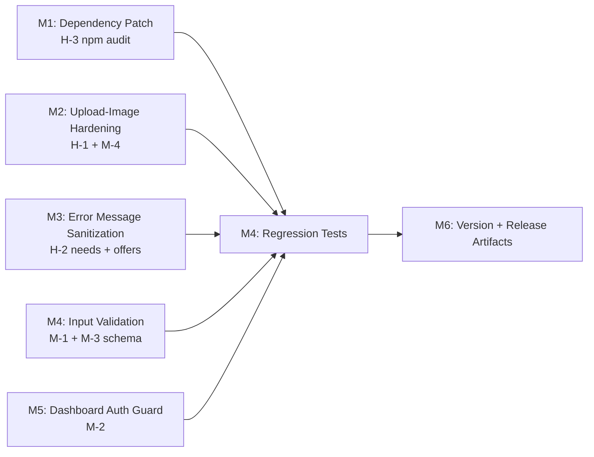

# Plan 060 — Security Remediation: Audit 066 Findings

| Field              | Value                                                                                                                             |
| ------------------ | --------------------------------------------------------------------------------------------------------------------------------- |
| **Plan ID**        | 060                                                                                                                               |
| **Type**           | Security Bugfix                                                                                                                   |
| **Target Release** | v0.9.7                                                                                                                            |
| **Status**         | Released (v0.9.7)                                                                                                                 |
| **Epic Alignment** | Platform Security / Admin Provider Edit hardening                                                                                 |
| **Related Issues** | Audit 066 (`agent-output/security/066-find-bugs.md`); Prior audit 049 (`agent-output/security/049-full-security-audit-v0.8.7.md`) |
| **Created**        | 2026-03-28T15:00Z                                                                                                                 |

## Changelog

| Date (UTC)        | Agent   | Change                                |
| ----------------- | ------- | ------------------------------------- |
| 2026-03-28T15:00Z | planner | Initial draft from Audit 066 findings |
| 2026-03-28T14:35Z | qa      | All gates passed; status updated to QA Complete |
| 2026-03-28T14:40Z | uat     | CONDITIONAL APPROVAL — all value delivery confirmed; live admin smoke deferred to DevOps Stage 3 |
| 2026-03-28T17:36Z | devops  | Target release confirmed as v0.9.7; document committed and closed for Stage 1 |
| 2026-03-28T17:54Z | devops  | Stage 2 completed: branch pushed, tag v0.9.7 published, and plan marked Released |

---

## Release Strategy

Standalone (no other known active plans open for a specific target version). Roadmap is in "ready for new planning" state post-v0.8.24. DevOps Stage 1 confirmed `v0.9.7` as the next patch after latest released tag `v0.9.6` with no tag collision.

---

## Value Statement and Business Objective

> As a platform operator and admin user, I want the security vulnerabilities identified in Audit 066 remediated before the admin provider edit feature reaches more users, so that the platform is not exposed to file upload abuse, information disclosure, or unauthorized admin UI access.

---

## Objective

Remediate all P0 and P1 security findings from Audit 066 (`agent-output/security/066-find-bugs.md`) across the admin provider edit feature surface. Includes: upload hardening, error message sanitization, rate limiting, input validation, route auth guarding, and dependency patching. P2/P3 items are addressed as scope permits; explicitly deferred items are documented.

---

## Assumptions

1. The `admin_audit_logs` table may not yet exist in production — audit logging fallback behavior is intentional and not blocking this plan.
2. The `(dashboard)` route group is admin-only; a server-side layout guard is the correct approach.
3. npm audit `picomatch` HIGH can be resolved via override or upgrade (same mechanism as prior Plan 037).
4. No database schema changes are required for any P0/P1 finding.
5. All new API routes introduced in PR #91 are in-scope; no other routes are touched.

**OPEN QUESTION [RESOLVED]:** Are the 049 Critical findings (set-role privilege escalation, unauthenticated token endpoints) still open?
→ Verified: `set-role` already has `isAdminOrModerator()` check added (regression test exists). 049 Criticals are fixed. Not in scope of this plan.

---

## Decision Record

| #   | Decision                                                                                                                   | Status                                                                                                                                           |
| --- | -------------------------------------------------------------------------------------------------------------------------- | ------------------------------------------------------------------------------------------------------------------------------------------------ |
| 1   | Scope to P0+P1 findings; defer P2/P3 to a follow-up plan or maintenance                                                    | [RESOLVED] Keeps plan focused and shippable fast                                                                                                 |
| 2   | File upload: use extension allowlist not magic-bytes inspection                                                            | [RESOLVED] Magic bytes adds complexity; extension allowlist + MIME check provides sufficient defense for admin-only routes                       |
| 3   | Dashboard auth guard: implement as `(dashboard)` layout with server-side getUserFromCookie                                 | [RESOLVED] Consistent with all other auth patterns in codebase                                                                                   |
| 4   | providerImages validation: Zod refinement to validate JSON structure `{ urls: string[] }` preferred over sanitizeTextInput | [RESOLVED] Structured validation catches shape errors that sanitizeTextInput cannot                                                              |
| 5   | npm audit: use package overrides (same as Plan 037) for transitive vulnerability that can't be resolved via direct upgrade | [RESOLVED] Proven pattern, audit verified clean post-override in Plan 037/046-OA-2                                                               |
| 6   | Middleware rate limiting dead code: remove dead API branch rather than adding `/api` to matcher                            | [DEFERRED: maintenance-cycle / Plan 061] Follow the critique recommendation and keep this P2 item out of the P0/P1 release scope |
| 7   | P2/P3 findings (M-5 dead code, M-6 hook type, L-1 through L-5) deferred                                                    | [DEFERRED: Implementer / maintenance-cycle / Plan 061 or follow-on]                                                                              |

---

## Scope — Files Affected

| File                                                        | Change                                                         |
| ----------------------------------------------------------- | -------------------------------------------------------------- |
| `src/app/api/admin/upload-image/route.ts`                   | H-1: File extension allowlist; remove SVG; rate limiting (M-4) |
| `src/app/api/admin/needs/route.ts`                          | H-2: Sanitize error output in production                       |
| `src/app/api/admin/offers/route.ts`                         | H-2: Sanitize error output in production                       |
| `src/lib/validations/adminSchemas.ts`                       | M-3: Add `.uuid()` constraint to array fields                  |
| `src/services/admin/providerEdit.ts`                        | M-1: Validate/sanitize providerImages field                    |
| `src/app/(dashboard)/layout.tsx` _(new)_                    | M-2: Server-side auth guard for dashboard route group          |
| `package.json`                                              | H-3: Override or upgrade picomatch + moderate vulns            |
| `src/__tests__/api/security-066-regression.test.ts` _(new)_ | Regression test coverage for all P0/P1 fixes                   |

**Total: 7 modified + 2 new = 9 files** ✅ within <10 file guideline

---

## Milestone Dependencies



Milestones M1–M5 are **independent** and can be implemented in any order or in parallel. M6 (version artifacts) is the final gate after all fixes are verified.

---

## Milestones

### M1 — Dependency Patch (H-3)

**Objective**: Eliminate `picomatch` HIGH vulnerability and 8 moderate-severity vulnerabilities from npm audit.

**Acceptance Criteria**:

- `npm audit --audit-level=high` exits 0
- No new vulnerabilities introduced
- All existing tests continue to pass

**Implementation Guidance**:

- Follow the same override/upgrade approach used in Plans 037 and 046-OA-2
- Run `npm audit --json` to identify the exact transitive chain
- Apply `overrides` in `package.json` if direct upgrade is not available
- Verify: `npm audit --audit-level=high` and `npm audit --audit-level=moderate`

**Out of Scope**: Resolving Dependabot's 3 high + 4 moderate reported on GitHub (delta already tracked as roadmap blocking item; investigate alignment after local fix).

---

### M2 — Upload-Image Hardening (H-1 + M-4)

**Objective**: Prevent file type spoofing on the admin image upload endpoint and add rate limiting.

**Acceptance Criteria**:

- Only the extensions `['jpg', 'jpeg', 'png', 'webp', 'gif']` are accepted
- SVG files are rejected regardless of MIME type
- A file with a PNG extension but falsified MIME type (`image/svg+xml`) passes extension check but is still rejected by extension validation (SVG extension is not in allowlist)
- Rate limiting is applied: same `rateLimiters.adminReview` pattern as other admin routes
- A file exceeding 5MB is still rejected (existing check preserved)
- Structured logger (`@/lib/logging/structuredLogger`) used instead of `console.error`

**Implementation Guidance — ILLUSTRATIVE ONLY**:

```
// Pseudocode — do NOT copy verbatim
const ALLOWED_EXTENSIONS = ['jpg', 'jpeg', 'png', 'webp', 'gif'];
const fileExt = file.name.split('.').pop()?.toLowerCase();
if (!fileExt || !ALLOWED_EXTENSIONS.includes(fileExt)) reject 400;
// Rate limiter before formData parsing
```

---

### M3 — Error Message Sanitization (H-2)

**Objective**: Ensure `needs` and `offers` API routes do not leak internal error messages in production.

**Acceptance Criteria**:

- In production (`NODE_ENV === 'production'`), error responses return generic messages (`'Failed to create need'` / `'Failed to create offer'`)
- In development, original error message is preserved for debugging
- Pattern matches `edit-provider/route.ts` exactly

**Implementation Guidance**: Both files have identical catch blocks. Apply the same `process.env.NODE_ENV === 'production'` guard used in `edit-provider/route.ts:140`.

---

### M4 — Input Validation Hardening (M-1 + M-3)

**Objective**: Validate `providerImages` JSON structure and add UUID constraints to array fields in the admin schema.

**Acceptance Criteria**:

- `offersIds`, `needsIds`, `communityServiceIds` in `providerEditUpdateSchema` reject any non-UUID string entries
- `providerImages` field is validated to be either null or valid JSON matching `{ urls: string[] }` structure
- Invalid payloads return 400 with a descriptive validation error
- Valid payloads continue to pass

**Implementation Guidance**:

- In `adminSchemas.ts`: change `z.array(z.string())` to `z.array(z.string().uuid())` for all three array fields
- In `providerEdit.ts` or `adminSchemas.ts`: add a Zod refinement or `z.string().refine(val => { try { const p = JSON.parse(val); return Array.isArray(p?.urls); } catch { return false; } })` for `providerImages` (or validate at the service layer)

---

### M5 — Dashboard Auth Guard (M-2)

**Objective**: Prevent unauthenticated users from accessing the admin dashboard UI, reducing information exposure and eliminating wasted API calls.

**Acceptance Criteria**:

- Unauthenticated users navigating to `/dashboard/*` are redirected to `/login` (or the appropriate auth page)
- Non-admin authenticated users navigating to `/dashboard/*` are redirected to `/providers` with an appropriate error
- Admin/moderator users continue to access dashboard pages normally
- Guard runs server-side (no client-side flash of admin UI)

**Implementation Guidance**:

- Create `src/app/(dashboard)/layout.tsx` as a server component
- Use `getUserFromCookie()` from `@/lib/supabase/getUserFromCookie` (server-only)
- Use `isAdminOrModerator()` from `@/lib/auth/roles`
- Return `redirect('/login')` for unauthenticated, `redirect('/providers')` for non-admin
- Pattern: follow existing server-side auth examples in the codebase

---

### M6 — Regression Tests

**Objective**: Add focused regression tests verifying every P0/P1 fix.

**Acceptance Criteria**:

- File: `src/__tests__/api/security-066-regression.test.ts`
- Coverage of H-1: test that SVG file is rejected, test that non-allowed extension is rejected, test that valid PNG is accepted
- Coverage of H-2: test that error catch returns generic message (mock `NODE_ENV=production`)
- Coverage of M-3: test that non-UUID in array fields fails schema validation
- Coverage of M-1: test that invalid providerImages JSON fails at API layer
- Coverage of M-2: test that unauthenticated request to a dashboard page redirects
- All existing tests continue to pass (`npm test` green)
- TypeScript check passes: `npm run type-check`

**Note**: Upload-image tests should mock `getSupabaseAdmin` storage; do not make real upload calls.

---

### M7 — Version and Release Artifacts

**Objective**: Update version artifacts to match target release.

**Acceptance Criteria**:

- `package.json` version updated to confirmed target version (next available after v0.9.6)
- `CHANGELOG.md` entry added documenting all P0/P1 fixes
- `README.md` updated if any user-visible behavior changed (none expected)
- Commit message follows established pattern

---

## Testing Strategy

- **Unit tests**: covers all schema validation changes (M4) and error sanitization (M3) — fast, no DB calls
- **API route tests**: mocked auth + storage for upload-image (M2) and needs/offers (M3)
- **Integration smoke**: dashboard layout auth redirect can be tested with a minimal render test
- **npm audit gate**: `npm audit --audit-level=high` as part of CI verification
- **Type check**: `npm run type-check` must pass — Zod schema changes will surface type regressions immediately

QA-specific test cases, test data, and full test suite strategy are QA's domain and documented in `agent-output/qa/`.

---

## Validation & Verification

| Gate           | Command                        | Expected                 |
| -------------- | ------------------------------ | ------------------------ |
| Unit/API tests | `npm test`                     | All pass, no regressions |
| Type check     | `npm run type-check`           | Exit 0                   |
| Lint           | `npm run lint`                 | Exit 0                   |
| npm audit      | `npm audit --audit-level=high` | Exit 0                   |
| Build          | `npm run build`                | Successful build         |

---

## Risks

| Risk                                                                      | Likelihood | Impact | Mitigation                                                                                                               |
| ------------------------------------------------------------------------- | ---------- | ------ | ------------------------------------------------------------------------------------------------------------------------ |
| npm override causes transitive breakage                                   | Low        | Medium | Run full tests after override; follow Plan 037 pattern exactly                                                           |
| Dashboard layout breaks existing provider edit flows                      | Low        | High   | Test both auth scenarios (admin + unauthenticated) before handoff                                                        |
| providerImages Zod refinement causes false rejects on existing valid data | Medium     | Medium | Check existing data format in codebase before writing refinement — confirmed format is `JSON.stringify({ urls: [...] })` |
| P2/P3 deferred items cause follow-on bugs                                 | Low        | Low    | Tracked in plan; M-6 hook type is a TypeScript enforcement gap not a runtime failure                                     |

---

## Rollback Considerations

All changes are non-breaking at the database level. No schema migrations. Rollback is a git revert of the commit. Rate limiting additions are additive and can be removed if needed.

---

## Duration Estimates

| Phase                  | Estimate  | Uncertainty                     |
| ---------------------- | --------- | ------------------------------- |
| Implementation (M1–M5) | 2–4h      | Low — all localized fixes       |
| Regression Tests (M6)  | 1–2h      | Low — focused test file         |
| Version artifacts (M7) | 15m       | Low                             |
| QA / UAT               | 30m–1h    | Low — targeted regression scope |
| DevOps                 | 30m       | Low                             |
| **Total**              | **~4–8h** | Low                             |

---

## Deferred Items (P2/P3)

The following findings from Audit 066 are **intentionally deferred** from this plan:

| Finding                                                         | Reason                                                               | Owner         | Target                                     |
| --------------------------------------------------------------- | -------------------------------------------------------------------- | ------------- | ------------------------------------------ |
| M-5: Middleware dead code                                       | Low risk — dead code, not active vulnerability                       | Implementer   | Maintenance cycle / Plan 061               |
| M-6: rejectProvider hook type                                   | TypeScript improvement, not runtime failure                          | Implementer   | Maintenance cycle / Plan 061               |
| L-1: Audit log silent failure                                   | Requires admin_audit_logs table availability; architectural decision | Platform team | Plan 061                                   |
| L-2: localStorage JSON.parse                                    | UI crash risk only (no data loss), low priority                      | Implementer   | Plan 061                                   |
| L-3: console.error instead of structured logger in upload-image | Cosmetic consistency                                                 | Implementer   | Bundled with upload-image rework if needed |
| L-4: Deprecated onKeyPress                                      | Browser compatibility — low impact                                   | Implementer   | Maintenance cycle                          |
| L-5: getUserRole PII in dev logs                                | Dev-only, no production risk                                         | Implementer   | Maintenance cycle                          |

---

## Open Questions

None remaining — all decisions resolved. Plan is ready for Critic review.
