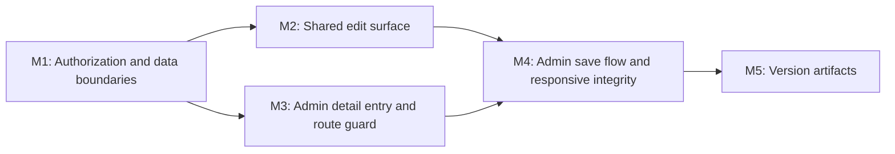

# 061 — Admin Provider Edit

| Field | Value |
|-------|-------|
| Plan ID | 061 |
| Target Release | next available patch after current origin/main version; confirm at DevOps Stage 1 |
| Version Scope | Minor feature release expected; confirm exact semver at DevOps Stage 1 |
| Epic Alignment | Admin provider review workflow; provider data quality and moderation throughput |
| Status | Released |
| Related Issues | None |

## Changelog

| Date | Agent | Change |
|------|-------|--------|
| 2026-03-25T07:02Z | Planner | Created plan for admin-side provider editing from the moderation detail flow, aligned to the existing owner edit UX and Plan 058 admin review architecture |
| 2026-03-25T07:15Z | Planner | Rev 1 — addressed Critic findings: clarified minor-release scope, anchored admin route to existing `(dashboard)` guard, specified browse → detail → edit entry flow, and named localStorage/write-boundary decisions |
| 2026-03-25T07:59Z | QA | QA failed — production build blocked by `PageNotFoundError` for `/dashboard/providers/[id]/edit` during page-data collection |
| 2026-03-25T08:11Z | Implementer | Build blocker resolved (lint fix from QA phase fixed module resolution). All gates green: build exit 0, type-check exit 0, 628 tests pass, 22/22 Plan 061 tests pass. Returning to QA retest. |
| 2026-03-25T08:14Z | QA | QA retest complete — build blocker no longer reproduces. Fresh build/type-check/focused/broad suite evidence passes; status updated to QA Complete. |
| 2026-03-25T08:30Z | UAT | CONDITIONAL APPROVAL — all deliverables verified by doc review; Admin Runtime Smoke Gate and provider_description schema check deferred to DevOps pre-release checklist. Status updated to UAT Approved. |
| 2026-03-25T12:06Z | QA | Fresh QA pass for post-UAT moderation footer + taxonomy-create delta failed at TDD Compliance Gate. Implementation doc missing artifact updates for the new code paths; status updated to QA Failed pending implementer artifact completion. |
| 2026-03-25T13:20Z | Implementer | Artifact rework complete. Updated impl doc: Files Modified/Created, TDD Compliance (5 new rows), Test Coverage (taxonomy API + moderation footer sections), Test Execution Results (focused 27/27, broad 633/633), Cross-Layer Integration (3 new surfaces), Outstanding Items (2 new deferred items). All gates green: type-check exit 0, build exit 0, 633 tests pass. Returning to QA. |
| 2026-03-25T14:00Z | Code Reviewer | Pass 3 complete. Reviewed RejectModal integration + main reconciliation. Verdict: APPROVED_WITH_COMMENTS. 1 MEDIUM deferred (missing page-level integration test for reject feedback path), 1 LOW (useCallback dep), 2 INFO. Status updated to Code Review Approved. |
| 2026-03-25T13:03Z | QA | Re-ran the TDD Compliance Gate against the current workspace state. Implementation doc still does not cover the Pass 3 reject-feedback chain or later-added runtime surfaces (`/api/admin/upload-image`, dashboard edit sub-pages). Status updated to QA Failed pending implementer artifact completion. |
| 2026-03-25T14:20Z | Implementer | Pass 3 artifact rework complete. Implementation doc fully updated: TDD Compliance (3 new rows for Pass 3 + UAT surfaces), Files Created (4 new rows), Cross-Layer Integration (5 new rows), Outstanding Items (3 new rows), fresh test evidence (667 pass / 18 skip, focused 27/27). All gates green: type-check exit 0, build exit 0. Status updated to In Progress for QA re-validation. |
| 2026-03-25T13:23Z | QA | QA re-validation complete. TDD Compliance Gate now passes after the artifact rework. Fresh evidence: focused suite 27/27 pass, broad suite 667/667 pass with 18 skips, delta lint 0 errors / 1 known warning, type-check exit 0, build exit 0 with dashboard sub-pages present. Status updated to QA Complete. |
| 2026-03-25T14:30Z | UAT | Pass 3 UAT complete. Scenarios 1-7 (base edit, auth, save, error handling, access control, owner regression, community service gate) retain prior PASS from live testing. Scenarios 8-9 (approve/reject review mutation paths) DEFERRED — PATCH /api/admin/review-provider not yet live-tested in any admin session; Admin Runtime Smoke Gate check #3 not satisfied for review decision path. CONDITIONAL APPROVAL issued. Smoke gate delegated to DevOps pre-release checklist. |
| 2026-03-25T13:48Z | DevOps | Released as v0.9.0. Branch `session/061-admin-provider-edit` pushed to origin. Tag v0.9.0 pushed. PR: https://github.com/abu-lina/uflow/compare/main...session/061-admin-provider-edit. Conditional smoke gate items (approve/reject paths) remain for post-merge operator verification. |

## Release Strategy

Standalone (no other known plans for this version).

## Target Release and Versioning

Version pre-flight confirms the repo is currently at released tags through `v0.8.26` with `origin/main` carrying `0.8.27`. Per planner release discipline, the exact release number remains locked until DevOps Stage 1 verifies the next available tag.

This work should nevertheless be treated as a **minor feature release**, not a patch-level bugfix, because it adds a new admin edit capability spanning:

- a new admin edit route under the existing guarded admin namespace
- an admin-only server save boundary
- a shared-form refactor that changes both admin and owner edit integration points

Expected release line: next minor after the current `origin/main` version; confirm exact tag at DevOps Stage 1.

## Value Statement and Business Objective

As an admin reviewer, I want to edit provider records directly from the provider detail view using the same form experience as owners, so that I can complete or correct provider information before approving it on desktop and mobile.

This specifically means the admin stays in the same moderation browsing workflow: browse pending providers in `/providers`, open a provider detail view from that list, then use an edit action on the provider detail page before returning to moderation work.

## Objective

Add an admin-only provider edit path that:

1. Starts from the existing provider detail surface used during moderation.
2. Reuses the current owner edit experience instead of introducing a second, divergent form.
3. Allows admins and moderators to update provider fields for records under review without weakening public visibility or owner permissions.
4. Preserves responsive usability across the current mobile detail page and desktop modal/detail experience.

## Background

Plan 058 moved moderation into the main `/providers` discovery flow and intentionally kept community services out of scope for moderation actions. The current owner edit flow already provides the desired visual baseline through `ProviderEditPage`, `ProviderEditForm`, `FooterAction`, and the detail-page `customActionButtons` slot. However, the current edit implementation is still owner/profile-oriented:

- navigation is rooted in `/profile/providers/[provider_id]/edit...`
- save behavior writes directly from the client via Supabase
- detail-page edit affordances are injected only in the owner profile context
- the current edit form does not yet expose the description field shown in the requested UX

This plan closes that gap without creating a separate admin-specific form implementation.

## Assumptions

1. Plan 058 remains the canonical entry path for admin moderation: admins discover pending providers from `/providers` and open provider detail from there.
2. Admin editing is limited to provider entities. Community services remain out of scope.
3. The owner edit experience is the canonical UX baseline for section order, field styling, image affordance, and floating save CTA.
4. The existing `providers` table already contains the data needed for this feature, including `provider_description`; no new product fields are required.
5. Auditability matters for admin edits because the workflow changes moderated content before approval.

## Decision Record

- [RESOLVED] Admin editing will reuse the owner edit UI shell rather than create a second admin-only form. Rationale: this preserves UX parity, reduces duplication, and keeps future field changes in one place.
- [RESOLVED] Admin edit writes will go through an admin-only server boundary instead of the existing owner-oriented client update path. Rationale: this aligns with Plan 058 moderation architecture, centralizes authorization and validation, and supports audit logging.
- [RESOLVED] Admin edit routing will live under the existing `(dashboard)`-guarded admin namespace rather than the public or profile tree. Rationale: the edit page itself should not be publicly navigable and should inherit the already-implemented `isAdminOrModerator` access control in `src/app/(dashboard)/layout.tsx` rather than introducing a second guard surface.
- [RESOLVED] The detail-page edit affordance will be injected only when the current entity is a provider and the viewer is an admin or moderator. Rationale: the shared moderation/discovery flow must not expose edit actions for unsupported entity types.
- [RESOLVED] The shared form must be extended to include provider description so the admin flow matches the requested owner-edit UX. Rationale: the requested edit experience explicitly includes description, and the data field already exists.
- [RESOLVED] Community services stay out of scope for editing in this plan. Rationale: Plan 058 already established provider-only moderation due to mixed-result actionability risk.
- [RESOLVED] Admin entry begins from the same moderation browse flow, but the edit page itself lives in the guarded admin namespace after the admin clicks edit from provider detail. Rationale: this preserves the `/providers` review workflow the user requested while keeping the edit surface behind existing admin routing guards.
- [RESOLVED] Shared-form extraction must explicitly account for localStorage-backed owner subpages and not silently reuse owner session state in the admin context. Rationale: the current owner edit flow stores category/offers/needs/social/images selections in provider-scoped localStorage keys that would otherwise leak stale owner state into admin editing.
- [RESOLVED] The implementation must explicitly choose and document whether admin writes rely on the existing admin UPDATE RLS policy or use a service-role write path. Rationale: Plan 058 required service-role for admin reads, but writes have a different risk profile and should not default silently.

## Shared Results Actionability

The shared discovery list can still return multiple entity types outside admin-filtered provider moderation flows. This plan must therefore make entity handling explicit:

- Legal edit targets: provider entities only.
- Illegal edit targets: community services and any non-provider search result types.
- Entity-type filtering location: UI entry points must only render the admin edit affordance for provider detail views reached from provider moderation results; the admin edit route/API must also reject non-provider IDs as defense in depth.
- Wrong-entity behavior: requests against unsupported entity types must return an explicit client-visible error (`400`, `403`, or `404` depending on boundary) rather than failing silently or issuing a no-op update.

## Scope

In scope:

- Admin-only edit affordance on provider detail during moderation
- Admin-guarded edit route and access checks
- Shared owner/admin provider edit form reuse
- Description-field parity in the shared form
- Admin-safe persistence path, validation, and audit logging
- Mobile and desktop behavior for detail entry and edit page layout
- Version artifact updates

Out of scope:

- Community service editing
- New moderation statuses or workflow redesign
- Removal of owner edit routes
- Full redesign of provider detail layout
- Deployment infrastructure changes

## Plan

### Milestone 1 — Confirm Authorization and Data Boundaries

Objective: Define a safe admin edit path that preserves existing public and owner access constraints.

Tasks:

1. Verify the current provider RLS coverage against admin editing requirements, including the `Admins can view all providers` select policy and the consolidated provider update policy for owners/admins.
2. Introduce an admin-only server boundary for provider edits that performs authenticated admin/moderator authorization before any write operation.
3. Route admin detail reads and edit-page hydration through a provider access path that can safely load non-approved providers for authorized admins while preserving approved-only behavior for public users.
4. Define explicit validation and sanitization rules for editable provider fields, including title, category, description, address, and contact fields.
5. Add audit coverage for admin edit events so moderation changes are attributable before review approval.
6. Decide and document whether admin edit writes use the authenticated client against the existing admin UPDATE RLS policy or a service-role write path, and record the rationale in implementation artifacts.

Acceptance criteria:

- Non-admin users cannot access the admin edit route or save path.
- Admins/moderators can load and edit providers in non-approved states without relaxing public visibility.
- Edit saves pass through a server boundary that performs role checks before writing.
- Admin edit operations produce auditable records.
- The chosen admin write model (RLS-backed authed client vs service-role) is explicit and documented rather than implied.

### Milestone 2 — Extract a Shared Provider Edit Surface

Objective: Reuse the existing owner edit UX while separating context-specific navigation and persistence concerns.

Tasks:

1. Refactor the current provider edit page/form into a shared surface that supports both owner and admin contexts via injected route helpers, initial values, and save handlers.
2. Preserve the existing owner experience and route structure while enabling an admin-specific wrapper to reuse the same form sections and visual language.
3. Extend the shared form model and rendered UI to include provider description in the Basics section so the implementation matches the requested edit experience.
4. Keep the responsive affordances already used by the owner flow, including the floating save CTA and image/media entry affordance where retained.
5. Keep owner-specific assumptions out of the shared core, especially hard-coded `/profile/providers/...` navigation, direct client-only save behavior, and implicit reuse of owner localStorage keys for category/offers/needs/social/images state.

Acceptance criteria:

- One shared provider edit surface serves both owner and admin wrappers.
- The Basics section includes title, category, and description.
- The Location section supports street, ZIP/PLZ, and city, with any additional existing fields retained only if they do not break parity.
- The Contact section remains available in the shared form.
- Owner editing continues to function without regression.
- Admin editing does not silently consume stale owner localStorage state when rendering or saving the shared form.

### Milestone 3 — Add Admin Detail Entry and Route Guarding

Objective: Let admins reach the edit experience from the provider detail view without exposing owner-only actions publicly.

Tasks:

1. Add an admin-aware action-button injector for provider detail views using the existing detail-page customization seam rather than duplicating the detail layout.
2. Ensure the admin edit affordance appears on both mobile and desktop detail experiences and mirrors the placement/intent of the owner `Bearbeiten` action.
3. Create the admin edit route under the existing `(dashboard)` layout namespace so it inherits the current admin/moderator guard, while preserving back navigation to the relevant moderation/detail context after the admin clicks edit from provider detail.
4. Prevent the admin edit affordance from appearing for unsupported entity types or for unauthorized users.
5. Keep the owner detail buttons and profile detail routes unchanged.

Acceptance criteria:

- Admins see an edit action on provider detail pages reached during moderation.
- Non-admin users do not see the admin edit affordance.
- Community service detail views do not show provider edit actions.
- The admin edit route is protected and returns the correct unauthorized/not-found behavior.
- Back navigation returns users to the appropriate detail/moderation context on both desktop and mobile.
- The browse flow remains `/providers` -> provider detail -> edit action, with the edit page itself hosted under the existing guarded admin route tree.

### Milestone 4 — Implement Admin Save Flow, Error States, and Responsive Integrity

Objective: Make the admin edit experience reliable and coherent across devices.

Tasks:

1. Implement the admin save path through the new server boundary, including success, validation failure, authorization failure, and concurrency handling.
2. Refresh the relevant moderation/detail caches after save so the updated provider data is visible immediately in discovery and detail views.
3. Ensure the edit page supports the same responsive behavior expected by the owner flow, including safe-area spacing, scroll behavior, sticky/floating CTA placement, and usable field layout on narrow screens.
4. Confirm desktop behavior works whether the provider was opened through the existing desktop detail presentation or a direct route.
5. Provide loading, empty, and error states where the shared form or admin route requires them.

Acceptance criteria:

- Successful admin edits return users to a detail state that shows updated provider information.
- Validation and authorization failures surface clear errors without losing the page state unexpectedly.
- Cache invalidation/refetch keeps moderation and detail views consistent after save.
- The edit experience is usable on common mobile and desktop layouts.

### Milestone 5 — Update Version and Release Artifacts

Objective: Keep release metadata aligned with the shipped feature.

Tasks:

1. Update `package.json`.
2. Update `package-lock.json`.
3. Add a changelog entry describing admin provider editing from the moderation detail flow.

Acceptance criteria:

- Version artifacts are internally consistent.
- Changelog reflects the feature scope accurately.
- Final version number is confirmed only at DevOps Stage 1 after tag verification.

## Milestone Dependencies

UI reuse and admin route work begin only after the authorization and data-boundary decisions are fixed, because the edit experience cannot safely reuse the owner form until the correct admin read/write boundary is defined.

## Testing Strategy

Expected test coverage:

- Route/API tests for admin authorization and non-admin denial on admin edit reads/writes
- Service tests for admin provider update behavior, validation, and unsupported-entity rejection
- Component tests for shared provider edit form reuse across owner/admin wrappers
- Regression tests proving description-field persistence in the shared edit flow
- Detail-page tests for admin-only edit affordance visibility on provider detail and absence on unsupported entity types
- Responsive/manual validation on mobile and desktop detail-to-edit flows

Coverage expectations:

- Regressions must cover both owner and admin edit entry points because the feature intentionally reuses the same form surface.
- Tests should verify the actual precedence and guard conditions used to decide whether the admin edit action appears.
- Validation should include both successful save and failure-path behavior.
- Coverage should verify that admin edit state is not polluted by owner localStorage state for the same provider ID.

## Validation

Implementation should validate with:

- `npm run type-check`
- `npm run lint`
- `npm test`
- Manual role-based verification on mobile and desktop for:
  - admin detail -> edit -> save -> detail
  - unauthorized user attempting direct admin edit route access
  - owner edit flow regression

## Risks

| Risk | Likelihood | Impact | Mitigation |
|------|-----------|--------|-----------|
| Admin edit path accidentally reuses owner-only client writes and weakens authorization clarity | Medium | High | Make the server-boundary decision explicit in Milestone 1 and keep admin saves out of the owner client write path. |
| Shared-form refactor breaks the current owner profile edit flow | Medium | High | Preserve owner wrapper behavior and require regression coverage for existing owner routes before handoff. |
| Admin shared form silently consumes owner localStorage state for the same provider | Medium | Medium | Explicitly remove, isolate, or namespace localStorage-backed owner subpage state in the admin context. |
| Mixed provider/community-service discovery context leaks unsupported edit actions | Medium | High | Keep provider-only action gating at both UI and server boundaries; reject unsupported entity types explicitly. |
| Detail-entry behavior diverges between mobile full-page and desktop modal flows | Medium | Medium | Reuse the existing detail action seam and require manual validation on both layouts. |
| Description parity is missed because current owner edit code does not expose the field yet | High | Medium | Call out description support as a first-class acceptance criterion in the shared form milestone. |

## Duration Estimates

| Phase | Estimate | Uncertainty |
|-------|----------|-------------|
| Analysis | 0.5 day | Low — the relevant owner/admin paths and RLS policies are already identifiable in the repo |
| Planning | 0.25 day | Low — requirements are explicit |
| Implementation | 1.5 to 2.5 days | Medium — shared-form extraction, admin route wiring, and save-boundary changes touch multiple layers |
| QA | 0.5 day | Medium — both admin and owner edit paths require regression checks |
| UAT | 0.5 day | Medium — desktop/mobile moderation flow verification is required |
| DevOps | 0.25 day | Low — no deployment-surface changes expected |

Main uncertainty drivers: the amount of refactoring needed to cleanly separate shared form UI from owner-specific navigation, and whether the existing detail-page action seam needs additional server/client role threading for desktop modal behavior.

## Handoff Notes

- Reuse the current owner edit UX as the canonical visual baseline; do not introduce a second admin-only design language.
- The user-confirmed flow is: browse pending providers in `/providers`, open provider detail, then click an edit action from that detail surface. Keep that moderation flow intact.
- Keep admin editing provider-only. If implementation discovers a hidden dependency on community-service edit paths, escalate rather than broadening scope silently.
- Treat the missing description field in the current shared edit code as part of this feature, not as a follow-up.
- If the admin edit path is temporarily unavailable after deployment, admins must still be able to complete moderation through the existing Plan 058 approve/reject actions; edit and review must remain operationally independent.
- No deployment path audit milestone is required because the planned changes do not touch deployment entry points, workflows, or infrastructure configuration.